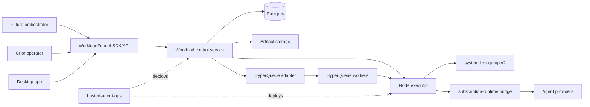
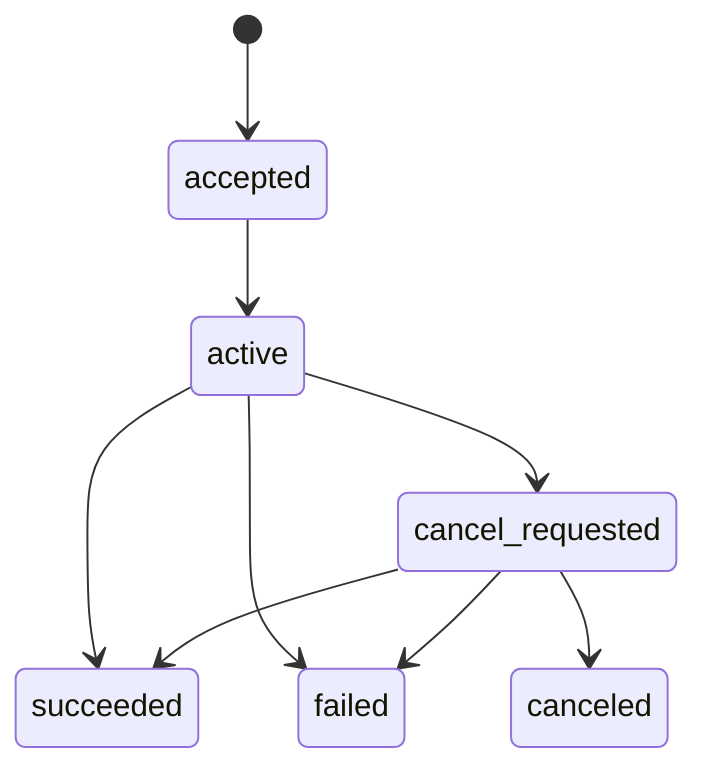
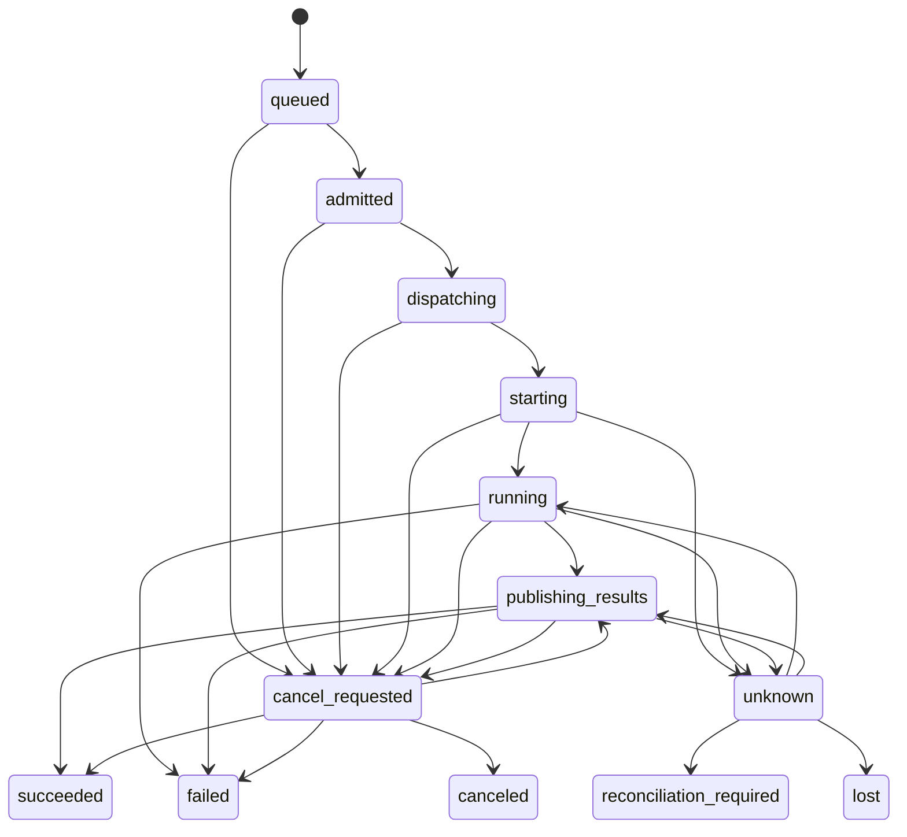

# WorkloadFunnel Architecture and Implementation Plan

> Turn unlimited demand into controlled execution.

| Field | Value |
| --- | --- |
| Status | Proposed architecture source of truth |
| Date | 2026-07-11 |
| Product | WorkloadFunnel |
| Repository | `777genius/workload-funnel` |
| Primary language | TypeScript |
| Initial deployment | Linux hosts with systemd and cgroup v2 |
| Production state store | Postgres |
| Embedded state store | SQLite |
| First external scheduler adapter | HyperQueue, optional and version-pinned |
| HyperQueue research baseline | v0.26.2; not an approved production pin |

## 1. Executive Decision

WorkloadFunnel is a reusable workload control plane placed between a caller that
decides *what should be done* and an execution system that knows *how to start a
process*.

```text
future LLM orchestrator / CI / desktop application / operator
                            |
                            v
                     WorkloadFunnel
       durable intent, admission, allocation, reconciliation
                 /             |              \
                v              v               v
      subscription-runtime   systemd       HyperQueue
        agent execution     local process   batch dispatch
```

The repository will contain both reusable TypeScript packages and deployable
services. It must remain useful without HyperQueue, without an LLM, and without
`subscription-runtime`.

The name describes the stable product responsibility: many heterogeneous
requests enter, policy and capacity narrow them into a controlled execution
flow. It does not bind the project to agents, one scheduler, a cloud, or a
particular operating system.

The core architectural decisions are:

1. Postgres is the canonical production source of workload intent and durable
   lifecycle decisions.
2. Controllers reconcile desired and observed state. They do not implement a
   fragile imperative script sequence.
3. Workload, run, attempt, allocation, dispatch, and process execution have
   separate identities and histories.
4. Delivery is at least once. Idempotency, inbox deduplication, leases, and
   fencing make retries safe; the system does not claim exactly-once execution.
5. Linux execution is owned by systemd transient services and cgroup v2, not by
   tmux and not by direct cgroupfs writes.
6. Schedulers and executors are replaceable adapters with explicit capability
   negotiation. HyperQueue is an optimization, never the domain authority.
7. `subscription-runtime` remains an agent execution and safety kernel.
   WorkloadFunnel invokes it through a versioned adapter contract and must not
   absorb provider authentication or agent-session implementation.
8. Project strategy remains above WorkloadFunnel. Producer/reviewer selection,
   coding goals, benchmark priorities, worktree review, and git integration are
   responsibilities of a future orchestrator.
9. Every package is internally divided into feature-owned vertical slices.
   Package boundaries alone are not considered sufficient modularity.
10. All mutations are auditable, correlated, idempotent, and recoverable after
    a crash between any two external side effects.

### 1.1 Why TypeScript

TypeScript is selected because the surrounding runtime, future orchestrator,
SDK consumers, and hosted control tooling are expected to use the same
ecosystem. It provides one contract/type/toolchain across server, node daemon,
SDK, and adapters. This decision is about integration and maintainability, not
an unsupported claim that Node.js is always faster or smaller than Python.

The core control path will not require a Python sidecar. HyperQueue integration
uses a pinned Rust CLI adapter. A future Python SDK may be generated from the
public protocol without moving domain policy into Python.

## 2. Problem Statement

Multiple autonomous agents, builds, tests, and background processes compete for
finite CPU, memory, IO, account quota, and execution slots. A raw concurrency
limit such as `maxActiveWorkers = 5` is insufficient because workloads vary
widely:

- an idle agent session may consume little CPU but hold memory and provider
  quota;
- `npm ci`, Docker BuildKit, `pip`, compilation, and benchmarks may saturate all
  cores and disk IO;
- eight lightweight workers may be safe while three build-heavy workers are
  not;
- processes can become detached from the launching shell;
- a controller can crash after starting a process but before recording success;
- duplicated commands can create duplicated side effects;
- a missing heartbeat may mean network partition, controller restart, process
  death, or delayed observation;
- an external scheduler may report completion while result publication fails;
- a future orchestrator needs durable capacity and lifecycle primitives, but
  should not own low-level host process safety.

The system therefore needs a durable, scheduler-independent layer that turns
unbounded demand into controlled execution while preserving useful throughput.

## 3. Goals

### 3.1 Functional goals

- Accept workloads using a stable, structured contract.
- Deduplicate caller retries through scoped idempotency keys.
- Queue and admit workloads according to capacity, quota, priority, fairness,
  constraints, and host pressure.
- Reserve resources before dispatch.
- Dispatch through local, agent-runtime, or external scheduler adapters.
- Own and observe complete process trees.
- Apply hard and soft resource envelopes where the executor supports them.
- Reconcile ambiguous, stale, and partially completed operations.
- Support cancellation as a durable desired-state transition.
- Persist immutable result manifests and explicit retention tombstones.
- Expose durable events, snapshots, metrics, and audit records.
- Scale from one desktop/host to a small multi-node worker pool.
- Let higher-level orchestrators maintain many logical workers without forcing
  all workers to run heavily at the same time.

### 3.2 Reliability goals

- No accepted workload is silently lost within its declared durability profile;
  receipts identify that profile and recovery gaps cause quarantine rather than
  silent continuation.
- Duplicate command or event delivery does not duplicate canonical state.
- A stale controller cannot mutate an allocation after lease takeover.
- A host or controller restart converges to a known state.
- Unknown execution outcomes remain explicit instead of being guessed.
- Side-effectful ambiguous work is never automatically replayed without an
  explicit policy and external idempotency guarantee.
- Cancellation does not become terminal until process state is observed or a
  terminal reconciliation decision is recorded.
- Deleting result bytes never deletes the terminal lifecycle record.
- A scheduler outage cannot corrupt the canonical workload lifecycle.

### 3.3 Architectural goals

- Strict compile-time dependency direction: applications and adapters depend on
  application contracts; application depends on domain; domain depends only on
  the minimal kernel.
- Feature-owned vertical slices inside every non-trivial package.
- No framework, database, scheduler, provider, or operating-system type in the
  domain API.
- Replaceable scheduler, executor, state store, event transport, artifact store,
  and pressure sensor.
- Versioned public contracts and explicit adapter capabilities.
- Small, reviewable files and cohesive bounded contexts.
- A future open-source release that is useful beyond AI agents.

## 4. Non-Goals

WorkloadFunnel will not:

- decide which product feature an agent should implement;
- decompose a project goal into tasks;
- choose producer, reviewer, drain, or integration roles;
- evaluate code quality or benchmark quality;
- review or merge git branches and worktrees;
- manage Codex, Claude, or other provider credentials;
- replace `subscription-runtime` as the agent launch/safety kernel;
- parse arbitrary shell strings to infer required resources or permissions;
- provide a general container orchestrator in the first release;
- reproduce all Kubernetes, Nomad, Slurm, or Temporal features;
- replace package-manager-native dependency caches or invent a universal build
  cache;
- promise exactly-once process execution;
- use HyperQueue as canonical state, tenant policy, or security boundary;
- silently downgrade required resource isolation when an adapter lacks it.

## 5. Ubiquitous Language

| Term | Meaning |
| --- | --- |
| Workload | Immutable execution intent submitted by a caller. |
| Workload spec | Structured desired command, resources, constraints, replay policy, and result contract. |
| Run | One accepted logical lifecycle of a workload. |
| Attempt | One try to realize a run. Retries create new attempts. |
| Allocation | Fenced reservation of capacity for one attempt on a node or scheduler pool. |
| Dispatch | Adapter-owned mapping between an allocation and an external execution system. |
| Execution | The observed operating-system or runtime process lifecycle. |
| Tenant | Fairness, quota, and idempotency scope. It need not equal a customer. |
| Workload class | Operational class such as interactive, agent, build, benchmark, recovery, or maintenance. |
| Resource request | Structured CPU, memory, PID, IO, custom-resource, and placement requirements. |
| Capacity snapshot | Time-bounded observation of allocatable resources and host pressure. |
| Lease | Expiring right to reconcile a resource. |
| Execution generation | Immutable identity of one concrete process execution; part of ticket/unit identity. |
| Owner fence | Monotonically increasing lease revision that rejects stale reconciliation owners without renaming the execution. |
| Namespace writer epoch | Deployment/ownership generation that rejects stale control-plane writers. |
| Start fence | Revocable attempt authorization that must still match immediately before creating the external execution. |
| Desired state | Persisted target lifecycle requested by a caller/controller. |
| Observed state | Latest adapter or node observation, including uncertainty. |
| Result manifest | Immutable metadata describing outputs, checksums, locations, and retention state. |
| Tombstone | Durable record that bytes were deliberately removed after policy evaluation. |
| Reconciliation | Idempotent convergence from persisted desired state and observations. |
| Admission | Decision to reserve scarce capacity now, defer, or deny. |
| Pressure | CPU, memory, IO, PID, scheduler, or provider saturation signal. |
| Execution ticket | Versioned command handed to an executor after admission and allocation. |

Words such as `worker`, `job`, and `task` are overloaded across providers.
Public domain contracts should prefer the terms above.

## 6. Architectural Principles

### 6.1 Desired state over imperative sequences

An API request records intent. Reconcilers make progress through small,
repeatable steps. A controller crash after any external call must be recoverable
from persisted state and observation.

Bad:

```text
insert row -> start process -> mark running -> hope every step returns
```

Required:

```text
persist desired state + outbox
  -> claim reconciliation work
  -> invoke idempotent/fenced adapter operation
  -> persist observation
  -> derive next decision
  -> repeat until converged
```

### 6.2 Separate intent, reservation, dispatch, and execution

An accepted workload does not prove resources were reserved. An allocation does
not prove a scheduler accepted the request. A scheduler ID does not prove a
process started. Process exit does not prove results were durably published.
Separate aggregates prevent these facts from being collapsed into one unsafe
`status` column.

### 6.3 Capability-driven adapters

Adapters publish a capability document. Application policies compare required
capabilities before selecting an adapter. Unsupported semantics produce a
typed refusal or a deliberate alternate route.

### 6.4 Fail closed for safety, remain explicit for liveness

- Missing hard-isolation capability blocks a workload requiring hard isolation.
- Missing observation produces `unknown`, not invented success/failure.
- Missing idempotency support blocks blind retry after an ambiguous call.
- Pressure sensor failure lowers admission capacity according to policy; it does
  not pretend the host is idle.

### 6.5 At-least-once everywhere

Commands, events, and reconciliation work can be redelivered. Every mutation is
scoped by an idempotency key, operation ID, aggregate version, or inbox receipt.
External side effects require adapter-level reconciliation.

### 6.6 No universal dumping grounds

There will be no repository-wide `utils`, `helpers`, `services`, `common`, or
`ports` folder. A capability belongs to a feature. Truly stable primitives may
live in the kernel only after at least two concrete consumers demonstrate that
the abstraction is real.

## 7. System Context and Responsibility Boundaries



### 7.1 Future orchestrator owns

- project goals and task decomposition;
- role mix and useful worker count;
- coding/review/integration strategy;
- benchmark and product priorities;
- interpretation of domain-specific worker output;
- when a project should stop, continue, or pivot.

### 7.2 WorkloadFunnel owns

- durable execution intent;
- tenant-aware admission and fairness;
- resource reservations and placement;
- attempt, allocation, dispatch, and execution reconciliation;
- process ownership contracts and resource enforcement requests;
- node capacity and pressure state;
- lifecycle events and audit;
- result manifests and retention decisions;
- idempotency, inbox/outbox, leases, and fencing.

### 7.3 `subscription-runtime` owns

- provider selection, account/session/auth handling;
- controlled agent startup, status, stop, and provider diagnostics;
- provider-specific safety and sandbox configuration;
- workspace/project access-policy enforcement;
- runtime-internal foreground process and event details;
- its own durable provider operation lifecycle.

There is one OS ownership topology for an agent workload: WorkloadFunnel's node
executor creates the fenced systemd/cgroup boundary, and
`subscription-runtime` runs in foreground inside that boundary. The runtime
owns provider/session semantics and its internal child lifecycle; it does not
daemonize outside or create a competing host-level owner. WorkloadFunnel does
not send provider commands directly. Both layers reconcile their own facts,
but only the node executor owns the outer process tree and resource envelope.

The dependency direction is:

```text
WorkloadFunnel adapter -> versioned subscription-runtime client contract
```

`subscription-runtime` must not import WorkloadFunnel. The bridge translates an
execution ticket into runtime broker operations and translates durable runtime
events back into scheduler-independent observations.

### 7.4 `hosted-agent-ops` owns

- installation and atomic release switching;
- systemd unit templates and environment wiring;
- Postgres/bootstrap/migration procedures;
- host cache and directory provisioning;
- health checks, rollback, backup, and operator runbooks.

It must not become a second canonical workload state machine. Shell watchdogs
may observe or restart a service, but must not independently create workloads
or mutate lifecycle state.

## 8. Repository Topology

```text
workload-funnel/
  apps/
    control-service/
    node-agent/
    node-launcher/
    scheduler-mutation-gateway/
    operator-cli/
  packages/
    kernel/
    workload-control/
    node-execution/
    store-postgres/
    store-sqlite/
    executor-systemd/
    dispatcher-local/
    scheduler-hyperqueue/
    bridge-subscription-runtime/
    client-sdk/
    observability/
    testing/
  docs/
    adr/
    operations/
    security/
    workload-funnel-architecture-plan.md
  tooling/
```

Package boundaries represent bounded contexts or independently replaceable
infrastructure. Every package that contains more than a trivial adapter is also
split by business feature.

`node-agent` is the unprivileged network/control client. `node-launcher` is the
minimal privileged local systemd boundary described in section 17. They MUST
run as different Unix identities.

`scheduler-mutation-gateway` is deployed only for an external scheduler that
cannot validate WorkloadFunnel fences itself. It is a narrow credential and
mutation boundary, not a second scheduler or control plane.

### 8.1 Standard feature layout

```text
src/features/<feature>/
  domain/
    entities/
    value-objects/
    policies/
    events/
  application/
    commands/
    queries/
    use-cases/
    contracts/
  adapters/
  api/
  tests/
  index.ts
```

Only folders actually needed by a feature are created. `application/contracts`
contains inbound and outbound boundaries conventionally called ports; the
project does not create a detached root `ports/` package.

### 8.2 Public import rules

- Cross-package imports use package exports.
- Cross-feature imports use the target feature's public `index.ts`, command,
  query, event, or read model.
- Internal entity and repository implementations are not imported across
  features.
- Adapters may depend on application contracts and public domain values.
- Domain code imports no application, adapter, framework, or transport code.
- Applications compose features; they do not contain domain policy.

Architecture tests will enforce forbidden imports and public export boundaries.

### 8.3 Package dependency graph

The allowed compile-time graph is:

```text
apps/*
  -> client-sdk / workload-control / node-execution
  -> concrete store, scheduler, executor, bridge, observability adapters

concrete adapters
  -> owning feature's application/contracts
  -> owning feature's public domain values

workload-control, node-execution
  -> kernel

kernel
  -> no internal package
```

`client-sdk` consumes generated or explicitly exported feature-owned public
schemas. It does not redefine domain commands. Transport controllers map wire
schemas to commands and do not own a competing contract model.

Pure implementation packages such as `executor-systemd`, `scheduler-hyperqueue`,
and stores are deliberate adapter packages. Their internal operation slices map
one-to-one to application contracts owned by business features; they contain no
independent business use cases. This is the only exception to using business
names as the top-level feature dimension.

Anti-corruption adapters may depend on the public contracts on both sides they
translate, never on internals. Required edges are explicit:

- `dispatcher-local` implements workload-control dispatch contracts and invokes
  node-execution ticket contracts;
- `scheduler-hyperqueue` implements workload-control dispatch contracts and
  invokes only the public node shim/ticket contract;
- `executor-systemd` implements node-execution process contracts;
- `bridge-subscription-runtime` implements a node-execution target contract and
  consumes a versioned external runtime client contract;
- stores implement multiple feature-owned persistence contracts through neutral
  values and may not import concrete scheduler/executor/runtime adapters.

No core feature package depends back on an anti-corruption adapter.

### 8.4 Single mutation owner

Each canonical aggregate transition has exactly one owning feature. Supporting
features request transitions through that feature's public command or react to
its public event. For example, `workload-lifecycle.RequestCancellation` alone
evaluates, records intent, and transitions Run/Attempt; the `cancellation`
process manager only propagates the resulting event and reports effects. Node
and adapter packages publish observations; they never mutate canonical
lifecycle independently.

## 9. Package and Feature Ownership

### 9.1 `packages/kernel`

Contains only stable, dependency-free primitives:

- typed identifiers;
- UTC instant and duration values;
- optimistic version;
- correlation, causation, and operation IDs;
- validation result and domain error base contracts;
- redacted secret references, never secret values.

It must not contain workload policy, repositories, logging wrappers, generic
service bases, or provider concepts.

### 9.2 `packages/workload-control`

This is the main domain and application package.

```text
src/features/
  workload-lifecycle/
  tenant-admission/
  node-lifecycle/
  capacity-management/
  allocation-leasing/
  dispatch-reconciliation/
  execution-reconciliation/
  cancellation/
  result-management/
  control-event-delivery/
  audit-history/
```

Feature responsibilities:

- `workload-lifecycle`: sole owner of Run/Attempt acceptance, allocation
  attachment, cancellation intent, lifecycle transitions, replay policy, and
  terminal outcome.
- `tenant-admission`: quotas, fair-share, priority aging, reserved classes, and
  admission explanations.
- `node-lifecycle`: sole canonical owner of node registration, epoch,
  schedulable/cordoned/draining state, and retirement.
- `capacity-management`: node/resource snapshots, allocatable envelopes,
  pressure derating, and placement candidates.
- `allocation-leasing`: reservation lifecycle, leases, generations, fencing,
  expiry, and takeover.
- `dispatch-reconciliation`: dispatch commands, observations, ambiguous
  outcomes, scheduler-independent convergence.
- `execution-reconciliation`: sole owner of Execution aggregate, start/stop
  effects, fenced process observations, ambiguity, and execution outcome.
- `cancellation`: process manager for propagation, grace timers, observations,
  and force-stop requests after `workload-lifecycle.RequestCancellation`; it
  never mutates Run/Attempt directly.
- `result-management`: sole owner of ResultManifest publication, checksums,
  retention, archive/delete decisions, and tombstones. Node publication and
  retention policy submit observations/commands only.
- `control-event-delivery`: durable event records, subscriptions, cursors,
  deduplication metadata, and replay.
- `audit-history`: actor, reason, policy version, decision inputs, and immutable
  audit projection.

### 9.3 `packages/node-execution`

```text
src/features/
  node-registration-reporting/
  allocation-claiming/
  execution-ticket-validation/
  process-lifecycle/
  resource-enforcement/
  heartbeat-reporting/
  observation-spooling/
  result-staging-reporting/
  execution-environment-resolution/
  node-drain-enforcement/
```

It defines executor-facing use cases and contracts without importing systemd.
The node service uses these features to claim a fenced allocation, validate a
ticket, resolve a configured execution environment, start and observe the
process, stage bytes and report fenced result observations, publish heartbeats,
and drain cleanly during maintenance.
It submits node registration/drain requests and observations to the canonical
`workload-control/node-lifecycle` feature; it never transitions the `Node`
aggregate itself.

### 9.4 `packages/store-postgres`

```text
src/features/
  workload-persistence/
  allocation-persistence/
  dispatch-persistence/
  transactional-outbox/
  command-inbox/
  reconciliation-claims/
  projection-checkpoints/
  schema-migrations/
```

Repositories persist aggregates and enforce optimistic versions. Domain
decisions stay in `workload-control`; SQL repositories must not infer lifecycle
transitions.

### 9.5 `packages/store-sqlite`

Supports embedded desktop/development mode with the same public persistence
contracts that it can satisfy. Persistence interfaces are segregated into
aggregate storage, idempotency, event delivery, distributed claiming, leasing,
and multi-writer coordination. SQLite implements only its declared subset;
embedded composition cannot request Postgres-only distributed capabilities.

### 9.6 `packages/executor-systemd`

```text
src/features/
  capability-discovery/
  transient-unit-start/
  transient-unit-observation/
  transient-unit-cancellation/
  cgroup-resource-mapping/
  journal-result-collection/
```

Uses D-Bus/systemd APIs where practical and a tightly bounded `systemd-run`
fallback where necessary. Direct arbitrary shell interpolation is prohibited.

### 9.7 `packages/dispatcher-local`

Dispatches already-admitted allocations to a single node set. Fairness,
priority aging, placement, and reservations remain exclusively in
`workload-control`; this adapter must not re-decide them. It is the reference
dispatch implementation, not merely a test fake.

### 9.8 `packages/scheduler-hyperqueue`

```text
src/features/
  capability-discovery/
  dispatch-submission/
  dispatch-observation/
  dispatch-cancellation/
  worker-inventory/
  hyperqueue-reconciliation/
```

The package owns all HyperQueue CLI schemas and identifiers. No HyperQueue type
escapes its public scheduler-independent implementation.

### 9.9 `packages/bridge-subscription-runtime`

```text
src/features/
  runtime-capability-discovery/
  execution-ticket-preparation/
  runtime-operation-dispatch/
  runtime-event-consumption/
  runtime-operation-reconciliation/
  runtime-result-translation/
```

The bridge never reads or writes the runtime registry, tmux sessions, or project
worktrees directly. It calls versioned broker APIs and consumes durable runtime
events/snapshots.

The bridge is composed exclusively inside the node executor's owned execution
path. The control service never invokes it as an alternate direct launcher; it
receives only scheduler-independent operation/observation data through node and
dispatch contracts.

### 9.10 `packages/client-sdk`

```text
src/features/
  workload-submission/
  workload-observation/
  workload-cancellation/
  event-subscription/
  capacity-observation/
  result-access/
```

The SDK exposes stable TypeScript contracts suitable for future LLM
orchestrators, desktop applications, CI, and operator tools.

### 9.11 `packages/observability`

Contains OpenTelemetry adapters, metric definitions, audit exporters, and
redaction policies. Domain features emit structured facts; they do not import
OpenTelemetry.

### 9.12 `packages/testing`

Contains synthetic builders, in-memory adapters, deterministic clocks, fault
injectors, disposable Postgres/HyperQueue/systemd fixtures, and contract test
suites. Production packages must not depend on it.

## 10. Domain Model

### 10.1 Workload specification

`WorkloadSpec` is immutable after acceptance and includes:

- tenant and caller identity references;
- caller-scoped idempotency key;
- workload class;
- transport-neutral execution target;
- environment *references* and allowed non-secret values;
- working-directory reference resolved by an executor policy;
- resource request;
- placement constraints;
- priority and optional deadline;
- replay classification;
- timeout and cancellation grace policy;
- result contract;
- required executor/scheduler capabilities;
- labels with bounded keys and values;
- contract schema version.

It must not contain raw provider credentials, auth files, unrestricted host
paths, shell pipelines, or secrets.

The execution target is a tagged, versioned union. Initial variants are:

- `process`: an allowlisted executable reference plus argument array;
- `agent_runtime`: an opaque runtime-intent envelope whose schema and policy are
  owned by the `subscription-runtime` bridge/runtime contract;
- `adapter_defined`: a namespaced opaque reference accepted only by an
  explicitly authorized adapter capability.

Provider, session, project-manifest, and workspace-policy fields never become
core domain concepts. Core validates envelope size, namespace, version, digest,
and required capabilities; the owning adapter validates its payload.

Caller-supplied workload class, priority, replay class, timeout, resource
profile, executable target, and capability requirements are requests, not
authority. Admission resolves them against a tenant-authorized profile and
persists both requested and effective values plus the policy revision. Field
overrides require explicit authenticated permission.

### 10.2 Aggregate boundaries

#### WorkloadRun aggregate

Owns:

- immutable accepted spec reference;
- desired logical lifecycle state;
- current attempt reference and completed attempt summary;
- replay and cancellation decisions;
- terminal outcome;
- aggregate version.

#### WorkloadAttempt aggregate

Owns one execution try:

- run and ordinal reference;
- immutable execution generation for the concrete process;
- revocable start fence;
- admission and attempt lifecycle;
- current allocation reference;
- current Execution reference and terminal summary;
- replay classification snapshot;
- required ResultManifest reference and completion summary;
- terminal attempt outcome;
- aggregate version.

Run and Attempt are separate aggregates connected by feature-owned domain
events and an idempotent lifecycle process manager. Attempt failure/loss does
not directly make the run terminal; the run policy decides retry or terminal
outcome using the expected run version.

#### Allocation aggregate

Owns:

- attempt reference;
- selected node/pool and reserved resources;
- lease owner and expiry;
- immutable execution generation and current owner fence;
- allocation lifecycle;
- release reason.

#### Dispatch aggregate

Owns:

- allocation execution generation;
- selected adapter;
- operation idempotency key;
- desired and observed dispatch state;
- last observation and ambiguity classification.

External scheduler/runtime/unit IDs live only in an adapter-owned mapping
repository keyed by neutral `dispatchId` and operation ID.

The feature-owned `DispatchMappingStore` contract accepts a bounded neutral
`AdapterDispatchReference` containing adapter key, adapter contract version,
opaque bytes/JSON, and fingerprint. The concrete adapter owns encoding and
schema validation; Postgres stores the neutral envelope without importing
HyperQueue, runtime, or systemd types. Mapping payloads may not contain secrets.

#### Execution aggregate

Owned only by `execution-reconciliation`, it represents one concrete process
execution and owns:

- attempt/allocation/dispatch references;
- immutable execution generation and deterministic execution ID;
- selected node and effective execution/SandboxProfile digests;
- desired start/stop intent and applied-effect receipts;
- current owner-fence/writer-epoch observations;
- monotonic source observations and ambiguity state;
- terminal execution outcome and immutable late/conflicting evidence summary;
- aggregate version.

`WorkloadAttempt` stores only the current Execution reference and terminal
summary. Node-execution, systemd, runtime, and scheduler adapters publish fenced
observations; none owns or mutates canonical Execution state.

#### Node aggregate

Owned only by `node-lifecycle`, it owns:

- node identity and epoch;
- declared capabilities;
- schedulable/draining state;
- capacity envelope;
- latest pressure observation reference;
- heartbeat freshness.

#### ResultManifest aggregate

Owned only by `result-management`, it owns:

- attempt and execution references;
- output entries and checksums;
- immutable artifact locations;
- publication completeness;
- retention class and expiry;
- archive/delete state;
- terminal tombstone.

An idempotent `result-completion` process manager reacts to
`ResultManifestCompleted`, reloads the current attempt/run versions, and asks
the owning lifecycle feature to apply success or publication failure. This
cross-aggregate protocol is retryable through inbox/outbox receipts.

### 10.3 Capacity reservation consistency boundary

Node is an inventory/observation aggregate, not the owner of every allocation.
A serialized `CapacityReservationLedger` application contract is the atomic
consistency boundary owned by `allocation-leasing`. `tenant-admission` and
`capacity-management` provide immutable, revisioned decisions/read models. In
one Postgres transaction, `allocation-leasing`:

- locks or compare-and-swaps the target pool/node capacity revision;
- sums or updates active reserved resource dimensions;
- validates the effective allocatable envelope;
- inserts the unique allocation reservation;
- advances the capacity revision;
- emits `AllocationReserved` through the outbox.

The ordering is explicit:

1. `workload-lifecycle` requests reservation for a queued Attempt and expected
   Attempt version.
2. `allocation-leasing` reserves capacity and emits `AllocationReserved`.
3. An idempotent lifecycle process manager consumes it, validates the Attempt
   is still attachable, attaches allocation, transitions Attempt to `admitted`,
   and emits `AttemptAdmitted` in its transaction.
4. If cancellation/staleness prevents attachment, it emits
   `AllocationAttachmentRejected`; `allocation-leasing` releases exactly once.
5. `dispatch-reconciliation` consumes only `AttemptAdmitted`, creates Dispatch,
   and later emits the conditional external submit command.

Thus dispatch cannot start from `AllocationReserved` alone. Every intermediate
state has a retryable inbox receipt and bounded reservation timeout/reconciler.
The reservation transaction never calls a dispatch adapter or mutates Attempt
or Dispatch aggregates.

Release reverses the reservation exactly once using allocation identity and
execution generation. The domain allocation policy computes validity; the persistence
adapter provides serialization. A later sharded implementation may partition
the ledger by pool/node without changing semantics.

### 10.4 Identity separation

```text
workloadId
  -> runId
      -> attemptId (1..n)
          -> allocationId + executionGeneration
              -> dispatchId
                  -> executionId
                      -> resultManifestId
```

External scheduler IDs and systemd unit names are adapter mappings, never domain
identities.

## 11. Lifecycle State Machines

### 11.1 Run lifecycle



The run is the logical caller-visible lifecycle. It stays `active` while one or
more attempts are queued, executing, publishing results, or awaiting a retry
decision. A cancellation race may still resolve to success/failure if the
attempt became irreversibly terminal first; the precedence decision is
versioned and audited.

### 11.2 Attempt lifecycle



Rules:

- Run `accepted` means canonical intent was durably persisted; the first
  Attempt may then enter `queued`.
- `admitted` requires a valid allocation; it is not a queue label.
- `running` requires an executor observation for the current execution
  generation and owner fence.
- `succeeded` requires acceptable exit observation and required result
  publication, not merely scheduler completion.
- `unknown` is non-terminal and blocks unsafe replay.
- `lost` is terminal for an attempt, not necessarily for the run.
- run retry policy creates a new attempt and never rewrites attempt history.
- terminal states are append-only facts; corrections are explicit superseding
  audit decisions, not row edits that erase history.
- Attempt `starting/running/unknown` states are lifecycle summaries advanced by
  public Execution events through `workload-lifecycle`; adapters never write
  them directly.

### 11.3 Allocation lifecycle

```text
proposed -> reserved -> claimed -> active -> releasing -> released
                         |          |
                         v          v
                       expired    revoked
```

- Reservation is atomic against the canonical capacity model.
- Claim requires the immutable execution generation and current owner fence.
- Lease renewal never changes the owner fence.
- Reconciliation-owner takeover increments only the owner fence; it does not
  rename or restart the existing execution.
- A new execution generation is issued only through a new Attempt after old
  execution absence/termination is proven and replay policy authorizes it.
- Every executor mutation includes execution generation, owner fence, and
  namespace writer epoch.
- A stale value receives a typed `stale_owner` rejection.

### 11.4 Dispatch lifecycle

```text
pending -> submitting -> accepted -> starting -> running -> terminal
                |           |           |
                +--------> unknown <----+
```

An adapter call timeout after submission is `unknown`, not `pending`. The
reconciler queries using deterministic operation identity and any adapter-owned
external mapping that was durably received before deciding whether another
submit is safe.

### 11.5 Execution lifecycle

```text
prepared -> start_requested -> starting -> running -> exited
                 |                |          |
                 |                +------> unknown
                 |                           |
                 +---------------------------+
running -> stop_requested -> stopped
stop_requested -> exited
unknown -> running | exited | stopped | lost | reconciliation_required
```

`execution-reconciliation` alone applies these transitions from conditional
effect receipts and ordered observations. `exited` records exit/signal facts,
not attempt success. `stopped` means cancellation effect and stop were observed.
Attempt lifecycle and result policy interpret these immutable Execution facts.

### 11.6 Cancellation lifecycle

1. Persist `cancel_requested` with actor and reason through expected-version CAS.
2. For queued work, cancel directly. For admitted but unstarted work, atomically
   revoke its `startFence`, suppress/supersede dispatch, and release reservation
   exactly once.
3. Every submit consumer and node start reloads desired state and validates
   `startFence`, execution generation, owner fence, writer epoch, and `notAfter`
   immediately before the external start side effect.
4. For started work, emit a conditional cancel command for the current execution
   generation. Adapter requests graceful cancellation.
5. Observe process group/unit/scheduler state. After grace timeout, apply an
   adapter-supported force stop if policy allows.
6. Commit `CancelEffectApplied` only for the current generation when the cancel
   side effect is valid. `cancel_requested` alone is not terminal.
7. Natural completion may win until `CancelEffectApplied` is committed. After
   that point, result publication may preserve artifacts but cannot produce run
   success. The first valid terminal compare-and-swap wins; later/conflicting
   evidence is immutable audit and may require reconciliation.
8. Mark `canceled` only after observed stop or explicit operator reconciliation,
   then release allocation exactly once.

Precedence uses canonical versions and source sequences, never node wall-clock
timestamps.

## 12. Replay and Side-Effect Policy

Every workload declares one replay class:

| Class | Automatic retry after definite failure | Retry after ambiguous execution |
| --- | --- | --- |
| `replayable` | Allowed by retry policy | Allowed only after executor proves old execution absent |
| `externally_idempotent` | Allowed | Allowed with external idempotency key and verified sink contract |
| `side_effectful` | Policy/manual | Never automatic |
| `non_replayable` | Never | Never |

No generic scheduler can create exactly-once semantics for arbitrary child
processes. A payment, git push, external message, or deployment requires its own
idempotency/fencing contract at the side-effect boundary.

## 13. Resource Model

### 13.1 Structured request

```ts
interface ResourceRequest {
  cpu: {
    minimumUnits: number;
    preferredUnits: number;
    maximumUnits?: number;
    weight?: number;
  };
  memory: {
    reservationBytes: bigint;
    highBytes?: bigint;
    maximumBytes: bigint;
    swapMaximumBytes?: bigint;
  };
  processLimit: number;
  io?: {
    weight?: number;
    readBytesPerSecond?: bigint;
    writeBytesPerSecond?: bigint;
  };
  ephemeralStorage?: {
    reservationBytes: bigint;
    maximumBytes: bigint;
    inodeMaximum?: bigint;
  };
  network?: {
    egressClass?: string;
    maximumBytes?: bigint;
  };
  fileDescriptorLimit?: number;
  customResources?: Record<string, number>;
  exclusiveKeys?: string[];
}
```

Exact API syntax may change, but the semantic distinctions are mandatory:

- reservation vs hard maximum;
- entitlement weight vs quota;
- scalar vs exclusive resource;
- desired request vs granted allocation;
- adapter-supported vs unsupported enforcement.

### 13.2 Why no global worker limit

The controller may allow 8-12 lightweight agent sessions while limiting heavy
build phases to 2-4 concurrent allocations. Capacity is evaluated using granted
resource envelopes, workload class, custom resources, and pressure. A global
worker count remains an optional emergency guard, not the primary scheduler.

### 13.3 Custom resources

Examples:

- `provider-capacity-slot`;
- `docker-build-slot`;
- `benchmark-gpu`;
- `database-migration-slot`;
- `network-heavy-slot`.

Custom resources are configured by deployment and described generically. Core
packages must not define project-specific account names or paths. Keys are
opaque and tenant-authorized. An external provider/runtime remains authoritative
for its actual quota and project-access leases; WorkloadFunnel may mirror a
capacity observation for admission but cannot supersede that authority.

### 13.4 Execution environments and dependency caches

A workload references a versioned execution-environment profile rather than
embedding host setup commands. A profile may declare toolchain identity,
container/image identity, allowed cache mounts, and compatibility keys.

WorkloadFunnel schedules and audits the profile but does not implement npm,
pnpm, pip, uv, Cargo, Gradle, or Docker cache semantics. Deployment adapters use
their native content-addressed/shared stores. Mutable project outputs such as a
worktree-local `node_modules` remain isolated unless the package manager itself
guarantees safe linking. Cache hits are placement hints, never correctness
requirements; a workload must still run correctly after a cache miss.

## 14. Admission, Fairness, and Backpressure

### 14.1 Admission pipeline

1. Validate schema and tenant.
2. Deduplicate acceptance.
3. Check cancellation/deadline state.
4. Check tenant concurrent and rolling-window quota.
5. Check required capabilities and placement constraints.
6. Evaluate fair-share deficit and priority aging.
7. Calculate candidate allocations from capacity snapshots.
8. Derate candidates using pressure and stale-observation policy.
9. Reserve capacity transactionally.
10. Emit `AllocationReserved`; attach it to Attempt before any dispatch intent
    is eligible, following section 10.3.

Every denial/defer decision includes machine-readable reasons and input
versions. It must be explainable to an operator and future orchestrator.

### 14.2 Fairness

Initial policy uses hierarchical weighted Dominant Resource Fairness (DRF) per
homogeneous capacity pool:

- global pool;
- tenant quota/weight;
- workload class weight;
- priority with bounded aging;
- reserved recovery capacity.

For each tenant, dominant share is the maximum ratio of its currently *reserved
grants* to effective pool capacity across configured fungible hard dimensions,
divided by tenant weight. Charging reservations rather than sampled usage
prevents a tenant from gaming fairness by under-declaring or producing bursty
load. Custom resources join DRF only when they have stable fungible capacity;
exclusive keys remain feasibility constraints.

The scheduler selects the eligible tenant with the lowest weighted dominant
share, then applies class weight and bounded aged priority inside that tenant.
Cross-pool placement compares only explicitly normalized policy scores; it does
not combine incomparable capacities into a false global share.

High priority must not starve lower priority forever, and a stream of small jobs
must not starve a large feasible job. Configured `maxBypassCount`/`maxQueueAge`
eventually reserves future released capacity for the oldest eligible workload
without killing running work. A request larger than every compatible pool's
maximum envelope is rejected as permanently unschedulable instead of waiting.
Deadlines never bypass tenant authorization or hard quota.

Recovery/drain work receives a small reserved lane so output debt or cleanup
cannot be blocked by new producers. Aging, bypass, reservation, and quota
decisions are revisioned and audited.

Concurrent admission replicas carry an expected admission/capacity revision.
The allocation transaction revalidates eligibility, tenant counters, fairness
charge, quota, and capacity, updates them with the reservation, or rejects the
stale decision for recomputation. A read-only fairness score can never reserve
capacity by itself.

### 14.3 Pressure-aware derating

The node executor reports:

- CPU utilization and load;
- CPU PSI `some`/`full` windows;
- memory available and PSI;
- IO PSI and optional device saturation;
- PID usage;
- ephemeral disk bytes/inodes and artifact staging headroom;
- file-descriptor, journal/log, and local-spool usage;
- network/egress saturation where observable;
- active allocation envelopes;
- OOM and throttling events;
- observation age.

Admission uses hysteresis:

- soft pressure lowers new grants gradually;
- sustained high pressure pauses heavy admission;
- critical pressure reserves room for control/recovery operations;
- recovery requires multiple healthy observations to avoid oscillation;
- missing metrics use conservative configured capacity.

The goal is not to leave two cores permanently idle. The goal is to keep the
host near its useful operating point while preserving responsiveness and
avoiding repeated OOM/thrash/build contention.

Admission also enforces bounded accepted backlog, per-tenant queued count/bytes,
result count/bytes, outbox/reconciliation debt, and control-plane disk reserve.
Crossing a soft bound derates affected classes; crossing a hard safety bound
rejects or pauses new acceptance with an explainable retry condition while
observation and cancellation remain available.

Hard acceptance bounds are linearized, not checked optimistically. After
idempotency lookup, the acceptance transaction lock/CAS-reserves global and
tenant queued count/bytes, recovery-debt, and configured disk budget together
with workload creation. A duplicate returns the original receipt without
charging again. `429`/`Retry-After` is returned only when no canonical operation
was created. Terminal/retention transitions release counters exactly once.

### 14.4 Preemption policy

Initial v1 scheduling is non-preemptive by default. Priority changes admission
order but does not kill a useful running agent/build. Explicit preemption may be
added later only for workloads that declare it safe, with checkpoint/result
contracts and a new attempt after termination. Emergency host protection and
operator cancellation are not represented as scheduler preemption.

## 15. Persistence and Transaction Model

### 15.1 Canonical data ownership

- Postgres stores accepted intent, aggregate state, attempts, allocations,
  dispatch mappings, observations, result manifests, audit, outbox, and inbox.
- systemd/scheduler/runtime stores observed execution reality.
- object/filesystem storage stores artifact bytes.
- metrics/logs are observability projections, not canonical lifecycle state.

### 15.1.1 Acknowledgement and durability profiles

The workload-accept acknowledgement linearization point is the successful
commit of idempotency record, workload/run, initial attempt, audit, and outbox in
one transaction. The API responds only after the configured Postgres durability
condition acknowledges that commit.

Supported profiles are explicit:

- `single_node_durable`: `synchronous_commit=on` and durable local WAL/storage;
  protects process/OS restart but declares non-zero disaster RPO for total
  volume/host loss.
- `synchronous_ha`: acknowledgement requires the configured synchronous
  Postgres quorum for the stated failure domain; this may claim RPO=0 only for
  failure modes actually covered and tested by that quorum.
- `externally_witnessed`: after the Postgres durability condition, acceptance
  sequence/commit reference is idempotently appended to a monotonic,
  tamper-evident watermark in an independent failure domain before success is
  returned. This is required when restore must detect every acknowledged gap.

If the database commit or external witness outcome is ambiguous, the API returns
`acceptance_outcome_unknown` with `operationId`; only same-key retry/status
lookup may resolve it. It never submits a second workload. Profiles without the
external witness state their disaster RPO and cannot claim detectable
acknowledgement continuity after losing their whole durability domain.

Receipts include cluster incarnation, durability profile, immutable acceptance
sequence, and a recoverable commit/high-watermark reference. Backup/restore
compares the recovered high watermark with the latest externally retained
acknowledgement/audit watermark. Any possible gap puts the namespace into
`restore_quarantine`: no new starts or replay until an operator reconciles the
gap and rotates the cluster incarnation. The plan never treats ordinary backups
or asynchronous replicas as zero-RPO.

### 15.2 Conceptual schema

```text
tenants
workload_specs
workload_runs
workload_attempts
allocations
allocation_leases
capacity_reservation_revisions
dispatches
adapter_dispatch_mappings
external_operation_intents
dispatch_observations
nodes
node_capacity_snapshots
execution_observations
result_manifests
result_entries
result_tombstones
idempotency_records
namespace_writer_epochs
command_inbox
event_outbox
reconciliation_claims
audit_events
projection_checkpoints
```

Tables are implementation details of feature repositories. The plan does not
mandate one aggregate per table if transaction and history invariants remain
clear.

### 15.3 Optimistic concurrency

Aggregate mutations use an expected version. Conflicts cause a fresh read and
policy reevaluation; they are never silently overwritten.

### 15.4 Queue claiming

`SELECT ... FOR UPDATE SKIP LOCKED` may be used for short-lived outbox,
reconciliation, or admission claims. It is a work distribution optimization,
not the source of truth for ownership. Long execution ownership uses explicit
leases and fencing.

### 15.5 Transactional outbox

Canonical mutation and event/command publication record are committed in the
same database transaction. A publisher retries until acknowledged. Consumers
deduplicate with an inbox receipt.

Required metadata:

- event/command ID;
- aggregate ID, version, and `eventOrdinal` within the mutation;
- tenant;
- correlation and causation IDs;
- controller epoch;
- schema version;
- creation time;
- redaction classification.

Ordering is guaranteed only per aggregate by monotonic aggregate version; there
is no global event order. Consumers receiving a version gap must defer, replay
from their durable cursor, or rebuild from a canonical snapshot. They must not
apply later state and guess the missing transition. Projection checkpoints and
outbox compaction retain enough history/snapshot coverage for this recovery.

Public durable streams add a visibility-safe `streamPosition` only after the
canonical outbox row is committed. A serialized publisher per stream partition
assigns positions, so transactions that commit out of order cannot create a
cursor hole. `streamPosition` is delivery order, not global causal order.
Aggregate causal order remains `(aggregateVersion, eventOrdinal)`.

API cursors are opaque, signed, and bound to tenant, filters, schema version,
stream partition, and snapshot watermark. Bounded keyset pages use
`(streamPosition,eventId)`. An expired cursor returns `cursor_expired` with
snapshot-bootstrap instructions instead of silently skipping retained history.

Fact events and conditional side-effect commands are distinct schemas. Every
external command carries `expectedDesiredVersion`, `startFence` where relevant,
execution generation, owner fence, namespace writer epoch, supersession key,
and optional `notAfter`. Immediately before invoking the adapter, its handler
reloads current canonical state. A late start/cancel/dispatch command that no
longer matches commits a durable `superseded` receipt without external effect.
Transport acknowledgement means durable delivery only; handler completion has
its own operation receipt.

### 15.6 Inbox deduplication

The inbox records `(consumer, messageId)` and resulting operation/aggregate
version. Inbox insertion, canonical mutation, and resulting outbox records
commit in one transaction. A duplicate must return the original durable receipt
or a typed reference to it.

Poison messages move to an auditable dead-letter/reconciliation state after a
bounded retry policy; they are never silently skipped. Inbox/outbox cleanup is
allowed only after every relevant consumer cursor, operation retry window,
result retention dependency, and disaster-recovery window has passed.

Consumers are leased registrations with maximum lag/replay horizon, byte/count
budget, bounded batch size, and slow-consumer policy. Expired consumers stop
blocking compaction and must bootstrap from a snapshot plus fresh cursor.
Observation and cancellation streams retain reserved throughput under backlog.

Projection row changes and checkpoint advancement commit atomically, keyed by
`(projectionName, projectionVersion, partition)` with event-ID deduplication and
gap rejection. Rebuild writes a versioned shadow projection, validates it at a
fixed stream watermark, atomically switches readers, and retains the old
projection through the rollback window.

### 15.7 Idempotency records

An idempotency identity is:

```text
(tenant, authenticated principal, operation kind, idempotency key)
```

The record has a unique database constraint, canonical request fingerprint,
operation ID, lifecycle, and complete original receipt. Reusing a key with a
different canonical payload is rejected as `idempotency_conflict`; it never
returns the earlier result as if inputs matched. Records are retained longer
than the maximum client retry, event replay, result, backup/restore, and
external-operation ambiguity windows.

The receipt exposes `idempotencyExpiresAt`, while a compact non-secret key
digest, request fingerprint, operation ID, and terminal disposition remain
through the declared disaster-recovery horizon. A known key received after full
receipt expiry returns `idempotency_key_expired`; it never creates a new
operation. Status lookup is available by operation ID and by scoped idempotency
identity.

For workload acceptance, unique idempotency insertion/fingerprint validation,
WorkloadSpec/Run/initial Attempt creation, audit, initial outbox, and receipt
commit in one transaction. The fingerprint includes contract version and
canonical normalized *requested* semantics; it excludes request/correlation/
causation IDs and mutable effective-policy results. A concurrent duplicate waits
for or reads the committed receipt and otherwise returns the same stable
operation reference.

### 15.8 Leases and fencing

A lease contains owner, expiry, immutable execution generation, and monotonic
owner fence. Expiry permits a new reconciliation owner only through a
transaction that increments the owner fence. It does not change execution
generation. External adapter operations include execution generation, owner
fence, and namespace writer epoch or encode them into a deterministic resource
identity. A lease without an enforced owner fence is insufficient because a
paused old owner can wake up after takeover.

Lease takeover transfers reconciliation authority; it does not prove the old
process stopped. A new execution must not start merely because the old lease
expired. The attempt first becomes `unknown`, then the reconciler must prove
absence, fence the old execution at an external side-effect boundary, or require
manual resolution according to replay policy.

Lease acquire/renew/takeover compares expected execution generation and owner
fence and uses Postgres time, not node wall-clock time. Deployment config
specifies renewal interval,
expiry, observation grace, and maximum disconnected duration. Fencing identity
also includes a non-reusable cluster incarnation so restoring an old database
backup cannot make pre-restore tokens valid against live executors. The current
incarnation is anchored outside the restorable database state, or the restore
procedure MUST rotate it in the deployment secret/config and re-enroll nodes
before admission. Merely storing it in the restored database is invalid.

Postgres time is authoritative for canonical deadlines, lease acquisition, and
renewal. A node uses a monotonic clock for local timeout/grace measurement and
reports wall-clock skew. Tickets carry bounded validity; nodes outside the
configured skew tolerance become unschedulable rather than interpreting expiry
optimistically.

## 16. Reconciliation Model

Reconcilers are feature-owned application services. Each iteration:

1. Claims a bounded batch.
2. Loads canonical aggregate state.
3. Loads the latest relevant observation.
4. Verifies execution generation, owner fence, and namespace writer epoch.
5. Computes one deterministic decision.
6. Persists the decision and outbox command atomically.
7. Releases the short claim.

Reconcilers must be safe under duplicate execution and controller failover.
They must not hold a database transaction while invoking a scheduler, systemd,
runtime, network API, or artifact store.

### 16.1 Controller epochs

The namespace writer epoch fences deployments and ownership transfers, not each
ordinary control-service replica. Multiple replicas may share the current epoch
and reconcile different aggregates using short claims plus per-resource leases.
Mutating operations carry namespace epoch and allocation token; an older
deployment cannot resume mutation after cutover or restore.

Correctness does not require one global leader. Optional leader election may
serialize maintenance tasks, but attempt/allocation ownership always relies on
its own persisted version, lease, and owner fence. Losing an optional leader
must not invalidate unrelated active allocations.

### 16.2 Unknown-state reconciliation

When a call or observation is ambiguous:

- persist operation intent and deterministic operation identity before the
  external call;
- preserve the operation ID even when no external ID was returned;
- query by deterministic operation identity when the adapter supports it, then
  query any known mapping and executor state;
- compare execution generation, owner fence, and writer epoch;
- inspect durable runtime/scheduler events;
- do not submit another execution until absence is proven or replay policy
  explicitly accepts duplication risk;
- escalate to `reconciliation_required` with a structured reason when no safe
  automatic decision exists.

Each adapter defines a proof-of-absence protocol. If the external system cannot
look up deterministic operation identity and no mapping was received, automatic
resubmission is forbidden unless replay policy explicitly accepts duplication.
The same prepare-call-observe protocol applies to cancel, secret issuance,
artifact finalize/delete, and every non-transactional external mutation.

### 16.3 Observation ordering

Every node, runtime, scheduler, and adapter observation carries:

```text
source
sourceEpoch or nodeBootEpoch
executionId
executionGeneration
ownerFenceObserved
sourceSequence
observedState
```

The inbox deduplicates this identity. Reconciliation orders observations by
source epoch/sequence, never receive time. A terminal source observation cannot
regress to running within the same source epoch. Cross-source evidence is not
forced into one artificial order: incompatible terminal facts enter
`reconciliation_required`, preserving both. Only the current fenced reconciler
derives a canonical transition from immutable evidence, including valid late
observations produced by an older owner.

### 16.4 Revisioned operation gates

Canonical `OperationGateSet` state exists per namespace with optional
per-adapter overrides and an optimistic revision. Independent gates control:

- acceptance;
- admission/reservation;
- dispatch and process start;
- automatic retry/new Attempt;
- result finalization;
- archive and result deletion.

Observation, canonical cancellation propagation, and privileged local
`emergency_stop` remain separately available. Restore, incompatible migration,
rollback, and critical pressure close the necessary mutation gates before
changing binaries or ownership.

Every conditional effect handler reloads the current gate revision immediately
before acting and persists `superseded_by_gate` without side effect when closed.
Scheduler mutation gateways validate it at scheduler-call time. Start tickets
carry gate revision and short validity; launchers maintain a root-owned signed
gate/revocation snapshot. A rollback broadcasts closure, waits for gateway/node
acknowledgements, and fences unreachable nodes or waits ticket expiry before
switching the writer release. Closing only the database gate while an offline
launcher still has a valid start ticket is not a completed freeze.

## 17. Privilege-Separated Node Execution and Linux Process Ownership

### 17.1 Privilege-separated node services

The unprivileged TypeScript node agent:

- registers node identity and boot epoch;
- reports capabilities and pressure;
- claims allocations using fencing;
- validates signed/versioned execution tickets;
- requests execution through a local typed launcher RPC;
- observes process state and resource events;
- renews leases only while it remains the current owner;
- publishes immutable observations and results;
- persists an acknowledgement-tracked local observation/result spool while the
  control service or network is unavailable;
- supports schedulable, cordoned, and draining modes.

The node agent talks to an authenticated control API/stream and does not receive
Postgres credentials. Capacity reservation, claim authorization, lease CAS, and
canonical observation persistence execute in the control service transaction
boundary. The node can buffer observations while disconnected but cannot grant
itself work or extend canonical authority.

The minimal privileged node launcher has no network, Postgres, scheduler, or
secret-store access. It exposes only typed `start`, `stop`, and `observe` RPC
over a root-owned Unix socket, validates peer credentials, and accepts only the
dedicated node-agent identity. Workloads and the node agent have no direct
systemd D-Bus mutation permission.

The launcher independently validates ticket signature/digest, exact node/boot
binding, execution generation, fences, nonce, expiry, and an immutable local
SandboxProfile. It constructs executable, user, paths, and every systemd
property from strict allowlists. Arbitrary `ExecStart`, unit properties, users,
mounts, and paths are rejected even if the node agent is compromised.

Before invoking systemd, the launcher atomically fsyncs a root-owned local
write-ahead redemption/start record containing allocation/execution generation/
owner fence, namespace and node boot epochs, operation ID, deterministic unit
name, ticket digest, nonce, and start state. It later records systemd invocation
ID and start/stop receipts. The unprivileged agent separately spools timestamps,
observations, terminal result, and publication acknowledgement.

Both ledgers are bounded, crash-safe, and contain no resolved secret values.
Admission stops before it reaches its hard limit. A node restart replays
unacknowledged observations idempotently, then reconciles this ledger through
the control API with deterministic systemd units, invocation IDs, canonical
state, and journal availability before claiming new work. Unit garbage
collection or journal vacuum therefore
cannot erase the node's only terminal fact. The WAL is authoritative for what
that node observed, but never for desired state, tenant policy, a new
allocation, or a run terminal decision; those become canonical only through
Postgres reconciliation.

### 17.2 systemd transient service per allocation

Each local execution gets a deterministic transient `.service` unit. The unit
name includes a safe allocation identity and immutable execution generation,
never user shell text. Owner-fence takeover does not rename the unit.

Expected mappings include:

- `CPUWeight` for proportional entitlement;
- `CPUQuota` or equivalent only when a hard ceiling is requested;
- `MemoryHigh` for reclaim pressure;
- `MemoryMax` for a hard boundary;
- `MemorySwapMax` where supported;
- `IOWeight` and optional device limits;
- `TasksMax` for PID containment;
- `KillMode=control-group` for complete process-tree cancellation;
- explicit runtime/max duration;
- controlled user, group, environment, and working directory;
- journal identifiers correlated to execution ID.

Use systemd's supported API. Do not write directly into cgroupfs when systemd
owns the hierarchy.

cgroup resource ownership is not a filesystem, network, syscall, or privilege
sandbox. Executor capabilities therefore report these dimensions separately:

- dedicated UID/GID or user namespace;
- filesystem/root/mount isolation;
- network namespace/egress policy;
- Linux capability drop and `NoNewPrivileges`;
- syscall/seccomp policy;
- device access policy;
- secret-delivery isolation;
- resource cgroup enforcement.

The systemd executor may use verified hardening properties, but must not label
their combination a complete sandbox unless E2E proves the declared profile.
Initial v1 can run trusted process profiles with cgroup containment. Arbitrary
untrusted code is production-denied until a container/microVM or equivalent
sandbox adapter satisfies its required isolation capabilities.

The effective immutable `SandboxProfile` is resolved before ticket issuance and
fingerprinted into the ticket. It defines UID/GID, root/mount view, writable
roots, network/egress, Linux capabilities, devices, namespaces, syscall policy,
secret/output policy, and resource controls. A baseline trusted-process profile
still requires `NoNewPrivileges`, empty capability sets unless explicitly
approved, private temp/devices where compatible, kernel/control-group
protection, and explicit writable roots. Any unsupported required control makes
the profile unschedulable; the launcher never silently relaxes it.

Workload units live in a dedicated slice. Control service, node executor,
Postgres, and essential host services retain configured memory/control-plane
headroom and higher entitlement weight. Prefer work-conserving weights and
pressure admission over reserving permanently idle cores: workloads may borrow
idle capacity, while pressure causes new heavy admission to pause before the
control plane becomes unresponsive. Hard aggregate quotas remain emergency
ceilings, not the normal utilization mechanism.

A versioned `HostSurvivalProfile` makes this executable: control/workload slice
hierarchy, `MemoryMin`/`MemoryLow`, CPU/IO weights, PID ceilings, OOM score and
`OOMPolicy`/`ManagedOOM` choices, restart burst limits, and whether
`systemd-oomd` is enabled. It reserves or quotas separate storage headroom for
Postgres/WAL, root-owned launcher ledger, node spool, scheduler journal, logs,
and artifact staging. Fault tests MUST show that critical pressure closes
admission while observation, cancellation, and local break-glass stop remain
responsive and that control services are not selected as first OOM victims.

### 17.3 Foreground ownership

The managed process must remain a foreground child of the owned unit. An
adapter that daemonizes, double-forks, or escapes the cgroup is rejected unless
it provides another verified ownership boundary. tmux may be a user interface,
but it is not canonical process ownership.

### 17.4 Daemon-mediated work

A child command can delegate expensive work to a host daemon outside its
cgroup. Examples include Docker/BuildKit, containerd, a remote compiler, or a
database service. The CLI process being contained does not mean the delegated
CPU, memory, IO, or descendants are contained.

Therefore:

- direct Docker/containerd/build-daemon socket access is a distinct
  `host_control` security capability, not merely a resource hint;
- untrusted or multi-tenant workloads never receive a host daemon socket;
- daemon-backed workloads declare the required custom resource/profile;
- admission accounts for the daemon pool separately;
- dedicated/rootless per-allocation daemons or dedicated build nodes are
  preferred when hard attribution is required;
- a shared daemon receives its own systemd slice/limits and global concurrency
  guard;
- the executor capability document must not claim hard per-workload isolation
  for delegated work it cannot attribute;
- tests measure the real daemon processes, not only the caller's cgroup.

Allowed production patterns are a rootless per-allocation/per-tenant daemon,
dedicated build node, or typed broker that authorizes image, mounts, devices,
privilege flags, output roots, and cancellation. Direct host-socket profiles are
elevated, non-multitenant, disabled by default, and cannot be selected by an
ordinary caller override.

This prevents a nominally limited worker from saturating the host through
unaccounted Docker builds.

### 17.5 Control-plane partition policy

The execution ticket declares a bounded disconnection policy:

- `terminate_after_grace`: stop if the node cannot renew/confirm authority;
- `continue_until_deadline`: keep the existing execution, but prevent any new
  allocation from replaying it until absence is proven;
- `executor_fenced`: continue only when an external sink/runtime enforces the
  current owner fence.

The choice is validated against replay class and executor capabilities. A node
never starts new work while isolated from canonical authority. Control-plane
failover may continue observation/cancellation, but must not infer that a
partitioned process is dead.

For a runaway process during canonical-store outage, a local privileged human
operator has a narrow break-glass stop command. It cannot start work or rewrite
canonical state, requires an explicit reason, targets only deterministic owned
units, and appends the intervention to the node WAL. Recovery later reconciles
that observation and audit record. This path is unavailable to an LLM or normal
orchestrator credential.

### 17.6 OOM and pressure classification

The executor distinguishes:

- child exit failure;
- systemd timeout;
- operator cancellation;
- memory limit/OOM kill;
- host pressure eviction;
- node loss;
- unknown observation loss.

This classification feeds retry policy and capacity tuning.

## 18. Scheduler Abstraction

The scheduler contract is intentionally smaller than any concrete scheduler:

```ts
interface DispatchAdapter {
  capabilities(): Promise<DispatchCapabilities>;
  submit(command: SubmitDispatch): Promise<DispatchReceipt>;
  observe(query: ObserveDispatch): Promise<DispatchObservation>;
  cancel(command: CancelDispatch): Promise<CancelReceipt>;
  inventory?(): Promise<SchedulerInventory>;
}
```

Commands use operation IDs, execution generations, owner fences, and writer
epochs. Receipts may
be `accepted`, `already_applied`, `rejected`, or `unknown`; a timeout is not
collapsed into rejection.

Adapter selection and version are immutable for one dispatch. A controller may
drain an adapter for new dispatches, but it cannot move an in-flight or unknown
dispatch to another adapter. Replacement requires proven terminal absence or a
new attempt allowed by replay policy. Capability regression marks affected new
placement unschedulable and sends active mappings to reconciliation; it does not
silently fall back.

### 18.1 Capability examples

- hard CPU enforcement;
- hard memory enforcement;
- PID containment;
- process-tree cancellation;
- placement constraints;
- custom scalar resources;
- exclusive resources;
- durable observation after controller restart;
- submit idempotency;
- lookup by deterministic operation identity;
- mutation-time owner-fence enforcement;
- namespace-writer-epoch enforcement;
- remote multi-node dispatch;
- artifact staging;
- encrypted transport;
- tenant isolation.

### 18.2 External mutation fencing

A database check before an external call does not fence a paused stale process
across the check-call race. Adapters therefore declare
`enforcesMutationFence` and `enforcesControllerEpoch`.

If the external scheduler cannot validate them, mutations MUST pass through a
single scheduler-mutation gateway that owns scheduler credentials and validates
the current namespace epoch/owner fence at side-effect time. Ordinary controller
replicas do not receive those credentials. If no such gateway exists, automated
failover for that adapter is disabled: operations enter quarantine until the
previous mutator is process/network/credential-fenced and an operator transfers
ownership. HyperQueue CLI access follows this rule.

## 19. HyperQueue Adapter

HyperQueue is useful for high-throughput multi-node batch dispatch and custom
resources. It is not a complete multi-tenant control plane.

### 19.1 Initial integration

- Pin an exact tested HyperQueue release and checksum.
- Use a TypeScript CLI adapter through `execFile`, never interpolated shell.
- Bound command timeout, stdout, stderr, and parsed payload size.
- Validate all output with versioned schemas.
- Submit one WorkloadFunnel dispatch per HyperQueue job initially.
- Store HyperQueue job/task IDs only in adapter dispatch mappings.
- Reconcile by operation ID and mapping before any retry.
- Make every HyperQueue task invoke the WorkloadFunnel node-agent/launcher
  ticket entrypoint, which then creates the execution-generation-specific
  systemd/runtime
  boundary. A direct arbitrary HQ child process lacks hard ownership
  capabilities and is rejected for workloads requiring them.
- Run HQ server/workers under dedicated identities and isolated worker pools
  without project secrets, host daemon sockets, node-launcher socket access, or
  sensitive host files except through the approved local shim.
- Use a synchronous HQ shim that presents the signed ticket to the local
  node-agent/launcher path, remains alive until terminal observation, forwards
  cancellation, and maps shim/connection loss to `unknown` rather than success.
- Keep direct HQ submission/server-directory credentials exclusively in the
  scheduler-mutation gateway; tenants and ordinary controller replicas cannot
  submit arbitrary HQ programs.
- Use custom resources as placement hints, not proof of cgroup enforcement.
- Require `never-restart` for every initial WorkloadFunnel dispatch. Scheduler
  restart is disabled; retries create a new canonical Attempt and execution
  generation only after reconciliation and replay-policy approval.
- Keep WorkloadFunnel's result and retry decisions canonical.

### 19.2 Explicit limitations

The adapter must expose, not hide:

- no WorkloadFunnel tenant fairness or quotas;
- global priority starvation risk;
- resource reservation that may not equal hard OS isolation;
- no general submit idempotency/exactly-once guarantee;
- upstream worker-loss policy may restart tasks from the beginning unless the
  pinned profile enforces `never-restart`;
- server journal durability and reconnect limitations;
- no assumed mTLS/RBAC/high-availability control plane;
- unstable CLI/JSON/journal compatibility across versions;
- platform and architecture constraints;
- unresolved upstream scheduler panic or recovery issues relevant to the pinned
  version.

### 19.3 Production gates

The HyperQueue adapter is not production-enabled until:

- exact-version contract tests pass;
- crash/restart tests prove the expected ambiguity handling;
- cancellation verifies complete process-tree behavior in the selected worker
  executor;
- workload replay classes map safely;
- the pinned version enforces per-job `never-restart`; otherwise production use
  is disabled;
- security review accepts network topology and credentials;
- known critical upstream issues are resolved, mitigated, or explicitly
  accepted in an ADR;
- fallback to local/systemd execution is tested for supported workloads.

The pinned deployment profile must also fix and audit:

- journal enablement, directory protection, flush/recovery assumptions, and
  pruning/forget policy;
- replay-class-specific crash limit and worker server-loss behavior;
- queue/job/task/backlog ceilings;
- maximum concurrent CLI operations and bounded output;
- server/worker memory and disk thresholds;
- ownership and rotation of submission/decryption keys;
- exact policy for completed job retention.

Because journal recovery may recompute recent work and retained jobs grow server
state, these settings are release configuration with E2E assertions, not
operator folklore.

Unless the pinned HyperQueue version proves a unique lookup by the persisted
WorkloadFunnel operation identity, the adapter declares
`submitLookupByOperationId=false`. A lost submit response then enters manual
reconciliation and is never automatically resubmitted. This limitation blocks
non-replayable and side-effectful production workloads from HyperQueue.

If this isolation and shim protocol cannot be enforced, the adapter declares
`tenantIsolation=false`, `hardProcessOwnership=false`, and is restricted to
replayable workloads on dedicated non-sensitive nodes.

## 20. `subscription-runtime` Integration

### 20.1 Execution flow

```text
WorkloadFunnel allocation
  -> signed/versioned execution ticket
  -> node executor + execution-generation-specific systemd unit
  -> bridge-subscription-runtime running in foreground
  -> runtime broker/provider operation
  -> durable runtime operation receipt
  -> runtime events/snapshot
  -> WorkloadFunnel execution observations
```

The bridge must use project-scoped broker controls. It cannot bypass access
policy with raw shell, tmux, git, or registry manipulation.

### 20.2 Required runtime contract evolution

Future runtime changes should remain minimal and execution-focused:

1. Mutating broker requests accept `requestId`, `idempotencyKey`,
   `correlationId`, `causationId`, and `controllerEpoch`.
2. Mutations return durable `operationId` and receipt state such as accepted,
   running, completed, rejected, or unknown.
3. Runtime events include project/controller/operation identity, runtime build
   SHA, and causation metadata.
4. A paginated project runtime snapshot exposes current operations and
   capabilities.
5. Runtime rejects stale controller epochs/fencing where it owns a mutable
   operation.
6. A foreground-owned execution mode lets systemd/cgroup own the complete
   runtime process tree. tmux remains optional compatibility/UI.

These are runtime-kernel contracts, not orchestration strategy.

The bridge is production-disabled until the runtime provides durable
idempotent operation receipts, cursor/snapshot reconciliation, stale-epoch
rejection where applicable, and a verified foreground-owned execution mode.
There is no fallback to raw tmux/registry writes, `danger_full_access`, or an
untracked daemonized runtime process. Until the gate passes, only synthetic
bridge tests may run.

### 20.3 Failure handling

- Broker timeout after request -> query operation by idempotency/operation ID.
- Runtime restart -> consume durable events from the last cursor and compare a
  snapshot.
- Account quota -> typed capacity observation, not generic process failure.
- Provider unavailable -> attempt failure classification; WorkloadFunnel retry
  follows replay and tenant policies.
- Runtime operation exists but process is unknown -> remain unknown and block
  duplicate start until reconciled.

## 21. Future Orchestrator Integration

The orchestrator is a separate higher layer. It may be an LLM controller, a
deterministic service, or both.

It interacts through SDK/API operations such as:

- submit workload;
- observe run/result/capacity;
- cancel workload;
- subscribe to durable events;
- request a workload class and resource profile;
- explain why admission is deferred;
- list reconciliation-required items.

It does not receive raw host credentials or scheduler shell access. It may ask
for five useful project workers, but WorkloadFunnel decides which admitted
allocations can run now based on resources and pressure. Project strategy still
decides whether those workers are producers, reviewers, or another role.

## 22. Public API and Contract Versioning

### 22.1 Initial surfaces

- TypeScript client SDK;
- operator CLI;
- internal HTTP/JSON or Connect/RPC service API, selected by ADR;
- durable event cursor API;
- health/readiness/metrics endpoints.

### 22.2 Mutation envelope

Every mutation includes:

```text
requestId
idempotencyKey
requestedTenantScope
correlationId
causationId
expectedVersion (when applicable)
contractVersion
```

The service derives authenticated principal and effective tenant from verified
transport identity and authorization policy. Caller text cannot assert `actor`
or escape its permitted tenant scope.

### 22.3 Compatibility

- Contracts use explicit schema versions.
- Unknown optional fields are ignored or preserved by pass-through adapters;
  unsupported required fields, event type, closed-enum value, or major version
  are quarantined without advancing the consumer checkpoint.
- Additive optional fields remain backwards compatible within a major version;
  new required fields and closed-enum variants require a new major/type.
- Events are immutable; corrections emit new events.
- Database migration and rolling deployment compatibility windows are tested.
- Adapter capability versions are persisted with every dispatch.

Database changes follow `expand -> compatible readers + dual-write ->
version-guarded checkpointed backfill -> equivalence/constraint validation ->
switch reads -> stop old writes -> rollback wait -> contract`. Each service
release declares a schema compatibility range. DDL uses bounded lock/statement
timeouts; migration ownership/backfill is resumable. Rollback does not require
reverse data migration. A release cannot contract schema while an old binary or
retained replay event still requires it.

Every release publishes a signed compatibility manifest covering database
schema range, API/event schemas, execution-ticket versions/key IDs, node/launcher
ledger formats, systemd property profile, adapter contracts, and exact
HyperQueue version. Deployment preflight rejects an incompatible control/node/
gateway combination.

The manifest declares readable and writable ranges. Producers emit only the
intersection supported by active consumers, offline-but-supported nodes,
retained replay schemas, and rollback releases. Mixed-version preflight checks
queued events and active tickets, not only running binary versions.

## 23. Security Model

### 23.1 Trust boundaries

- Caller/orchestrator is untrusted for host commands and paths.
- Control service is trusted for policy and lifecycle, not for raw secrets.
- Node agent is unprivileged; the local launcher has minimal typed systemd
  authority and no network/database/scheduler credentials.
- Scheduler is an external subsystem whose reports require reconciliation.
- Workload child processes are untrusted and resource-contained.
- `subscription-runtime` is trusted only within its project/access manifest.

### 23.2 Command safety

- Executables and arguments are arrays, not shell strings.
- Process targets resolve from tenant-authorized executable/environment profiles
  pinned by digest or immutable release identity.
- Interpreters and arbitrary binaries, including `/bin/sh -c`, require an
  explicit elevated profile; an argument array alone is not a sandbox.
- Environment keys and values are schema-validated and size-bounded.
- Working directories resolve through configured roots and realpath checks.
- Symlink escapes are rejected.
- No caller-controlled systemd unit property names.
- Resource values have deployment-defined maxima.
- Result paths are relative to an allocation-owned output root.

Every operation is authorized with RBAC/ABAC against the authenticated
principal, effective tenant, operation kind, workload profile, resource limits,
and target node/pool. Read APIs apply the same tenant isolation as mutations.

Execution tickets contain issuer, audience, tenant, exact node identity and boot
epoch, allocation identity, immutable execution generation, current owner fence,
namespace writer epoch, `startFence`, executable or opaque-intent digest,
issued/not-before/expiry timestamps, nonce, cluster incarnation, and
signature/key ID. The node verifies all fields and records the nonce before
starting. Boot epoch and allocation state prevent replay after restart.

Pool identity is placement input only and is invalid on an executable ticket.
The launcher atomically redeems unique `(cluster incarnation, key ID, nonce)`
with the start intent before systemd invocation. Same nonce plus same digest
returns the previous durable receipt; same nonce with another digest rejects.
Corrupt/full redemption ledger cords the node. Nonces are retained beyond
ticket/key overlap, maximum execution, retry, backup/restore, and audit windows.
Key rotation defines overlap for observation/cancel, while revocation disables
new starts immediately and may trigger the profile's stop/quarantine policy.

### 23.3 Secrets

- Workload specs contain secret references only.
- Secret references are logical names authorized under the authenticated
  workload identity, never caller-provided arbitrary vault paths.
- Secret resolution occurs as late as possible in the executor/runtime adapter.
- Delivery uses a protected mechanism such as systemd credentials, sealed
  `memfd`, or allocation-owned protected tmpfs according to adapter capability;
  command-line delivery is forbidden.
- Issued credentials are generation-scoped, short-lived, and revocable.
- Platform code never intentionally places secret values in Postgres, events,
  manifests, general logs, CLI arguments, scheduler payloads, or metrics.
- Redaction happens at structured boundaries, not by best-effort log regex alone.
- Access is scoped by tenant, workload, adapter, and duration.
- Tests inspect argv, environment, `/proc` visibility, journal, child output,
  artifacts, crash dumps, scheduler metadata, and local spool for leakage.

This guarantee applies to platform-controlled serialization and accidental
exposure. A process legitimately given plaintext can deliberately print,
transform, upload, or otherwise exfiltrate it. Therefore untrusted profiles do
not receive secrets unless their filesystem, network, output, and artifact
channels are confined by an approved sandbox policy. Secret-bearing stdout and
stderr use a protected collector/quarantine path with bounded redaction and
access; they are not streamed directly into general logs.

Revocation cannot recall plaintext already delivered. It means: deny renewal,
stop/cancel the current execution generation according to policy, rotate the
upstream credential, and remove credential material after unit termination.
Secret-bearing profiles disable core dumps and keep node/control/HQ credentials
outside workload-readable namespaces. Their outputs remain quarantined until
the configured release/redaction decision.

### 23.4 Service identity

Initial single-host deployment may use local Unix identity and filesystem
permissions. Multi-node mode requires mutually authenticated service identity,
short-lived credentials, and node enrollment/revocation. HyperQueue transport
security is not assumed to satisfy WorkloadFunnel service authorization.

Before multi-node dispatch is enabled, the implementation must define and test
node enrollment approval, certificate rotation/revocation, identity-to-node
binding, ticket audience/nonce/expiry validation, boot-epoch replay protection,
authorization for capacity/result publication, and compromised-node quarantine.

### 23.5 Audit

Audit records include actor, reason, policy/version, previous and next state,
correlation, affected resources, and timestamp. Audit append failure blocks
security-sensitive mutation if it cannot be committed atomically.

## 24. Results, Artifacts, and Retention

### 24.1 Publication protocol

1. Executor writes into an allocation-owned temporary output root.
2. After execution is terminal/quiesced, the launcher atomically renames it to
   a root-owned read-only staging root or creates a real filesystem snapshot.
3. It traverses descriptor-relative, rejects symlinks, devices, sockets, FIFOs,
   and unsafe hardlinks, and enforces file-count, depth, and byte limits while
   comparing inode/size metadata before and after reads.
4. It computes size/checksum/type metadata from that stable view.
5. Artifact adapter stages bytes under an immutable key derived from execution
   generation and manifest digest.
6. Node reports a fenced `ResultStaged` observation; it does not transition the
   canonical ResultManifest.
7. `result-management` verifies server-side checksums, compare-and-set finalizes
   publication, and persists ResultManifest/object version state atomically with
   its outbox event.
8. Required outputs are validated.
9. Run success is derived only after the required manifest is complete.

Node upload credentials are create-only and scoped to the current allocation
prefix. The control plane finalizes manifests; a separate retention identity
deletes. A node cannot list, read, overwrite, or delete another allocation's
objects.

Retention schedulers request archive/delete through `result-management`
commands. They do not mutate retention or tombstone state directly.

Retries reuse immutable staging identity. Orphan staging uploads are garbage
collected only after canonical-state and retention checks. Deletion is
two-phase: record intent, delete/version-mark bytes idempotently, verify, then
commit the tombstone. A timeout remains ambiguous and is reconciled before a
retry.

### 24.2 Retention states

```text
active -> retention_due -> archiving -> archived
                         -> deleting -> tombstoned
```

A tombstone retains identity, checksums, reason, actor/policy, and deletion
time. It does not claim bytes still exist.

### 24.3 Dirty workspaces

WorkloadFunnel does not interpret git diffs. A project-specific orchestrator or
runtime reports a structured result manifest/terminal ledger. WorkloadFunnel
ensures the workload result is not silently discarded, but deciding whether a
dirty worktree is integrated, duplicate, superseded, or rejected remains above
the generic workload layer.

### 24.4 Data-class retention and erasure

A versioned data-class policy covers workload specs, principal references,
canonical events, audit, idempotency receipts, projections, inbox/outbox/DLQ,
logs, artifacts, and backups. Each class defines purpose, retention horizon,
legal-hold precedence, restore behavior, and permitted deletion method.

Erasure is an idempotent workflow across canonical and derived stores. Where
history must remain, identifying fields are pseudonymized or crypto-erased while
a non-personal tombstone preserves lifecycle integrity. Legal hold blocks byte
deletion but records the pending request. A tamper-evident erasure ledger in an
independent failure domain is replayed after restore before affected reads,
events, projections, or artifacts resume, preventing backup restoration from
silently resurrecting erased personal data.

## 25. Observability

### 25.1 Required metrics

- accepted/queued/admitted/running/unknown/terminal counts;
- queue latency, admission latency, startup latency, execution duration;
- retries by classification;
- duplicate command/event count;
- reconciliation lag and unknown-state age;
- lease expiry/takeover/stale-fence rejection;
- allocation requests vs grants;
- CPU/memory/IO/PID pressure and throttling;
- cancellation latency;
- result publication and retention failures;
- adapter errors/capability mismatches;
- tenant fairness and quota deferrals;
- outbox/inbox backlog;
- controller/node heartbeat freshness.

Metrics must avoid high-cardinality workload IDs by default.

### 25.2 Tracing

Correlation propagates from caller request through admission, allocation,
dispatch, runtime/executor operation, result publication, and events. Trace
loss must not affect correctness.

### 25.3 Structured logs

Logs contain IDs, versions, state, reason codes, and durations. They exclude
secrets, full prompts, raw provider payloads, and unbounded child output.

### 25.4 Health semantics

- Liveness: process can make internal progress.
- Readiness: dependencies required for accepted API semantics are available.
- Degraded: service can observe/cancel but cannot safely admit new work.
- Node schedulability: separate from daemon health.

## 26. Configuration

Configuration is schema-validated, versioned, and split into:

- static deployment config;
- dynamic policy config with revision history;
- secret references;
- adapter capability discovery;
- tenant quota/policy records.

Invalid safety-critical configuration fails startup or marks the relevant
adapter unschedulable. Hot reload applies only to explicitly supported policy
fields and records the policy revision used for each decision.

No project paths, account names, or Infinity-specific concepts are hardcoded.

## 27. Deployment Topologies

### 27.1 Embedded desktop

- in-process control application;
- SQLite state store;
- local scheduler;
- platform executor with declared weaker capabilities;
- low concurrency;
- no claim of Linux cgroup isolation.

macOS may use process groups and OS APIs but must report unsupported hard
memory/PID semantics rather than pretending parity with Linux.

### 27.2 Single Linux host

- control service;
- Postgres or explicitly accepted SQLite limitation;
- node executor;
- systemd transient units/cgroup v2;
- local scheduler;
- optional `subscription-runtime` bridge.

This is the first production target.

### 27.3 Multi-node

- redundant control-service instances;
- Postgres;
- one node executor per host;
- authenticated node communications;
- local placement or HyperQueue adapter;
- shared/content-addressed artifact storage;
- node cordon/drain and failover.

### 27.4 Hosted operations integration

`hosted-agent-ops` provides generic deployment manifests and runbooks:

- immutable releases;
- migration preflight and rollback rules;
- systemd service users and directories;
- environment/secret references;
- log rotation and metrics scraping;
- backup/restore drills;
- external acceptance/audit recovery-watermark retention;
- node enrollment and drain procedures.

## 28. Failure Matrix

| Failure | Canonical response |
| --- | --- |
| Duplicate submit | Return existing run receipt for scoped idempotency key. |
| Control service crashes before external call | Outbox/reconciler retries. |
| Control service crashes after external call | Mark/query unknown operation; no blind duplicate. |
| Postgres unavailable | Public cancel/mutations return unavailable. Nodes buffer observations only. A privileged human may use audited execution-generation-bound `emergency_stop`, which does not mark canonical cancellation until recovery. |
| Node heartbeat stale | Cordon node, mark executions unknown, wait/reconcile before replay. |
| Node reboots | New node boot epoch; old allocations fenced; systemd observations reconciled. |
| Lease expires while old owner pauses | New owner fence rejects old reconciler but does not prove or rename the old execution. |
| Scheduler accepts but response is lost | Query operation/mapping; remain unknown until proven. |
| Scheduler reports terminal, results missing | Attempt remains result-publishing/failed by policy, not succeeded. |
| Child forks descendants | systemd cgroup ownership and `KillMode=control-group`. |
| Child escapes ownership | Executor capability violation; stop/fail closed; production gate failure. |
| Memory pressure | Derate admission, apply `MemoryHigh`, classify OOM distinctly. |
| Disk/artifact full | Pause affected admission class, preserve manifests, surface operator action. |
| Cancellation races with completion | Versioned observations and deterministic terminal precedence policy. |
| Outbox delivers twice | Consumer inbox returns original receipt. |
| Event consumer restarts | Resume durable cursor; duplicates tolerated. |
| Policy config changes mid-run | Existing decision retains policy revision; future decisions use new revision. |
| Adapter capability regresses | Mark unschedulable for workloads requiring missing capability. |
| HyperQueue server restarts | Reconcile journal/mappings; affected dispatches may become unknown. |
| Runtime account quota exhausted | Report typed capacity/retry-after; avoid hot restart loop. |
| Result bytes deleted | Keep terminal tombstone and audit. |
| Clock skew | Use database authority for leases; reject nodes outside configured skew tolerance. |

## 29. Testing Strategy

### 29.1 Domain tests

Pure deterministic tests cover:

- every valid/invalid lifecycle transition;
- retry/replay classification;
- cancellation precedence;
- fairness and priority aging;
- allocation arithmetic;
- lease expiry and fencing;
- result retention/tombstones;
- pressure hysteresis;
- policy revision behavior.

Use property-based tests for state machines, resource arithmetic, fairness, and
idempotency invariants.

### 29.2 Application tests

Use in-memory contracts and deterministic time to test commands, queries,
outbox decisions, duplicate delivery, conflict retries, and reconciliation.

### 29.3 Persistence contract tests

Run capability-specific contract suites. Postgres and SQLite both pass aggregate
storage/idempotency semantics they advertise; only stores advertising
distributed claiming/multi-writer coordination run `SKIP LOCKED`, lease, and HA
suites. Include transaction rollback, optimistic conflict, migrations, large
event backlog, and crash between outbox publication steps.

### 29.4 Adapter contract tests

Every scheduler/executor/runtime adapter must pass a common suite for:

- capability declaration;
- deterministic operation identity;
- duplicate submit/start/cancel;
- timeout/unknown response;
- observation mapping;
- stale fencing rejection;
- cancellation and process-tree handling;
- bounded output and malformed payloads;
- secret absence.

### 29.5 Linux E2E

Disposable test hosts/VMs verify:

- transient unit creation and cleanup;
- CPU weight/quota behavior under contention;
- `MemoryHigh`/`MemoryMax` and OOM classification;
- PID limit;
- IO weighting where supported;
- cancellation of nested process trees;
- daemon/controller restart while execution continues;
- node reboot and boot-epoch reconciliation;
- PSI-based admission derating and recovery;
- 8-12 mixed lightweight/heavy workloads without control-plane starvation.

### 29.6 HyperQueue E2E

Against an isolated pinned server/worker set:

- submit/observe/cancel happy path;
- server restart before/after journal flush;
- worker loss and retry behavior;
- duplicate/ambiguous submit;
- custom resources;
- scheduler backlog and priority behavior;
- malformed/changed CLI output;
- network partition;
- process-tree termination;
- version mismatch failure.

### 29.7 `subscription-runtime` bridge E2E

Only synthetic projects and test accounts/adapters may be used. Verify:

- ticket -> broker operation -> durable event -> result;
- duplicate operation request;
- runtime restart and cursor resume;
- provider quota/capacity response;
- stale controller epoch;
- foreground process ownership;
- cancellation race;
- no raw registry/tmux/git access from the bridge.

### 29.8 Chaos and recovery tests

Inject process kills and network failures after each durable/external boundary:

- before and after canonical commit;
- before and after outbox claim;
- before and after scheduler/runtime/systemd call;
- before and after receipt persistence;
- during lease renewal;
- during result publication;
- during cancellation;
- during schema migration.

Expected result is convergence or explicit `reconciliation_required`, never
silent duplication or deletion.

Release-blocking combined scenarios include:

- database commit succeeds but acknowledgement is lost;
- backup restore while old allocations/processes still exist;
- node partition while its process continues and controller fails over;
- scheduler capability loss/replacement while dispatch is unknown;
- mixed-version rolling upgrade and interrupted backfill;
- stale legacy writer restart after ownership transfer;
- artifact partial finalize and partial two-phase delete;
- node certificate expiry/revocation and execution-ticket replay;
- cross-tenant authorization/idempotency collision attempts;
- secret leak attempts through every documented surface;
- prolonged disk, inode, journal, spool, outbox, and reconciliation saturation;
- unauthorized systemd D-Bus and launcher-socket calls;
- compromised node-agent attempts arbitrary executable/property/user/path;
- Docker/containerd socket and `host_control` bypass;
- cross-node/boot ticket replay, nonce-ledger corruption/full, and key revocation;
- direct HyperQueue command/shim bypass and scheduler credential theft attempt;
- artifact symlink/hardlink/special-file/mutation races and cross-tenant object
  credentials;
- secret revocation with running work and core-dump attempts;
- `systemd-oomd` victim selection under control-plane pressure;
- rollback with active N-version units, tickets, ledgers, and adapter mappings.

Each scenario asserts a bounded time to converge or escalate, maximum duplicate
external calls, maximum backlog/resource growth, and the exact terminal or
manual-reconciliation state. "Eventually" without a bound is not a passing
criterion.

### 29.9 Architecture tests

Automated checks enforce:

- no forbidden adapter imports in domain/application;
- no cross-feature internal imports;
- no root dumping-ground modules;
- public package export boundaries;
- file size limits;
- circular dependency absence;
- source files do not contain project/account-specific constants.

### 29.10 Test safety

Never exercise launch/provisioning/runtime/process operations on real user
projects. Use synthetic repositories, temporary roots, disposable units,
isolated databases, and test-prefixed scheduler resources.

## 30. Implementation Phases

Line counts are planning ranges, not output targets. Quality and explicit
invariants are more important than volume.

### Phase 0: Decisions and skeleton

Estimated change: 600-1,000 lines.

- Approve name, license, package scope, and public/private transition.
- Add workspace tooling, TypeScript strict mode, lint, tests, architecture
  checks, changesets/versioning, and CI.
- Add ADR template and threat-model template.
- Create packages/apps only as they become active; avoid empty architecture.

Acceptance:

- dependency rules run in CI;
- one sample feature demonstrates vertical slicing;
- no production behavior is claimed.

### Phase 0.5: Mandatory feasibility gates

Estimated change: 800-1,500 disposable harness/test lines plus ADR evidence.
These spikes validate risky boundaries before production domain breadth is
built. Reusable code is kept only if it already satisfies package rules.

1. Start a synthetic nested process through a deterministic systemd transient
   unit; prove full-tree cancellation, restart observation from node WAL, and
   memory/PID classification.
2. Run a synthetic `subscription-runtime` operation in foreground inside that
   unit; prove no daemon/tmux escapes and durable duplicate request handling.
3. Prototype Postgres idempotency + canonical mutation + outbox in one
   transaction, then kill the process before/after every commit/ack boundary.
4. Prototype capacity-ledger compare-and-swap with concurrent reservations and
   prove no hard-resource overcommit.
5. Exercise the exact pinned HyperQueue CLI for submit timeout, server restart,
   worker loss, cancellation, lookup, journal prune, and malformed output.
6. Saturate synthetic CPU/memory/IO/disk/inodes while verifying that protected
   control services remain responsive and admission closes before exhaustion.

Gate decisions:

- If foreground runtime ownership is not enforceable, Phase 6 remains blocked;
  do not weaken the outer-owner invariant.
- If HyperQueue cannot reconcile ambiguous submit by operation identity, record
  the capability as unsupported and restrict it to replayable workloads; do not
  invent command parsing as proof.
- If systemd or the target distribution cannot enforce a requested hard
  resource, the capability remains false and admission rejects that profile.
- If the capacity transaction cannot remain bounded under contention, redesign
  ledger partitioning before adding scheduler complexity.

Acceptance:

- evidence artifacts and commands are attached to ADRs;
- every result maps to invariant IDs;
- unsupported capabilities are represented in contracts;
- no spike uses a real user project;
- Phase 1 begins only after critical gates have explicit pass/block decisions.

### Phase 1: Synthetic single-host walking slice

Estimated change: 4,000-7,000 lines including tests. This phase creates one
complete vertical path before broad policy or real host execution:

```text
submit API
  -> Postgres idempotency + Workload/Run/Attempt + outbox
  -> one static node/capacity profile
  -> CapacityReservationLedger
  -> AllocationReserved -> AttemptAdmitted
  -> dispatcher-local
  -> deterministic in-memory executor observation
  -> empty or local-filesystem ResultManifest finalization
  -> succeeded/failed/canceled observe API
```

Required scope:

- minimal Workload/Run/Attempt/Allocation/Dispatch/Execution/ResultManifest
  invariants used by this path;
- one authenticated synthetic tenant and one trusted process profile;
- revisioned operation gates, closed by default outside a test namespace;
- one atomic acceptance/idempotency/backlog transaction;
- Postgres repositories, inbox/outbox, audit, and a minimal projection;
- static capacity reservation with no overcommit;
- `dispatcher-local` and deterministic in-memory executor;
- `result-management` plus local filesystem artifact adapter and explicit empty
  result manifest;
- minimal submit, status, cancel, and operation-status APIs;
- process-manager chain from reservation through attempt/dispatch/result;
- restart and duplicate-delivery tests.

No real systemd process, HyperQueue, provider runtime, multi-node, or production
workload is enabled.

Acceptance:

- one synthetic workload reaches every terminal state end to end;
- duplicate submit/cancel/events return stable receipts and do not duplicate
  state;
- service restart at each durable boundary converges;
- cancellation before dispatch supersedes every queued start;
- success is impossible without a complete manifest, including empty output;
- architecture dependency tests pass for the first vertical feature chain.

### Phase 2: Lifecycle and crash-recovery hardening

Estimated change: 3,000-5,000 lines.

- complete domain state machines and property-based transition tests;
- separate Run/Attempt/Allocation/Dispatch/Execution identities;
- owner fence, execution generation, writer epoch, start fence, and leases;
- conditional commands, operation receipts, unknown-state reconciliation;
- cancellation/effect precedence and exact-once reservation release;
- result process manager, retention tombstone, and ambiguous artifact operations;
- leased consumers, visibility-safe stream positions, projections, DLQ;
- durability profiles, external witness adapter, restore quarantine;
- kill/fault injection around every Postgres/outbox/effect boundary.

Acceptance:

- all normative lifecycle/invariant tests are executable;
- stale owners/writers/commands cannot create effects;
- ambiguous calls never cause blind replay;
- recovered state has no missing event/projection transition;
- restore cannot reopen admission before gap/execution reconciliation.

### Phase 3: Admission, multidimensional capacity, and fairness

Estimated change: 2,500-4,000 lines.

- revisioned node/capacity snapshots and serialized resource counters;
- weighted DRF per capacity pool and tenant/class quota;
- bounded aging, bypass, large-workload reservation, and recovery lane;
- priority/deadline policy without automatic preemption;
- pressure hysteresis and hard backlog/disk/debt bounds;
- explain-admission read models and deterministic simulations;
- admission concurrency/fairness revision revalidation.

Acceptance:

- concurrent reservation simulations never overcommit hard resources;
- mixed workload simulations demonstrate bounded starvation and tenant quotas;
- permanently unschedulable work is rejected instead of waiting forever;
- stale/failed pressure sensors close admission conservatively;
- no fixed worker-count assumption is needed.

### Phase 4: Privilege-separated real process execution

Estimated change: 4,500-7,000 lines across independently gated slices. Real
production starts remain disabled until every capability required by a profile
has passed its gate.

#### Phase 4A: Minimal trusted unit

- unprivileged node-agent and minimal root node-launcher;
- typed peer-checked Unix RPC;
- signed exact-node/boot ticket and one allowlisted synthetic executable;
- deterministic systemd unit, observe, stop, and operation-gate revocation.

Gate: compromised agent input cannot select another executable, user, path,
property, or direct D-Bus operation; complete process tree is stoppable.

#### Phase 4B: Durable node recovery

- nonce redemption and root launcher WAL;
- unprivileged observation/result spool;
- node/launcher restart, unit inventory, unknown-state reconciliation;
- control partition policies and generation-bound emergency stop.

Gate: restart/replay/ledger-full/corruption tests converge or cordon safely,
without duplicate execution.

#### Phase 4C: Resources and host survival

- cgroup/systemd CPU, memory, PID, IO, disk and supported sandbox controls;
- SandboxProfile and capability refusal;
- HostSurvivalProfile, PSI hysteresis, OOM/pressure classification;
- daemon-mediated/host-control restrictions.

Gate: limits and control-plane survival are verified on disposable Linux hosts;
unsupported isolation remains unschedulable.

#### Phase 4D: Real result staging

- quiesced root-owned staging/snapshot;
- safe descriptor traversal and scoped upload identity;
- fenced `ResultStaged`, result-management finalize, retention/tombstone;
- malicious/special-file and mutation-race tests.

Gate: non-empty and empty results finalize safely; node cannot access another
allocation's artifacts.

### Phase 5: Public API, SDK, operations, and observability

Estimated change: 1,500-2,500 lines. This expands the minimal Phase 1 API rather
than introducing transport late.

- complete submit/observe/cancel/result/capacity/explanation APIs;
- signed keyset cursors, snapshots, slow-consumer lifecycle;
- TypeScript SDK and operator CLI;
- authn/authz, data retention/erasure, and audit operations;
- metrics, traces, health/degraded semantics, dashboards;
- compatibility manifests and rolling migration preflight.

Acceptance:

- all mutation envelopes and cursor contracts are versioned/idempotent;
- SDK and mixed-version contract tests pass;
- security, retention, redaction, and slow-consumer tests pass;
- operation gates can safely freeze starts/retries/deletion during rollback.

### Phase 6: `subscription-runtime` bridge

Estimated WorkloadFunnel change: 1,500-2,500 lines.
Expected runtime contract change: 500-1,200 lines in its own repository.

- Capability discovery.
- execution ticket translation;
- durable operation dispatch;
- event/snapshot reconciliation;
- provider capacity and terminal result mapping.

Acceptance:

- synthetic end-to-end agent run survives bridge/runtime restart;
- duplicate start is prevented;
- no direct registry/tmux/git access exists;
- stale writer epoch/owner fence is rejected.

### Phase 7: HyperQueue adapter

Estimated change: 2,000-3,500 lines.

- exact-version CLI wrapper;
- schemas and capability mapping;
- submit/observe/cancel/reconcile;
- scheduler-mutation gateway and synchronous node-launcher shim;
- isolated server/worker E2E;
- security and upstream-issue production gate.

Acceptance:

- adapter replacement leaves domain/application tests unchanged;
- unknown submit and worker-loss scenarios remain safe;
- unsupported semantics fail explicitly;
- HyperQueue is removable without data migration of canonical domain state.

### Phase 8: Multi-node and production hardening

Estimated change: 2,500-4,500 lines.

- service/node identity and enrollment;
- control-service failover;
- node cordon/drain/reboot;
- artifact store production adapter;
- backup/restore and disaster drills;
- dashboards/SLOs/load/chaos tests;
- hosted-agent-ops deployment support.

Acceptance:

- failover does not permit stale owner mutation;
- backup restore preserves accepted and terminal history;
- load test meets SLO without host-control starvation;
- documented rollback and migration procedures pass rehearsal.

### Realistic foundation size

An honest production-capable first foundation is likely 20,000-35,000 lines
including tests and migrations. A smaller 12,000-20,000-line subset may provide
single-host value, but must not claim multi-node or ambiguous-failure guarantees
that have not been implemented and tested.

## 31. Rollout and Migration

### 31.1 Shadow mode

- WorkloadFunnel reads synthetic or mirrored observations.
- It computes admission/reconciliation decisions without launching work.
- Compare decisions with current operators/controllers.
- Validate pressure, fairness, and capacity models.

### 31.2 Controlled canary

- One synthetic project and dedicated node/resource pool.
- No real user project launch testing.
- Start with replayable workloads.
- Require manual approval for ambiguous reconciliation.

### 31.3 Single writer cutover

Before WorkloadFunnel mutates a workload class:

1. Stop or disable every legacy write-enabled registrar/watchdog for that class.
2. Snapshot legacy state and active process ownership.
3. Import/adopt only through an explicit migration command.
4. Verify no duplicate owner or scheduler mapping.
5. Enable WorkloadFunnel admission.
6. Keep rollback able to stop new admission without deleting active work.

Two independent controllers must never create work in the same scope.

This is enforced, not just documented: the namespace has a durable writer epoch
checked by every mutation, old controller credentials are revoked, and ownership
transfer is an audited compare-and-swap. Rollback acquires a new epoch rather
than reactivating an old writer. A legacy process that restarts with stale
credentials/epoch can observe at most; it cannot create or mutate work.

Rollback closes and drains the operation gates from section 16.4, acquires a
new writer epoch, and never performs a destructive database downgrade. The
rollback release must remain able to
observe/cancel active units and tickets created by the newer compatible release.
Nodes roll one at a time; active workload units are not coupled to node-agent
restart and remain under the privileged launcher/systemd boundary.

### 31.4 Expansion

- Add real projects only after synthetic E2E and operator approval.
- Expand workload classes separately.
- Add HyperQueue only after local/systemd semantics are stable.
- Add multi-node only after fencing/failover drills pass.

### 31.5 Disaster restore protocol

A restored control plane starts in `restore_quarantine`; admission, dispatch,
retry, and result deletion are disabled.

1. Compare recovered acceptance/audit high watermark with the external recovery
   watermark and declared durability profile. Any gap is explicit data-loss
   reconciliation, never normal startup.
2. Rotate cluster incarnation, ticket-signing authority, namespace writer epoch,
   scheduler-gateway credentials, and node enrollment credentials.
3. Inventory node WAL/systemd units, runtime operations, scheduler mappings, and
   artifact staging for every recovered active/unknown execution.
4. Record the recovered canonical stream cut; invalidate/rebuild projection
   checkpoints beyond it, reconcile external transport offsets, and replay
   canonical outbox rows idempotently. Event/projection APIs stay quarantined;
   duplicate post-restore notification is allowed, omission is not.
5. Replay the external erasure ledger before enabling affected reads/events.
6. Stop each old execution, prove absence, adopt observation under the new
   authority, or mark it
   `reconciliation_required`. An old process may still run even though its token
   can no longer mutate canonical state.
7. Re-enroll nodes and validate empty/stable unknown backlog.
8. Resume observation/cancellation first, then admission only after the restore
   gate has an audited approval.

`single_node_durable` cannot advertise zero-RPO disaster recovery. A deployment
requiring no acknowledged loss for its stated node/storage failure domain must
use and continuously test `synchronous_ha` plus `externally_witnessed`.

## 32. Operational Runbooks Required

- install/upgrade/rollback;
- database migration and backup/restore;
- node enroll/cordon/drain/remove;
- controller failover and stale epoch;
- unknown execution reconciliation;
- outbox/inbox backlog recovery;
- disk/artifact pressure;
- memory/CPU/IO pressure tuning;
- scheduler/runtime outage;
- lost node and process adoption;
- result retention/tombstone audit;
- secret rotation;
- disabling admission while preserving cancellation/observation;
- legacy controller cutover.

## 33. ADR Backlog

The following decisions require explicit ADRs before their implementation:

1. Public license and governance.
2. Monorepo package manager and release/versioning tool.
3. HTTP/JSON vs Connect/RPC transport.
4. Postgres event/state schema strategy.
5. Leader/epoch mechanism.
6. Service and node authentication.
7. Execution ticket signing format.
8. Local artifact store and production object store.
9. SQLite capability limits.
10. Scheduler selection/fallback policy.
11. Exact HyperQueue version and accepted upstream risks.
12. systemd D-Bus library vs bounded CLI fallback.
13. Fair-share and priority-aging formulas.
14. Clock authority and skew limits.
15. Public API compatibility policy.

## 34. Risks and Mitigations

### 34.1 Building too much scheduler infrastructure

Mitigation: implement only domain guarantees needed for agent/build workloads;
use replaceable adapters; avoid recreating Kubernetes.

### 34.2 Blurring orchestrator and runtime responsibilities

Mitigation: enforce repository boundaries, dependency tests, and the ownership
matrix in this plan. Project strategy never enters WorkloadFunnel policy.

### 34.3 HyperQueue coupling

Mitigation: adapter-only package, exact capability contract, adapter mapping IDs,
reference local scheduler, and replacement contract tests.

### 34.4 False exactly-once confidence

Mitigation: document at-least-once, separate unknown state, require replay class,
and fence owners. Side effects require external idempotency.

### 34.5 Resource model does not match real load

Mitigation: requested/granted/observed resources are separate, PSI feedback is
recorded, policy is versioned, and simulations plus host load tests tune it.

### 34.6 Control plane competes with workloads

Mitigation: dedicated systemd slice/weights, reserved memory/CPU entitlement,
bounded reconciliation batches, pressure-based admission, and recovery capacity.

### 34.7 Dirty or abandoned outputs accumulate

Mitigation: result publication is a lifecycle phase, terminal manifests are
required, retention is explicit, and new producer admission may be constrained
by a higher orchestrator's structured output-debt signal. WorkloadFunnel does
not guess from raw git status.

### 34.8 Feature slices degrade into duplicated plumbing

Mitigation: share only stable semantic primitives, provide contract test kits,
and tolerate small local mapping duplication instead of centralizing unrelated
business behavior.

### 6.7 Normative language and invariant catalog

`MUST`, `MUST NOT`, `SHOULD`, and `MAY` are normative. If prose, a diagram, and
an invariant conflict, the invariant wins until an ADR deliberately changes it.
Every production change maps its tests to the affected invariant IDs.

| ID | Invariant |
| --- | --- |
| WF-INV-001 | An acknowledged accepted workload MUST already exist in canonical durable state. |
| WF-INV-002 | One namespace MUST have only one current writer epoch; stale writers MUST be rejected. |
| WF-INV-003 | One execution generation MUST have one outer OS process owner. |
| WF-INV-004 | Lease expiry MUST NOT be treated as proof that an execution stopped. |
| WF-INV-005 | An unknown external mutation MUST NOT be blindly repeated. |
| WF-INV-006 | A stale owner fence or writer epoch MUST NOT mutate allocation, dispatch, execution, or result state. |
| WF-INV-007 | Capacity reservation MUST serialize against one current capacity revision and MUST NOT overcommit hard dimensions. |
| WF-INV-008 | Inbox receipt, canonical mutation, and resulting outbox records MUST commit atomically. |
| WF-INV-009 | Run success MUST require a successful current attempt and complete required result manifest. |
| WF-INV-010 | Control-plane code MUST NOT serialize secret values into canonical state, scheduler payload, argv, events, manifests, or spool; secret-bearing output MUST follow its isolation/redaction policy. |
| WF-INV-011 | Authenticated principal and effective tenant MUST NOT come from untrusted request fields. |
| WF-INV-012 | Dispatch adapter and version MUST remain immutable while a dispatch is non-terminal or unknown. |
| WF-INV-013 | Node/control-plane isolation MUST stop new starts and MUST preserve existing execution ambiguity. |
| WF-INV-014 | Result-byte deletion MUST leave a durable audited tombstone. |
| WF-INV-015 | An adapter MUST NOT claim or receive work requiring capabilities it cannot enforce. |
| WF-INV-016 | Runtime, scheduler, and operational scripts MUST NOT bypass the node executor's outer ownership boundary. |
| WF-INV-017 | A controller or node restart MUST reconcile durable intent and observations before accepting/claiming new work. |
| WF-INV-018 | Canonical history MUST NOT be destructively rewritten to hide retries, ambiguity, or operator intervention. |
| WF-INV-019 | A closed operation gate MUST prevent queued and new matching side effects at the final executor/gateway boundary. |
| WF-INV-020 | Each canonical aggregate transition MUST have one feature owner; adapters/process managers submit commands or evidence only. |
| WF-INV-021 | A profile claiming detectable acknowledged continuity MUST durably witness acceptance before returning success. |

## 35. Open Decisions

These do not block documenting the architecture but block a public production
release:

- open-source license and contributor model;
- final npm organization/package names;
- exact API transport;
- whether initial embedded mode ships in v1;
- exact HyperQueue production posture after upstream validation;
- artifact store choice;
- multi-node service identity mechanism;
- initial SLOs and supported Linux distributions/systemd versions.

## 36. Definition of Done for v1

WorkloadFunnel v1 is complete only when:

- a workload is accepted idempotently and survives service restart;
- admission uses resource envelopes, fairness, quota, and pressure rather than
  only worker count;
- allocations use leases, immutable execution generations, owner fences, and
  writer epochs;
- a privilege-separated node agent/launcher owns and cancels complete process
  trees;
- ambiguous dispatch/execution remains explicit and cannot cause blind replay;
- controller and node restarts reconcile safely;
- required results are published before success and have durable retention
  state/tombstones;
- the SDK exposes submit/observe/cancel/events/capacity;
- a synthetic `subscription-runtime` E2E passes without raw host control;
- local dispatcher works without HyperQueue;
- HyperQueue adapter, if enabled, passes exact-version failure tests;
- dependency and feature-boundary architecture tests pass;
- security threat model and operator runbooks are reviewed;
- backup/restore, migration, rollback, load, and chaos drills pass;
- no launch testing has occurred on a real user project without explicit fresh
  authorization.

## 37. Research Basis

The architecture draws on, but does not copy, the following established
patterns and systems:

- [Kubernetes controller pattern](https://kubernetes.io/docs/concepts/architecture/controller/)
  for desired/observed reconciliation.
- [Kubernetes Jobs](https://kubernetes.io/docs/concepts/workloads/controllers/job/)
  for attempt/completion semantics and acknowledgement that exactly-once effects
  require idempotent workloads.
- [PostgreSQL explicit locking](https://www.postgresql.org/docs/current/explicit-locking.html)
  for short transactional claims.
- [Debezium outbox pattern](https://debezium.io/documentation/reference/stable/transformations/outbox-event-router.html)
  for atomic state/event publication.
- [etcd concurrency concepts](https://etcd.io/docs/v3.5/dev-guide/api_concurrency_reference_v3/)
  for leases and revision-aware ownership, supplemented here by explicit fencing.
- [systemd resource control](https://www.freedesktop.org/software/systemd/man/latest/systemd.resource-control.html)
  and [systemd transient units](https://www.freedesktop.org/software/systemd/man/latest/systemd-run.html)
  for Linux process ownership.
- [Linux cgroup v2](https://docs.kernel.org/admin-guide/cgroup-v2.html)
  and [PSI](https://docs.kernel.org/accounting/psi.html) for resource enforcement
  and pressure-aware admission.
- [HyperQueue](https://github.com/It4innovations/hyperqueue) as an optional batch
  execution adapter, with its limitations isolated from the domain.
- HyperQueue's official [failure/restart semantics](https://it4innovations.github.io/hyperqueue/stable/jobs/failure/),
  [worker server-loss policy](https://it4innovations.github.io/hyperqueue/stable/deployment/worker/),
  [logical CPU reservations](https://it4innovations.github.io/hyperqueue/stable/jobs/cresources/),
  and [job/journal retention behavior](https://it4innovations.github.io/hyperqueue/stable/jobs/jobs/).
- [Temporal task queues](https://docs.temporal.io/task-queue) and
  [activities](https://docs.temporal.io/activities) as references for durable
  dispatch/retry concepts, without introducing a Temporal dependency.
- The original [Dominant Resource Fairness paper](https://www.usenix.org/conference/nsdi11/dominant-resource-fairness-fair-allocation-multiple-resource-types)
  for multidimensional tenant fairness, adapted here with pool boundaries,
  quotas, aging, and non-preemptive starvation guards.

These references inform semantics. WorkloadFunnel remains a focused workload
admission and execution control system, not a compatibility clone of any one
platform.

## 38. Immediate Next Actions

1. Complete four documented plan-hardening rounds before production code:
   aggregate/feature ownership; distributed persistence/recovery; security and
   host operations; vertical implementation/E2E feasibility. Each round records
   findings, resolves every critical/high item or marks a production gate, runs
   Markdown/consistency checks, and commits a review checkpoint.
2. Decide license, package manager, API transport, and initial deployment scope
   through ADRs.
3. Scaffold strict TypeScript workspace and architecture tests.
4. Run Phase 0.5 feasibility gates in disposable synthetic environments.
5. Implement the complete Phase 1 walking slice, not isolated horizontal
   packages.
6. Keep every real process-start operation gate closed until Phase 4 gates pass.
