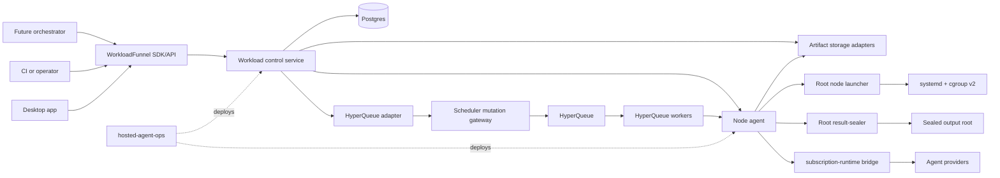
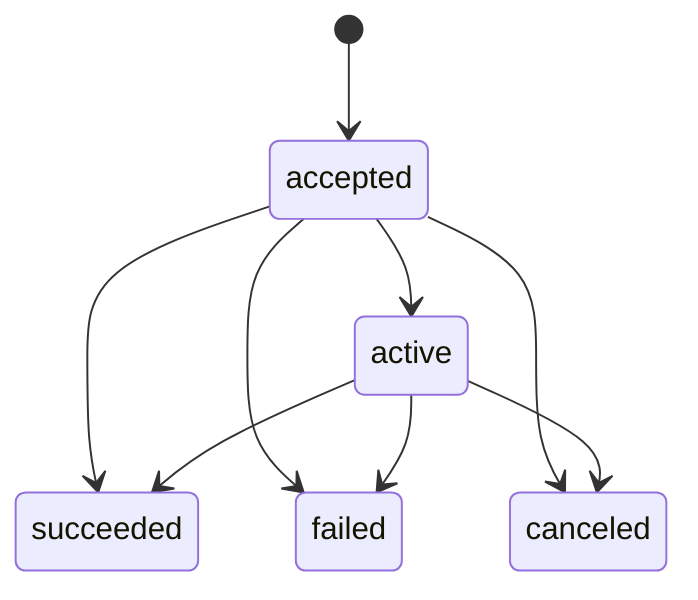
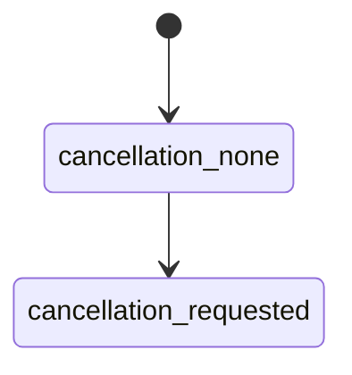
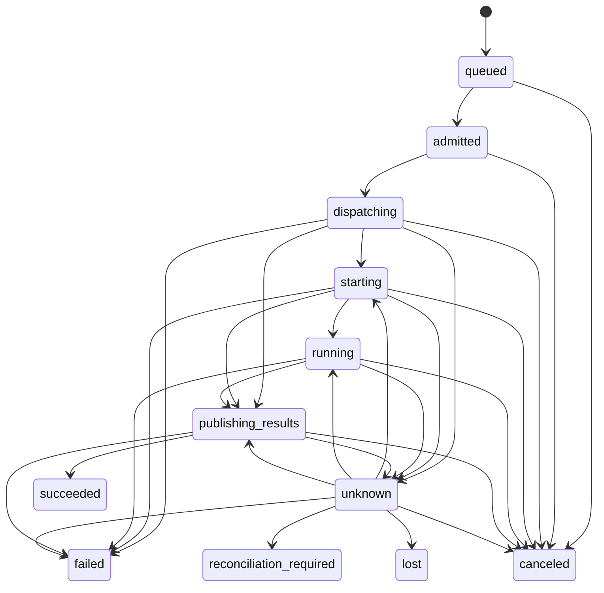
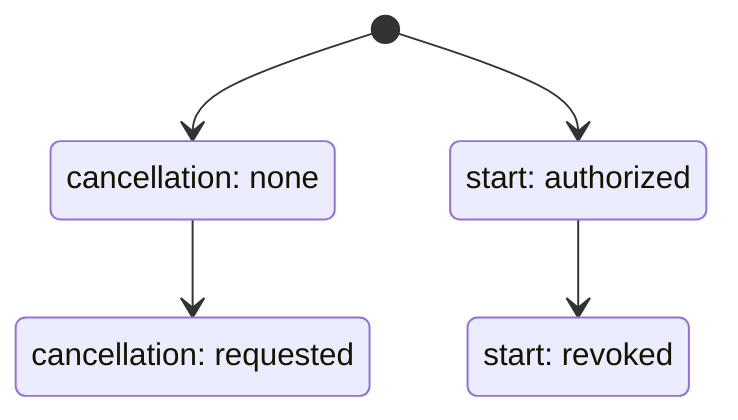
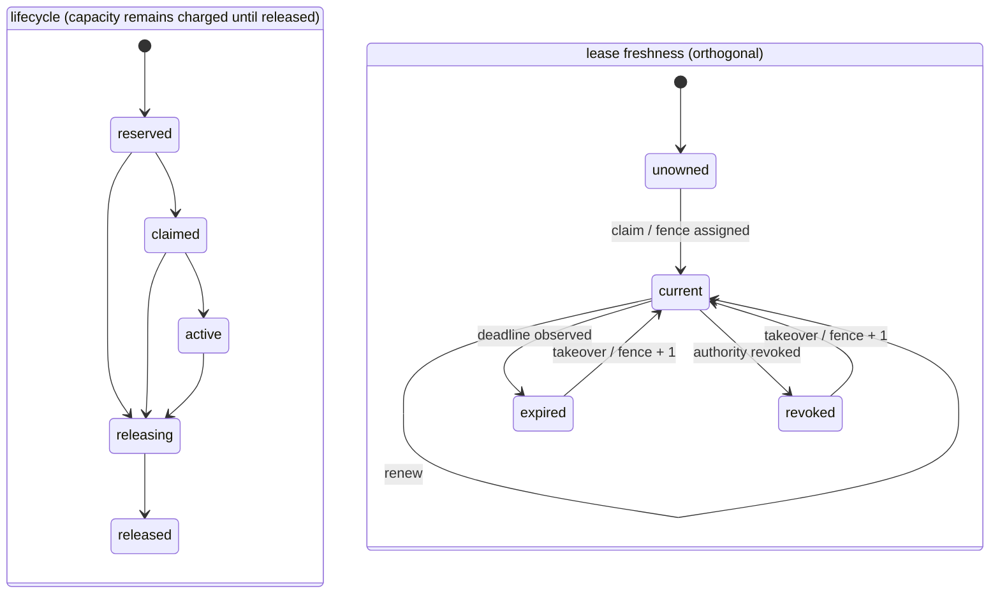
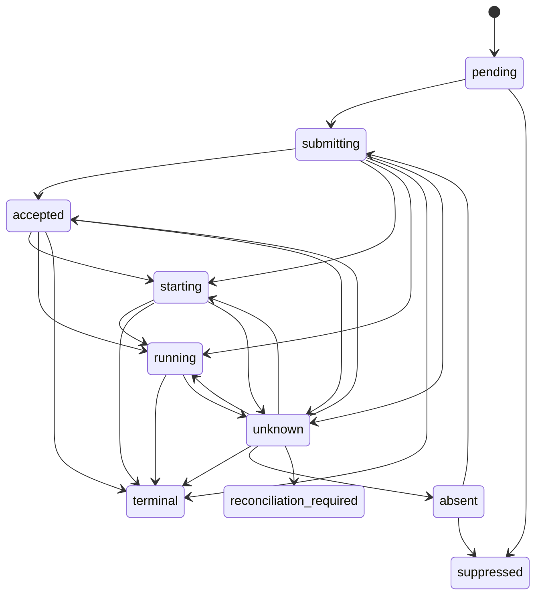

# WorkloadFunnel Architecture and Implementation Plan

> Turn unlimited demand into controlled execution.

| Field | Value |
| --- | --- |
| Status | Proposed architecture source of truth |
| Date | 2026-07-12 |
| Product | WorkloadFunnel |
| Repository | `777genius/workload-funnel` |
| Primary language | TypeScript |
| Initial deployment | Linux hosts with systemd and cgroup v2 |
| Production state store | Postgres |
| Embedded state store | SQLite |
| First external scheduler adapter | HyperQueue, optional and version-pinned |
| HyperQueue research baseline | v0.26.2; not an approved production pin |

## 1. Executive Decision

WorkloadFunnel is a reusable workload control plane placed between a caller that
decides *what should be done* and an execution system that knows *how to start a
process*.

```text
future LLM orchestrator / CI / desktop application / operator
                            |
                            v
                     WorkloadFunnel
       durable intent, admission, allocation, reconciliation
                 /             |              \
                v              v               v
      subscription-runtime   systemd       HyperQueue
        agent execution     local process   batch dispatch
```

The repository will contain both reusable TypeScript packages and deployable
services. It must remain useful without HyperQueue, without an LLM, and without
`subscription-runtime`.

The name describes the stable product responsibility: many heterogeneous
requests enter, policy and capacity narrow them into a controlled execution
flow. It does not bind the project to agents, one scheduler, a cloud, or a
particular operating system.

The core architectural decisions are:

1. Postgres is the canonical production source of workload intent and durable
   lifecycle decisions.
2. Controllers reconcile desired and observed state. They do not implement a
   fragile imperative script sequence.
3. Workload, run, attempt, allocation, dispatch, and process execution have
   separate identities and histories.
4. Delivery is at least once. Idempotency, inbox deduplication, leases, and
   fencing make retries safe; the system does not claim exactly-once execution.
5. Linux execution is owned by systemd transient services and cgroup v2, not by
   tmux and not by direct cgroupfs writes.
6. Schedulers and executors are replaceable adapters with explicit capability
   negotiation. HyperQueue is an optimization, never the domain authority.
7. `subscription-runtime` remains an agent execution and safety kernel.
   WorkloadFunnel invokes it through a versioned adapter contract and must not
   absorb provider authentication or agent-session implementation.
8. Project strategy remains above WorkloadFunnel. Producer/reviewer selection,
   coding goals, benchmark priorities, worktree review, and git integration are
   responsibilities of a future orchestrator.
9. Every package is internally divided into feature-owned vertical slices.
   Package boundaries alone are not considered sufficient modularity.
10. All mutations are auditable, correlated, idempotent, and recoverable after
    a crash between any two external side effects.

### 1.1 Why TypeScript

TypeScript is selected because the surrounding runtime, future orchestrator,
SDK consumers, and hosted control tooling are expected to use the same
ecosystem. It provides one contract/type/toolchain across server, node daemon,
SDK, and adapters. This decision is about integration and maintainability, not
an unsupported claim that Node.js is always faster or smaller than Python.

The core control path will not require a Python sidecar. HyperQueue integration
uses a pinned Rust CLI adapter. A future Python SDK may be generated from the
public protocol without moving domain policy into Python.

## 2. Problem Statement

Multiple autonomous agents, builds, tests, and background processes compete for
finite CPU, memory, IO, account quota, and execution slots. A raw concurrency
limit such as `maxActiveWorkers = 5` is insufficient because workloads vary
widely:

- an idle agent session may consume little CPU but hold memory and provider
  quota;
- `npm ci`, Docker BuildKit, `pip`, compilation, and benchmarks may saturate all
  cores and disk IO;
- eight lightweight workers may be safe while three build-heavy workers are
  not;
- processes can become detached from the launching shell;
- a controller can crash after starting a process but before recording success;
- duplicated commands can create duplicated side effects;
- a missing heartbeat may mean network partition, controller restart, process
  death, or delayed observation;
- an external scheduler may report completion while result publication fails;
- a future orchestrator needs durable capacity and lifecycle primitives, but
  should not own low-level host process safety.

The system therefore needs a durable, scheduler-independent layer that turns
unbounded demand into controlled execution while preserving useful throughput.

## 3. Goals

### 3.1 Functional goals

- Accept workloads using a stable, structured contract.
- Deduplicate caller retries through scoped idempotency keys.
- Queue and admit workloads according to capacity, quota, priority, fairness,
  constraints, and host pressure.
- Reserve resources before dispatch.
- Dispatch through local, agent-runtime, or external scheduler adapters.
- Own and observe complete process trees.
- Apply hard and soft resource envelopes where the executor supports them.
- Reconcile ambiguous, stale, and partially completed operations.
- Support cancellation as a durable desired-state transition.
- Persist immutable result manifests and explicit retention tombstones.
- Expose durable events, snapshots, metrics, and audit records.
- Scale from one desktop/host to a small multi-node worker pool.
- Let higher-level orchestrators maintain many logical workers without forcing
  all workers to run heavily at the same time.

### 3.2 Reliability goals

- No accepted workload is silently lost within its declared durability profile;
  receipts identify that profile and recovery gaps cause quarantine rather than
  silent continuation.
- Duplicate command or event delivery does not duplicate canonical state.
- A stale controller cannot mutate an allocation after lease takeover.
- A host or controller restart converges to a known state.
- Unknown execution outcomes remain explicit instead of being guessed.
- Side-effectful ambiguous work is never automatically replayed without an
  explicit policy and external idempotency guarantee.
- Cancellation does not become terminal until process state is observed or a
  terminal reconciliation decision is recorded.
- Deleting result bytes never deletes the terminal lifecycle record.
- A scheduler outage cannot corrupt the canonical workload lifecycle.

### 3.3 Architectural goals

- Strict compile-time dependency direction: applications and adapters depend on
  application contracts; application depends on domain; domain depends only on
  the minimal kernel.
- Feature-owned vertical slices inside every non-trivial package.
- No framework, database, scheduler, provider, or operating-system type in the
  domain API.
- Replaceable scheduler, executor, state store, event transport, artifact store,
  and pressure sensor.
- Versioned public contracts and explicit adapter capabilities.
- Small, reviewable files and cohesive bounded contexts.
- A future open-source release that is useful beyond AI agents.

## 4. Non-Goals

WorkloadFunnel will not:

- decide which product feature an agent should implement;
- decompose a project goal into tasks;
- choose producer, reviewer, drain, or integration roles;
- evaluate code quality or benchmark quality;
- review or merge git branches and worktrees;
- manage Codex, Claude, or other provider credentials;
- replace `subscription-runtime` as the agent launch/safety kernel;
- parse arbitrary shell strings to infer required resources or permissions;
- provide a general container orchestrator in the first release;
- reproduce all Kubernetes, Nomad, Slurm, or Temporal features;
- replace package-manager-native dependency caches or invent a universal build
  cache;
- promise exactly-once process execution;
- use HyperQueue as canonical state, tenant policy, or security boundary;
- silently downgrade required resource isolation when an adapter lacks it.

## 5. Ubiquitous Language

| Term | Meaning |
| --- | --- |
| Workload | Accepted immutable intent with identity `workloadId`; it owns exactly one `WorkloadSpec`. |
| Workload spec | Identity-less immutable value owned by one Workload: structured desired command, resources, constraints, replay policy, and result contract. |
| Run | Caller-visible lifecycle with identity `runId`. V1 creates exactly one Run for each accepted Workload. |
| WorkloadRun | Read model joining a Workload and its Run; it is not an aggregate, command target, or additional identity. |
| Attempt | One try to realize a Run. Retries create new Attempts under that Run. |
| Allocation | Fenced reservation of capacity for one attempt on a node or scheduler pool. |
| Dispatch | Adapter-owned mapping between an allocation and an external execution system. |
| Execution | The observed operating-system or runtime process lifecycle. |
| Tenant | Fairness, quota, and idempotency scope. It need not equal a customer. |
| Workload class | Operational class such as interactive, agent, build, benchmark, recovery, or maintenance. |
| Resource request | Structured CPU, memory, PID, IO, custom-resource, and placement requirements. |
| Capacity snapshot | Time-bounded observation of allocatable resources and host pressure. |
| Lease | Expiring right to reconcile a resource. |
| Execution generation | Immutable identity of one concrete process execution; part of ticket/unit identity. |
| Owner fence | Monotonically increasing lease revision that rejects stale reconciliation owners without renaming the execution. |
| Namespace writer epoch | Deployment/ownership generation that rejects stale control-plane writers. |
| Namespace ownership | Canonical per-namespace ownership aggregate containing the current writer identity/epoch and transfer state. |
| Start fence | Revocable Attempt authorization that must still match immediately before creating or progressing the external execution. |
| Attempt start-revocation revision | Monotonic Attempt-owned revision incremented when canonical cancellation revokes its start fence; final start authorities durably advance to it before revocation is effective there. |
| Cancellation desired state | Monotonic Run/Attempt intent (`none -> requested`) kept separate from observed lifecycle so requesting cancellation never erases `accepted`, `unknown`, or other execution evidence. |
| Terminalization intent | Immutable Attempt-owned CAS decision naming one terminal disposition and its exact evidence; it is recorded before any capacity, tenant, staging, or no-Allocation release. |
| Desired state | Persisted target lifecycle requested by a caller/controller. |
| Observed state | Latest adapter or node observation, including uncertainty. |
| Result manifest | Immutable metadata describing outputs, checksums, locations, and retention state. |
| Tombstone | Durable record that bytes were deliberately removed after policy evaluation. |
| Reconciliation | Idempotent convergence from persisted desired state and observations. |
| Admission | Decision to reserve scarce capacity now, defer, or deny. |
| Pressure | CPU, memory, IO, PID, scheduler, or provider saturation signal. |
| Execution ticket | Versioned command handed to an executor after admission and allocation. |

Words such as `worker`, `job`, and `task` are overloaded across providers.
Public domain contracts should prefer the terms above.

## 6. Architectural Principles

### 6.1 Desired state over imperative sequences

An API request records intent. Reconcilers make progress through small,
repeatable steps. A controller crash after any external call must be recoverable
from persisted state and observation.

Bad:

```text
insert row -> start process -> mark running -> hope every step returns
```

Required:

```text
persist desired state + outbox
  -> claim reconciliation work
  -> invoke idempotent/fenced adapter operation
  -> persist observation
  -> derive next decision
  -> repeat until converged
```

### 6.2 Separate intent, reservation, dispatch, and execution

An accepted workload does not prove resources were reserved. An allocation does
not prove a scheduler accepted the request. A scheduler ID does not prove a
process started. Process exit does not prove results were durably published.
Separate aggregates prevent these facts from being collapsed into one unsafe
`status` column.

### 6.3 Capability-driven adapters

Adapters publish a capability document. Application policies compare required
capabilities before selecting an adapter. Unsupported semantics produce a
typed refusal or a deliberate alternate route.

### 6.4 Fail closed for safety, remain explicit for liveness

- Missing hard-isolation capability blocks a workload requiring hard isolation.
- Missing observation produces `unknown`, not invented success/failure.
- Missing idempotency support blocks blind retry after an ambiguous call.
- Pressure sensor failure lowers admission capacity according to policy; it does
  not pretend the host is idle.

### 6.5 At-least-once everywhere

Commands, events, and reconciliation work can be redelivered. Every mutation is
scoped by an idempotency key, operation ID, aggregate version, or inbox receipt.
External side effects require adapter-level reconciliation.

### 6.6 No universal dumping grounds

There will be no repository-wide `utils`, `helpers`, `services`, `common`, or
`ports` folder. A capability belongs to a feature. Truly stable primitives may
live in the kernel only after at least two concrete consumers demonstrate that
the abstraction is real.

### 6.7 Normative language and invariant catalog

`MUST`, `MUST NOT`, `SHOULD`, and `MAY` are normative. If prose, a diagram, and
an invariant conflict, the invariant wins until an ADR deliberately changes it.
Every production change maps its tests to the affected invariant IDs.

| ID | Invariant |
| --- | --- |
| WF-INV-001 | An acknowledged accepted workload MUST already exist in canonical durable state. |
| WF-INV-002 | One namespace MUST have only one current writer epoch; stale writers MUST be rejected. |
| WF-INV-003 | One execution generation MUST have one outer OS process owner. |
| WF-INV-004 | Lease expiry MUST NOT be treated as proof that an execution stopped. |
| WF-INV-005 | An unknown external mutation MUST NOT be blindly repeated. |
| WF-INV-006 | A stale applicable fencing tuple MUST NOT mutate allocation, dispatch, execution, runtime/provider session, or result state. |
| WF-INV-007 | Capacity reservation MUST serialize against one current reservation-ledger revision and MUST NOT overcommit hard dimensions. |
| WF-INV-008 | Inbox receipt, canonical mutation, and resulting outbox records MUST commit atomically. |
| WF-INV-009 | Run success MUST require a successful current Attempt and complete required ResultManifest. |
| WF-INV-010 | Control-plane code MUST NOT serialize secret values into canonical state, scheduler payload, argv, events, manifests, or spool; secret-bearing output MUST follow its isolation/redaction policy. |
| WF-INV-011 | Authenticated principal and effective tenant MUST NOT come from untrusted request fields. |
| WF-INV-012 | Dispatch adapter and version MUST remain immutable while a Dispatch is non-terminal or unknown. |
| WF-INV-013 | Node/control-plane isolation MUST stop new starts and MUST preserve existing execution ambiguity. |
| WF-INV-014 | Result-byte deletion MUST leave a durable audited tombstone. |
| WF-INV-015 | An adapter MUST NOT claim or receive work requiring capabilities it cannot enforce. |
| WF-INV-016 | Runtime, scheduler, and operational scripts MUST NOT bypass the node executor's outer ownership boundary. |
| WF-INV-017 | A controller or node restart MUST reconcile durable intent and observations before accepting/claiming new work. |
| WF-INV-018 | Canonical history MUST NOT be destructively rewritten to hide retries, ambiguity, or operator intervention. |
| WF-INV-019 | A closed operation gate MUST prevent queued and new matching side effects at the final executor/gateway boundary. |
| WF-INV-020 | Each canonical aggregate field and transition MUST have one feature owner; adapters and process managers submit commands or evidence only. |
| WF-INV-021 | A profile claiming detectable acknowledged continuity MUST durably witness acceptance before returning success. |
| WF-INV-022 | Only `workload-lifecycle` MAY issue an execution generation, and it MUST issue it atomically with creation of its Attempt. |
| WF-INV-023 | `node-lifecycle` MUST be the only writer of Node capability, heartbeat, pressure, observation revision, and lifecycle state. |
| WF-INV-024 | Cancellation MUST converge through durable single-owner saga steps; capacity MUST NOT be released until start is impossible and any existing execution is stopped or proven absent. |
| WF-INV-025 | One accepted Workload MUST own one immutable WorkloadSpec and one Run; a scoped idempotent retry MUST return those same identities and MUST NOT create another Attempt. |
| WF-INV-026 | Recording canonical start revocation MUST NOT be treated as effective at a final start authority until that authority acknowledges the Attempt's revision, is externally fenced, or every older start authorization expires. |
| WF-INV-027 | The runtime broker MUST monotonically fence every external mutation at its final boundary; a missing, lower, or equal-version/mismatched tuple MUST perform zero external mutation. |
| WF-INV-028 | Cancellation desired/revocation state MUST be monotonic and orthogonal to Run/Attempt observed lifecycle; requesting cancellation MUST NOT erase accepted or ambiguous execution evidence. |
| WF-INV-029 | `namespace-ownership` alone MUST advance NamespaceOwnership; every cutover/rollback MUST close and drain effects, fence old authorities, CAS to a fresh epoch, install/acknowledge the dominating fence, and only then reopen. |
| WF-INV-030 | The root launcher MUST durably enforce the complete applicable MutationFence at the serialized final systemd boundary, including per-effect-scope desired-version/supersession high-watermarks and the full-tuple fingerprint; missing, lower, or equal-version/mismatched authority MUST make zero systemd calls. |
| WF-INV-031 | `scheduler-hyperqueue/mutation-gateway-authority` MUST be the sole owner of the scheduler gateway fence registry and the gateway MUST hold the sole HyperQueue mutation credential; every submit/cancel mutation MUST serialize complete-tuple validation with the final CLI call. |
| WF-INV-032 | NamespaceOwnership transfer state MUST progress `pending -> aborted` only before the epoch CAS, or `pending -> epoch_advanced` atomically with that CAS and then `epoch_advanced -> completed` only after every required final-authority installation acknowledgement; post-CAS recovery MUST resume forward. |
| WF-INV-033 | Privileged output sealing MUST occur only through the separate result-sealer's typed, fence-bound, deterministic-root contract; the node launcher MUST NOT gain artifact traversal, sealing, upload, or ResultManifest authority. |
| WF-INV-034 | Every external-effect receipt MUST identify its operation and either carry the complete MutationFence or its immutable fingerprint plus every field used for comparison, so reconciliation can prove exactly which authority was applied or rejected. |
| WF-INV-035 | A pre-start Execution superseded before any external process exists MUST terminate as `superseded`; an early exit or stop observed after start issuance MUST remain representable directly from `starting`. |
| WF-INV-036 | A valid terminal Execution observation MUST advance Attempt directly from its current observed state; an owner MUST NOT fabricate an intermediate `running` observation to reach result publication or failure. |
| WF-INV-037 | A Dispatch in `unknown` MUST remain recoverable by ordered evidence to `accepted`, `starting`, `running`, `terminal`, or proven `absent`, and otherwise MUST enter `reconciliation_required`; scheduler terminal evidence alone MUST NOT decide Execution or Attempt success. |
| WF-INV-038 | Every canonical counter, policy, tenant, audit, and coordinator record MUST be classified as an aggregate, serialized ledger, process-manager record, immutable evidence, or projection with one writer, one version rule, and explicit transaction participation. |
| WF-INV-039 | Acceptance, reservation, Allocation attachment/rejection, allocation release, Attempt terminalization, ResultManifest finalization, and retention/tombstone accounting MUST invoke every active declared owner participant in the fixed canonical transaction order; no coordinator or store adapter may write a foreign feature's repository. |
| WF-INV-040 | The checked-in dependency/composition source MUST be bijective with production filesystem slices, strict DAG nodes, binding rows, generated roots, entrypoint exports, and per-node kernel-symbol grants; unlisted, duplicate, implicit, or privileged network/spool edges MUST fail generation. |
| WF-INV-041 | An Attempt or Run MUST NOT terminalize for success, normal failure, publication failure, lost, or cancellation until a same-intent immutable allocation-release or no-Allocation receipt proves capacity, tenant, event-debt, audit, and staging-disk dispositions committed exactly once. |
| WF-INV-042 | `CapacityReservationLedgerStore` and `OwnershipTransferCoordinatorStore` MUST be feature-owned contracts with dedicated Postgres/SQLite slices, schema ownership, exact DAG/profile bindings, and restart-safe contract tests. |
| WF-INV-043 | Executable and working-directory identity MUST remain descriptor-validated and mount-pinned through the final systemd call; a pathname or symlink swap MUST NOT change the launched inode or directory. |
| WF-INV-044 | An Attempt MUST CAS exactly one immutable terminalization intent before any terminal resource disposition; every release/no-Allocation receipt MUST bind `(attemptId, executionGeneration, terminalizationIntentId)`, and conflicting disposition or evidence MUST fail without releasing anything. |
| WF-INV-045 | Attempt terminalization MUST verify an extant owner-issued allocation/no-Allocation receipt through `AllocationLeasingTransactionParticipant` in the same fixed-lock transaction; caller-carried, stale, forged, mismatched, or deleted receipt data MUST NOT authorize a terminal transition. |
| WF-INV-046 | Every canonical bundle MUST declare its complete lock intents before locking, then execute the closed phase ranks in order as lock, validate, apply; Postgres and SQLite MUST expose actual transaction lock-call traces proving the protocol. |
| WF-INV-047 | Every enabled ownership-transfer controller, feature API, coordinator store, and claim facility MUST be composed together; pre-CAS abort and post-CAS completion are disjoint, and incomplete work MUST be discoverable, claimable, acknowledged, and completed only forward. |
| WF-INV-048 | Every Dispatch adapter mapping MUST persist through the feature-owned `DispatchMappingStore` with create-only identity and payload uniqueness, backend schema ownership, exact composition bindings, and restart-safe reconciliation. |
| WF-INV-049 | A privileged launcher MUST apply the closed mount-attribute and namespace sequence before systemd and persist an immutable cleanup receipt for every pinned executable/working-directory mount; restart MUST resume cleanup without path re-resolution. |
| WF-INV-050 | Reservation rollback and terminal release are distinct: attachment rejection MUST write only a nonterminal `ReservationRollbackReceipt`; terminalization MUST still verify one intent-bound terminal release proof, and terminal-intent creation MUST serialize with Allocation ownership and uniqueness at ranks 40/50. |
| WF-INV-051 | A terminal release receipt MUST be finalized by `allocation-leasing` at owner-controlled rank 160 after every declared participant result exists; a draft or coordinator receipt MUST NOT authorize Attempt terminalization. |
| WF-INV-052 | Compile-time imports and runtime injection MUST be checked as separate graphs: every `B` output MUST have checked-in `C` records naming its actual receiving factory, the generated root MUST wire provider output to owner input without an owner-to-adapter import, and both graphs MUST independently compile/topologically construct. |
| WF-INV-053 | A pinned-path execution profile MUST have the host-mount-namespace launcher pin the verified anchor namespace FD, validate boot/PID-start/InvocationID identity before and after pinning, and prove host visibility, crash reopening, anti-reuse validation, and child-first cleanup in Phase 0.5; unsupported hosts MUST fail closed. |
| WF-INV-054 | Allocation lifecycle and lease freshness MUST be orthogonal; lease expiry/revocation MUST NOT imply process absence, release capacity, or prevent fenced takeover/reconciliation. |
| WF-INV-055 | Externally witnessed acceptance MUST NOT return success until witness acknowledgement is followed by a durable canonical `confirmed` status/idempotency receipt; crash recovery MUST resolve an acknowledged-but-unrecorded witness by exact operation lookup. |
| WF-INV-056 | Both control profiles MUST construct and register exactly the seven feature-owned canonical transaction participant contracts directly into `canonical-transaction-coordination.createProvider`, and startup MUST reject any bundle whose exact participant mode set or rank-160 finalizer differs from the normative matrix. |
| WF-INV-057 | Reservation, attachment, attachment rejection, rollback, terminal-intent creation, and no-Allocation proof MUST serialize on the same Allocation lifetime-uniqueness/history keys; rollback evidence MUST remain nonterminal and historical Allocation existence MUST never be represented as absence. |
| WF-INV-058 | `ResultManagementTransactionParticipant` MUST be the only ranks-90/100 writer in result finalization/tombstoning bundles; both backend roots MUST bind its four owner stores and inject it into the real coordinator factory, and every result/staging-mutating bundle MUST pass the closed startup mode assertion. |
| WF-INV-059 | Ownership-transfer restart work MUST acquire the separately injected `ReconciliationClaimStore` lease/fence in both profiles; stale or expired claimants MUST NOT record coordinator steps or acknowledgements. |
| WF-INV-060 | Fixed Phase 0/1 roots MUST construct without HyperQueue, provider-runtime, or object-artifact adapters; later adapters MUST enter only through closed capability-gated profiles/provider sets, and an absent required capability MUST be typed unschedulable with no fallback effect. |
| WF-INV-061 | Atomic Allocation attachment rejection MUST durably schedule an idempotent owner continuation that either republishes the still-queued Attempt for reservation or enters the existing terminal-intent/release pipeline; a committed rollback receipt MUST NOT strand an Attempt. |

## 7. System Context and Responsibility Boundaries



### 7.1 Future orchestrator owns

- project goals and task decomposition;
- role mix and useful worker count;
- coding/review/integration strategy;
- benchmark and product priorities;
- interpretation of domain-specific worker output;
- when a project should stop, continue, or pivot.

### 7.2 WorkloadFunnel owns

- durable execution intent;
- tenant-aware admission and fairness;
- resource reservations and placement;
- attempt, allocation, dispatch, and execution reconciliation;
- process ownership contracts and resource enforcement requests;
- node capacity and pressure state;
- lifecycle events and audit;
- result manifests and retention decisions;
- idempotency, inbox/outbox, leases, and fencing.

### 7.3 `subscription-runtime` owns

- provider selection, account/session/auth handling;
- controlled agent startup, status, stop, and provider diagnostics;
- provider-specific safety and sandbox configuration;
- workspace/project access-policy enforcement;
- runtime-internal foreground process and event details;
- its own durable provider operation lifecycle.

There is one OS ownership topology for an agent workload: WorkloadFunnel's node
executor creates the fenced systemd/cgroup boundary, and
`subscription-runtime` runs in foreground inside that boundary. The runtime
owns provider/session semantics and its internal child lifecycle; it does not
daemonize outside or create a competing host-level owner. WorkloadFunnel does
not send provider commands directly. Both layers reconcile their own facts,
but only the node executor owns the outer process tree and resource envelope.

The dependency direction is:

```text
WorkloadFunnel adapter -> versioned subscription-runtime client contract
```

`subscription-runtime` must not import WorkloadFunnel. The bridge translates an
execution ticket into runtime broker operations and translates durable runtime
events back into scheduler-independent observations.

### 7.4 `hosted-agent-ops` owns

- installation and atomic release switching;
- systemd unit templates and environment wiring;
- Postgres/bootstrap/migration procedures;
- host cache and directory provisioning;
- health checks, rollback, backup, and operator runbooks.

It must not become a second canonical workload state machine. Shell watchdogs
may observe or restart a service, but must not independently create workloads
or mutate lifecycle state.

## 8. Repository Topology

```text
workload-funnel/
  apps/
    control-service/
    node-agent/
    node-launcher/
    result-sealer/
    scheduler-mutation-gateway/
    operator-cli/
  packages/
    kernel/
    workload-control/
    node-execution/
    store-postgres/
    store-sqlite/
    executor-systemd/
    dispatcher-local/
    scheduler-hyperqueue/
    artifact-store-filesystem/
    artifact-store-object/
    bridge-subscription-runtime/
    client-sdk/
    observability/
    testing/
  docs/
    adr/
    operations/
    security/
    workload-funnel-architecture-plan.md
  tooling/
```

Package boundaries represent bounded contexts or independently replaceable
infrastructure. Every package that contains more than a trivial adapter is also
split by business feature.

`node-agent` is the unprivileged network/control client. `node-launcher` is the
minimal privileged local systemd boundary described in section 17. They MUST
run as different Unix identities.

`result-sealer` is the separate minimal privileged deterministic-root filesystem
boundary in section 17.7. It MUST run under an identity distinct from both node
agent and launcher and has no systemd or artifact-store authority.

`scheduler-mutation-gateway` is deployed only for an external scheduler that
cannot validate WorkloadFunnel fences itself. It is a narrow credential and
mutation boundary, not a second scheduler or control plane.

### 8.1 Standard feature layout

```text
src/features/<feature>/
  domain/
    entities/
    value-objects/
    policies/
    events/
  application/
    commands/
    queries/
    use-cases/
    contracts/
  adapters/
  api/
  tests/
  index.ts
```

Only folders actually needed by a feature are created. `application/contracts`
contains inbound and outbound boundaries conventionally called ports; the
project does not create a detached root `ports/` package.

### 8.2 Public import rules

- Cross-package imports use package exports.
- Cross-feature imports use the target feature's public `index.ts`, command,
  query, event, or read model.
- Internal entity and repository implementations are not imported across
  features.
- Adapters may depend on application contracts and public domain values.
- Domain code imports no application, adapter, framework, or transport code.
- Applications compose features; they do not contain domain policy.

Architecture tests will enforce forbidden imports and public export boundaries.

### 8.3 Package dependency graph

The directional constraint is:

```text
generated application composition root
  -> exact provider factories listed in its section 8.3.1 row

named adapter or app implementation slice
  -> exact public contracts listed in its section 8.3.1 row

named business feature
  -> exact public feature APIs listed in its section 8.3.1 row

kernel primitives
  -> no internal package
```

This diagram grants no imports; the exact rows and generated kernel-symbol map
below are the allowlist.

`client-sdk` consumes generated or explicitly exported feature-owned public
schemas. It does not redefine domain commands. Transport controllers map wire
schemas to commands and do not own a competing contract model.

Pure implementation packages such as `executor-systemd`, `scheduler-hyperqueue`,
and stores are deliberate adapter packages. Their internal operation slices map
one-to-one to application contracts owned by business features; they contain no
independent business use cases. This is the only exception to using business
names as the top-level feature dimension.

Anti-corruption adapters may depend on the public contracts on both sides they
translate, never on internals. Section 8.3.1 is the only source of required and
allowed production edges; descriptions in this and later sections do not create
additional permissions.

No core feature package depends back on an anti-corruption adapter.

#### 8.3.1 Enforceable feature dependency DAG

The following table is the single normative, machine-readable source from which
Phase 0 generates the compile-time import allowlist, package-export checks, and
cycle check. An arrow is expressed as "feature may import"; every production
cross-feature/package import not present in a row is forbidden. The generator
adds only the separately declared `kernel` primitive imports from the generated
manifest; it infers no adapter, business, application, composition, or external
contract edge. Only the target
feature's public `index.ts` or named public contract may be imported. Consuming
a public event is still an edge. A later prose flow cannot authorize a missing
edge: the table must be updated first.

Canonical node IDs have the exact form `<package>/<feature>` for packages,
`apps/<app>/<feature>` for deployables, or `external/<contract>/<major>` for an
external contract. These are generator keys, not abbreviations. Bare feature
names, package wildcards, `apps/*`, prose such as "public facts", and unnamed
"versioned external contracts" are invalid targets.

The second cell grammar is exactly `∅` or `` `nodeId` (`, `nodeId`)* ``.
Whitespace is one ASCII space around commas; order is lexical; duplicate IDs,
`and`, semicolons, annotations such as `public facts`/`contracts`, or any text
outside backticks are parse errors. Contract/member detail belongs only in the
section 8.3.3 `contractTarget` inventory and public export, never in this DAG
cell. The Markdown table is a checked rendering of the `D` relation extracted
from those node/target pairs; generation fails if re-rendering changes a byte.

| Feature | May import public API of |
| --- | --- |
| `workload-control/canonical-transaction-coordination` | ∅ |
| `workload-control/workload-lifecycle` | `workload-control/canonical-transaction-coordination` |
| `workload-control/node-lifecycle` | ∅ |
| `workload-control/operation-gating` | ∅ |
| `workload-control/namespace-ownership` | ∅ |
| `workload-control/capacity-management` | `workload-control/canonical-transaction-coordination`, `workload-control/node-lifecycle` |
| `workload-control/tenant-admission` | `workload-control/canonical-transaction-coordination`, `workload-control/capacity-management`, `workload-control/workload-lifecycle` |
| `workload-control/allocation-leasing` | `workload-control/canonical-transaction-coordination`, `workload-control/capacity-management`, `workload-control/namespace-ownership`, `workload-control/node-lifecycle`, `workload-control/tenant-admission`, `workload-control/workload-lifecycle` |
| `workload-control/dispatch-reconciliation` | `workload-control/allocation-leasing`, `workload-control/namespace-ownership`, `workload-control/operation-gating`, `workload-control/workload-lifecycle` |
| `workload-control/execution-reconciliation` | `workload-control/allocation-leasing`, `workload-control/dispatch-reconciliation`, `workload-control/namespace-ownership`, `workload-control/node-lifecycle`, `workload-control/operation-gating`, `workload-control/workload-lifecycle` |
| `workload-control/result-management` | `workload-control/canonical-transaction-coordination`, `workload-control/execution-reconciliation`, `workload-control/namespace-ownership`, `workload-control/operation-gating`, `workload-control/workload-lifecycle` |
| `workload-control/cancellation` | `workload-control/allocation-leasing`, `workload-control/dispatch-reconciliation`, `workload-control/execution-reconciliation`, `workload-control/namespace-ownership`, `workload-control/operation-gating`, `workload-control/result-management`, `workload-control/workload-lifecycle` |
| `workload-control/ownership-transfer` | `workload-control/allocation-leasing`, `workload-control/cancellation`, `workload-control/canonical-transaction-coordination`, `workload-control/dispatch-reconciliation`, `workload-control/execution-reconciliation`, `workload-control/namespace-ownership`, `workload-control/operation-gating` |
| `workload-control/control-event-delivery` | `workload-control/canonical-transaction-coordination` |
| `workload-control/audit-history` | `workload-control/allocation-leasing`, `workload-control/cancellation`, `workload-control/canonical-transaction-coordination`, `workload-control/capacity-management`, `workload-control/dispatch-reconciliation`, `workload-control/execution-reconciliation`, `workload-control/namespace-ownership`, `workload-control/node-lifecycle`, `workload-control/operation-gating`, `workload-control/ownership-transfer`, `workload-control/result-management`, `workload-control/tenant-admission`, `workload-control/workload-lifecycle` |
| `node-execution/node-registration-reporting` | `workload-control/node-lifecycle` |
| `node-execution/heartbeat-reporting` | `workload-control/node-lifecycle` |
| `node-execution/allocation-claiming` | `workload-control/allocation-leasing`, `workload-control/namespace-ownership` |
| `node-execution/execution-environment-resolution` | `workload-control/workload-lifecycle` |
| `node-execution/resource-enforcement` | ∅ |
| `node-execution/execution-ticket-validation` | `workload-control/allocation-leasing`, `workload-control/execution-reconciliation`, `workload-control/namespace-ownership`, `workload-control/node-lifecycle`, `workload-control/operation-gating`, `workload-control/workload-lifecycle` |
| `node-execution/observation-spooling` | `workload-control/execution-reconciliation`, `workload-control/node-lifecycle`, `workload-control/result-management` |
| `node-execution/local-receipt-recovery` | `workload-control/execution-reconciliation`, `workload-control/result-management` |
| `node-execution/process-lifecycle` | `node-execution/execution-environment-resolution`, `node-execution/execution-ticket-validation`, `node-execution/observation-spooling`, `node-execution/resource-enforcement`, `workload-control/execution-reconciliation` |
| `node-execution/scheduler-shim-entrypoint` | `node-execution/execution-ticket-validation`, `node-execution/observation-spooling`, `node-execution/process-lifecycle`, `workload-control/dispatch-reconciliation` |
| `node-execution/result-staging-reporting` | `node-execution/observation-spooling`, `workload-control/execution-reconciliation`, `workload-control/result-management` |
| `node-execution/result-sealing-coordination` | `node-execution/observation-spooling`, `node-execution/result-staging-reporting`, `workload-control/execution-reconciliation`, `workload-control/namespace-ownership`, `workload-control/operation-gating`, `workload-control/result-management` |
| `node-execution/node-drain-enforcement` | `node-execution/node-registration-reporting`, `node-execution/process-lifecycle`, `workload-control/execution-reconciliation`, `workload-control/node-lifecycle` |
| `store-postgres/workload-persistence` | `workload-control/workload-lifecycle` |
| `store-postgres/tenant-persistence` | `workload-control/tenant-admission` |
| `store-postgres/queued-work-ledger-persistence` | `workload-control/tenant-admission` |
| `store-postgres/recovery-debt-ledger-persistence` | `workload-control/control-event-delivery` |
| `store-postgres/disk-budget-ledger-persistence` | `workload-control/capacity-management` |
| `store-postgres/result-accounting-ledger-persistence` | `workload-control/result-management` |
| `store-postgres/retention-policy-persistence` | `workload-control/result-management` |
| `store-postgres/retention-work-ledger-persistence` | `workload-control/result-management` |
| `store-postgres/audit-ledger-persistence` | `workload-control/audit-history` |
| `store-postgres/canonical-transaction` | `workload-control/canonical-transaction-coordination` |
| `store-postgres/node-persistence` | `workload-control/node-lifecycle` |
| `store-postgres/allocation-persistence` | `workload-control/allocation-leasing` |
| `store-postgres/capacity-reservation-ledger-persistence` | `workload-control/allocation-leasing` |
| `store-postgres/dispatch-mapping-persistence` | `workload-control/dispatch-reconciliation` |
| `store-postgres/dispatch-persistence` | `workload-control/dispatch-reconciliation` |
| `store-postgres/execution-persistence` | `workload-control/execution-reconciliation` |
| `store-postgres/result-persistence` | `workload-control/result-management` |
| `store-postgres/operation-gate-persistence` | `workload-control/operation-gating` |
| `store-postgres/namespace-ownership-persistence` | `workload-control/namespace-ownership`, `workload-control/ownership-transfer` |
| `store-postgres/ownership-transfer-coordinator-persistence` | `workload-control/ownership-transfer` |
| `store-postgres/cancellation-coordinator-persistence` | `workload-control/cancellation` |
| `store-postgres/transactional-outbox` | `workload-control/control-event-delivery` |
| `store-postgres/command-inbox` | `workload-control/control-event-delivery` |
| `store-postgres/reconciliation-claims` | `workload-control/allocation-leasing`, `workload-control/cancellation`, `workload-control/canonical-transaction-coordination`, `workload-control/dispatch-reconciliation`, `workload-control/execution-reconciliation`, `workload-control/ownership-transfer`, `workload-control/result-management`, `workload-control/tenant-admission` |
| `store-postgres/projection-checkpoints` | `workload-control/control-event-delivery` |
| `store-postgres/schema-migrations` | ∅ |
| `store-sqlite/workload-persistence` | `workload-control/workload-lifecycle` |
| `store-sqlite/tenant-persistence` | `workload-control/tenant-admission` |
| `store-sqlite/queued-work-ledger-persistence` | `workload-control/tenant-admission` |
| `store-sqlite/recovery-debt-ledger-persistence` | `workload-control/control-event-delivery` |
| `store-sqlite/disk-budget-ledger-persistence` | `workload-control/capacity-management` |
| `store-sqlite/result-accounting-ledger-persistence` | `workload-control/result-management` |
| `store-sqlite/retention-policy-persistence` | `workload-control/result-management` |
| `store-sqlite/retention-work-ledger-persistence` | `workload-control/result-management` |
| `store-sqlite/audit-ledger-persistence` | `workload-control/audit-history` |
| `store-sqlite/canonical-transaction` | `workload-control/canonical-transaction-coordination` |
| `store-sqlite/node-persistence` | `workload-control/node-lifecycle` |
| `store-sqlite/allocation-persistence` | `workload-control/allocation-leasing` |
| `store-sqlite/capacity-reservation-ledger-persistence` | `workload-control/allocation-leasing` |
| `store-sqlite/dispatch-mapping-persistence` | `workload-control/dispatch-reconciliation` |
| `store-sqlite/dispatch-persistence` | `workload-control/dispatch-reconciliation` |
| `store-sqlite/execution-persistence` | `workload-control/execution-reconciliation` |
| `store-sqlite/result-persistence` | `workload-control/result-management` |
| `store-sqlite/operation-gate-persistence` | `workload-control/operation-gating` |
| `store-sqlite/namespace-ownership-persistence` | `workload-control/namespace-ownership`, `workload-control/ownership-transfer` |
| `store-sqlite/ownership-transfer-coordinator-persistence` | `workload-control/ownership-transfer` |
| `store-sqlite/cancellation-coordinator-persistence` | `workload-control/cancellation` |
| `store-sqlite/transactional-outbox` | `workload-control/control-event-delivery` |
| `store-sqlite/command-inbox` | `workload-control/control-event-delivery` |
| `store-sqlite/reconciliation-claims` | `workload-control/allocation-leasing`, `workload-control/cancellation`, `workload-control/canonical-transaction-coordination`, `workload-control/dispatch-reconciliation`, `workload-control/execution-reconciliation`, `workload-control/ownership-transfer`, `workload-control/result-management`, `workload-control/tenant-admission` |
| `store-sqlite/projection-checkpoints` | `workload-control/control-event-delivery` |
| `store-sqlite/schema-migrations` | ∅ |
| `executor-systemd/capability-discovery` | `node-execution/resource-enforcement` |
| `executor-systemd/transient-unit-start` | `node-execution/process-lifecycle` |
| `executor-systemd/transient-unit-observation` | `node-execution/observation-spooling`, `node-execution/process-lifecycle` |
| `executor-systemd/transient-unit-cancellation` | `node-execution/process-lifecycle` |
| `executor-systemd/cgroup-resource-mapping` | `node-execution/resource-enforcement` |
| `executor-systemd/journal-result-collection` | `node-execution/observation-spooling`, `node-execution/result-staging-reporting` |
| `dispatcher-local/capability-discovery` | `node-execution/execution-ticket-validation`, `workload-control/dispatch-reconciliation` |
| `dispatcher-local/dispatch-submission` | `node-execution/execution-ticket-validation`, `node-execution/process-lifecycle`, `workload-control/dispatch-reconciliation` |
| `dispatcher-local/dispatch-observation` | `node-execution/process-lifecycle`, `workload-control/dispatch-reconciliation` |
| `dispatcher-local/dispatch-cancellation` | `node-execution/process-lifecycle`, `workload-control/dispatch-reconciliation` |
| `scheduler-hyperqueue/capability-discovery` | `node-execution/scheduler-shim-entrypoint`, `workload-control/dispatch-reconciliation` |
| `scheduler-hyperqueue/dispatch-submission` | `node-execution/scheduler-shim-entrypoint`, `scheduler-hyperqueue/mutation-gateway-authority`, `workload-control/dispatch-reconciliation` |
| `scheduler-hyperqueue/dispatch-observation` | `node-execution/scheduler-shim-entrypoint`, `workload-control/dispatch-reconciliation` |
| `scheduler-hyperqueue/dispatch-cancellation` | `node-execution/scheduler-shim-entrypoint`, `scheduler-hyperqueue/mutation-gateway-authority`, `workload-control/dispatch-reconciliation` |
| `scheduler-hyperqueue/worker-inventory` | `node-execution/scheduler-shim-entrypoint`, `workload-control/dispatch-reconciliation` |
| `scheduler-hyperqueue/hyperqueue-reconciliation` | `node-execution/scheduler-shim-entrypoint`, `workload-control/dispatch-reconciliation` |
| `scheduler-hyperqueue/mutation-gateway-authority` | `workload-control/dispatch-reconciliation`, `workload-control/namespace-ownership`, `workload-control/operation-gating` |
| `scheduler-hyperqueue/hyperqueue-cli-mutation` | `node-execution/scheduler-shim-entrypoint`, `scheduler-hyperqueue/mutation-gateway-authority` |
| `artifact-store-filesystem/stage-write` | `node-execution/result-staging-reporting`, `workload-control/result-management` |
| `artifact-store-filesystem/verify-finalize` | `workload-control/result-management` |
| `artifact-store-filesystem/retention-delete` | `workload-control/result-management` |
| `artifact-store-object/stage-upload` | `node-execution/result-staging-reporting`, `workload-control/result-management` |
| `artifact-store-object/verify-finalize` | `workload-control/result-management` |
| `artifact-store-object/retention-delete` | `workload-control/result-management` |
| `external/subscription-runtime-client/v1` | ∅ |
| `bridge-subscription-runtime/runtime-capability-discovery` | `external/subscription-runtime-client/v1`, `node-execution/process-lifecycle` |
| `bridge-subscription-runtime/execution-ticket-preparation` | `external/subscription-runtime-client/v1`, `node-execution/process-lifecycle` |
| `bridge-subscription-runtime/runtime-operation-dispatch` | `external/subscription-runtime-client/v1`, `node-execution/process-lifecycle` |
| `bridge-subscription-runtime/runtime-event-consumption` | `external/subscription-runtime-client/v1`, `node-execution/process-lifecycle` |
| `bridge-subscription-runtime/runtime-operation-reconciliation` | `external/subscription-runtime-client/v1`, `node-execution/process-lifecycle` |
| `bridge-subscription-runtime/runtime-result-translation` | `external/subscription-runtime-client/v1`, `node-execution/process-lifecycle` |
| `client-sdk/workload-submission` | `workload-control/workload-lifecycle` |
| `client-sdk/workload-observation` | `workload-control/workload-lifecycle` |
| `client-sdk/workload-cancellation` | `workload-control/cancellation` |
| `client-sdk/event-subscription` | `workload-control/control-event-delivery` |
| `client-sdk/capacity-observation` | `workload-control/capacity-management` |
| `client-sdk/result-access` | `workload-control/result-management` |
| `observability/telemetry-export` | `workload-control/allocation-leasing`, `workload-control/cancellation`, `workload-control/capacity-management`, `workload-control/dispatch-reconciliation`, `workload-control/execution-reconciliation`, `workload-control/namespace-ownership`, `workload-control/node-lifecycle`, `workload-control/operation-gating`, `workload-control/result-management`, `workload-control/workload-lifecycle` |
| `observability/audit-export` | `workload-control/audit-history` |
| `observability/redaction-policy` | ∅ |
| `apps/node-launcher/authority-registry` | `node-execution/execution-ticket-validation`, `node-execution/process-lifecycle`, `workload-control/namespace-ownership`, `workload-control/operation-gating` |
| `apps/node-launcher/authority-installation` | `apps/node-launcher/authority-registry`, `node-execution/execution-ticket-validation` |
| `apps/node-launcher/systemd-mutation-boundary` | `apps/node-launcher/authority-registry`, `executor-systemd/capability-discovery`, `executor-systemd/cgroup-resource-mapping`, `executor-systemd/transient-unit-cancellation`, `executor-systemd/transient-unit-observation`, `executor-systemd/transient-unit-start`, `node-execution/process-lifecycle` |
| `apps/node-launcher/recovery-observation` | `apps/node-launcher/authority-registry`, `apps/node-launcher/systemd-mutation-boundary`, `executor-systemd/journal-result-collection`, `node-execution/local-receipt-recovery` |
| `apps/node-launcher/break-glass-stop` | `apps/node-launcher/systemd-mutation-boundary`, `node-execution/process-lifecycle` |
| `apps/scheduler-mutation-gateway/authority-registry` | `scheduler-hyperqueue/mutation-gateway-authority` |
| `apps/scheduler-mutation-gateway/authority-installation` | `apps/scheduler-mutation-gateway/authority-registry`, `scheduler-hyperqueue/mutation-gateway-authority` |
| `apps/scheduler-mutation-gateway/hyperqueue-mutation-boundary` | `apps/scheduler-mutation-gateway/authority-registry`, `scheduler-hyperqueue/hyperqueue-cli-mutation`, `scheduler-hyperqueue/mutation-gateway-authority` |
| `apps/scheduler-mutation-gateway/recovery` | `apps/scheduler-mutation-gateway/authority-registry`, `apps/scheduler-mutation-gateway/hyperqueue-mutation-boundary` |
| `apps/result-sealer/seal-authority-registry` | `node-execution/result-sealing-coordination` |
| `apps/result-sealer/filesystem-seal-boundary` | `apps/result-sealer/seal-authority-registry`, `node-execution/result-sealing-coordination` |
| `apps/result-sealer/recovery` | `apps/result-sealer/filesystem-seal-boundary`, `apps/result-sealer/seal-authority-registry`, `node-execution/local-receipt-recovery` |
| `apps/control-service/transport-http` | `apps/control-service/authentication`, `apps/control-service/authorization`, `apps/control-service/node-controller`, `apps/control-service/reconciliation-controller`, `apps/control-service/result-controller`, `apps/control-service/workload-controller` |
| `apps/control-service/authentication` | ∅ |
| `apps/control-service/authorization` | `workload-control/tenant-admission` |
| `apps/control-service/phase1-synthetic-runtime` | `dispatcher-local/capability-discovery`, `dispatcher-local/dispatch-cancellation`, `dispatcher-local/dispatch-observation`, `dispatcher-local/dispatch-submission`, `store-postgres/audit-ledger-persistence`, `store-postgres/canonical-transaction`, `store-postgres/command-inbox`, `store-postgres/projection-checkpoints`, `store-postgres/reconciliation-claims`, `store-postgres/transactional-outbox`, `store-postgres/workload-persistence`, `store-sqlite/audit-ledger-persistence`, `store-sqlite/canonical-transaction`, `store-sqlite/command-inbox`, `store-sqlite/projection-checkpoints`, `store-sqlite/reconciliation-claims`, `store-sqlite/transactional-outbox`, `store-sqlite/workload-persistence`, `workload-control/allocation-leasing`, `workload-control/audit-history`, `workload-control/cancellation`, `workload-control/canonical-transaction-coordination`, `workload-control/capacity-management`, `workload-control/control-event-delivery`, `workload-control/dispatch-reconciliation`, `workload-control/execution-reconciliation`, `workload-control/node-lifecycle`, `workload-control/operation-gating`, `workload-control/ownership-transfer`, `workload-control/result-management`, `workload-control/tenant-admission`, `workload-control/workload-lifecycle` |
| `apps/control-service/workload-controller` | `apps/control-service/phase1-synthetic-runtime`, `workload-control/cancellation`, `workload-control/tenant-admission`, `workload-control/workload-lifecycle` |
| `apps/control-service/node-controller` | `workload-control/allocation-leasing`, `workload-control/capacity-management`, `workload-control/node-lifecycle` |
| `apps/control-service/reconciliation-controller` | `workload-control/dispatch-reconciliation`, `workload-control/execution-reconciliation`, `workload-control/ownership-transfer` |
| `apps/control-service/result-controller` | `workload-control/result-management` |
| `apps/node-agent/control-plane-transport` | `node-execution/allocation-claiming`, `node-execution/heartbeat-reporting`, `node-execution/node-registration-reporting`, `node-execution/observation-spooling` |
| `apps/node-agent/launcher-socket-client` | `node-execution/local-receipt-recovery`, `node-execution/process-lifecycle` |
| `apps/node-agent/result-sealer-socket-client` | `node-execution/local-receipt-recovery`, `node-execution/result-sealing-coordination` |
| `apps/node-agent/local-receipt-recovery` | `node-execution/local-receipt-recovery`, `node-execution/observation-spooling` |
| `apps/node-agent/work-claim-controller` | `node-execution/allocation-claiming`, `node-execution/execution-ticket-validation`, `node-execution/process-lifecycle` |
| `apps/node-agent/observation-controller` | `node-execution/heartbeat-reporting`, `node-execution/observation-spooling`, `node-execution/result-staging-reporting` |
| `apps/control-service/composition-postgres` | `apps/control-service/authentication`, `apps/control-service/authorization`, `apps/control-service/node-controller`, `apps/control-service/reconciliation-controller`, `apps/control-service/result-controller`, `apps/control-service/transport-http`, `apps/control-service/workload-controller`, `dispatcher-local/capability-discovery`, `dispatcher-local/dispatch-cancellation`, `dispatcher-local/dispatch-observation`, `dispatcher-local/dispatch-submission`, `observability/audit-export`, `observability/redaction-policy`, `observability/telemetry-export`, `store-postgres/allocation-persistence`, `store-postgres/audit-ledger-persistence`, `store-postgres/cancellation-coordinator-persistence`, `store-postgres/canonical-transaction`, `store-postgres/capacity-reservation-ledger-persistence`, `store-postgres/command-inbox`, `store-postgres/disk-budget-ledger-persistence`, `store-postgres/dispatch-mapping-persistence`, `store-postgres/dispatch-persistence`, `store-postgres/execution-persistence`, `store-postgres/namespace-ownership-persistence`, `store-postgres/node-persistence`, `store-postgres/operation-gate-persistence`, `store-postgres/ownership-transfer-coordinator-persistence`, `store-postgres/projection-checkpoints`, `store-postgres/queued-work-ledger-persistence`, `store-postgres/reconciliation-claims`, `store-postgres/recovery-debt-ledger-persistence`, `store-postgres/result-accounting-ledger-persistence`, `store-postgres/result-persistence`, `store-postgres/retention-policy-persistence`, `store-postgres/retention-work-ledger-persistence`, `store-postgres/schema-migrations`, `store-postgres/tenant-persistence`, `store-postgres/transactional-outbox`, `store-postgres/workload-persistence`, `workload-control/allocation-leasing`, `workload-control/audit-history`, `workload-control/cancellation`, `workload-control/canonical-transaction-coordination`, `workload-control/capacity-management`, `workload-control/control-event-delivery`, `workload-control/dispatch-reconciliation`, `workload-control/execution-reconciliation`, `workload-control/namespace-ownership`, `workload-control/node-lifecycle`, `workload-control/operation-gating`, `workload-control/ownership-transfer`, `workload-control/result-management`, `workload-control/tenant-admission`, `workload-control/workload-lifecycle` |
| `apps/control-service/composition-sqlite` | `apps/control-service/authentication`, `apps/control-service/authorization`, `apps/control-service/node-controller`, `apps/control-service/reconciliation-controller`, `apps/control-service/result-controller`, `apps/control-service/transport-http`, `apps/control-service/workload-controller`, `artifact-store-filesystem/retention-delete`, `artifact-store-filesystem/verify-finalize`, `dispatcher-local/capability-discovery`, `dispatcher-local/dispatch-cancellation`, `dispatcher-local/dispatch-observation`, `dispatcher-local/dispatch-submission`, `observability/audit-export`, `observability/redaction-policy`, `observability/telemetry-export`, `store-sqlite/allocation-persistence`, `store-sqlite/audit-ledger-persistence`, `store-sqlite/cancellation-coordinator-persistence`, `store-sqlite/canonical-transaction`, `store-sqlite/capacity-reservation-ledger-persistence`, `store-sqlite/command-inbox`, `store-sqlite/disk-budget-ledger-persistence`, `store-sqlite/dispatch-mapping-persistence`, `store-sqlite/dispatch-persistence`, `store-sqlite/execution-persistence`, `store-sqlite/namespace-ownership-persistence`, `store-sqlite/node-persistence`, `store-sqlite/operation-gate-persistence`, `store-sqlite/ownership-transfer-coordinator-persistence`, `store-sqlite/projection-checkpoints`, `store-sqlite/queued-work-ledger-persistence`, `store-sqlite/reconciliation-claims`, `store-sqlite/recovery-debt-ledger-persistence`, `store-sqlite/result-accounting-ledger-persistence`, `store-sqlite/result-persistence`, `store-sqlite/retention-policy-persistence`, `store-sqlite/retention-work-ledger-persistence`, `store-sqlite/schema-migrations`, `store-sqlite/tenant-persistence`, `store-sqlite/transactional-outbox`, `store-sqlite/workload-persistence`, `workload-control/allocation-leasing`, `workload-control/audit-history`, `workload-control/cancellation`, `workload-control/canonical-transaction-coordination`, `workload-control/capacity-management`, `workload-control/control-event-delivery`, `workload-control/dispatch-reconciliation`, `workload-control/execution-reconciliation`, `workload-control/namespace-ownership`, `workload-control/node-lifecycle`, `workload-control/operation-gating`, `workload-control/ownership-transfer`, `workload-control/result-management`, `workload-control/tenant-admission`, `workload-control/workload-lifecycle` |
| `apps/node-agent/composition-local` | `apps/node-agent/control-plane-transport`, `apps/node-agent/launcher-socket-client`, `apps/node-agent/local-receipt-recovery`, `apps/node-agent/observation-controller`, `apps/node-agent/result-sealer-socket-client`, `apps/node-agent/work-claim-controller`, `artifact-store-filesystem/stage-write`, `bridge-subscription-runtime/execution-ticket-preparation`, `bridge-subscription-runtime/runtime-capability-discovery`, `bridge-subscription-runtime/runtime-event-consumption`, `bridge-subscription-runtime/runtime-operation-dispatch`, `bridge-subscription-runtime/runtime-operation-reconciliation`, `bridge-subscription-runtime/runtime-result-translation`, `node-execution/allocation-claiming`, `node-execution/execution-environment-resolution`, `node-execution/execution-ticket-validation`, `node-execution/heartbeat-reporting`, `node-execution/local-receipt-recovery`, `node-execution/node-drain-enforcement`, `node-execution/node-registration-reporting`, `node-execution/observation-spooling`, `node-execution/process-lifecycle`, `node-execution/resource-enforcement`, `node-execution/result-sealing-coordination`, `node-execution/result-staging-reporting`, `node-execution/scheduler-shim-entrypoint` |
| `apps/node-agent/composition-production` | `apps/node-agent/control-plane-transport`, `apps/node-agent/launcher-socket-client`, `apps/node-agent/local-receipt-recovery`, `apps/node-agent/observation-controller`, `apps/node-agent/result-sealer-socket-client`, `apps/node-agent/work-claim-controller`, `artifact-store-object/stage-upload`, `bridge-subscription-runtime/execution-ticket-preparation`, `bridge-subscription-runtime/runtime-capability-discovery`, `bridge-subscription-runtime/runtime-event-consumption`, `bridge-subscription-runtime/runtime-operation-dispatch`, `bridge-subscription-runtime/runtime-operation-reconciliation`, `bridge-subscription-runtime/runtime-result-translation`, `node-execution/allocation-claiming`, `node-execution/execution-environment-resolution`, `node-execution/execution-ticket-validation`, `node-execution/heartbeat-reporting`, `node-execution/local-receipt-recovery`, `node-execution/node-drain-enforcement`, `node-execution/node-registration-reporting`, `node-execution/observation-spooling`, `node-execution/process-lifecycle`, `node-execution/resource-enforcement`, `node-execution/result-sealing-coordination`, `node-execution/result-staging-reporting`, `node-execution/scheduler-shim-entrypoint` |
| `apps/node-launcher/composition` | `apps/node-launcher/authority-installation`, `apps/node-launcher/authority-registry`, `apps/node-launcher/break-glass-stop`, `apps/node-launcher/recovery-observation`, `apps/node-launcher/systemd-mutation-boundary` |
| `apps/scheduler-mutation-gateway/composition` | `apps/scheduler-mutation-gateway/authority-installation`, `apps/scheduler-mutation-gateway/authority-registry`, `apps/scheduler-mutation-gateway/hyperqueue-mutation-boundary`, `apps/scheduler-mutation-gateway/recovery` |
| `apps/result-sealer/composition` | `apps/result-sealer/filesystem-seal-boundary`, `apps/result-sealer/recovery`, `apps/result-sealer/seal-authority-registry` |
| `apps/operator-cli/composition` | `client-sdk/capacity-observation`, `client-sdk/event-subscription`, `client-sdk/result-access`, `client-sdk/workload-cancellation`, `client-sdk/workload-observation`, `client-sdk/workload-submission` |

The apparent event flow back toward `workload-lifecycle` does not create a
compile-time reverse edge: the downstream owner or process manager imports the
public lifecycle command and invokes it. `workload-lifecycle` never imports an
allocation, dispatch, execution, result, or cancellation internal/public type.

Pure adapter operation slices may import exactly the contracts in their row plus
neutral public values named by those contracts. Every production adapter slice
has a named row; an adapter directory without one fails generation. The
application composition roots consume a separately generated composition
manifest from these same rows; they may instantiate listed implementations but
may not create a new feature-to-feature edge or be imported by a feature.
Adding an edge requires changing this table or an ADR first; a cycle, internal
import, or unlisted edge fails the generated check.

#### 8.3.2 Generated application-composition manifest

The generator renders one deployment manifest for each exact
`apps/.../composition...` row above from the checked-in section 8.3.3 source.
Its JSON representation has this closed schema; `additionalProperties` is false
at every level:

```text
manifestVersion
applicationId
profileId
generatedRootId                  # exact apps/.../composition... DAG node
bindings[]:
  slotBase                       # globally unique logical contract slot
  orderedSlot?                   # slotBase.index; present only for ordered_many
  contractTarget                 # exact package/feature public contract ID
  providerTarget                 # exact DAG node ID from the root's row
  providerFactoryExport          # exact public export, never a module glob
  requiredCapabilities[]         # closed identifiers; empty is explicit
  multiplicity                   # exactly_one | ordered_many
  consumerFactoryInputs[]:
    consumerTarget               # exact root-reachable DAG node receiving slot
    consumerFactoryExport        # exact public factory or generated-root E export
    inputContractTarget          # exact named input; equals contractTarget
entrypointExports[]              # exact generated exports
kernelImportsByNode[]:
  sourceNode                     # every production DAG node exactly once
  symbolIds[]                    # exact kernel exports; empty is explicit
```

There is no wildcard, default provider, directory scan, transitive permission,
environment-selected module name, optional undeclared binding, or generic
container lookup. Every `providerTarget` must occur verbatim in the root's DAG
row, every provider-to-contract import must have its own DAG row, and every
contract slot must be bound exactly once unless it declares `ordered_many` with
an explicit ordered list. Every binding also has at least one concrete
`consumerFactoryInputs` edge. `B` and `C` describe runtime construction, while
section 8.3.1 describes compile-time imports; those graphs are deliberately
different. A provider adapter imports the owner's public contract to implement
it, so the compile edge is `adapter -> contract owner`. The generated root
imports both modules and passes the provider output to the owner's named
factory without generating an `owner -> adapter` import. The runtime edge is
`provider factory output -> owner factory input`. A `C` record names that
actual receiving factory and does not assert or require a compile-time DAG edge
from consumer to provider. `Entrypoint` is consumed by the generated root. The
generator resolves no consumer from future source code: it parses `B`, `C`,
`E`, and the DAG, emits those exact runtime edges into JSON and generated roots,
and compares the renderings back to the checked-in records. Zero consumers for
a binding, a `C` input with no `B` row, an extra generated factory input, or an
enabled factory input with no `C` row fails generation. A DAG edge without `C`
is valid compile-time type/schema use and creates no runtime input.
Thus the SQLite reconciliation controller, `ownership-transfer::FeatureApi`,
and both ownership-transfer stores cannot be enabled or disabled separately.
`kernelImportsByNode` has no default or package-level
grant: a source may import only the exact kernel symbols in its own entry. The
`control-postgres` and `control-sqlite` are the fixed Phase 0/1 control profiles.
Neither may contain a HyperQueue, provider-runtime, or object-artifact `B`, `C`,
root-DAG, import, constructor, environment lookup, or startup requirement.
`control-postgres` deliberately constructs
`result-management.createArtifactProviderSet({providers: []})`; the SQLite core
profile names only its local filesystem providers. An empty set is a real frozen
value, not an optional argument: admission/placement returns typed
`unschedulable_missing_capability` for a workload requiring artifact
verification, retention deletion, HyperQueue dispatch, or provider-runtime
execution that the selected set does not advertise. It never substitutes local
dispatch, raw process execution, or ephemeral bytes.

HyperQueue (`control-postgres-hyperqueue` and `scheduler-gateway`), object
artifacts (`control-postgres-object` and `node-production`), and provider runtime
(`node-local`/`node-production`) are capability-gated later-profile
families. Until their phase gate opens they are `phase_disabled`, have no
constructible Phase 0/1 root edge, and cannot affect core readiness. Enabling
one requires a separately generated profile whose complete adapter `B` rows
feed the owner's named provider-set factory through exact `C` records and whose
capability preflight succeeds; environment-driven registration and partial
provider sets are rejected. Unknown nodes, unbound slots, extra bindings,
duplicate factories, or a provider whose capability is not selected fail
generation and startup preflight.

| Profile/root | Phase gate | Fixed provider-set construction | Readiness consequence |
| --- | --- | --- | --- |
| `control-postgres` / `composition-postgres` | Phase 0/1 | local dispatcher only; `ArtifactProviderSet([])`; no runtime set | root constructs; unsupported adapter requirements are unschedulable |
| `control-sqlite` / `composition-sqlite` | Phase 0/1 | local dispatcher plus filesystem artifact provider set; no runtime set | root constructs without HyperQueue/runtime/object modules |
| `control-postgres-hyperqueue` / future generated root | Phase 7 | complete pinned HyperQueue provider set | disabled until pin/capability and gateway checks pass |
| `control-postgres-object` / future generated root and `node-production` / checked later root | Phase 8 | complete object-artifact provider set | disabled until verify/finalize/delete and quarantine contracts pass |
| `node-local` / checked later root | Phase 4 | complete provider-runtime bridge set | disabled until the runtime contract and node-owned outer boundary pass |

The profile-construction test deletes or replaces each late adapter module with
a throwing sentinel and imports/constructs both Phase 0/1 generated roots. Any
import, lookup, constructor call, readiness probe, or required capability from a
sentinel fails `ARCH-020`; typed unschedulable results for absent capabilities
must still pass.

The following rows are a human review index into mandatory `C` records in both
named control profiles; they are not a second source and provider reachability
alone does not satisfy them:

| Profile(s) | Consumer `createProvider` | Exact input contract | Provider slot base |
| --- | --- | --- | --- |
| `control-postgres`, `control-sqlite` | `workload-control/dispatch-reconciliation` | `workload-control/dispatch-reconciliation::DispatchMappingStore` | `<profile>.store.<backend>.dispatch.mapping.persistence` |
| `control-postgres`, `control-sqlite` | `workload-control/ownership-transfer` | `workload-control/ownership-transfer::OwnershipTransferCoordinatorStore` | `<profile>.store.<backend>.ownership.transfer.coordinator.persistence` |
| `control-postgres`, `control-sqlite` | `workload-control/ownership-transfer` | `workload-control/canonical-transaction-coordination::ReconciliationClaimStore` | `<profile>.store.<backend>.reconciliation.claims` |
| `control-postgres`, `control-sqlite` | `workload-control/ownership-transfer` | `workload-control/namespace-ownership::FeatureApi` | `<profile>.workload.control.namespace.ownership` |
| `control-postgres`, `control-sqlite` | `apps/control-service/reconciliation-controller` | `workload-control/ownership-transfer::FeatureApi` | `<profile>.workload.control.ownership.transfer` |
| `control-postgres`, `control-sqlite` | each contract-owning feature's `createProvider` | every `*Store` and adapter application contract | each concrete `<profile>.store.<backend>.*`, dispatcher, scheduler, artifact, and audit-export slot |
| `control-postgres`, `control-sqlite` | each of seven owner `createTransactionParticipant` factories | its exact owner-store inputs from section 9.2 | the same concrete owner-store slots |
| `control-postgres`, `control-sqlite` | `workload-control/canonical-transaction-coordination.createProvider` | backend `CanonicalTransaction` plus seven `CanonicalTransactionParticipant` inputs carrying the exact owner participant IDs/mode sets | `<profile>.store.<backend>.canonical.transaction` plus `<profile>.workload.control.<owner>.transaction.participant` |
| `control-postgres`, `control-sqlite` | `workload-control/result-management.createArtifactProviderSet` | the profile's declared artifact adapters, or the literal closed empty set when none are enabled | capability-gated artifact slots only; absence is explicit and fail-closed |

`<profile>`/`<backend>` expands only to `control-postgres`/`postgres` or
`control-sqlite`/`sqlite`; angle brackets are table notation, not source
grammar. Generation emits concrete strings and checks the corresponding
consumer DAG edge and named factory input.

The authoritative source is the section 8.3.3 block;
`tooling/architecture/app-composition.source.json` is its checked rendering.
Generated roots are
`apps/<application>/src/generated/composition.<profileId>.ts` and the signed
release artifact is `dist/architecture/app-composition.<profileId>.json`.
Generation checks a bijection between the root row's constructible provider
targets and `bindings[].providerTarget`: each constructible provider has one or
more explicit slot bindings and no binding names an unlisted provider.
Every current root target is constructible; a future root-level compile-only
target requires an explicit grammar extension and cannot be inferred by
absence. Compile-only edges between non-root nodes remain solely in the DAG and
do not create `C` inputs. The generated root imports concrete providers, but
feature factories import only their own/public dependency contracts. These renderings are
generated, never hand-edited; changing a composition edge requires changing
sections 8.3.1 and 8.3.3 in the same reviewed change.

For each profile the generator expands every `B` factory and every `C`
consumer factory into distinct construction vertices
`(dagNode,factoryExport)`. It topologically sorts the runtime edges, emits one
lexically deterministic factory call per vertex after all named inputs exist,
and rejects a cycle, missing input, duplicate construction, unused output, or
post-construction mutation. It then runs `tsc --noEmit` against the real public
exports and exact generated root. This proves both that the compile-time DAG is
acyclic and that the intentionally reversed dependency-injection graph is
constructible without a consumer importing its adapter.

The generator also emits a reverse inventory proving that every production
adapter and app implementation slice in section 8.3.1 is reachable from at
least one named composition profile or is explicitly `phase_disabled` with its
phase gate. Hand-written application code may import only its generated root;
features and adapters may never import a composition node.

The checked Round 1 construction evidence derived from the source block is:

```wf-generated-root-evidence-v1
control-postgres|B=63|C=158|vertices=64|layers=34,10,1,3,1,2,2,1,1,2,3,2,1,1|terminal=apps/control-service/composition-postgres::createControlService
control-sqlite|B=65|C=160|vertices=66|layers=35,11,1,3,1,2,2,1,1,2,3,2,1,1|terminal=apps/control-service/composition-sqlite::createControlService
node-launcher|B=5|C=10|vertices=6|layers=1,2,2,1|terminal=apps/node-launcher/composition::createNodeLauncher
node-local|B=26|C=54|vertices=27|layers=15,4,6,1,1|terminal=apps/node-agent/composition-local::createNodeAgent
node-production|B=26|C=54|vertices=27|layers=15,4,6,1,1|terminal=apps/node-agent/composition-production::createNodeAgent
operator-cli|B=6|C=6|vertices=7|layers=6,1|terminal=apps/operator-cli/composition::createOperatorCli
result-sealer|B=3|C=6|vertices=4|layers=1,1,1,1|terminal=apps/result-sealer/composition::createResultSealer
scheduler-gateway|B=4|C=8|vertices=5|layers=1,2,1,1|terminal=apps/scheduler-mutation-gateway/composition::createSchedulerMutationGateway
```

The dependency-free plan verifier recomputes every value and rejects any byte
difference. No profile has a runtime cycle and every terminal root factory is
the sole last vertex. During implementation, the generator emits a sibling
`composition.<profileId>.compile-test.ts` that imports only public exports,
assigns every factory result to its exact `B.contractTarget`, calls factories in
these layers, and passes `tsc --noEmit --strict`. For the two control roots the
fixture additionally proves the seven participant outputs and backend
`CanonicalTransaction` reach `canonical-transaction-coordination.createProvider`
after their owner stores, and that only its frozen `FeatureApi` reaches
`createControlService`. Generated code containing any feature-to-store/adapter
import, `any`, cast, unresolved overload, optional missing input, or factory call
outside the computed layer fails `ARCH-020`; a manifest-only test cannot pass.

#### 8.3.3 Checked-in composition source v1 and exhaustive inventory

The fenced `wf-composition-source-v1` block below is the normative, checked-in
source artifact for Round 1.
`tooling/architecture/app-composition.source.json` MUST be a lossless
deterministic JSON rendering, not a separately authored source; canonical JSON
decoding and line re-encoding must reproduce this block byte-for-byte. The
parser is closed and field-specific; there is deliberately no generic
"identifier" production:

```text
profileId       := lowerWord ("-" lowerWord)*
slotBase        := profileId "." lowerWord ("." lowerWord)+
orderedSlot     := slotBase "." nonZeroDecimal
bindingSlot     := slotBase | orderedSlot
packageName     := lowerWord ("-" lowerWord)*
featureName     := lowerWord ("-" lowerWord)*
dagNode         := packageName "/" featureName
                 | "apps/" packageName "/" featureName
                 | "external/" packageName "/v" nonZeroDecimal
publicSymbol    := upperAscii alphaNumeric*
factoryExport   := exportName
consumerFactoryExport := exportName
capability      := lowerAtom ("_" lowerAtom)*
multiplicity    := "exactly_one" | "ordered_many"
exportName      := lowerAscii alphaNumeric*
capabilityList  := "empty" | capability ("+" capability)*
symbolList      := "empty" | publicSymbol ("+" publicSymbol)*
exportList      := exportName ("+" exportName)*
contractTarget  := dagNode "::" publicSymbol
lowerWord       := lowerAscii (lowerAscii | digit)*
lowerAtom       := lowerAscii (lowerAscii | digit)*
alphaNumeric    := upperAscii | lowerAscii | digit
nonZeroDecimal  := ("1".."9") digit*
```

`B`, `C`, `E`, and `K` have exactly eight, six, four, and three ASCII
`|`-separated fields respectively. A `C` record is
`C|profileId|bindingSlot|consumerTarget|consumerFactoryExport|inputContractTarget`.
Its slot MUST match exactly one `B` record in the same profile, its input
contract MUST equal that `B.contractTarget`, and `(profileId, slot,
consumerTarget, consumerFactoryExport, inputContractTarget)` is unique. The
`B.providerTarget` MUST be the contract node itself or have one exact enabled
compile-time edge to the contract node in section 8.3.1. The `C` consumer need
not and ordinarily MUST NOT import the concrete provider. It MUST be reachable
from the profile root, and its named public factory MUST declare the exact
contract input. If it is not the generated root and does not own that contract,
its compile-time DAG row MUST target the contract node. When the consumer is
the profile's generated root, `consumerFactoryExport` MUST be the first export
in its `E` record. The third `B` field is parsed by multiplicity, never by a
single permissive slot production: `exactly_one` requires `slotBase` and rejects
any terminal decimal segment; `ordered_many` requires `orderedSlot`. Both MUST
begin with the row's exact `profileId + "."`. Consecutive `ordered_many` rows
have one identical `slotBase` and exactly the indexes `1..n` with no gap,
duplicate, leading zero, or mixed multiplicity. A `slotBase` segment begins
with lowercase ASCII, so the numeric suffix is unambiguous. DAG nodes MUST exist
in section 8.3.1 and `contractTarget` uses exact public symbol spelling.
Capabilities are members of the closed list below and are encoded in that
list's declared rank, which intentionally makes
`transactional_storage+multi_writer` canonical; kernel symbols use the closed
symbol-list rank below; entrypoint exports preserve the declared call order.
Empty capability/symbol lists encode only as `empty`. Whitespace, escaping,
Unicode, comments inside the fence, blank fields, duplicate rows/keys, leading
zeroes, empty list members, trailing `+`, and alternative separators are
invalid.

The parser first splits the record into its exact arity, parses each field with
the production for that position, validates closed-set membership and
cross-references, then validates uniqueness, multiplicity, provider-contract
compile edges, runtime factory inputs, runtime-graph acyclicity, and sort order.
The
canonical re-encoder emits ASCII fields with no whitespace or escaping, emits
lists in their specified order, and emits `empty` exactly. Record-kind rank is
closed as `B=10`, `C=20`, `E=30`, `K=40`. `B` rows sort by profile ID as unsigned ASCII
bytes, then `slotBase` as unsigned ASCII bytes, then absent index before present
index and present indexes numerically, then fields 4-8 as unsigned ASCII bytes.
`C` rows sort by profile ID, consumer target, input contract target, slot, and
consumer factory export as unsigned ASCII bytes. `E` rows sort by profile ID
and fields 3-4 as unsigned ASCII bytes. `K` rows
sort by source node and symbol-list bytes. No locale, Unicode collation, natural
sort, or unspecified "lexical" order is allowed. Parse followed by re-encode
MUST equal the fenced bytes; semantic equivalence is insufficient.

Closed capabilities, in canonical rank, are `transactional_storage`,
`multi_writer`, `single_writer`, `local_dispatch`, `hyperqueue_dispatch`,
`filesystem_artifact`, `object_artifact`, `runtime_bridge`,
`authenticated_transport`, `peer_checked_unix`, `privileged_systemd`,
`privileged_scheduler_mutation`, and `privileged_result_seal`. Closed kernel
symbols, in canonical rank, are `Identifier`, `OperationId`,
`OptimisticVersion`, `UtcInstant`, and `MutationFence`. `empty` grants nothing.
The contract owner public `index.ts` exports the symbol and the provider public
`index.ts` exports the exact `B.providerFactoryExport` factory returning it
(`createProvider` or the explicitly listed `createTransactionParticipant`). The
contract node must be the provider itself or one of its direct DAG targets.
Aliases, default exports, inferred structural types, and directory globs are
invalid.

Golden parser fixtures are normative and fenced so record separators cannot be
interpreted as Markdown table cells:

```wf-composition-fixtures-v1
accept-record:B|control-postgres|control-postgres.store.postgres.allocation.persistence|workload-control/allocation-leasing::AllocationStore|store-postgres/allocation-persistence|createProvider|transactional_storage+multi_writer|exactly_one
accept-record:C|control-postgres|control-postgres.workload.control.cancellation|apps/control-service/workload-controller|createProvider|workload-control/cancellation::FeatureApi
accept-record:E|operator-cli|apps/operator-cli/composition|createOperatorCli+runOperatorCli
accept-record:K|workload-control/cancellation|Identifier+OperationId+OptimisticVersion+UtcInstant+MutationFence
accept-fragment:capability:peer_checked_unix
reject-profile:control_postgres
reject-slot:control-postgres/store
reject-exactly-one-numeric-slot:B|control-postgres|control-postgres.store.dispatch.1|workload-control/dispatch-reconciliation::DispatchStore|store-postgres/dispatch-persistence|createProvider|transactional_storage+multi_writer|exactly_one
reject-ordered-many-base-slot:B|control-postgres|control-postgres.dispatch.submitters|workload-control/dispatch-reconciliation::DispatchSubmitter|dispatcher-local/dispatch-submission|createProvider|local_dispatch|ordered_many
reject-leading-zero:B|control-postgres|control-postgres.dispatch.submitters.01|workload-control/dispatch-reconciliation::DispatchSubmitter|dispatcher-local/dispatch-submission|createProvider|local_dispatch|ordered_many
reject-consumer-without-dag-edge:C|control-postgres|control-postgres.workload.control.cancellation|apps/control-service/result-controller|createProvider|workload-control/cancellation::FeatureApi
reject-wrong-consumer-contract:C|control-postgres|control-postgres.workload.control.cancellation|apps/control-service/workload-controller|createProvider|workload-control/workload-lifecycle::FeatureApi
reject-dag-node:Workload-Control/cancellation
reject-symbol:mutationFence
reject-factory:create-provider
reject-capability:peer-checked-unix
reject-capability-rank:multi_writer+transactional_storage
reject-multiplicity:many
reject-empty-list-member:Identifier++OperationId
reject-trailing-list-separator:createControlService+
```

The ordered-many two-record accept case and reversed/gapped reject cases use
the exact full `B` records specified by the grammar and are stored as
length-prefixed arrays in the JSON rendering; parse/re-encode tests compare the
array bytes and do not embed an unescaped separator in a Markdown table.

```wf-composition-source-v1
B|control-postgres|control-postgres.apps.control.service.authentication|apps/control-service/authentication::Entrypoint|apps/control-service/authentication|createProvider|empty|exactly_one
B|control-postgres|control-postgres.apps.control.service.authorization|apps/control-service/authorization::Entrypoint|apps/control-service/authorization|createProvider|empty|exactly_one
B|control-postgres|control-postgres.apps.control.service.node.controller|apps/control-service/node-controller::Entrypoint|apps/control-service/node-controller|createProvider|empty|exactly_one
B|control-postgres|control-postgres.apps.control.service.phase1.synthetic.runtime|apps/control-service/phase1-synthetic-runtime::Phase1SyntheticService|apps/control-service/phase1-synthetic-runtime|createPhase1SyntheticService|empty|exactly_one
B|control-postgres|control-postgres.apps.control.service.reconciliation.controller|apps/control-service/reconciliation-controller::Entrypoint|apps/control-service/reconciliation-controller|createProvider|empty|exactly_one
B|control-postgres|control-postgres.apps.control.service.result.controller|apps/control-service/result-controller::Entrypoint|apps/control-service/result-controller|createProvider|empty|exactly_one
B|control-postgres|control-postgres.apps.control.service.transport.http|apps/control-service/transport-http::Entrypoint|apps/control-service/transport-http|createProvider|authenticated_transport|exactly_one
B|control-postgres|control-postgres.apps.control.service.workload.controller|apps/control-service/workload-controller::Entrypoint|apps/control-service/workload-controller|createProvider|empty|exactly_one
B|control-postgres|control-postgres.dispatcher.local.capability.discovery|workload-control/dispatch-reconciliation::DispatchCapabilityProvider|dispatcher-local/capability-discovery|createProvider|local_dispatch|exactly_one
B|control-postgres|control-postgres.dispatcher.local.dispatch.cancellation|workload-control/dispatch-reconciliation::DispatchCanceler|dispatcher-local/dispatch-cancellation|createProvider|local_dispatch|exactly_one
B|control-postgres|control-postgres.dispatcher.local.dispatch.observation|workload-control/dispatch-reconciliation::DispatchObserver|dispatcher-local/dispatch-observation|createProvider|local_dispatch|exactly_one
B|control-postgres|control-postgres.dispatcher.local.dispatch.submission|workload-control/dispatch-reconciliation::DispatchSubmitter|dispatcher-local/dispatch-submission|createProvider|local_dispatch|exactly_one
B|control-postgres|control-postgres.observability.audit.export|workload-control/audit-history::AuditExporter|observability/audit-export|createProvider|empty|exactly_one
B|control-postgres|control-postgres.observability.redaction.policy|observability/redaction-policy::ObservabilityProvider|observability/redaction-policy|createProvider|empty|exactly_one
B|control-postgres|control-postgres.observability.telemetry.export|observability/telemetry-export::ObservabilityProvider|observability/telemetry-export|createProvider|empty|exactly_one
B|control-postgres|control-postgres.store.postgres.allocation.persistence|workload-control/allocation-leasing::AllocationStore|store-postgres/allocation-persistence|createProvider|transactional_storage+multi_writer|exactly_one
B|control-postgres|control-postgres.store.postgres.audit.ledger.persistence|workload-control/audit-history::AuditLedgerStore|store-postgres/audit-ledger-persistence|createProvider|transactional_storage+multi_writer|exactly_one
B|control-postgres|control-postgres.store.postgres.cancellation.coordinator.persistence|workload-control/cancellation::CancellationCoordinatorStore|store-postgres/cancellation-coordinator-persistence|createProvider|transactional_storage+multi_writer|exactly_one
B|control-postgres|control-postgres.store.postgres.canonical.transaction|workload-control/canonical-transaction-coordination::CanonicalTransaction|store-postgres/canonical-transaction|createProvider|transactional_storage+multi_writer|exactly_one
B|control-postgres|control-postgres.store.postgres.capacity.reservation.ledger.persistence|workload-control/allocation-leasing::CapacityReservationLedgerStore|store-postgres/capacity-reservation-ledger-persistence|createProvider|transactional_storage+multi_writer|exactly_one
B|control-postgres|control-postgres.store.postgres.command.inbox|workload-control/control-event-delivery::InboxStore|store-postgres/command-inbox|createProvider|transactional_storage+multi_writer|exactly_one
B|control-postgres|control-postgres.store.postgres.disk.budget.ledger.persistence|workload-control/capacity-management::DiskBudgetLedgerStore|store-postgres/disk-budget-ledger-persistence|createProvider|transactional_storage+multi_writer|exactly_one
B|control-postgres|control-postgres.store.postgres.dispatch.mapping.persistence|workload-control/dispatch-reconciliation::DispatchMappingStore|store-postgres/dispatch-mapping-persistence|createProvider|transactional_storage+multi_writer|exactly_one
B|control-postgres|control-postgres.store.postgres.dispatch.persistence|workload-control/dispatch-reconciliation::DispatchStore|store-postgres/dispatch-persistence|createProvider|transactional_storage+multi_writer|exactly_one
B|control-postgres|control-postgres.store.postgres.execution.persistence|workload-control/execution-reconciliation::ExecutionStore|store-postgres/execution-persistence|createProvider|transactional_storage+multi_writer|exactly_one
B|control-postgres|control-postgres.store.postgres.namespace.ownership.persistence|workload-control/namespace-ownership::NamespaceOwnershipStore|store-postgres/namespace-ownership-persistence|createProvider|transactional_storage+multi_writer|exactly_one
B|control-postgres|control-postgres.store.postgres.node.persistence|workload-control/node-lifecycle::NodeStore|store-postgres/node-persistence|createProvider|transactional_storage+multi_writer|exactly_one
B|control-postgres|control-postgres.store.postgres.operation.gate.persistence|workload-control/operation-gating::OperationGateStore|store-postgres/operation-gate-persistence|createProvider|transactional_storage+multi_writer|exactly_one
B|control-postgres|control-postgres.store.postgres.ownership.transfer.coordinator.persistence|workload-control/ownership-transfer::OwnershipTransferCoordinatorStore|store-postgres/ownership-transfer-coordinator-persistence|createProvider|transactional_storage+multi_writer|exactly_one
B|control-postgres|control-postgres.store.postgres.projection.checkpoints|workload-control/control-event-delivery::ProjectionCheckpointStore|store-postgres/projection-checkpoints|createProvider|transactional_storage+multi_writer|exactly_one
B|control-postgres|control-postgres.store.postgres.queued.work.ledger.persistence|workload-control/tenant-admission::QueuedWorkLedgerStore|store-postgres/queued-work-ledger-persistence|createProvider|transactional_storage+multi_writer|exactly_one
B|control-postgres|control-postgres.store.postgres.reconciliation.claims|workload-control/canonical-transaction-coordination::ReconciliationClaimStore|store-postgres/reconciliation-claims|createProvider|transactional_storage+multi_writer|exactly_one
B|control-postgres|control-postgres.store.postgres.recovery.debt.ledger.persistence|workload-control/control-event-delivery::RecoveryDebtLedgerStore|store-postgres/recovery-debt-ledger-persistence|createProvider|transactional_storage+multi_writer|exactly_one
B|control-postgres|control-postgres.store.postgres.result.accounting.ledger.persistence|workload-control/result-management::ResultAccountingLedgerStore|store-postgres/result-accounting-ledger-persistence|createProvider|transactional_storage+multi_writer|exactly_one
B|control-postgres|control-postgres.store.postgres.result.persistence|workload-control/result-management::ResultManifestStore|store-postgres/result-persistence|createProvider|transactional_storage+multi_writer|exactly_one
B|control-postgres|control-postgres.store.postgres.retention.policy.persistence|workload-control/result-management::RetentionPolicyStore|store-postgres/retention-policy-persistence|createProvider|transactional_storage+multi_writer|exactly_one
B|control-postgres|control-postgres.store.postgres.retention.work.ledger.persistence|workload-control/result-management::RetentionWorkLedgerStore|store-postgres/retention-work-ledger-persistence|createProvider|transactional_storage+multi_writer|exactly_one
B|control-postgres|control-postgres.store.postgres.schema.migrations|store-postgres/schema-migrations::MigrationProvider|store-postgres/schema-migrations|createProvider|transactional_storage+multi_writer|exactly_one
B|control-postgres|control-postgres.store.postgres.tenant.persistence|workload-control/tenant-admission::TenantStore|store-postgres/tenant-persistence|createProvider|transactional_storage+multi_writer|exactly_one
B|control-postgres|control-postgres.store.postgres.transactional.outbox|workload-control/control-event-delivery::OutboxStore|store-postgres/transactional-outbox|createProvider|transactional_storage+multi_writer|exactly_one
B|control-postgres|control-postgres.store.postgres.workload.persistence|workload-control/workload-lifecycle::WorkloadStore|store-postgres/workload-persistence|createProvider|transactional_storage+multi_writer|exactly_one
B|control-postgres|control-postgres.workload.control.allocation.leasing|workload-control/allocation-leasing::FeatureApi|workload-control/allocation-leasing|createProvider|empty|exactly_one
B|control-postgres|control-postgres.workload.control.allocation.leasing.transaction.participant|workload-control/canonical-transaction-coordination::CanonicalTransactionParticipant|workload-control/allocation-leasing|createTransactionParticipant|empty|exactly_one
B|control-postgres|control-postgres.workload.control.audit.history|workload-control/audit-history::FeatureApi|workload-control/audit-history|createProvider|empty|exactly_one
B|control-postgres|control-postgres.workload.control.audit.history.transaction.participant|workload-control/canonical-transaction-coordination::CanonicalTransactionParticipant|workload-control/audit-history|createTransactionParticipant|empty|exactly_one
B|control-postgres|control-postgres.workload.control.cancellation|workload-control/cancellation::FeatureApi|workload-control/cancellation|createProvider|empty|exactly_one
B|control-postgres|control-postgres.workload.control.canonical.transaction.coordination|workload-control/canonical-transaction-coordination::FeatureApi|workload-control/canonical-transaction-coordination|createProvider|empty|exactly_one
B|control-postgres|control-postgres.workload.control.capacity.management|workload-control/capacity-management::FeatureApi|workload-control/capacity-management|createProvider|empty|exactly_one
B|control-postgres|control-postgres.workload.control.capacity.management.transaction.participant|workload-control/canonical-transaction-coordination::CanonicalTransactionParticipant|workload-control/capacity-management|createTransactionParticipant|empty|exactly_one
B|control-postgres|control-postgres.workload.control.control.event.delivery|workload-control/control-event-delivery::FeatureApi|workload-control/control-event-delivery|createProvider|empty|exactly_one
B|control-postgres|control-postgres.workload.control.control.event.delivery.transaction.participant|workload-control/canonical-transaction-coordination::CanonicalTransactionParticipant|workload-control/control-event-delivery|createTransactionParticipant|empty|exactly_one
B|control-postgres|control-postgres.workload.control.dispatch.reconciliation|workload-control/dispatch-reconciliation::FeatureApi|workload-control/dispatch-reconciliation|createProvider|empty|exactly_one
B|control-postgres|control-postgres.workload.control.execution.reconciliation|workload-control/execution-reconciliation::FeatureApi|workload-control/execution-reconciliation|createProvider|empty|exactly_one
B|control-postgres|control-postgres.workload.control.namespace.ownership|workload-control/namespace-ownership::FeatureApi|workload-control/namespace-ownership|createProvider|empty|exactly_one
B|control-postgres|control-postgres.workload.control.node.lifecycle|workload-control/node-lifecycle::FeatureApi|workload-control/node-lifecycle|createProvider|empty|exactly_one
B|control-postgres|control-postgres.workload.control.operation.gating|workload-control/operation-gating::FeatureApi|workload-control/operation-gating|createProvider|empty|exactly_one
B|control-postgres|control-postgres.workload.control.ownership.transfer|workload-control/ownership-transfer::FeatureApi|workload-control/ownership-transfer|createProvider|empty|exactly_one
B|control-postgres|control-postgres.workload.control.result.management|workload-control/result-management::FeatureApi|workload-control/result-management|createProvider|empty|exactly_one
B|control-postgres|control-postgres.workload.control.result.management.artifact.provider.set|workload-control/result-management::ArtifactProviderSet|workload-control/result-management|createArtifactProviderSet|empty|exactly_one
B|control-postgres|control-postgres.workload.control.result.management.transaction.participant|workload-control/canonical-transaction-coordination::CanonicalTransactionParticipant|workload-control/result-management|createTransactionParticipant|empty|exactly_one
B|control-postgres|control-postgres.workload.control.tenant.admission|workload-control/tenant-admission::FeatureApi|workload-control/tenant-admission|createProvider|empty|exactly_one
B|control-postgres|control-postgres.workload.control.tenant.admission.transaction.participant|workload-control/canonical-transaction-coordination::CanonicalTransactionParticipant|workload-control/tenant-admission|createTransactionParticipant|empty|exactly_one
B|control-postgres|control-postgres.workload.control.workload.lifecycle|workload-control/workload-lifecycle::FeatureApi|workload-control/workload-lifecycle|createProvider|empty|exactly_one
B|control-postgres|control-postgres.workload.control.workload.lifecycle.transaction.participant|workload-control/canonical-transaction-coordination::CanonicalTransactionParticipant|workload-control/workload-lifecycle|createTransactionParticipant|empty|exactly_one
B|control-sqlite|control-sqlite.apps.control.service.authentication|apps/control-service/authentication::Entrypoint|apps/control-service/authentication|createProvider|empty|exactly_one
B|control-sqlite|control-sqlite.apps.control.service.authorization|apps/control-service/authorization::Entrypoint|apps/control-service/authorization|createProvider|empty|exactly_one
B|control-sqlite|control-sqlite.apps.control.service.node.controller|apps/control-service/node-controller::Entrypoint|apps/control-service/node-controller|createProvider|empty|exactly_one
B|control-sqlite|control-sqlite.apps.control.service.phase1.synthetic.runtime|apps/control-service/phase1-synthetic-runtime::Phase1SyntheticService|apps/control-service/phase1-synthetic-runtime|createPhase1SyntheticService|empty|exactly_one
B|control-sqlite|control-sqlite.apps.control.service.reconciliation.controller|apps/control-service/reconciliation-controller::Entrypoint|apps/control-service/reconciliation-controller|createProvider|empty|exactly_one
B|control-sqlite|control-sqlite.apps.control.service.result.controller|apps/control-service/result-controller::Entrypoint|apps/control-service/result-controller|createProvider|empty|exactly_one
B|control-sqlite|control-sqlite.apps.control.service.transport.http|apps/control-service/transport-http::Entrypoint|apps/control-service/transport-http|createProvider|authenticated_transport|exactly_one
B|control-sqlite|control-sqlite.apps.control.service.workload.controller|apps/control-service/workload-controller::Entrypoint|apps/control-service/workload-controller|createProvider|empty|exactly_one
B|control-sqlite|control-sqlite.artifact.store.filesystem.retention.delete|workload-control/result-management::RetentionByteStore|artifact-store-filesystem/retention-delete|createProvider|filesystem_artifact|exactly_one
B|control-sqlite|control-sqlite.artifact.store.filesystem.verify.finalize|workload-control/result-management::ArtifactVerifier|artifact-store-filesystem/verify-finalize|createProvider|filesystem_artifact|exactly_one
B|control-sqlite|control-sqlite.dispatcher.local.capability.discovery|workload-control/dispatch-reconciliation::DispatchCapabilityProvider|dispatcher-local/capability-discovery|createProvider|local_dispatch|exactly_one
B|control-sqlite|control-sqlite.dispatcher.local.dispatch.cancellation|workload-control/dispatch-reconciliation::DispatchCanceler|dispatcher-local/dispatch-cancellation|createProvider|local_dispatch|exactly_one
B|control-sqlite|control-sqlite.dispatcher.local.dispatch.observation|workload-control/dispatch-reconciliation::DispatchObserver|dispatcher-local/dispatch-observation|createProvider|local_dispatch|exactly_one
B|control-sqlite|control-sqlite.dispatcher.local.dispatch.submission|workload-control/dispatch-reconciliation::DispatchSubmitter|dispatcher-local/dispatch-submission|createProvider|local_dispatch|exactly_one
B|control-sqlite|control-sqlite.observability.audit.export|workload-control/audit-history::AuditExporter|observability/audit-export|createProvider|empty|exactly_one
B|control-sqlite|control-sqlite.observability.redaction.policy|observability/redaction-policy::ObservabilityProvider|observability/redaction-policy|createProvider|empty|exactly_one
B|control-sqlite|control-sqlite.observability.telemetry.export|observability/telemetry-export::ObservabilityProvider|observability/telemetry-export|createProvider|empty|exactly_one
B|control-sqlite|control-sqlite.store.sqlite.allocation.persistence|workload-control/allocation-leasing::AllocationStore|store-sqlite/allocation-persistence|createProvider|transactional_storage+single_writer|exactly_one
B|control-sqlite|control-sqlite.store.sqlite.audit.ledger.persistence|workload-control/audit-history::AuditLedgerStore|store-sqlite/audit-ledger-persistence|createProvider|transactional_storage+single_writer|exactly_one
B|control-sqlite|control-sqlite.store.sqlite.cancellation.coordinator.persistence|workload-control/cancellation::CancellationCoordinatorStore|store-sqlite/cancellation-coordinator-persistence|createProvider|transactional_storage+single_writer|exactly_one
B|control-sqlite|control-sqlite.store.sqlite.canonical.transaction|workload-control/canonical-transaction-coordination::CanonicalTransaction|store-sqlite/canonical-transaction|createProvider|transactional_storage+single_writer|exactly_one
B|control-sqlite|control-sqlite.store.sqlite.capacity.reservation.ledger.persistence|workload-control/allocation-leasing::CapacityReservationLedgerStore|store-sqlite/capacity-reservation-ledger-persistence|createProvider|transactional_storage+single_writer|exactly_one
B|control-sqlite|control-sqlite.store.sqlite.command.inbox|workload-control/control-event-delivery::InboxStore|store-sqlite/command-inbox|createProvider|transactional_storage+single_writer|exactly_one
B|control-sqlite|control-sqlite.store.sqlite.disk.budget.ledger.persistence|workload-control/capacity-management::DiskBudgetLedgerStore|store-sqlite/disk-budget-ledger-persistence|createProvider|transactional_storage+single_writer|exactly_one
B|control-sqlite|control-sqlite.store.sqlite.dispatch.mapping.persistence|workload-control/dispatch-reconciliation::DispatchMappingStore|store-sqlite/dispatch-mapping-persistence|createProvider|transactional_storage+single_writer|exactly_one
B|control-sqlite|control-sqlite.store.sqlite.dispatch.persistence|workload-control/dispatch-reconciliation::DispatchStore|store-sqlite/dispatch-persistence|createProvider|transactional_storage+single_writer|exactly_one
B|control-sqlite|control-sqlite.store.sqlite.execution.persistence|workload-control/execution-reconciliation::ExecutionStore|store-sqlite/execution-persistence|createProvider|transactional_storage+single_writer|exactly_one
B|control-sqlite|control-sqlite.store.sqlite.namespace.ownership.persistence|workload-control/namespace-ownership::NamespaceOwnershipStore|store-sqlite/namespace-ownership-persistence|createProvider|transactional_storage+single_writer|exactly_one
B|control-sqlite|control-sqlite.store.sqlite.node.persistence|workload-control/node-lifecycle::NodeStore|store-sqlite/node-persistence|createProvider|transactional_storage+single_writer|exactly_one
B|control-sqlite|control-sqlite.store.sqlite.operation.gate.persistence|workload-control/operation-gating::OperationGateStore|store-sqlite/operation-gate-persistence|createProvider|transactional_storage+single_writer|exactly_one
B|control-sqlite|control-sqlite.store.sqlite.ownership.transfer.coordinator.persistence|workload-control/ownership-transfer::OwnershipTransferCoordinatorStore|store-sqlite/ownership-transfer-coordinator-persistence|createProvider|transactional_storage+single_writer|exactly_one
B|control-sqlite|control-sqlite.store.sqlite.projection.checkpoints|workload-control/control-event-delivery::ProjectionCheckpointStore|store-sqlite/projection-checkpoints|createProvider|transactional_storage+single_writer|exactly_one
B|control-sqlite|control-sqlite.store.sqlite.queued.work.ledger.persistence|workload-control/tenant-admission::QueuedWorkLedgerStore|store-sqlite/queued-work-ledger-persistence|createProvider|transactional_storage+single_writer|exactly_one
B|control-sqlite|control-sqlite.store.sqlite.reconciliation.claims|workload-control/canonical-transaction-coordination::ReconciliationClaimStore|store-sqlite/reconciliation-claims|createProvider|transactional_storage+single_writer|exactly_one
B|control-sqlite|control-sqlite.store.sqlite.recovery.debt.ledger.persistence|workload-control/control-event-delivery::RecoveryDebtLedgerStore|store-sqlite/recovery-debt-ledger-persistence|createProvider|transactional_storage+single_writer|exactly_one
B|control-sqlite|control-sqlite.store.sqlite.result.accounting.ledger.persistence|workload-control/result-management::ResultAccountingLedgerStore|store-sqlite/result-accounting-ledger-persistence|createProvider|transactional_storage+single_writer|exactly_one
B|control-sqlite|control-sqlite.store.sqlite.result.persistence|workload-control/result-management::ResultManifestStore|store-sqlite/result-persistence|createProvider|transactional_storage+single_writer|exactly_one
B|control-sqlite|control-sqlite.store.sqlite.retention.policy.persistence|workload-control/result-management::RetentionPolicyStore|store-sqlite/retention-policy-persistence|createProvider|transactional_storage+single_writer|exactly_one
B|control-sqlite|control-sqlite.store.sqlite.retention.work.ledger.persistence|workload-control/result-management::RetentionWorkLedgerStore|store-sqlite/retention-work-ledger-persistence|createProvider|transactional_storage+single_writer|exactly_one
B|control-sqlite|control-sqlite.store.sqlite.schema.migrations|store-sqlite/schema-migrations::MigrationProvider|store-sqlite/schema-migrations|createProvider|transactional_storage+single_writer|exactly_one
B|control-sqlite|control-sqlite.store.sqlite.tenant.persistence|workload-control/tenant-admission::TenantStore|store-sqlite/tenant-persistence|createProvider|transactional_storage+single_writer|exactly_one
B|control-sqlite|control-sqlite.store.sqlite.transactional.outbox|workload-control/control-event-delivery::OutboxStore|store-sqlite/transactional-outbox|createProvider|transactional_storage+single_writer|exactly_one
B|control-sqlite|control-sqlite.store.sqlite.workload.persistence|workload-control/workload-lifecycle::WorkloadStore|store-sqlite/workload-persistence|createProvider|transactional_storage+single_writer|exactly_one
B|control-sqlite|control-sqlite.workload.control.allocation.leasing|workload-control/allocation-leasing::FeatureApi|workload-control/allocation-leasing|createProvider|empty|exactly_one
B|control-sqlite|control-sqlite.workload.control.allocation.leasing.transaction.participant|workload-control/canonical-transaction-coordination::CanonicalTransactionParticipant|workload-control/allocation-leasing|createTransactionParticipant|empty|exactly_one
B|control-sqlite|control-sqlite.workload.control.audit.history|workload-control/audit-history::FeatureApi|workload-control/audit-history|createProvider|empty|exactly_one
B|control-sqlite|control-sqlite.workload.control.audit.history.transaction.participant|workload-control/canonical-transaction-coordination::CanonicalTransactionParticipant|workload-control/audit-history|createTransactionParticipant|empty|exactly_one
B|control-sqlite|control-sqlite.workload.control.cancellation|workload-control/cancellation::FeatureApi|workload-control/cancellation|createProvider|empty|exactly_one
B|control-sqlite|control-sqlite.workload.control.canonical.transaction.coordination|workload-control/canonical-transaction-coordination::FeatureApi|workload-control/canonical-transaction-coordination|createProvider|empty|exactly_one
B|control-sqlite|control-sqlite.workload.control.capacity.management|workload-control/capacity-management::FeatureApi|workload-control/capacity-management|createProvider|empty|exactly_one
B|control-sqlite|control-sqlite.workload.control.capacity.management.transaction.participant|workload-control/canonical-transaction-coordination::CanonicalTransactionParticipant|workload-control/capacity-management|createTransactionParticipant|empty|exactly_one
B|control-sqlite|control-sqlite.workload.control.control.event.delivery|workload-control/control-event-delivery::FeatureApi|workload-control/control-event-delivery|createProvider|empty|exactly_one
B|control-sqlite|control-sqlite.workload.control.control.event.delivery.transaction.participant|workload-control/canonical-transaction-coordination::CanonicalTransactionParticipant|workload-control/control-event-delivery|createTransactionParticipant|empty|exactly_one
B|control-sqlite|control-sqlite.workload.control.dispatch.reconciliation|workload-control/dispatch-reconciliation::FeatureApi|workload-control/dispatch-reconciliation|createProvider|empty|exactly_one
B|control-sqlite|control-sqlite.workload.control.execution.reconciliation|workload-control/execution-reconciliation::FeatureApi|workload-control/execution-reconciliation|createProvider|empty|exactly_one
B|control-sqlite|control-sqlite.workload.control.namespace.ownership|workload-control/namespace-ownership::FeatureApi|workload-control/namespace-ownership|createProvider|empty|exactly_one
B|control-sqlite|control-sqlite.workload.control.node.lifecycle|workload-control/node-lifecycle::FeatureApi|workload-control/node-lifecycle|createProvider|empty|exactly_one
B|control-sqlite|control-sqlite.workload.control.operation.gating|workload-control/operation-gating::FeatureApi|workload-control/operation-gating|createProvider|empty|exactly_one
B|control-sqlite|control-sqlite.workload.control.ownership.transfer|workload-control/ownership-transfer::FeatureApi|workload-control/ownership-transfer|createProvider|empty|exactly_one
B|control-sqlite|control-sqlite.workload.control.result.management|workload-control/result-management::FeatureApi|workload-control/result-management|createProvider|empty|exactly_one
B|control-sqlite|control-sqlite.workload.control.result.management.artifact.provider.set|workload-control/result-management::ArtifactProviderSet|workload-control/result-management|createArtifactProviderSet|filesystem_artifact|exactly_one
B|control-sqlite|control-sqlite.workload.control.result.management.transaction.participant|workload-control/canonical-transaction-coordination::CanonicalTransactionParticipant|workload-control/result-management|createTransactionParticipant|empty|exactly_one
B|control-sqlite|control-sqlite.workload.control.tenant.admission|workload-control/tenant-admission::FeatureApi|workload-control/tenant-admission|createProvider|empty|exactly_one
B|control-sqlite|control-sqlite.workload.control.tenant.admission.transaction.participant|workload-control/canonical-transaction-coordination::CanonicalTransactionParticipant|workload-control/tenant-admission|createTransactionParticipant|empty|exactly_one
B|control-sqlite|control-sqlite.workload.control.workload.lifecycle|workload-control/workload-lifecycle::FeatureApi|workload-control/workload-lifecycle|createProvider|empty|exactly_one
B|control-sqlite|control-sqlite.workload.control.workload.lifecycle.transaction.participant|workload-control/canonical-transaction-coordination::CanonicalTransactionParticipant|workload-control/workload-lifecycle|createTransactionParticipant|empty|exactly_one
B|node-launcher|node-launcher.apps.node.launcher.authority.installation|apps/node-launcher/authority-installation::LocalAuthorityProvider|apps/node-launcher/authority-installation|createProvider|privileged_systemd|exactly_one
B|node-launcher|node-launcher.apps.node.launcher.authority.registry|apps/node-launcher/authority-registry::LocalAuthorityProvider|apps/node-launcher/authority-registry|createProvider|privileged_systemd|exactly_one
B|node-launcher|node-launcher.apps.node.launcher.break.glass.stop|apps/node-launcher/break-glass-stop::LocalAuthorityProvider|apps/node-launcher/break-glass-stop|createProvider|privileged_systemd|exactly_one
B|node-launcher|node-launcher.apps.node.launcher.recovery.observation|apps/node-launcher/recovery-observation::LocalAuthorityProvider|apps/node-launcher/recovery-observation|createProvider|privileged_systemd|exactly_one
B|node-launcher|node-launcher.apps.node.launcher.systemd.mutation.boundary|apps/node-launcher/systemd-mutation-boundary::LocalAuthorityProvider|apps/node-launcher/systemd-mutation-boundary|createProvider|privileged_systemd|exactly_one
B|node-local|node-local.apps.node.agent.control.plane.transport|apps/node-agent/control-plane-transport::Entrypoint|apps/node-agent/control-plane-transport|createProvider|authenticated_transport|exactly_one
B|node-local|node-local.apps.node.agent.launcher.socket.client|apps/node-agent/launcher-socket-client::Entrypoint|apps/node-agent/launcher-socket-client|createProvider|peer_checked_unix|exactly_one
B|node-local|node-local.apps.node.agent.local.receipt.recovery|apps/node-agent/local-receipt-recovery::Entrypoint|apps/node-agent/local-receipt-recovery|createProvider|peer_checked_unix|exactly_one
B|node-local|node-local.apps.node.agent.observation.controller|apps/node-agent/observation-controller::Entrypoint|apps/node-agent/observation-controller|createProvider|empty|exactly_one
B|node-local|node-local.apps.node.agent.result.sealer.socket.client|apps/node-agent/result-sealer-socket-client::Entrypoint|apps/node-agent/result-sealer-socket-client|createProvider|peer_checked_unix|exactly_one
B|node-local|node-local.apps.node.agent.work.claim.controller|apps/node-agent/work-claim-controller::Entrypoint|apps/node-agent/work-claim-controller|createProvider|empty|exactly_one
B|node-local|node-local.artifact.store.filesystem.stage.write|node-execution/result-staging-reporting::ArtifactStageWriter|artifact-store-filesystem/stage-write|createProvider|filesystem_artifact|exactly_one
B|node-local|node-local.bridge.subscription.runtime.execution.ticket.preparation|node-execution/process-lifecycle::TargetTicketPreparer|bridge-subscription-runtime/execution-ticket-preparation|createProvider|runtime_bridge|exactly_one
B|node-local|node-local.bridge.subscription.runtime.runtime.capability.discovery|node-execution/process-lifecycle::TargetCapabilityProvider|bridge-subscription-runtime/runtime-capability-discovery|createProvider|runtime_bridge|exactly_one
B|node-local|node-local.bridge.subscription.runtime.runtime.event.consumption|node-execution/process-lifecycle::TargetEventSource|bridge-subscription-runtime/runtime-event-consumption|createProvider|runtime_bridge|exactly_one
B|node-local|node-local.bridge.subscription.runtime.runtime.operation.dispatch|node-execution/process-lifecycle::TargetOperationDispatcher|bridge-subscription-runtime/runtime-operation-dispatch|createProvider|runtime_bridge|exactly_one
B|node-local|node-local.bridge.subscription.runtime.runtime.operation.reconciliation|node-execution/process-lifecycle::TargetReconciler|bridge-subscription-runtime/runtime-operation-reconciliation|createProvider|runtime_bridge|exactly_one
B|node-local|node-local.bridge.subscription.runtime.runtime.result.translation|node-execution/process-lifecycle::TargetResultTranslator|bridge-subscription-runtime/runtime-result-translation|createProvider|runtime_bridge|exactly_one
B|node-local|node-local.node.execution.allocation.claiming|node-execution/allocation-claiming::FeatureApi|node-execution/allocation-claiming|createProvider|empty|exactly_one
B|node-local|node-local.node.execution.execution.environment.resolution|node-execution/execution-environment-resolution::FeatureApi|node-execution/execution-environment-resolution|createProvider|empty|exactly_one
B|node-local|node-local.node.execution.execution.ticket.validation|node-execution/execution-ticket-validation::FeatureApi|node-execution/execution-ticket-validation|createProvider|empty|exactly_one
B|node-local|node-local.node.execution.heartbeat.reporting|node-execution/heartbeat-reporting::FeatureApi|node-execution/heartbeat-reporting|createProvider|empty|exactly_one
B|node-local|node-local.node.execution.local.receipt.recovery|node-execution/local-receipt-recovery::FeatureApi|node-execution/local-receipt-recovery|createProvider|peer_checked_unix|exactly_one
B|node-local|node-local.node.execution.node.drain.enforcement|node-execution/node-drain-enforcement::FeatureApi|node-execution/node-drain-enforcement|createProvider|empty|exactly_one
B|node-local|node-local.node.execution.node.registration.reporting|node-execution/node-registration-reporting::FeatureApi|node-execution/node-registration-reporting|createProvider|empty|exactly_one
B|node-local|node-local.node.execution.observation.spooling|node-execution/observation-spooling::FeatureApi|node-execution/observation-spooling|createProvider|empty|exactly_one
B|node-local|node-local.node.execution.process.lifecycle|node-execution/process-lifecycle::FeatureApi|node-execution/process-lifecycle|createProvider|empty|exactly_one
B|node-local|node-local.node.execution.resource.enforcement|node-execution/resource-enforcement::FeatureApi|node-execution/resource-enforcement|createProvider|empty|exactly_one
B|node-local|node-local.node.execution.result.sealing.coordination|node-execution/result-sealing-coordination::FeatureApi|node-execution/result-sealing-coordination|createProvider|empty|exactly_one
B|node-local|node-local.node.execution.result.staging.reporting|node-execution/result-staging-reporting::FeatureApi|node-execution/result-staging-reporting|createProvider|empty|exactly_one
B|node-local|node-local.node.execution.scheduler.shim.entrypoint|node-execution/scheduler-shim-entrypoint::FeatureApi|node-execution/scheduler-shim-entrypoint|createProvider|empty|exactly_one
B|node-production|node-production.apps.node.agent.control.plane.transport|apps/node-agent/control-plane-transport::Entrypoint|apps/node-agent/control-plane-transport|createProvider|authenticated_transport|exactly_one
B|node-production|node-production.apps.node.agent.launcher.socket.client|apps/node-agent/launcher-socket-client::Entrypoint|apps/node-agent/launcher-socket-client|createProvider|peer_checked_unix|exactly_one
B|node-production|node-production.apps.node.agent.local.receipt.recovery|apps/node-agent/local-receipt-recovery::Entrypoint|apps/node-agent/local-receipt-recovery|createProvider|peer_checked_unix|exactly_one
B|node-production|node-production.apps.node.agent.observation.controller|apps/node-agent/observation-controller::Entrypoint|apps/node-agent/observation-controller|createProvider|empty|exactly_one
B|node-production|node-production.apps.node.agent.result.sealer.socket.client|apps/node-agent/result-sealer-socket-client::Entrypoint|apps/node-agent/result-sealer-socket-client|createProvider|peer_checked_unix|exactly_one
B|node-production|node-production.apps.node.agent.work.claim.controller|apps/node-agent/work-claim-controller::Entrypoint|apps/node-agent/work-claim-controller|createProvider|empty|exactly_one
B|node-production|node-production.artifact.store.object.stage.upload|node-execution/result-staging-reporting::ArtifactStageWriter|artifact-store-object/stage-upload|createProvider|object_artifact|exactly_one
B|node-production|node-production.bridge.subscription.runtime.execution.ticket.preparation|node-execution/process-lifecycle::TargetTicketPreparer|bridge-subscription-runtime/execution-ticket-preparation|createProvider|runtime_bridge|exactly_one
B|node-production|node-production.bridge.subscription.runtime.runtime.capability.discovery|node-execution/process-lifecycle::TargetCapabilityProvider|bridge-subscription-runtime/runtime-capability-discovery|createProvider|runtime_bridge|exactly_one
B|node-production|node-production.bridge.subscription.runtime.runtime.event.consumption|node-execution/process-lifecycle::TargetEventSource|bridge-subscription-runtime/runtime-event-consumption|createProvider|runtime_bridge|exactly_one
B|node-production|node-production.bridge.subscription.runtime.runtime.operation.dispatch|node-execution/process-lifecycle::TargetOperationDispatcher|bridge-subscription-runtime/runtime-operation-dispatch|createProvider|runtime_bridge|exactly_one
B|node-production|node-production.bridge.subscription.runtime.runtime.operation.reconciliation|node-execution/process-lifecycle::TargetReconciler|bridge-subscription-runtime/runtime-operation-reconciliation|createProvider|runtime_bridge|exactly_one
B|node-production|node-production.bridge.subscription.runtime.runtime.result.translation|node-execution/process-lifecycle::TargetResultTranslator|bridge-subscription-runtime/runtime-result-translation|createProvider|runtime_bridge|exactly_one
B|node-production|node-production.node.execution.allocation.claiming|node-execution/allocation-claiming::FeatureApi|node-execution/allocation-claiming|createProvider|empty|exactly_one
B|node-production|node-production.node.execution.execution.environment.resolution|node-execution/execution-environment-resolution::FeatureApi|node-execution/execution-environment-resolution|createProvider|empty|exactly_one
B|node-production|node-production.node.execution.execution.ticket.validation|node-execution/execution-ticket-validation::FeatureApi|node-execution/execution-ticket-validation|createProvider|empty|exactly_one
B|node-production|node-production.node.execution.heartbeat.reporting|node-execution/heartbeat-reporting::FeatureApi|node-execution/heartbeat-reporting|createProvider|empty|exactly_one
B|node-production|node-production.node.execution.local.receipt.recovery|node-execution/local-receipt-recovery::FeatureApi|node-execution/local-receipt-recovery|createProvider|peer_checked_unix|exactly_one
B|node-production|node-production.node.execution.node.drain.enforcement|node-execution/node-drain-enforcement::FeatureApi|node-execution/node-drain-enforcement|createProvider|empty|exactly_one
B|node-production|node-production.node.execution.node.registration.reporting|node-execution/node-registration-reporting::FeatureApi|node-execution/node-registration-reporting|createProvider|empty|exactly_one
B|node-production|node-production.node.execution.observation.spooling|node-execution/observation-spooling::FeatureApi|node-execution/observation-spooling|createProvider|empty|exactly_one
B|node-production|node-production.node.execution.process.lifecycle|node-execution/process-lifecycle::FeatureApi|node-execution/process-lifecycle|createProvider|empty|exactly_one
B|node-production|node-production.node.execution.resource.enforcement|node-execution/resource-enforcement::FeatureApi|node-execution/resource-enforcement|createProvider|empty|exactly_one
B|node-production|node-production.node.execution.result.sealing.coordination|node-execution/result-sealing-coordination::FeatureApi|node-execution/result-sealing-coordination|createProvider|empty|exactly_one
B|node-production|node-production.node.execution.result.staging.reporting|node-execution/result-staging-reporting::FeatureApi|node-execution/result-staging-reporting|createProvider|empty|exactly_one
B|node-production|node-production.node.execution.scheduler.shim.entrypoint|node-execution/scheduler-shim-entrypoint::FeatureApi|node-execution/scheduler-shim-entrypoint|createProvider|empty|exactly_one
B|operator-cli|operator-cli.client.sdk.capacity.observation|client-sdk/capacity-observation::ClientFeature|client-sdk/capacity-observation|createProvider|empty|exactly_one
B|operator-cli|operator-cli.client.sdk.event.subscription|client-sdk/event-subscription::ClientFeature|client-sdk/event-subscription|createProvider|empty|exactly_one
B|operator-cli|operator-cli.client.sdk.result.access|client-sdk/result-access::ClientFeature|client-sdk/result-access|createProvider|empty|exactly_one
B|operator-cli|operator-cli.client.sdk.workload.cancellation|client-sdk/workload-cancellation::ClientFeature|client-sdk/workload-cancellation|createProvider|empty|exactly_one
B|operator-cli|operator-cli.client.sdk.workload.observation|client-sdk/workload-observation::ClientFeature|client-sdk/workload-observation|createProvider|empty|exactly_one
B|operator-cli|operator-cli.client.sdk.workload.submission|client-sdk/workload-submission::ClientFeature|client-sdk/workload-submission|createProvider|empty|exactly_one
B|result-sealer|result-sealer.apps.result.sealer.filesystem.seal.boundary|apps/result-sealer/filesystem-seal-boundary::SealAuthorityProvider|apps/result-sealer/filesystem-seal-boundary|createProvider|privileged_result_seal|exactly_one
B|result-sealer|result-sealer.apps.result.sealer.recovery|apps/result-sealer/recovery::SealAuthorityProvider|apps/result-sealer/recovery|createProvider|privileged_result_seal|exactly_one
B|result-sealer|result-sealer.apps.result.sealer.seal.authority.registry|apps/result-sealer/seal-authority-registry::SealAuthorityProvider|apps/result-sealer/seal-authority-registry|createProvider|privileged_result_seal|exactly_one
B|scheduler-gateway|scheduler-gateway.apps.scheduler.mutation.gateway.authority.installation|apps/scheduler-mutation-gateway/authority-installation::GatewayProvider|apps/scheduler-mutation-gateway/authority-installation|createProvider|privileged_scheduler_mutation|exactly_one
B|scheduler-gateway|scheduler-gateway.apps.scheduler.mutation.gateway.authority.registry|apps/scheduler-mutation-gateway/authority-registry::GatewayProvider|apps/scheduler-mutation-gateway/authority-registry|createProvider|privileged_scheduler_mutation|exactly_one
B|scheduler-gateway|scheduler-gateway.apps.scheduler.mutation.gateway.hyperqueue.mutation.boundary|apps/scheduler-mutation-gateway/hyperqueue-mutation-boundary::GatewayProvider|apps/scheduler-mutation-gateway/hyperqueue-mutation-boundary|createProvider|privileged_scheduler_mutation|exactly_one
B|scheduler-gateway|scheduler-gateway.apps.scheduler.mutation.gateway.recovery|apps/scheduler-mutation-gateway/recovery::GatewayProvider|apps/scheduler-mutation-gateway/recovery|createProvider|privileged_scheduler_mutation|exactly_one
C|control-postgres|control-postgres.workload.control.tenant.admission|apps/control-service/authorization|createProvider|workload-control/tenant-admission::FeatureApi
C|control-postgres|control-postgres.apps.control.service.authentication|apps/control-service/composition-postgres|createControlService|apps/control-service/authentication::Entrypoint
C|control-postgres|control-postgres.apps.control.service.authorization|apps/control-service/composition-postgres|createControlService|apps/control-service/authorization::Entrypoint
C|control-postgres|control-postgres.apps.control.service.node.controller|apps/control-service/composition-postgres|createControlService|apps/control-service/node-controller::Entrypoint
C|control-postgres|control-postgres.apps.control.service.phase1.synthetic.runtime|apps/control-service/composition-postgres|createControlService|apps/control-service/phase1-synthetic-runtime::Phase1SyntheticService
C|control-postgres|control-postgres.apps.control.service.reconciliation.controller|apps/control-service/composition-postgres|createControlService|apps/control-service/reconciliation-controller::Entrypoint
C|control-postgres|control-postgres.apps.control.service.result.controller|apps/control-service/composition-postgres|createControlService|apps/control-service/result-controller::Entrypoint
C|control-postgres|control-postgres.apps.control.service.transport.http|apps/control-service/composition-postgres|createControlService|apps/control-service/transport-http::Entrypoint
C|control-postgres|control-postgres.apps.control.service.workload.controller|apps/control-service/composition-postgres|createControlService|apps/control-service/workload-controller::Entrypoint
C|control-postgres|control-postgres.observability.redaction.policy|apps/control-service/composition-postgres|createControlService|observability/redaction-policy::ObservabilityProvider
C|control-postgres|control-postgres.observability.telemetry.export|apps/control-service/composition-postgres|createControlService|observability/telemetry-export::ObservabilityProvider
C|control-postgres|control-postgres.store.postgres.schema.migrations|apps/control-service/composition-postgres|createControlService|store-postgres/schema-migrations::MigrationProvider
C|control-postgres|control-postgres.workload.control.allocation.leasing|apps/control-service/composition-postgres|createControlService|workload-control/allocation-leasing::FeatureApi
C|control-postgres|control-postgres.workload.control.audit.history|apps/control-service/composition-postgres|createControlService|workload-control/audit-history::FeatureApi
C|control-postgres|control-postgres.workload.control.cancellation|apps/control-service/composition-postgres|createControlService|workload-control/cancellation::FeatureApi
C|control-postgres|control-postgres.workload.control.canonical.transaction.coordination|apps/control-service/composition-postgres|createControlService|workload-control/canonical-transaction-coordination::FeatureApi
C|control-postgres|control-postgres.workload.control.capacity.management|apps/control-service/composition-postgres|createControlService|workload-control/capacity-management::FeatureApi
C|control-postgres|control-postgres.workload.control.control.event.delivery|apps/control-service/composition-postgres|createControlService|workload-control/control-event-delivery::FeatureApi
C|control-postgres|control-postgres.workload.control.dispatch.reconciliation|apps/control-service/composition-postgres|createControlService|workload-control/dispatch-reconciliation::FeatureApi
C|control-postgres|control-postgres.workload.control.execution.reconciliation|apps/control-service/composition-postgres|createControlService|workload-control/execution-reconciliation::FeatureApi
C|control-postgres|control-postgres.workload.control.namespace.ownership|apps/control-service/composition-postgres|createControlService|workload-control/namespace-ownership::FeatureApi
C|control-postgres|control-postgres.workload.control.node.lifecycle|apps/control-service/composition-postgres|createControlService|workload-control/node-lifecycle::FeatureApi
C|control-postgres|control-postgres.workload.control.operation.gating|apps/control-service/composition-postgres|createControlService|workload-control/operation-gating::FeatureApi
C|control-postgres|control-postgres.workload.control.ownership.transfer|apps/control-service/composition-postgres|createControlService|workload-control/ownership-transfer::FeatureApi
C|control-postgres|control-postgres.workload.control.result.management|apps/control-service/composition-postgres|createControlService|workload-control/result-management::FeatureApi
C|control-postgres|control-postgres.workload.control.tenant.admission|apps/control-service/composition-postgres|createControlService|workload-control/tenant-admission::FeatureApi
C|control-postgres|control-postgres.workload.control.workload.lifecycle|apps/control-service/composition-postgres|createControlService|workload-control/workload-lifecycle::FeatureApi
C|control-postgres|control-postgres.workload.control.allocation.leasing|apps/control-service/node-controller|createProvider|workload-control/allocation-leasing::FeatureApi
C|control-postgres|control-postgres.workload.control.capacity.management|apps/control-service/node-controller|createProvider|workload-control/capacity-management::FeatureApi
C|control-postgres|control-postgres.workload.control.node.lifecycle|apps/control-service/node-controller|createProvider|workload-control/node-lifecycle::FeatureApi
C|control-postgres|control-postgres.workload.control.dispatch.reconciliation|apps/control-service/reconciliation-controller|createProvider|workload-control/dispatch-reconciliation::FeatureApi
C|control-postgres|control-postgres.workload.control.execution.reconciliation|apps/control-service/reconciliation-controller|createProvider|workload-control/execution-reconciliation::FeatureApi
C|control-postgres|control-postgres.workload.control.ownership.transfer|apps/control-service/reconciliation-controller|createProvider|workload-control/ownership-transfer::FeatureApi
C|control-postgres|control-postgres.workload.control.result.management|apps/control-service/result-controller|createProvider|workload-control/result-management::FeatureApi
C|control-postgres|control-postgres.apps.control.service.authentication|apps/control-service/transport-http|createProvider|apps/control-service/authentication::Entrypoint
C|control-postgres|control-postgres.apps.control.service.authorization|apps/control-service/transport-http|createProvider|apps/control-service/authorization::Entrypoint
C|control-postgres|control-postgres.apps.control.service.node.controller|apps/control-service/transport-http|createProvider|apps/control-service/node-controller::Entrypoint
C|control-postgres|control-postgres.apps.control.service.reconciliation.controller|apps/control-service/transport-http|createProvider|apps/control-service/reconciliation-controller::Entrypoint
C|control-postgres|control-postgres.apps.control.service.result.controller|apps/control-service/transport-http|createProvider|apps/control-service/result-controller::Entrypoint
C|control-postgres|control-postgres.apps.control.service.workload.controller|apps/control-service/transport-http|createProvider|apps/control-service/workload-controller::Entrypoint
C|control-postgres|control-postgres.workload.control.cancellation|apps/control-service/workload-controller|createProvider|workload-control/cancellation::FeatureApi
C|control-postgres|control-postgres.workload.control.tenant.admission|apps/control-service/workload-controller|createProvider|workload-control/tenant-admission::FeatureApi
C|control-postgres|control-postgres.workload.control.workload.lifecycle|apps/control-service/workload-controller|createProvider|workload-control/workload-lifecycle::FeatureApi
C|control-postgres|control-postgres.workload.control.allocation.leasing|observability/telemetry-export|createProvider|workload-control/allocation-leasing::FeatureApi
C|control-postgres|control-postgres.workload.control.cancellation|observability/telemetry-export|createProvider|workload-control/cancellation::FeatureApi
C|control-postgres|control-postgres.workload.control.capacity.management|observability/telemetry-export|createProvider|workload-control/capacity-management::FeatureApi
C|control-postgres|control-postgres.workload.control.dispatch.reconciliation|observability/telemetry-export|createProvider|workload-control/dispatch-reconciliation::FeatureApi
C|control-postgres|control-postgres.workload.control.execution.reconciliation|observability/telemetry-export|createProvider|workload-control/execution-reconciliation::FeatureApi
C|control-postgres|control-postgres.workload.control.namespace.ownership|observability/telemetry-export|createProvider|workload-control/namespace-ownership::FeatureApi
C|control-postgres|control-postgres.workload.control.node.lifecycle|observability/telemetry-export|createProvider|workload-control/node-lifecycle::FeatureApi
C|control-postgres|control-postgres.workload.control.operation.gating|observability/telemetry-export|createProvider|workload-control/operation-gating::FeatureApi
C|control-postgres|control-postgres.workload.control.result.management|observability/telemetry-export|createProvider|workload-control/result-management::FeatureApi
C|control-postgres|control-postgres.workload.control.workload.lifecycle|observability/telemetry-export|createProvider|workload-control/workload-lifecycle::FeatureApi
C|control-postgres|control-postgres.store.postgres.allocation.persistence|workload-control/allocation-leasing|createProvider|workload-control/allocation-leasing::AllocationStore
C|control-postgres|control-postgres.store.postgres.allocation.persistence|workload-control/allocation-leasing|createTransactionParticipant|workload-control/allocation-leasing::AllocationStore
C|control-postgres|control-postgres.store.postgres.capacity.reservation.ledger.persistence|workload-control/allocation-leasing|createProvider|workload-control/allocation-leasing::CapacityReservationLedgerStore
C|control-postgres|control-postgres.store.postgres.capacity.reservation.ledger.persistence|workload-control/allocation-leasing|createTransactionParticipant|workload-control/allocation-leasing::CapacityReservationLedgerStore
C|control-postgres|control-postgres.workload.control.capacity.management|workload-control/allocation-leasing|createProvider|workload-control/capacity-management::FeatureApi
C|control-postgres|control-postgres.workload.control.namespace.ownership|workload-control/allocation-leasing|createProvider|workload-control/namespace-ownership::FeatureApi
C|control-postgres|control-postgres.workload.control.node.lifecycle|workload-control/allocation-leasing|createProvider|workload-control/node-lifecycle::FeatureApi
C|control-postgres|control-postgres.workload.control.tenant.admission|workload-control/allocation-leasing|createProvider|workload-control/tenant-admission::FeatureApi
C|control-postgres|control-postgres.workload.control.workload.lifecycle|workload-control/allocation-leasing|createProvider|workload-control/workload-lifecycle::FeatureApi
C|control-postgres|control-postgres.workload.control.allocation.leasing|workload-control/audit-history|createProvider|workload-control/allocation-leasing::FeatureApi
C|control-postgres|control-postgres.observability.audit.export|workload-control/audit-history|createProvider|workload-control/audit-history::AuditExporter
C|control-postgres|control-postgres.store.postgres.audit.ledger.persistence|workload-control/audit-history|createProvider|workload-control/audit-history::AuditLedgerStore
C|control-postgres|control-postgres.store.postgres.audit.ledger.persistence|workload-control/audit-history|createTransactionParticipant|workload-control/audit-history::AuditLedgerStore
C|control-postgres|control-postgres.workload.control.cancellation|workload-control/audit-history|createProvider|workload-control/cancellation::FeatureApi
C|control-postgres|control-postgres.workload.control.canonical.transaction.coordination|workload-control/audit-history|createProvider|workload-control/canonical-transaction-coordination::FeatureApi
C|control-postgres|control-postgres.workload.control.capacity.management|workload-control/audit-history|createProvider|workload-control/capacity-management::FeatureApi
C|control-postgres|control-postgres.workload.control.dispatch.reconciliation|workload-control/audit-history|createProvider|workload-control/dispatch-reconciliation::FeatureApi
C|control-postgres|control-postgres.workload.control.execution.reconciliation|workload-control/audit-history|createProvider|workload-control/execution-reconciliation::FeatureApi
C|control-postgres|control-postgres.workload.control.namespace.ownership|workload-control/audit-history|createProvider|workload-control/namespace-ownership::FeatureApi
C|control-postgres|control-postgres.workload.control.node.lifecycle|workload-control/audit-history|createProvider|workload-control/node-lifecycle::FeatureApi
C|control-postgres|control-postgres.workload.control.operation.gating|workload-control/audit-history|createProvider|workload-control/operation-gating::FeatureApi
C|control-postgres|control-postgres.workload.control.ownership.transfer|workload-control/audit-history|createProvider|workload-control/ownership-transfer::FeatureApi
C|control-postgres|control-postgres.workload.control.result.management|workload-control/audit-history|createProvider|workload-control/result-management::FeatureApi
C|control-postgres|control-postgres.workload.control.tenant.admission|workload-control/audit-history|createProvider|workload-control/tenant-admission::FeatureApi
C|control-postgres|control-postgres.workload.control.workload.lifecycle|workload-control/audit-history|createProvider|workload-control/workload-lifecycle::FeatureApi
C|control-postgres|control-postgres.workload.control.allocation.leasing|workload-control/cancellation|createProvider|workload-control/allocation-leasing::FeatureApi
C|control-postgres|control-postgres.store.postgres.cancellation.coordinator.persistence|workload-control/cancellation|createProvider|workload-control/cancellation::CancellationCoordinatorStore
C|control-postgres|control-postgres.workload.control.dispatch.reconciliation|workload-control/cancellation|createProvider|workload-control/dispatch-reconciliation::FeatureApi
C|control-postgres|control-postgres.workload.control.execution.reconciliation|workload-control/cancellation|createProvider|workload-control/execution-reconciliation::FeatureApi
C|control-postgres|control-postgres.workload.control.namespace.ownership|workload-control/cancellation|createProvider|workload-control/namespace-ownership::FeatureApi
C|control-postgres|control-postgres.workload.control.operation.gating|workload-control/cancellation|createProvider|workload-control/operation-gating::FeatureApi
C|control-postgres|control-postgres.workload.control.result.management|workload-control/cancellation|createProvider|workload-control/result-management::FeatureApi
C|control-postgres|control-postgres.workload.control.workload.lifecycle|workload-control/cancellation|createProvider|workload-control/workload-lifecycle::FeatureApi
C|control-postgres|control-postgres.store.postgres.canonical.transaction|workload-control/canonical-transaction-coordination|createProvider|workload-control/canonical-transaction-coordination::CanonicalTransaction
C|control-postgres|control-postgres.workload.control.allocation.leasing.transaction.participant|workload-control/canonical-transaction-coordination|createProvider|workload-control/canonical-transaction-coordination::CanonicalTransactionParticipant
C|control-postgres|control-postgres.workload.control.audit.history.transaction.participant|workload-control/canonical-transaction-coordination|createProvider|workload-control/canonical-transaction-coordination::CanonicalTransactionParticipant
C|control-postgres|control-postgres.workload.control.capacity.management.transaction.participant|workload-control/canonical-transaction-coordination|createProvider|workload-control/canonical-transaction-coordination::CanonicalTransactionParticipant
C|control-postgres|control-postgres.workload.control.control.event.delivery.transaction.participant|workload-control/canonical-transaction-coordination|createProvider|workload-control/canonical-transaction-coordination::CanonicalTransactionParticipant
C|control-postgres|control-postgres.workload.control.result.management.transaction.participant|workload-control/canonical-transaction-coordination|createProvider|workload-control/canonical-transaction-coordination::CanonicalTransactionParticipant
C|control-postgres|control-postgres.workload.control.tenant.admission.transaction.participant|workload-control/canonical-transaction-coordination|createProvider|workload-control/canonical-transaction-coordination::CanonicalTransactionParticipant
C|control-postgres|control-postgres.workload.control.workload.lifecycle.transaction.participant|workload-control/canonical-transaction-coordination|createProvider|workload-control/canonical-transaction-coordination::CanonicalTransactionParticipant
C|control-postgres|control-postgres.store.postgres.reconciliation.claims|workload-control/canonical-transaction-coordination|createProvider|workload-control/canonical-transaction-coordination::ReconciliationClaimStore
C|control-postgres|control-postgres.workload.control.canonical.transaction.coordination|workload-control/capacity-management|createProvider|workload-control/canonical-transaction-coordination::FeatureApi
C|control-postgres|control-postgres.store.postgres.disk.budget.ledger.persistence|workload-control/capacity-management|createProvider|workload-control/capacity-management::DiskBudgetLedgerStore
C|control-postgres|control-postgres.store.postgres.disk.budget.ledger.persistence|workload-control/capacity-management|createTransactionParticipant|workload-control/capacity-management::DiskBudgetLedgerStore
C|control-postgres|control-postgres.workload.control.node.lifecycle|workload-control/capacity-management|createProvider|workload-control/node-lifecycle::FeatureApi
C|control-postgres|control-postgres.workload.control.canonical.transaction.coordination|workload-control/control-event-delivery|createProvider|workload-control/canonical-transaction-coordination::FeatureApi
C|control-postgres|control-postgres.store.postgres.command.inbox|workload-control/control-event-delivery|createProvider|workload-control/control-event-delivery::InboxStore
C|control-postgres|control-postgres.store.postgres.command.inbox|workload-control/control-event-delivery|createTransactionParticipant|workload-control/control-event-delivery::InboxStore
C|control-postgres|control-postgres.store.postgres.transactional.outbox|workload-control/control-event-delivery|createProvider|workload-control/control-event-delivery::OutboxStore
C|control-postgres|control-postgres.store.postgres.transactional.outbox|workload-control/control-event-delivery|createTransactionParticipant|workload-control/control-event-delivery::OutboxStore
C|control-postgres|control-postgres.store.postgres.projection.checkpoints|workload-control/control-event-delivery|createProvider|workload-control/control-event-delivery::ProjectionCheckpointStore
C|control-postgres|control-postgres.store.postgres.recovery.debt.ledger.persistence|workload-control/control-event-delivery|createProvider|workload-control/control-event-delivery::RecoveryDebtLedgerStore
C|control-postgres|control-postgres.store.postgres.recovery.debt.ledger.persistence|workload-control/control-event-delivery|createTransactionParticipant|workload-control/control-event-delivery::RecoveryDebtLedgerStore
C|control-postgres|control-postgres.workload.control.allocation.leasing|workload-control/dispatch-reconciliation|createProvider|workload-control/allocation-leasing::FeatureApi
C|control-postgres|control-postgres.dispatcher.local.dispatch.cancellation|workload-control/dispatch-reconciliation|createProvider|workload-control/dispatch-reconciliation::DispatchCanceler
C|control-postgres|control-postgres.dispatcher.local.capability.discovery|workload-control/dispatch-reconciliation|createProvider|workload-control/dispatch-reconciliation::DispatchCapabilityProvider
C|control-postgres|control-postgres.store.postgres.dispatch.mapping.persistence|workload-control/dispatch-reconciliation|createProvider|workload-control/dispatch-reconciliation::DispatchMappingStore
C|control-postgres|control-postgres.dispatcher.local.dispatch.observation|workload-control/dispatch-reconciliation|createProvider|workload-control/dispatch-reconciliation::DispatchObserver
C|control-postgres|control-postgres.store.postgres.dispatch.persistence|workload-control/dispatch-reconciliation|createProvider|workload-control/dispatch-reconciliation::DispatchStore
C|control-postgres|control-postgres.dispatcher.local.dispatch.submission|workload-control/dispatch-reconciliation|createProvider|workload-control/dispatch-reconciliation::DispatchSubmitter
C|control-postgres|control-postgres.workload.control.namespace.ownership|workload-control/dispatch-reconciliation|createProvider|workload-control/namespace-ownership::FeatureApi
C|control-postgres|control-postgres.workload.control.operation.gating|workload-control/dispatch-reconciliation|createProvider|workload-control/operation-gating::FeatureApi
C|control-postgres|control-postgres.workload.control.workload.lifecycle|workload-control/dispatch-reconciliation|createProvider|workload-control/workload-lifecycle::FeatureApi
C|control-postgres|control-postgres.workload.control.allocation.leasing|workload-control/execution-reconciliation|createProvider|workload-control/allocation-leasing::FeatureApi
C|control-postgres|control-postgres.workload.control.dispatch.reconciliation|workload-control/execution-reconciliation|createProvider|workload-control/dispatch-reconciliation::FeatureApi
C|control-postgres|control-postgres.store.postgres.execution.persistence|workload-control/execution-reconciliation|createProvider|workload-control/execution-reconciliation::ExecutionStore
C|control-postgres|control-postgres.workload.control.namespace.ownership|workload-control/execution-reconciliation|createProvider|workload-control/namespace-ownership::FeatureApi
C|control-postgres|control-postgres.workload.control.node.lifecycle|workload-control/execution-reconciliation|createProvider|workload-control/node-lifecycle::FeatureApi
C|control-postgres|control-postgres.workload.control.operation.gating|workload-control/execution-reconciliation|createProvider|workload-control/operation-gating::FeatureApi
C|control-postgres|control-postgres.workload.control.workload.lifecycle|workload-control/execution-reconciliation|createProvider|workload-control/workload-lifecycle::FeatureApi
C|control-postgres|control-postgres.store.postgres.namespace.ownership.persistence|workload-control/namespace-ownership|createProvider|workload-control/namespace-ownership::NamespaceOwnershipStore
C|control-postgres|control-postgres.store.postgres.node.persistence|workload-control/node-lifecycle|createProvider|workload-control/node-lifecycle::NodeStore
C|control-postgres|control-postgres.store.postgres.operation.gate.persistence|workload-control/operation-gating|createProvider|workload-control/operation-gating::OperationGateStore
C|control-postgres|control-postgres.workload.control.allocation.leasing|workload-control/ownership-transfer|createProvider|workload-control/allocation-leasing::FeatureApi
C|control-postgres|control-postgres.workload.control.cancellation|workload-control/ownership-transfer|createProvider|workload-control/cancellation::FeatureApi
C|control-postgres|control-postgres.store.postgres.reconciliation.claims|workload-control/ownership-transfer|createProvider|workload-control/canonical-transaction-coordination::ReconciliationClaimStore
C|control-postgres|control-postgres.workload.control.dispatch.reconciliation|workload-control/ownership-transfer|createProvider|workload-control/dispatch-reconciliation::FeatureApi
C|control-postgres|control-postgres.workload.control.execution.reconciliation|workload-control/ownership-transfer|createProvider|workload-control/execution-reconciliation::FeatureApi
C|control-postgres|control-postgres.workload.control.namespace.ownership|workload-control/ownership-transfer|createProvider|workload-control/namespace-ownership::FeatureApi
C|control-postgres|control-postgres.workload.control.operation.gating|workload-control/ownership-transfer|createProvider|workload-control/operation-gating::FeatureApi
C|control-postgres|control-postgres.store.postgres.ownership.transfer.coordinator.persistence|workload-control/ownership-transfer|createProvider|workload-control/ownership-transfer::OwnershipTransferCoordinatorStore
C|control-postgres|control-postgres.workload.control.canonical.transaction.coordination|workload-control/result-management|createProvider|workload-control/canonical-transaction-coordination::FeatureApi
C|control-postgres|control-postgres.workload.control.execution.reconciliation|workload-control/result-management|createProvider|workload-control/execution-reconciliation::FeatureApi
C|control-postgres|control-postgres.workload.control.namespace.ownership|workload-control/result-management|createProvider|workload-control/namespace-ownership::FeatureApi
C|control-postgres|control-postgres.workload.control.operation.gating|workload-control/result-management|createProvider|workload-control/operation-gating::FeatureApi
C|control-postgres|control-postgres.workload.control.result.management.artifact.provider.set|workload-control/result-management|createProvider|workload-control/result-management::ArtifactProviderSet
C|control-postgres|control-postgres.store.postgres.result.accounting.ledger.persistence|workload-control/result-management|createProvider|workload-control/result-management::ResultAccountingLedgerStore
C|control-postgres|control-postgres.store.postgres.result.accounting.ledger.persistence|workload-control/result-management|createTransactionParticipant|workload-control/result-management::ResultAccountingLedgerStore
C|control-postgres|control-postgres.store.postgres.result.persistence|workload-control/result-management|createProvider|workload-control/result-management::ResultManifestStore
C|control-postgres|control-postgres.store.postgres.result.persistence|workload-control/result-management|createTransactionParticipant|workload-control/result-management::ResultManifestStore
C|control-postgres|control-postgres.store.postgres.retention.policy.persistence|workload-control/result-management|createProvider|workload-control/result-management::RetentionPolicyStore
C|control-postgres|control-postgres.store.postgres.retention.policy.persistence|workload-control/result-management|createTransactionParticipant|workload-control/result-management::RetentionPolicyStore
C|control-postgres|control-postgres.store.postgres.retention.work.ledger.persistence|workload-control/result-management|createProvider|workload-control/result-management::RetentionWorkLedgerStore
C|control-postgres|control-postgres.store.postgres.retention.work.ledger.persistence|workload-control/result-management|createTransactionParticipant|workload-control/result-management::RetentionWorkLedgerStore
C|control-postgres|control-postgres.workload.control.workload.lifecycle|workload-control/result-management|createProvider|workload-control/workload-lifecycle::FeatureApi
C|control-postgres|control-postgres.workload.control.canonical.transaction.coordination|workload-control/tenant-admission|createProvider|workload-control/canonical-transaction-coordination::FeatureApi
C|control-postgres|control-postgres.workload.control.capacity.management|workload-control/tenant-admission|createProvider|workload-control/capacity-management::FeatureApi
C|control-postgres|control-postgres.store.postgres.queued.work.ledger.persistence|workload-control/tenant-admission|createProvider|workload-control/tenant-admission::QueuedWorkLedgerStore
C|control-postgres|control-postgres.store.postgres.queued.work.ledger.persistence|workload-control/tenant-admission|createTransactionParticipant|workload-control/tenant-admission::QueuedWorkLedgerStore
C|control-postgres|control-postgres.store.postgres.tenant.persistence|workload-control/tenant-admission|createProvider|workload-control/tenant-admission::TenantStore
C|control-postgres|control-postgres.store.postgres.tenant.persistence|workload-control/tenant-admission|createTransactionParticipant|workload-control/tenant-admission::TenantStore
C|control-postgres|control-postgres.workload.control.workload.lifecycle|workload-control/tenant-admission|createProvider|workload-control/workload-lifecycle::FeatureApi
C|control-postgres|control-postgres.workload.control.canonical.transaction.coordination|workload-control/workload-lifecycle|createProvider|workload-control/canonical-transaction-coordination::FeatureApi
C|control-postgres|control-postgres.store.postgres.workload.persistence|workload-control/workload-lifecycle|createProvider|workload-control/workload-lifecycle::WorkloadStore
C|control-postgres|control-postgres.store.postgres.workload.persistence|workload-control/workload-lifecycle|createTransactionParticipant|workload-control/workload-lifecycle::WorkloadStore
C|control-sqlite|control-sqlite.workload.control.tenant.admission|apps/control-service/authorization|createProvider|workload-control/tenant-admission::FeatureApi
C|control-sqlite|control-sqlite.apps.control.service.authentication|apps/control-service/composition-sqlite|createControlService|apps/control-service/authentication::Entrypoint
C|control-sqlite|control-sqlite.apps.control.service.authorization|apps/control-service/composition-sqlite|createControlService|apps/control-service/authorization::Entrypoint
C|control-sqlite|control-sqlite.apps.control.service.node.controller|apps/control-service/composition-sqlite|createControlService|apps/control-service/node-controller::Entrypoint
C|control-sqlite|control-sqlite.apps.control.service.phase1.synthetic.runtime|apps/control-service/composition-sqlite|createControlService|apps/control-service/phase1-synthetic-runtime::Phase1SyntheticService
C|control-sqlite|control-sqlite.apps.control.service.reconciliation.controller|apps/control-service/composition-sqlite|createControlService|apps/control-service/reconciliation-controller::Entrypoint
C|control-sqlite|control-sqlite.apps.control.service.result.controller|apps/control-service/composition-sqlite|createControlService|apps/control-service/result-controller::Entrypoint
C|control-sqlite|control-sqlite.apps.control.service.transport.http|apps/control-service/composition-sqlite|createControlService|apps/control-service/transport-http::Entrypoint
C|control-sqlite|control-sqlite.apps.control.service.workload.controller|apps/control-service/composition-sqlite|createControlService|apps/control-service/workload-controller::Entrypoint
C|control-sqlite|control-sqlite.observability.redaction.policy|apps/control-service/composition-sqlite|createControlService|observability/redaction-policy::ObservabilityProvider
C|control-sqlite|control-sqlite.observability.telemetry.export|apps/control-service/composition-sqlite|createControlService|observability/telemetry-export::ObservabilityProvider
C|control-sqlite|control-sqlite.store.sqlite.schema.migrations|apps/control-service/composition-sqlite|createControlService|store-sqlite/schema-migrations::MigrationProvider
C|control-sqlite|control-sqlite.workload.control.allocation.leasing|apps/control-service/composition-sqlite|createControlService|workload-control/allocation-leasing::FeatureApi
C|control-sqlite|control-sqlite.workload.control.audit.history|apps/control-service/composition-sqlite|createControlService|workload-control/audit-history::FeatureApi
C|control-sqlite|control-sqlite.workload.control.cancellation|apps/control-service/composition-sqlite|createControlService|workload-control/cancellation::FeatureApi
C|control-sqlite|control-sqlite.workload.control.canonical.transaction.coordination|apps/control-service/composition-sqlite|createControlService|workload-control/canonical-transaction-coordination::FeatureApi
C|control-sqlite|control-sqlite.workload.control.capacity.management|apps/control-service/composition-sqlite|createControlService|workload-control/capacity-management::FeatureApi
C|control-sqlite|control-sqlite.workload.control.control.event.delivery|apps/control-service/composition-sqlite|createControlService|workload-control/control-event-delivery::FeatureApi
C|control-sqlite|control-sqlite.workload.control.dispatch.reconciliation|apps/control-service/composition-sqlite|createControlService|workload-control/dispatch-reconciliation::FeatureApi
C|control-sqlite|control-sqlite.workload.control.execution.reconciliation|apps/control-service/composition-sqlite|createControlService|workload-control/execution-reconciliation::FeatureApi
C|control-sqlite|control-sqlite.workload.control.namespace.ownership|apps/control-service/composition-sqlite|createControlService|workload-control/namespace-ownership::FeatureApi
C|control-sqlite|control-sqlite.workload.control.node.lifecycle|apps/control-service/composition-sqlite|createControlService|workload-control/node-lifecycle::FeatureApi
C|control-sqlite|control-sqlite.workload.control.operation.gating|apps/control-service/composition-sqlite|createControlService|workload-control/operation-gating::FeatureApi
C|control-sqlite|control-sqlite.workload.control.ownership.transfer|apps/control-service/composition-sqlite|createControlService|workload-control/ownership-transfer::FeatureApi
C|control-sqlite|control-sqlite.workload.control.result.management|apps/control-service/composition-sqlite|createControlService|workload-control/result-management::FeatureApi
C|control-sqlite|control-sqlite.workload.control.tenant.admission|apps/control-service/composition-sqlite|createControlService|workload-control/tenant-admission::FeatureApi
C|control-sqlite|control-sqlite.workload.control.workload.lifecycle|apps/control-service/composition-sqlite|createControlService|workload-control/workload-lifecycle::FeatureApi
C|control-sqlite|control-sqlite.workload.control.allocation.leasing|apps/control-service/node-controller|createProvider|workload-control/allocation-leasing::FeatureApi
C|control-sqlite|control-sqlite.workload.control.capacity.management|apps/control-service/node-controller|createProvider|workload-control/capacity-management::FeatureApi
C|control-sqlite|control-sqlite.workload.control.node.lifecycle|apps/control-service/node-controller|createProvider|workload-control/node-lifecycle::FeatureApi
C|control-sqlite|control-sqlite.workload.control.dispatch.reconciliation|apps/control-service/reconciliation-controller|createProvider|workload-control/dispatch-reconciliation::FeatureApi
C|control-sqlite|control-sqlite.workload.control.execution.reconciliation|apps/control-service/reconciliation-controller|createProvider|workload-control/execution-reconciliation::FeatureApi
C|control-sqlite|control-sqlite.workload.control.ownership.transfer|apps/control-service/reconciliation-controller|createProvider|workload-control/ownership-transfer::FeatureApi
C|control-sqlite|control-sqlite.workload.control.result.management|apps/control-service/result-controller|createProvider|workload-control/result-management::FeatureApi
C|control-sqlite|control-sqlite.apps.control.service.authentication|apps/control-service/transport-http|createProvider|apps/control-service/authentication::Entrypoint
C|control-sqlite|control-sqlite.apps.control.service.authorization|apps/control-service/transport-http|createProvider|apps/control-service/authorization::Entrypoint
C|control-sqlite|control-sqlite.apps.control.service.node.controller|apps/control-service/transport-http|createProvider|apps/control-service/node-controller::Entrypoint
C|control-sqlite|control-sqlite.apps.control.service.reconciliation.controller|apps/control-service/transport-http|createProvider|apps/control-service/reconciliation-controller::Entrypoint
C|control-sqlite|control-sqlite.apps.control.service.result.controller|apps/control-service/transport-http|createProvider|apps/control-service/result-controller::Entrypoint
C|control-sqlite|control-sqlite.apps.control.service.workload.controller|apps/control-service/transport-http|createProvider|apps/control-service/workload-controller::Entrypoint
C|control-sqlite|control-sqlite.workload.control.cancellation|apps/control-service/workload-controller|createProvider|workload-control/cancellation::FeatureApi
C|control-sqlite|control-sqlite.workload.control.tenant.admission|apps/control-service/workload-controller|createProvider|workload-control/tenant-admission::FeatureApi
C|control-sqlite|control-sqlite.workload.control.workload.lifecycle|apps/control-service/workload-controller|createProvider|workload-control/workload-lifecycle::FeatureApi
C|control-sqlite|control-sqlite.workload.control.allocation.leasing|observability/telemetry-export|createProvider|workload-control/allocation-leasing::FeatureApi
C|control-sqlite|control-sqlite.workload.control.cancellation|observability/telemetry-export|createProvider|workload-control/cancellation::FeatureApi
C|control-sqlite|control-sqlite.workload.control.capacity.management|observability/telemetry-export|createProvider|workload-control/capacity-management::FeatureApi
C|control-sqlite|control-sqlite.workload.control.dispatch.reconciliation|observability/telemetry-export|createProvider|workload-control/dispatch-reconciliation::FeatureApi
C|control-sqlite|control-sqlite.workload.control.execution.reconciliation|observability/telemetry-export|createProvider|workload-control/execution-reconciliation::FeatureApi
C|control-sqlite|control-sqlite.workload.control.namespace.ownership|observability/telemetry-export|createProvider|workload-control/namespace-ownership::FeatureApi
C|control-sqlite|control-sqlite.workload.control.node.lifecycle|observability/telemetry-export|createProvider|workload-control/node-lifecycle::FeatureApi
C|control-sqlite|control-sqlite.workload.control.operation.gating|observability/telemetry-export|createProvider|workload-control/operation-gating::FeatureApi
C|control-sqlite|control-sqlite.workload.control.result.management|observability/telemetry-export|createProvider|workload-control/result-management::FeatureApi
C|control-sqlite|control-sqlite.workload.control.workload.lifecycle|observability/telemetry-export|createProvider|workload-control/workload-lifecycle::FeatureApi
C|control-sqlite|control-sqlite.store.sqlite.allocation.persistence|workload-control/allocation-leasing|createProvider|workload-control/allocation-leasing::AllocationStore
C|control-sqlite|control-sqlite.store.sqlite.allocation.persistence|workload-control/allocation-leasing|createTransactionParticipant|workload-control/allocation-leasing::AllocationStore
C|control-sqlite|control-sqlite.store.sqlite.capacity.reservation.ledger.persistence|workload-control/allocation-leasing|createProvider|workload-control/allocation-leasing::CapacityReservationLedgerStore
C|control-sqlite|control-sqlite.store.sqlite.capacity.reservation.ledger.persistence|workload-control/allocation-leasing|createTransactionParticipant|workload-control/allocation-leasing::CapacityReservationLedgerStore
C|control-sqlite|control-sqlite.workload.control.capacity.management|workload-control/allocation-leasing|createProvider|workload-control/capacity-management::FeatureApi
C|control-sqlite|control-sqlite.workload.control.namespace.ownership|workload-control/allocation-leasing|createProvider|workload-control/namespace-ownership::FeatureApi
C|control-sqlite|control-sqlite.workload.control.node.lifecycle|workload-control/allocation-leasing|createProvider|workload-control/node-lifecycle::FeatureApi
C|control-sqlite|control-sqlite.workload.control.tenant.admission|workload-control/allocation-leasing|createProvider|workload-control/tenant-admission::FeatureApi
C|control-sqlite|control-sqlite.workload.control.workload.lifecycle|workload-control/allocation-leasing|createProvider|workload-control/workload-lifecycle::FeatureApi
C|control-sqlite|control-sqlite.workload.control.allocation.leasing|workload-control/audit-history|createProvider|workload-control/allocation-leasing::FeatureApi
C|control-sqlite|control-sqlite.observability.audit.export|workload-control/audit-history|createProvider|workload-control/audit-history::AuditExporter
C|control-sqlite|control-sqlite.store.sqlite.audit.ledger.persistence|workload-control/audit-history|createProvider|workload-control/audit-history::AuditLedgerStore
C|control-sqlite|control-sqlite.store.sqlite.audit.ledger.persistence|workload-control/audit-history|createTransactionParticipant|workload-control/audit-history::AuditLedgerStore
C|control-sqlite|control-sqlite.workload.control.cancellation|workload-control/audit-history|createProvider|workload-control/cancellation::FeatureApi
C|control-sqlite|control-sqlite.workload.control.canonical.transaction.coordination|workload-control/audit-history|createProvider|workload-control/canonical-transaction-coordination::FeatureApi
C|control-sqlite|control-sqlite.workload.control.capacity.management|workload-control/audit-history|createProvider|workload-control/capacity-management::FeatureApi
C|control-sqlite|control-sqlite.workload.control.dispatch.reconciliation|workload-control/audit-history|createProvider|workload-control/dispatch-reconciliation::FeatureApi
C|control-sqlite|control-sqlite.workload.control.execution.reconciliation|workload-control/audit-history|createProvider|workload-control/execution-reconciliation::FeatureApi
C|control-sqlite|control-sqlite.workload.control.namespace.ownership|workload-control/audit-history|createProvider|workload-control/namespace-ownership::FeatureApi
C|control-sqlite|control-sqlite.workload.control.node.lifecycle|workload-control/audit-history|createProvider|workload-control/node-lifecycle::FeatureApi
C|control-sqlite|control-sqlite.workload.control.operation.gating|workload-control/audit-history|createProvider|workload-control/operation-gating::FeatureApi
C|control-sqlite|control-sqlite.workload.control.ownership.transfer|workload-control/audit-history|createProvider|workload-control/ownership-transfer::FeatureApi
C|control-sqlite|control-sqlite.workload.control.result.management|workload-control/audit-history|createProvider|workload-control/result-management::FeatureApi
C|control-sqlite|control-sqlite.workload.control.tenant.admission|workload-control/audit-history|createProvider|workload-control/tenant-admission::FeatureApi
C|control-sqlite|control-sqlite.workload.control.workload.lifecycle|workload-control/audit-history|createProvider|workload-control/workload-lifecycle::FeatureApi
C|control-sqlite|control-sqlite.workload.control.allocation.leasing|workload-control/cancellation|createProvider|workload-control/allocation-leasing::FeatureApi
C|control-sqlite|control-sqlite.store.sqlite.cancellation.coordinator.persistence|workload-control/cancellation|createProvider|workload-control/cancellation::CancellationCoordinatorStore
C|control-sqlite|control-sqlite.workload.control.dispatch.reconciliation|workload-control/cancellation|createProvider|workload-control/dispatch-reconciliation::FeatureApi
C|control-sqlite|control-sqlite.workload.control.execution.reconciliation|workload-control/cancellation|createProvider|workload-control/execution-reconciliation::FeatureApi
C|control-sqlite|control-sqlite.workload.control.namespace.ownership|workload-control/cancellation|createProvider|workload-control/namespace-ownership::FeatureApi
C|control-sqlite|control-sqlite.workload.control.operation.gating|workload-control/cancellation|createProvider|workload-control/operation-gating::FeatureApi
C|control-sqlite|control-sqlite.workload.control.result.management|workload-control/cancellation|createProvider|workload-control/result-management::FeatureApi
C|control-sqlite|control-sqlite.workload.control.workload.lifecycle|workload-control/cancellation|createProvider|workload-control/workload-lifecycle::FeatureApi
C|control-sqlite|control-sqlite.store.sqlite.canonical.transaction|workload-control/canonical-transaction-coordination|createProvider|workload-control/canonical-transaction-coordination::CanonicalTransaction
C|control-sqlite|control-sqlite.workload.control.allocation.leasing.transaction.participant|workload-control/canonical-transaction-coordination|createProvider|workload-control/canonical-transaction-coordination::CanonicalTransactionParticipant
C|control-sqlite|control-sqlite.workload.control.audit.history.transaction.participant|workload-control/canonical-transaction-coordination|createProvider|workload-control/canonical-transaction-coordination::CanonicalTransactionParticipant
C|control-sqlite|control-sqlite.workload.control.capacity.management.transaction.participant|workload-control/canonical-transaction-coordination|createProvider|workload-control/canonical-transaction-coordination::CanonicalTransactionParticipant
C|control-sqlite|control-sqlite.workload.control.control.event.delivery.transaction.participant|workload-control/canonical-transaction-coordination|createProvider|workload-control/canonical-transaction-coordination::CanonicalTransactionParticipant
C|control-sqlite|control-sqlite.workload.control.result.management.transaction.participant|workload-control/canonical-transaction-coordination|createProvider|workload-control/canonical-transaction-coordination::CanonicalTransactionParticipant
C|control-sqlite|control-sqlite.workload.control.tenant.admission.transaction.participant|workload-control/canonical-transaction-coordination|createProvider|workload-control/canonical-transaction-coordination::CanonicalTransactionParticipant
C|control-sqlite|control-sqlite.workload.control.workload.lifecycle.transaction.participant|workload-control/canonical-transaction-coordination|createProvider|workload-control/canonical-transaction-coordination::CanonicalTransactionParticipant
C|control-sqlite|control-sqlite.store.sqlite.reconciliation.claims|workload-control/canonical-transaction-coordination|createProvider|workload-control/canonical-transaction-coordination::ReconciliationClaimStore
C|control-sqlite|control-sqlite.workload.control.canonical.transaction.coordination|workload-control/capacity-management|createProvider|workload-control/canonical-transaction-coordination::FeatureApi
C|control-sqlite|control-sqlite.store.sqlite.disk.budget.ledger.persistence|workload-control/capacity-management|createProvider|workload-control/capacity-management::DiskBudgetLedgerStore
C|control-sqlite|control-sqlite.store.sqlite.disk.budget.ledger.persistence|workload-control/capacity-management|createTransactionParticipant|workload-control/capacity-management::DiskBudgetLedgerStore
C|control-sqlite|control-sqlite.workload.control.node.lifecycle|workload-control/capacity-management|createProvider|workload-control/node-lifecycle::FeatureApi
C|control-sqlite|control-sqlite.workload.control.canonical.transaction.coordination|workload-control/control-event-delivery|createProvider|workload-control/canonical-transaction-coordination::FeatureApi
C|control-sqlite|control-sqlite.store.sqlite.command.inbox|workload-control/control-event-delivery|createProvider|workload-control/control-event-delivery::InboxStore
C|control-sqlite|control-sqlite.store.sqlite.command.inbox|workload-control/control-event-delivery|createTransactionParticipant|workload-control/control-event-delivery::InboxStore
C|control-sqlite|control-sqlite.store.sqlite.transactional.outbox|workload-control/control-event-delivery|createProvider|workload-control/control-event-delivery::OutboxStore
C|control-sqlite|control-sqlite.store.sqlite.transactional.outbox|workload-control/control-event-delivery|createTransactionParticipant|workload-control/control-event-delivery::OutboxStore
C|control-sqlite|control-sqlite.store.sqlite.projection.checkpoints|workload-control/control-event-delivery|createProvider|workload-control/control-event-delivery::ProjectionCheckpointStore
C|control-sqlite|control-sqlite.store.sqlite.recovery.debt.ledger.persistence|workload-control/control-event-delivery|createProvider|workload-control/control-event-delivery::RecoveryDebtLedgerStore
C|control-sqlite|control-sqlite.store.sqlite.recovery.debt.ledger.persistence|workload-control/control-event-delivery|createTransactionParticipant|workload-control/control-event-delivery::RecoveryDebtLedgerStore
C|control-sqlite|control-sqlite.workload.control.allocation.leasing|workload-control/dispatch-reconciliation|createProvider|workload-control/allocation-leasing::FeatureApi
C|control-sqlite|control-sqlite.dispatcher.local.dispatch.cancellation|workload-control/dispatch-reconciliation|createProvider|workload-control/dispatch-reconciliation::DispatchCanceler
C|control-sqlite|control-sqlite.dispatcher.local.capability.discovery|workload-control/dispatch-reconciliation|createProvider|workload-control/dispatch-reconciliation::DispatchCapabilityProvider
C|control-sqlite|control-sqlite.store.sqlite.dispatch.mapping.persistence|workload-control/dispatch-reconciliation|createProvider|workload-control/dispatch-reconciliation::DispatchMappingStore
C|control-sqlite|control-sqlite.dispatcher.local.dispatch.observation|workload-control/dispatch-reconciliation|createProvider|workload-control/dispatch-reconciliation::DispatchObserver
C|control-sqlite|control-sqlite.store.sqlite.dispatch.persistence|workload-control/dispatch-reconciliation|createProvider|workload-control/dispatch-reconciliation::DispatchStore
C|control-sqlite|control-sqlite.dispatcher.local.dispatch.submission|workload-control/dispatch-reconciliation|createProvider|workload-control/dispatch-reconciliation::DispatchSubmitter
C|control-sqlite|control-sqlite.workload.control.namespace.ownership|workload-control/dispatch-reconciliation|createProvider|workload-control/namespace-ownership::FeatureApi
C|control-sqlite|control-sqlite.workload.control.operation.gating|workload-control/dispatch-reconciliation|createProvider|workload-control/operation-gating::FeatureApi
C|control-sqlite|control-sqlite.workload.control.workload.lifecycle|workload-control/dispatch-reconciliation|createProvider|workload-control/workload-lifecycle::FeatureApi
C|control-sqlite|control-sqlite.workload.control.allocation.leasing|workload-control/execution-reconciliation|createProvider|workload-control/allocation-leasing::FeatureApi
C|control-sqlite|control-sqlite.workload.control.dispatch.reconciliation|workload-control/execution-reconciliation|createProvider|workload-control/dispatch-reconciliation::FeatureApi
C|control-sqlite|control-sqlite.store.sqlite.execution.persistence|workload-control/execution-reconciliation|createProvider|workload-control/execution-reconciliation::ExecutionStore
C|control-sqlite|control-sqlite.workload.control.namespace.ownership|workload-control/execution-reconciliation|createProvider|workload-control/namespace-ownership::FeatureApi
C|control-sqlite|control-sqlite.workload.control.node.lifecycle|workload-control/execution-reconciliation|createProvider|workload-control/node-lifecycle::FeatureApi
C|control-sqlite|control-sqlite.workload.control.operation.gating|workload-control/execution-reconciliation|createProvider|workload-control/operation-gating::FeatureApi
C|control-sqlite|control-sqlite.workload.control.workload.lifecycle|workload-control/execution-reconciliation|createProvider|workload-control/workload-lifecycle::FeatureApi
C|control-sqlite|control-sqlite.store.sqlite.namespace.ownership.persistence|workload-control/namespace-ownership|createProvider|workload-control/namespace-ownership::NamespaceOwnershipStore
C|control-sqlite|control-sqlite.store.sqlite.node.persistence|workload-control/node-lifecycle|createProvider|workload-control/node-lifecycle::NodeStore
C|control-sqlite|control-sqlite.store.sqlite.operation.gate.persistence|workload-control/operation-gating|createProvider|workload-control/operation-gating::OperationGateStore
C|control-sqlite|control-sqlite.workload.control.allocation.leasing|workload-control/ownership-transfer|createProvider|workload-control/allocation-leasing::FeatureApi
C|control-sqlite|control-sqlite.workload.control.cancellation|workload-control/ownership-transfer|createProvider|workload-control/cancellation::FeatureApi
C|control-sqlite|control-sqlite.store.sqlite.reconciliation.claims|workload-control/ownership-transfer|createProvider|workload-control/canonical-transaction-coordination::ReconciliationClaimStore
C|control-sqlite|control-sqlite.workload.control.dispatch.reconciliation|workload-control/ownership-transfer|createProvider|workload-control/dispatch-reconciliation::FeatureApi
C|control-sqlite|control-sqlite.workload.control.execution.reconciliation|workload-control/ownership-transfer|createProvider|workload-control/execution-reconciliation::FeatureApi
C|control-sqlite|control-sqlite.workload.control.namespace.ownership|workload-control/ownership-transfer|createProvider|workload-control/namespace-ownership::FeatureApi
C|control-sqlite|control-sqlite.workload.control.operation.gating|workload-control/ownership-transfer|createProvider|workload-control/operation-gating::FeatureApi
C|control-sqlite|control-sqlite.store.sqlite.ownership.transfer.coordinator.persistence|workload-control/ownership-transfer|createProvider|workload-control/ownership-transfer::OwnershipTransferCoordinatorStore
C|control-sqlite|control-sqlite.workload.control.canonical.transaction.coordination|workload-control/result-management|createProvider|workload-control/canonical-transaction-coordination::FeatureApi
C|control-sqlite|control-sqlite.workload.control.execution.reconciliation|workload-control/result-management|createProvider|workload-control/execution-reconciliation::FeatureApi
C|control-sqlite|control-sqlite.workload.control.namespace.ownership|workload-control/result-management|createProvider|workload-control/namespace-ownership::FeatureApi
C|control-sqlite|control-sqlite.workload.control.operation.gating|workload-control/result-management|createProvider|workload-control/operation-gating::FeatureApi
C|control-sqlite|control-sqlite.workload.control.result.management.artifact.provider.set|workload-control/result-management|createProvider|workload-control/result-management::ArtifactProviderSet
C|control-sqlite|control-sqlite.artifact.store.filesystem.verify.finalize|workload-control/result-management|createArtifactProviderSet|workload-control/result-management::ArtifactVerifier
C|control-sqlite|control-sqlite.store.sqlite.result.accounting.ledger.persistence|workload-control/result-management|createProvider|workload-control/result-management::ResultAccountingLedgerStore
C|control-sqlite|control-sqlite.store.sqlite.result.accounting.ledger.persistence|workload-control/result-management|createTransactionParticipant|workload-control/result-management::ResultAccountingLedgerStore
C|control-sqlite|control-sqlite.store.sqlite.result.persistence|workload-control/result-management|createProvider|workload-control/result-management::ResultManifestStore
C|control-sqlite|control-sqlite.store.sqlite.result.persistence|workload-control/result-management|createTransactionParticipant|workload-control/result-management::ResultManifestStore
C|control-sqlite|control-sqlite.artifact.store.filesystem.retention.delete|workload-control/result-management|createArtifactProviderSet|workload-control/result-management::RetentionByteStore
C|control-sqlite|control-sqlite.store.sqlite.retention.policy.persistence|workload-control/result-management|createProvider|workload-control/result-management::RetentionPolicyStore
C|control-sqlite|control-sqlite.store.sqlite.retention.policy.persistence|workload-control/result-management|createTransactionParticipant|workload-control/result-management::RetentionPolicyStore
C|control-sqlite|control-sqlite.store.sqlite.retention.work.ledger.persistence|workload-control/result-management|createProvider|workload-control/result-management::RetentionWorkLedgerStore
C|control-sqlite|control-sqlite.store.sqlite.retention.work.ledger.persistence|workload-control/result-management|createTransactionParticipant|workload-control/result-management::RetentionWorkLedgerStore
C|control-sqlite|control-sqlite.workload.control.workload.lifecycle|workload-control/result-management|createProvider|workload-control/workload-lifecycle::FeatureApi
C|control-sqlite|control-sqlite.workload.control.canonical.transaction.coordination|workload-control/tenant-admission|createProvider|workload-control/canonical-transaction-coordination::FeatureApi
C|control-sqlite|control-sqlite.workload.control.capacity.management|workload-control/tenant-admission|createProvider|workload-control/capacity-management::FeatureApi
C|control-sqlite|control-sqlite.store.sqlite.queued.work.ledger.persistence|workload-control/tenant-admission|createProvider|workload-control/tenant-admission::QueuedWorkLedgerStore
C|control-sqlite|control-sqlite.store.sqlite.queued.work.ledger.persistence|workload-control/tenant-admission|createTransactionParticipant|workload-control/tenant-admission::QueuedWorkLedgerStore
C|control-sqlite|control-sqlite.store.sqlite.tenant.persistence|workload-control/tenant-admission|createProvider|workload-control/tenant-admission::TenantStore
C|control-sqlite|control-sqlite.store.sqlite.tenant.persistence|workload-control/tenant-admission|createTransactionParticipant|workload-control/tenant-admission::TenantStore
C|control-sqlite|control-sqlite.workload.control.workload.lifecycle|workload-control/tenant-admission|createProvider|workload-control/workload-lifecycle::FeatureApi
C|control-sqlite|control-sqlite.workload.control.canonical.transaction.coordination|workload-control/workload-lifecycle|createProvider|workload-control/canonical-transaction-coordination::FeatureApi
C|control-sqlite|control-sqlite.store.sqlite.workload.persistence|workload-control/workload-lifecycle|createProvider|workload-control/workload-lifecycle::WorkloadStore
C|control-sqlite|control-sqlite.store.sqlite.workload.persistence|workload-control/workload-lifecycle|createTransactionParticipant|workload-control/workload-lifecycle::WorkloadStore
C|node-launcher|node-launcher.apps.node.launcher.authority.registry|apps/node-launcher/authority-installation|createProvider|apps/node-launcher/authority-registry::LocalAuthorityProvider
C|node-launcher|node-launcher.apps.node.launcher.systemd.mutation.boundary|apps/node-launcher/break-glass-stop|createProvider|apps/node-launcher/systemd-mutation-boundary::LocalAuthorityProvider
C|node-launcher|node-launcher.apps.node.launcher.authority.installation|apps/node-launcher/composition|createNodeLauncher|apps/node-launcher/authority-installation::LocalAuthorityProvider
C|node-launcher|node-launcher.apps.node.launcher.authority.registry|apps/node-launcher/composition|createNodeLauncher|apps/node-launcher/authority-registry::LocalAuthorityProvider
C|node-launcher|node-launcher.apps.node.launcher.break.glass.stop|apps/node-launcher/composition|createNodeLauncher|apps/node-launcher/break-glass-stop::LocalAuthorityProvider
C|node-launcher|node-launcher.apps.node.launcher.recovery.observation|apps/node-launcher/composition|createNodeLauncher|apps/node-launcher/recovery-observation::LocalAuthorityProvider
C|node-launcher|node-launcher.apps.node.launcher.systemd.mutation.boundary|apps/node-launcher/composition|createNodeLauncher|apps/node-launcher/systemd-mutation-boundary::LocalAuthorityProvider
C|node-launcher|node-launcher.apps.node.launcher.authority.registry|apps/node-launcher/recovery-observation|createProvider|apps/node-launcher/authority-registry::LocalAuthorityProvider
C|node-launcher|node-launcher.apps.node.launcher.systemd.mutation.boundary|apps/node-launcher/recovery-observation|createProvider|apps/node-launcher/systemd-mutation-boundary::LocalAuthorityProvider
C|node-launcher|node-launcher.apps.node.launcher.authority.registry|apps/node-launcher/systemd-mutation-boundary|createProvider|apps/node-launcher/authority-registry::LocalAuthorityProvider
C|node-local|node-local.apps.node.agent.control.plane.transport|apps/node-agent/composition-local|createNodeAgent|apps/node-agent/control-plane-transport::Entrypoint
C|node-local|node-local.apps.node.agent.launcher.socket.client|apps/node-agent/composition-local|createNodeAgent|apps/node-agent/launcher-socket-client::Entrypoint
C|node-local|node-local.apps.node.agent.local.receipt.recovery|apps/node-agent/composition-local|createNodeAgent|apps/node-agent/local-receipt-recovery::Entrypoint
C|node-local|node-local.apps.node.agent.observation.controller|apps/node-agent/composition-local|createNodeAgent|apps/node-agent/observation-controller::Entrypoint
C|node-local|node-local.apps.node.agent.result.sealer.socket.client|apps/node-agent/composition-local|createNodeAgent|apps/node-agent/result-sealer-socket-client::Entrypoint
C|node-local|node-local.apps.node.agent.work.claim.controller|apps/node-agent/composition-local|createNodeAgent|apps/node-agent/work-claim-controller::Entrypoint
C|node-local|node-local.node.execution.allocation.claiming|apps/node-agent/composition-local|createNodeAgent|node-execution/allocation-claiming::FeatureApi
C|node-local|node-local.node.execution.execution.environment.resolution|apps/node-agent/composition-local|createNodeAgent|node-execution/execution-environment-resolution::FeatureApi
C|node-local|node-local.node.execution.execution.ticket.validation|apps/node-agent/composition-local|createNodeAgent|node-execution/execution-ticket-validation::FeatureApi
C|node-local|node-local.node.execution.heartbeat.reporting|apps/node-agent/composition-local|createNodeAgent|node-execution/heartbeat-reporting::FeatureApi
C|node-local|node-local.node.execution.local.receipt.recovery|apps/node-agent/composition-local|createNodeAgent|node-execution/local-receipt-recovery::FeatureApi
C|node-local|node-local.node.execution.node.drain.enforcement|apps/node-agent/composition-local|createNodeAgent|node-execution/node-drain-enforcement::FeatureApi
C|node-local|node-local.node.execution.node.registration.reporting|apps/node-agent/composition-local|createNodeAgent|node-execution/node-registration-reporting::FeatureApi
C|node-local|node-local.node.execution.observation.spooling|apps/node-agent/composition-local|createNodeAgent|node-execution/observation-spooling::FeatureApi
C|node-local|node-local.node.execution.process.lifecycle|apps/node-agent/composition-local|createNodeAgent|node-execution/process-lifecycle::FeatureApi
C|node-local|node-local.node.execution.resource.enforcement|apps/node-agent/composition-local|createNodeAgent|node-execution/resource-enforcement::FeatureApi
C|node-local|node-local.node.execution.result.sealing.coordination|apps/node-agent/composition-local|createNodeAgent|node-execution/result-sealing-coordination::FeatureApi
C|node-local|node-local.node.execution.result.staging.reporting|apps/node-agent/composition-local|createNodeAgent|node-execution/result-staging-reporting::FeatureApi
C|node-local|node-local.node.execution.scheduler.shim.entrypoint|apps/node-agent/composition-local|createNodeAgent|node-execution/scheduler-shim-entrypoint::FeatureApi
C|node-local|node-local.node.execution.allocation.claiming|apps/node-agent/control-plane-transport|createProvider|node-execution/allocation-claiming::FeatureApi
C|node-local|node-local.node.execution.heartbeat.reporting|apps/node-agent/control-plane-transport|createProvider|node-execution/heartbeat-reporting::FeatureApi
C|node-local|node-local.node.execution.node.registration.reporting|apps/node-agent/control-plane-transport|createProvider|node-execution/node-registration-reporting::FeatureApi
C|node-local|node-local.node.execution.observation.spooling|apps/node-agent/control-plane-transport|createProvider|node-execution/observation-spooling::FeatureApi
C|node-local|node-local.node.execution.local.receipt.recovery|apps/node-agent/launcher-socket-client|createProvider|node-execution/local-receipt-recovery::FeatureApi
C|node-local|node-local.node.execution.process.lifecycle|apps/node-agent/launcher-socket-client|createProvider|node-execution/process-lifecycle::FeatureApi
C|node-local|node-local.node.execution.local.receipt.recovery|apps/node-agent/local-receipt-recovery|createProvider|node-execution/local-receipt-recovery::FeatureApi
C|node-local|node-local.node.execution.observation.spooling|apps/node-agent/local-receipt-recovery|createProvider|node-execution/observation-spooling::FeatureApi
C|node-local|node-local.node.execution.heartbeat.reporting|apps/node-agent/observation-controller|createProvider|node-execution/heartbeat-reporting::FeatureApi
C|node-local|node-local.node.execution.observation.spooling|apps/node-agent/observation-controller|createProvider|node-execution/observation-spooling::FeatureApi
C|node-local|node-local.node.execution.result.staging.reporting|apps/node-agent/observation-controller|createProvider|node-execution/result-staging-reporting::FeatureApi
C|node-local|node-local.node.execution.local.receipt.recovery|apps/node-agent/result-sealer-socket-client|createProvider|node-execution/local-receipt-recovery::FeatureApi
C|node-local|node-local.node.execution.result.sealing.coordination|apps/node-agent/result-sealer-socket-client|createProvider|node-execution/result-sealing-coordination::FeatureApi
C|node-local|node-local.node.execution.allocation.claiming|apps/node-agent/work-claim-controller|createProvider|node-execution/allocation-claiming::FeatureApi
C|node-local|node-local.node.execution.execution.ticket.validation|apps/node-agent/work-claim-controller|createProvider|node-execution/execution-ticket-validation::FeatureApi
C|node-local|node-local.node.execution.process.lifecycle|apps/node-agent/work-claim-controller|createProvider|node-execution/process-lifecycle::FeatureApi
C|node-local|node-local.node.execution.node.registration.reporting|node-execution/node-drain-enforcement|createProvider|node-execution/node-registration-reporting::FeatureApi
C|node-local|node-local.node.execution.process.lifecycle|node-execution/node-drain-enforcement|createProvider|node-execution/process-lifecycle::FeatureApi
C|node-local|node-local.node.execution.execution.environment.resolution|node-execution/process-lifecycle|createProvider|node-execution/execution-environment-resolution::FeatureApi
C|node-local|node-local.node.execution.execution.ticket.validation|node-execution/process-lifecycle|createProvider|node-execution/execution-ticket-validation::FeatureApi
C|node-local|node-local.node.execution.observation.spooling|node-execution/process-lifecycle|createProvider|node-execution/observation-spooling::FeatureApi
C|node-local|node-local.bridge.subscription.runtime.runtime.capability.discovery|node-execution/process-lifecycle|createProvider|node-execution/process-lifecycle::TargetCapabilityProvider
C|node-local|node-local.bridge.subscription.runtime.runtime.event.consumption|node-execution/process-lifecycle|createProvider|node-execution/process-lifecycle::TargetEventSource
C|node-local|node-local.bridge.subscription.runtime.runtime.operation.dispatch|node-execution/process-lifecycle|createProvider|node-execution/process-lifecycle::TargetOperationDispatcher
C|node-local|node-local.bridge.subscription.runtime.runtime.operation.reconciliation|node-execution/process-lifecycle|createProvider|node-execution/process-lifecycle::TargetReconciler
C|node-local|node-local.bridge.subscription.runtime.runtime.result.translation|node-execution/process-lifecycle|createProvider|node-execution/process-lifecycle::TargetResultTranslator
C|node-local|node-local.bridge.subscription.runtime.execution.ticket.preparation|node-execution/process-lifecycle|createProvider|node-execution/process-lifecycle::TargetTicketPreparer
C|node-local|node-local.node.execution.resource.enforcement|node-execution/process-lifecycle|createProvider|node-execution/resource-enforcement::FeatureApi
C|node-local|node-local.node.execution.observation.spooling|node-execution/result-sealing-coordination|createProvider|node-execution/observation-spooling::FeatureApi
C|node-local|node-local.node.execution.result.staging.reporting|node-execution/result-sealing-coordination|createProvider|node-execution/result-staging-reporting::FeatureApi
C|node-local|node-local.node.execution.observation.spooling|node-execution/result-staging-reporting|createProvider|node-execution/observation-spooling::FeatureApi
C|node-local|node-local.artifact.store.filesystem.stage.write|node-execution/result-staging-reporting|createProvider|node-execution/result-staging-reporting::ArtifactStageWriter
C|node-local|node-local.node.execution.execution.ticket.validation|node-execution/scheduler-shim-entrypoint|createProvider|node-execution/execution-ticket-validation::FeatureApi
C|node-local|node-local.node.execution.observation.spooling|node-execution/scheduler-shim-entrypoint|createProvider|node-execution/observation-spooling::FeatureApi
C|node-local|node-local.node.execution.process.lifecycle|node-execution/scheduler-shim-entrypoint|createProvider|node-execution/process-lifecycle::FeatureApi
C|node-production|node-production.apps.node.agent.control.plane.transport|apps/node-agent/composition-production|createNodeAgent|apps/node-agent/control-plane-transport::Entrypoint
C|node-production|node-production.apps.node.agent.launcher.socket.client|apps/node-agent/composition-production|createNodeAgent|apps/node-agent/launcher-socket-client::Entrypoint
C|node-production|node-production.apps.node.agent.local.receipt.recovery|apps/node-agent/composition-production|createNodeAgent|apps/node-agent/local-receipt-recovery::Entrypoint
C|node-production|node-production.apps.node.agent.observation.controller|apps/node-agent/composition-production|createNodeAgent|apps/node-agent/observation-controller::Entrypoint
C|node-production|node-production.apps.node.agent.result.sealer.socket.client|apps/node-agent/composition-production|createNodeAgent|apps/node-agent/result-sealer-socket-client::Entrypoint
C|node-production|node-production.apps.node.agent.work.claim.controller|apps/node-agent/composition-production|createNodeAgent|apps/node-agent/work-claim-controller::Entrypoint
C|node-production|node-production.node.execution.allocation.claiming|apps/node-agent/composition-production|createNodeAgent|node-execution/allocation-claiming::FeatureApi
C|node-production|node-production.node.execution.execution.environment.resolution|apps/node-agent/composition-production|createNodeAgent|node-execution/execution-environment-resolution::FeatureApi
C|node-production|node-production.node.execution.execution.ticket.validation|apps/node-agent/composition-production|createNodeAgent|node-execution/execution-ticket-validation::FeatureApi
C|node-production|node-production.node.execution.heartbeat.reporting|apps/node-agent/composition-production|createNodeAgent|node-execution/heartbeat-reporting::FeatureApi
C|node-production|node-production.node.execution.local.receipt.recovery|apps/node-agent/composition-production|createNodeAgent|node-execution/local-receipt-recovery::FeatureApi
C|node-production|node-production.node.execution.node.drain.enforcement|apps/node-agent/composition-production|createNodeAgent|node-execution/node-drain-enforcement::FeatureApi
C|node-production|node-production.node.execution.node.registration.reporting|apps/node-agent/composition-production|createNodeAgent|node-execution/node-registration-reporting::FeatureApi
C|node-production|node-production.node.execution.observation.spooling|apps/node-agent/composition-production|createNodeAgent|node-execution/observation-spooling::FeatureApi
C|node-production|node-production.node.execution.process.lifecycle|apps/node-agent/composition-production|createNodeAgent|node-execution/process-lifecycle::FeatureApi
C|node-production|node-production.node.execution.resource.enforcement|apps/node-agent/composition-production|createNodeAgent|node-execution/resource-enforcement::FeatureApi
C|node-production|node-production.node.execution.result.sealing.coordination|apps/node-agent/composition-production|createNodeAgent|node-execution/result-sealing-coordination::FeatureApi
C|node-production|node-production.node.execution.result.staging.reporting|apps/node-agent/composition-production|createNodeAgent|node-execution/result-staging-reporting::FeatureApi
C|node-production|node-production.node.execution.scheduler.shim.entrypoint|apps/node-agent/composition-production|createNodeAgent|node-execution/scheduler-shim-entrypoint::FeatureApi
C|node-production|node-production.node.execution.allocation.claiming|apps/node-agent/control-plane-transport|createProvider|node-execution/allocation-claiming::FeatureApi
C|node-production|node-production.node.execution.heartbeat.reporting|apps/node-agent/control-plane-transport|createProvider|node-execution/heartbeat-reporting::FeatureApi
C|node-production|node-production.node.execution.node.registration.reporting|apps/node-agent/control-plane-transport|createProvider|node-execution/node-registration-reporting::FeatureApi
C|node-production|node-production.node.execution.observation.spooling|apps/node-agent/control-plane-transport|createProvider|node-execution/observation-spooling::FeatureApi
C|node-production|node-production.node.execution.local.receipt.recovery|apps/node-agent/launcher-socket-client|createProvider|node-execution/local-receipt-recovery::FeatureApi
C|node-production|node-production.node.execution.process.lifecycle|apps/node-agent/launcher-socket-client|createProvider|node-execution/process-lifecycle::FeatureApi
C|node-production|node-production.node.execution.local.receipt.recovery|apps/node-agent/local-receipt-recovery|createProvider|node-execution/local-receipt-recovery::FeatureApi
C|node-production|node-production.node.execution.observation.spooling|apps/node-agent/local-receipt-recovery|createProvider|node-execution/observation-spooling::FeatureApi
C|node-production|node-production.node.execution.heartbeat.reporting|apps/node-agent/observation-controller|createProvider|node-execution/heartbeat-reporting::FeatureApi
C|node-production|node-production.node.execution.observation.spooling|apps/node-agent/observation-controller|createProvider|node-execution/observation-spooling::FeatureApi
C|node-production|node-production.node.execution.result.staging.reporting|apps/node-agent/observation-controller|createProvider|node-execution/result-staging-reporting::FeatureApi
C|node-production|node-production.node.execution.local.receipt.recovery|apps/node-agent/result-sealer-socket-client|createProvider|node-execution/local-receipt-recovery::FeatureApi
C|node-production|node-production.node.execution.result.sealing.coordination|apps/node-agent/result-sealer-socket-client|createProvider|node-execution/result-sealing-coordination::FeatureApi
C|node-production|node-production.node.execution.allocation.claiming|apps/node-agent/work-claim-controller|createProvider|node-execution/allocation-claiming::FeatureApi
C|node-production|node-production.node.execution.execution.ticket.validation|apps/node-agent/work-claim-controller|createProvider|node-execution/execution-ticket-validation::FeatureApi
C|node-production|node-production.node.execution.process.lifecycle|apps/node-agent/work-claim-controller|createProvider|node-execution/process-lifecycle::FeatureApi
C|node-production|node-production.node.execution.node.registration.reporting|node-execution/node-drain-enforcement|createProvider|node-execution/node-registration-reporting::FeatureApi
C|node-production|node-production.node.execution.process.lifecycle|node-execution/node-drain-enforcement|createProvider|node-execution/process-lifecycle::FeatureApi
C|node-production|node-production.node.execution.execution.environment.resolution|node-execution/process-lifecycle|createProvider|node-execution/execution-environment-resolution::FeatureApi
C|node-production|node-production.node.execution.execution.ticket.validation|node-execution/process-lifecycle|createProvider|node-execution/execution-ticket-validation::FeatureApi
C|node-production|node-production.node.execution.observation.spooling|node-execution/process-lifecycle|createProvider|node-execution/observation-spooling::FeatureApi
C|node-production|node-production.bridge.subscription.runtime.runtime.capability.discovery|node-execution/process-lifecycle|createProvider|node-execution/process-lifecycle::TargetCapabilityProvider
C|node-production|node-production.bridge.subscription.runtime.runtime.event.consumption|node-execution/process-lifecycle|createProvider|node-execution/process-lifecycle::TargetEventSource
C|node-production|node-production.bridge.subscription.runtime.runtime.operation.dispatch|node-execution/process-lifecycle|createProvider|node-execution/process-lifecycle::TargetOperationDispatcher
C|node-production|node-production.bridge.subscription.runtime.runtime.operation.reconciliation|node-execution/process-lifecycle|createProvider|node-execution/process-lifecycle::TargetReconciler
C|node-production|node-production.bridge.subscription.runtime.runtime.result.translation|node-execution/process-lifecycle|createProvider|node-execution/process-lifecycle::TargetResultTranslator
C|node-production|node-production.bridge.subscription.runtime.execution.ticket.preparation|node-execution/process-lifecycle|createProvider|node-execution/process-lifecycle::TargetTicketPreparer
C|node-production|node-production.node.execution.resource.enforcement|node-execution/process-lifecycle|createProvider|node-execution/resource-enforcement::FeatureApi
C|node-production|node-production.node.execution.observation.spooling|node-execution/result-sealing-coordination|createProvider|node-execution/observation-spooling::FeatureApi
C|node-production|node-production.node.execution.result.staging.reporting|node-execution/result-sealing-coordination|createProvider|node-execution/result-staging-reporting::FeatureApi
C|node-production|node-production.node.execution.observation.spooling|node-execution/result-staging-reporting|createProvider|node-execution/observation-spooling::FeatureApi
C|node-production|node-production.artifact.store.object.stage.upload|node-execution/result-staging-reporting|createProvider|node-execution/result-staging-reporting::ArtifactStageWriter
C|node-production|node-production.node.execution.execution.ticket.validation|node-execution/scheduler-shim-entrypoint|createProvider|node-execution/execution-ticket-validation::FeatureApi
C|node-production|node-production.node.execution.observation.spooling|node-execution/scheduler-shim-entrypoint|createProvider|node-execution/observation-spooling::FeatureApi
C|node-production|node-production.node.execution.process.lifecycle|node-execution/scheduler-shim-entrypoint|createProvider|node-execution/process-lifecycle::FeatureApi
C|operator-cli|operator-cli.client.sdk.capacity.observation|apps/operator-cli/composition|createOperatorCli|client-sdk/capacity-observation::ClientFeature
C|operator-cli|operator-cli.client.sdk.event.subscription|apps/operator-cli/composition|createOperatorCli|client-sdk/event-subscription::ClientFeature
C|operator-cli|operator-cli.client.sdk.result.access|apps/operator-cli/composition|createOperatorCli|client-sdk/result-access::ClientFeature
C|operator-cli|operator-cli.client.sdk.workload.cancellation|apps/operator-cli/composition|createOperatorCli|client-sdk/workload-cancellation::ClientFeature
C|operator-cli|operator-cli.client.sdk.workload.observation|apps/operator-cli/composition|createOperatorCli|client-sdk/workload-observation::ClientFeature
C|operator-cli|operator-cli.client.sdk.workload.submission|apps/operator-cli/composition|createOperatorCli|client-sdk/workload-submission::ClientFeature
C|result-sealer|result-sealer.apps.result.sealer.filesystem.seal.boundary|apps/result-sealer/composition|createResultSealer|apps/result-sealer/filesystem-seal-boundary::SealAuthorityProvider
C|result-sealer|result-sealer.apps.result.sealer.recovery|apps/result-sealer/composition|createResultSealer|apps/result-sealer/recovery::SealAuthorityProvider
C|result-sealer|result-sealer.apps.result.sealer.seal.authority.registry|apps/result-sealer/composition|createResultSealer|apps/result-sealer/seal-authority-registry::SealAuthorityProvider
C|result-sealer|result-sealer.apps.result.sealer.seal.authority.registry|apps/result-sealer/filesystem-seal-boundary|createProvider|apps/result-sealer/seal-authority-registry::SealAuthorityProvider
C|result-sealer|result-sealer.apps.result.sealer.filesystem.seal.boundary|apps/result-sealer/recovery|createProvider|apps/result-sealer/filesystem-seal-boundary::SealAuthorityProvider
C|result-sealer|result-sealer.apps.result.sealer.seal.authority.registry|apps/result-sealer/recovery|createProvider|apps/result-sealer/seal-authority-registry::SealAuthorityProvider
C|scheduler-gateway|scheduler-gateway.apps.scheduler.mutation.gateway.authority.registry|apps/scheduler-mutation-gateway/authority-installation|createProvider|apps/scheduler-mutation-gateway/authority-registry::GatewayProvider
C|scheduler-gateway|scheduler-gateway.apps.scheduler.mutation.gateway.authority.installation|apps/scheduler-mutation-gateway/composition|createSchedulerMutationGateway|apps/scheduler-mutation-gateway/authority-installation::GatewayProvider
C|scheduler-gateway|scheduler-gateway.apps.scheduler.mutation.gateway.authority.registry|apps/scheduler-mutation-gateway/composition|createSchedulerMutationGateway|apps/scheduler-mutation-gateway/authority-registry::GatewayProvider
C|scheduler-gateway|scheduler-gateway.apps.scheduler.mutation.gateway.hyperqueue.mutation.boundary|apps/scheduler-mutation-gateway/composition|createSchedulerMutationGateway|apps/scheduler-mutation-gateway/hyperqueue-mutation-boundary::GatewayProvider
C|scheduler-gateway|scheduler-gateway.apps.scheduler.mutation.gateway.recovery|apps/scheduler-mutation-gateway/composition|createSchedulerMutationGateway|apps/scheduler-mutation-gateway/recovery::GatewayProvider
C|scheduler-gateway|scheduler-gateway.apps.scheduler.mutation.gateway.authority.registry|apps/scheduler-mutation-gateway/hyperqueue-mutation-boundary|createProvider|apps/scheduler-mutation-gateway/authority-registry::GatewayProvider
C|scheduler-gateway|scheduler-gateway.apps.scheduler.mutation.gateway.authority.registry|apps/scheduler-mutation-gateway/recovery|createProvider|apps/scheduler-mutation-gateway/authority-registry::GatewayProvider
C|scheduler-gateway|scheduler-gateway.apps.scheduler.mutation.gateway.hyperqueue.mutation.boundary|apps/scheduler-mutation-gateway/recovery|createProvider|apps/scheduler-mutation-gateway/hyperqueue-mutation-boundary::GatewayProvider
E|control-postgres|apps/control-service/composition-postgres|createControlService+startControlService
E|control-sqlite|apps/control-service/composition-sqlite|createControlService+startControlService
E|node-launcher|apps/node-launcher/composition|createNodeLauncher+startNodeLauncher
E|node-local|apps/node-agent/composition-local|createNodeAgent+startNodeAgent
E|node-production|apps/node-agent/composition-production|createNodeAgent+startNodeAgent
E|operator-cli|apps/operator-cli/composition|createOperatorCli+runOperatorCli
E|result-sealer|apps/result-sealer/composition|createResultSealer+startResultSealer
E|scheduler-gateway|apps/scheduler-mutation-gateway/composition|createSchedulerMutationGateway+startSchedulerMutationGateway
K|apps/control-service/authentication|empty
K|apps/control-service/authorization|Identifier+OperationId
K|apps/control-service/composition-postgres|empty
K|apps/control-service/composition-sqlite|empty
K|apps/control-service/node-controller|Identifier+OperationId
K|apps/control-service/phase1-synthetic-runtime|empty
K|apps/control-service/reconciliation-controller|Identifier+OperationId
K|apps/control-service/result-controller|Identifier+OperationId
K|apps/control-service/transport-http|Identifier+OperationId
K|apps/control-service/workload-controller|Identifier+OperationId
K|apps/node-agent/composition-local|empty
K|apps/node-agent/composition-production|empty
K|apps/node-agent/control-plane-transport|Identifier+OperationId
K|apps/node-agent/launcher-socket-client|Identifier+OperationId
K|apps/node-agent/local-receipt-recovery|Identifier+OperationId
K|apps/node-agent/observation-controller|Identifier+OperationId
K|apps/node-agent/result-sealer-socket-client|Identifier+OperationId
K|apps/node-agent/work-claim-controller|Identifier+OperationId
K|apps/node-launcher/authority-installation|Identifier+OperationId+MutationFence
K|apps/node-launcher/authority-registry|Identifier+OperationId+MutationFence
K|apps/node-launcher/break-glass-stop|Identifier+OperationId+MutationFence
K|apps/node-launcher/composition|empty
K|apps/node-launcher/recovery-observation|Identifier+OperationId
K|apps/node-launcher/systemd-mutation-boundary|Identifier+OperationId+MutationFence
K|apps/operator-cli/composition|empty
K|apps/result-sealer/composition|empty
K|apps/result-sealer/filesystem-seal-boundary|Identifier+OperationId+MutationFence
K|apps/result-sealer/recovery|Identifier+OperationId+MutationFence
K|apps/result-sealer/seal-authority-registry|Identifier+OperationId+MutationFence
K|apps/scheduler-mutation-gateway/authority-installation|Identifier+OperationId+MutationFence
K|apps/scheduler-mutation-gateway/authority-registry|Identifier+OperationId+MutationFence
K|apps/scheduler-mutation-gateway/composition|empty
K|apps/scheduler-mutation-gateway/hyperqueue-mutation-boundary|Identifier+OperationId+MutationFence
K|apps/scheduler-mutation-gateway/recovery|Identifier+OperationId+MutationFence
K|artifact-store-filesystem/retention-delete|Identifier+OperationId+MutationFence
K|artifact-store-filesystem/stage-write|Identifier+OperationId+MutationFence
K|artifact-store-filesystem/verify-finalize|Identifier+OperationId+MutationFence
K|artifact-store-object/retention-delete|Identifier+OperationId+MutationFence
K|artifact-store-object/stage-upload|Identifier+OperationId+MutationFence
K|artifact-store-object/verify-finalize|Identifier+OperationId+MutationFence
K|bridge-subscription-runtime/execution-ticket-preparation|Identifier+OperationId+MutationFence
K|bridge-subscription-runtime/runtime-capability-discovery|Identifier+OperationId
K|bridge-subscription-runtime/runtime-event-consumption|Identifier+OperationId
K|bridge-subscription-runtime/runtime-operation-dispatch|Identifier+OperationId+MutationFence
K|bridge-subscription-runtime/runtime-operation-reconciliation|Identifier+OperationId
K|bridge-subscription-runtime/runtime-result-translation|Identifier+OperationId
K|client-sdk/capacity-observation|Identifier+OperationId
K|client-sdk/event-subscription|Identifier+OperationId
K|client-sdk/result-access|Identifier+OperationId
K|client-sdk/workload-cancellation|Identifier+OperationId
K|client-sdk/workload-observation|Identifier+OperationId
K|client-sdk/workload-submission|Identifier+OperationId
K|dispatcher-local/capability-discovery|Identifier+OperationId
K|dispatcher-local/dispatch-cancellation|Identifier+OperationId+MutationFence
K|dispatcher-local/dispatch-observation|Identifier+OperationId
K|dispatcher-local/dispatch-submission|Identifier+OperationId+MutationFence
K|executor-systemd/capability-discovery|Identifier+OperationId
K|executor-systemd/cgroup-resource-mapping|Identifier+OperationId
K|executor-systemd/journal-result-collection|Identifier+OperationId
K|executor-systemd/transient-unit-cancellation|Identifier+OperationId+MutationFence
K|executor-systemd/transient-unit-observation|Identifier+OperationId
K|executor-systemd/transient-unit-start|Identifier+OperationId+MutationFence
K|external/subscription-runtime-client/v1|empty
K|node-execution/allocation-claiming|Identifier+OperationId+OptimisticVersion+UtcInstant
K|node-execution/execution-environment-resolution|Identifier+OperationId+OptimisticVersion+UtcInstant
K|node-execution/execution-ticket-validation|Identifier+OperationId+OptimisticVersion+UtcInstant+MutationFence
K|node-execution/heartbeat-reporting|Identifier+OperationId+OptimisticVersion+UtcInstant
K|node-execution/local-receipt-recovery|Identifier+OperationId+OptimisticVersion+UtcInstant
K|node-execution/node-drain-enforcement|Identifier+OperationId+OptimisticVersion+UtcInstant
K|node-execution/node-registration-reporting|Identifier+OperationId+OptimisticVersion+UtcInstant
K|node-execution/observation-spooling|Identifier+OperationId+OptimisticVersion+UtcInstant
K|node-execution/process-lifecycle|Identifier+OperationId+OptimisticVersion+UtcInstant+MutationFence
K|node-execution/resource-enforcement|Identifier+OperationId+OptimisticVersion+UtcInstant
K|node-execution/result-sealing-coordination|Identifier+OperationId+OptimisticVersion+UtcInstant+MutationFence
K|node-execution/result-staging-reporting|Identifier+OperationId+OptimisticVersion+UtcInstant+MutationFence
K|node-execution/scheduler-shim-entrypoint|Identifier+OperationId+OptimisticVersion+UtcInstant
K|observability/audit-export|Identifier+OperationId
K|observability/redaction-policy|empty
K|observability/telemetry-export|Identifier+OperationId
K|scheduler-hyperqueue/capability-discovery|Identifier+OperationId
K|scheduler-hyperqueue/dispatch-cancellation|Identifier+OperationId+MutationFence
K|scheduler-hyperqueue/dispatch-observation|Identifier+OperationId
K|scheduler-hyperqueue/dispatch-submission|Identifier+OperationId+MutationFence
K|scheduler-hyperqueue/hyperqueue-cli-mutation|Identifier+OperationId+MutationFence
K|scheduler-hyperqueue/hyperqueue-reconciliation|Identifier+OperationId
K|scheduler-hyperqueue/mutation-gateway-authority|Identifier+OperationId+MutationFence
K|scheduler-hyperqueue/worker-inventory|Identifier+OperationId
K|store-postgres/allocation-persistence|Identifier+OptimisticVersion
K|store-postgres/audit-ledger-persistence|Identifier+OptimisticVersion
K|store-postgres/cancellation-coordinator-persistence|Identifier+OptimisticVersion
K|store-postgres/canonical-transaction|Identifier+OptimisticVersion
K|store-postgres/capacity-reservation-ledger-persistence|Identifier+OptimisticVersion
K|store-postgres/command-inbox|Identifier+OptimisticVersion
K|store-postgres/disk-budget-ledger-persistence|Identifier+OptimisticVersion
K|store-postgres/dispatch-mapping-persistence|Identifier+OperationId
K|store-postgres/dispatch-persistence|Identifier+OptimisticVersion
K|store-postgres/execution-persistence|Identifier+OptimisticVersion
K|store-postgres/namespace-ownership-persistence|Identifier+OptimisticVersion
K|store-postgres/node-persistence|Identifier+OptimisticVersion
K|store-postgres/operation-gate-persistence|Identifier+OptimisticVersion
K|store-postgres/ownership-transfer-coordinator-persistence|Identifier+OptimisticVersion
K|store-postgres/projection-checkpoints|Identifier+OptimisticVersion
K|store-postgres/queued-work-ledger-persistence|Identifier+OptimisticVersion
K|store-postgres/reconciliation-claims|Identifier+OptimisticVersion
K|store-postgres/recovery-debt-ledger-persistence|Identifier+OptimisticVersion
K|store-postgres/result-accounting-ledger-persistence|Identifier+OptimisticVersion
K|store-postgres/result-persistence|Identifier+OptimisticVersion
K|store-postgres/retention-policy-persistence|Identifier+OptimisticVersion
K|store-postgres/retention-work-ledger-persistence|Identifier+OptimisticVersion
K|store-postgres/schema-migrations|empty
K|store-postgres/tenant-persistence|Identifier+OptimisticVersion
K|store-postgres/transactional-outbox|Identifier+OptimisticVersion
K|store-postgres/workload-persistence|Identifier+OptimisticVersion
K|store-sqlite/allocation-persistence|Identifier+OptimisticVersion
K|store-sqlite/audit-ledger-persistence|Identifier+OptimisticVersion
K|store-sqlite/cancellation-coordinator-persistence|Identifier+OptimisticVersion
K|store-sqlite/canonical-transaction|Identifier+OptimisticVersion
K|store-sqlite/capacity-reservation-ledger-persistence|Identifier+OptimisticVersion
K|store-sqlite/command-inbox|Identifier+OptimisticVersion
K|store-sqlite/disk-budget-ledger-persistence|Identifier+OptimisticVersion
K|store-sqlite/dispatch-mapping-persistence|Identifier+OperationId
K|store-sqlite/dispatch-persistence|Identifier+OptimisticVersion
K|store-sqlite/execution-persistence|Identifier+OptimisticVersion
K|store-sqlite/namespace-ownership-persistence|Identifier+OptimisticVersion
K|store-sqlite/node-persistence|Identifier+OptimisticVersion
K|store-sqlite/operation-gate-persistence|Identifier+OptimisticVersion
K|store-sqlite/ownership-transfer-coordinator-persistence|Identifier+OptimisticVersion
K|store-sqlite/projection-checkpoints|Identifier+OptimisticVersion
K|store-sqlite/queued-work-ledger-persistence|Identifier+OptimisticVersion
K|store-sqlite/reconciliation-claims|Identifier+OptimisticVersion
K|store-sqlite/recovery-debt-ledger-persistence|Identifier+OptimisticVersion
K|store-sqlite/result-accounting-ledger-persistence|Identifier+OptimisticVersion
K|store-sqlite/result-persistence|Identifier+OptimisticVersion
K|store-sqlite/retention-policy-persistence|Identifier+OptimisticVersion
K|store-sqlite/retention-work-ledger-persistence|Identifier+OptimisticVersion
K|store-sqlite/schema-migrations|empty
K|store-sqlite/tenant-persistence|Identifier+OptimisticVersion
K|store-sqlite/transactional-outbox|Identifier+OptimisticVersion
K|store-sqlite/workload-persistence|Identifier+OptimisticVersion
K|workload-control/allocation-leasing|Identifier+OperationId+OptimisticVersion+UtcInstant+MutationFence
K|workload-control/audit-history|Identifier+OperationId+OptimisticVersion+UtcInstant
K|workload-control/cancellation|Identifier+OperationId+OptimisticVersion+UtcInstant+MutationFence
K|workload-control/canonical-transaction-coordination|Identifier+OperationId+OptimisticVersion+UtcInstant
K|workload-control/capacity-management|Identifier+OperationId+OptimisticVersion+UtcInstant
K|workload-control/control-event-delivery|Identifier+OperationId+OptimisticVersion+UtcInstant
K|workload-control/dispatch-reconciliation|Identifier+OperationId+OptimisticVersion+UtcInstant+MutationFence
K|workload-control/execution-reconciliation|Identifier+OperationId+OptimisticVersion+UtcInstant+MutationFence
K|workload-control/namespace-ownership|Identifier+OperationId+OptimisticVersion+UtcInstant+MutationFence
K|workload-control/node-lifecycle|Identifier+OperationId+OptimisticVersion+UtcInstant
K|workload-control/operation-gating|Identifier+OperationId+OptimisticVersion+UtcInstant+MutationFence
K|workload-control/ownership-transfer|Identifier+OperationId+OptimisticVersion+UtcInstant+MutationFence
K|workload-control/result-management|Identifier+OperationId+OptimisticVersion+UtcInstant+MutationFence
K|workload-control/tenant-admission|Identifier+OperationId+OptimisticVersion+UtcInstant
K|workload-control/workload-lifecycle|Identifier+OperationId+OptimisticVersion+UtcInstant+MutationFence
```

This checked-in block contains exactly 200 `B`, 458 `C`, 8 `E`, and 154 `K`
records. The section 8.3.1 compile relation contains 154 nodes and 511 edges;
the separate runtime construction relation contains the 458 concrete `C`
records above. These counts
are verification outputs, not substitute acceptance criteria: the parser still
compares every complete record/key/edge and permits a reviewed count change only
when the corresponding DAG/profile evidence changes in the same edit.

For each `B` row, the third field is globally unique `slotBase` for
`exactly_one` or `orderedSlot` for `ordered_many`; the fourth is
`contractTarget`, the fifth `providerTarget`, the sixth
`providerFactoryExport`, the seventh required capabilities, and the eighth
multiplicity; the second is `profileId`. The generated binding additionally
materializes the exact consumer/factory-input edges named by `C`: profile,
matching `B` slot, consumer target, consumer factory export, and exact input
contract target. `E` binds a profile to its exact DAG root and ordered entrypoint exports.
`K` grants exact kernel symbols to every DAG source node, including explicit
`empty`. This inventory contains every target of every composition root and
every DAG node; changing either table without the matching record is invalid.

The generator performs seven closed checks using only this plan artifact: (1) production
`src/features/*/index.ts` plus generated-root filesystem inventory equals
non-external DAG nodes, excluding only checked `phase_disabled` records; (2)
each root target equals the set of its profile `B.providerTarget`; (3) each
`B.contractTarget` and factory/export exists exactly once and every declared
contract slot is bound with its declared multiplicity; (4) each concrete
provider has the required compile edge to its public contract owner, independent
of injection; (5) every generated consumer factory input equals one `C` row,
every `C` row appears in the generated root, and store/adapter outputs terminate
at owner factories rather than root bags; (6) the `C` construction graph
topologically constructs and its emitted TypeScript passes `tsc --noEmit`
without owner-to-adapter imports; and (7) profile `E` rows equal generated roots
and their actual named exports. It also requires exactly one `K` row per DAG
node. A compile DAG edge has no implied runtime object and needs no `C` row.
Missing or extra filesystem slices, nodes, bindings, consumer inputs, roots,
exports, symbols, capabilities, or ordered-many indexes fail `ARCH-001`,
`ARCH-014`, and `ARCH-020`; there is no warning mode.

### 8.4 Single mutation owner

Each canonical aggregate transition has exactly one owning feature. Supporting
features request transitions through that feature's public command or react to
its public event. For example, `RequestRunCancellation` mutates only Run and the
later `RevokeAttemptStart` mutates only Attempt; both commands are owned by
`workload-lifecycle` and are coordinated durably by `cancellation`. Node and
adapter packages publish observations; they never mutate canonical lifecycle
independently.

#### 8.4.1 Exhaustive aggregate field and transition ownership

The following is the complete v1 aggregate-root set. Every persisted field
group and every state transition is listed; no other noun in this plan is an
aggregate root. Adding a root, field group, or transition requires updating this
matrix and its architecture/ownership tests before implementation.

| Aggregate | Canonical field groups | Complete canonical transitions | Sole writer feature |
| --- | --- | --- | --- |
| Workload | `workloadId`; authenticated tenant/principal scope; exactly one immutable `WorkloadSpec`; spec digest/schema version; acceptance operation/time | create once during idempotent acceptance; no update transition | `workload-lifecycle` |
| Tenant | `tenantId`; authorization scope; lifecycle `active/suspended/retired`; current admission/result/retention policy references; quota and policy revisions; version | create `active`; replace a policy reference only with its expected revision; `active -> suspended -> active`; `active/suspended -> retired`; never rewrite the policy revision used by a prior decision | `tenant-admission` |
| Run | `runId`; `workloadId`; observed lifecycle; monotonic cancellation desired state and request metadata; current Attempt reference; completed Attempt summaries; replay decisions; terminal outcome; version | create `accepted` with cancellation `none`; observed `accepted -> active/succeeded/failed/canceled`; observed `active -> succeeded/failed/canceled`; cancellation desired `none -> requested` without changing observed lifecycle; select retry/current Attempt | `workload-lifecycle` |
| Attempt | `attemptId`; Run/ordinal; immutable execution generation; observed lifecycle; monotonic cancellation desired state; start fence/authorization state and monotonic start-revocation revision; reservation-request revision and immutable Allocation attachment/rejection dispositions; Allocation, Dispatch, and Execution references/summaries; replay snapshot; required ResultManifest reference/completion; optional immutable TerminalizationIntent; terminal outcome; version | create observed `queued`, cancellation `none`, start `authorized`, revisions zero; attach Allocation or record rejection while remaining `queued`; after a rejection, exactly one owner continuation either advances reservation-request revision and republishes readiness or enters the terminal-intent path; CAS exactly one `none -> TerminalizationIntent` before terminal release (nonterminal attachment rollback is separate); observed `queued -> admitted/canceled`; `admitted -> dispatching/canceled`; `dispatching -> starting/publishing_results/failed/unknown/canceled`; `starting -> running/publishing_results/failed/unknown/canceled`; `running -> publishing_results/failed/unknown/canceled`; `publishing_results -> succeeded/failed/unknown/canceled`; `unknown -> starting/running/publishing_results/failed/reconciliation_required/lost/canceled`; cancellation desired `none -> requested` and start `authorized -> revoked` with revision increment, without replacing observed lifecycle; attach Dispatch/Execution/result summaries. Direct terminal mappings consume Execution facts and never synthesize `running` | `workload-lifecycle` |
| Allocation | `allocationId`; Attempt and copied execution generation; node/pool and reserved resources; lifecycle state `reserved/claimed/active/releasing/released`; orthogonal lease state `unowned/current/expired/revoked`, lease owner/expiry and owner fence; release reason; version | lifecycle: create `reserved`; `reserved -> claimed -> active`; `reserved/claimed/active -> releasing -> released`; lease: `unowned -> current`, renew `current`, `current -> expired/revoked`, fenced takeover `expired/revoked -> current`; lifecycle and lease transitions never imply one another | `allocation-leasing` |
| Dispatch | `dispatchId`; Allocation and copied execution generation; immutable adapter/version and submit operation identity; desired submit/cancel state; observed state; ordered evidence cursor and ambiguity reason; adapter mapping reference; terminal/absence proof; version | create `pending`; `pending -> submitting/suppressed`; `submitting -> accepted/starting/running/terminal/unknown`; `accepted -> starting/running/terminal/unknown`; `starting -> running/terminal/unknown`; `running -> terminal/unknown`; `unknown -> accepted/starting/running/terminal/absent/reconciliation_required`; proven `absent -> submitting/suppressed`; request/suppress submit; request cancel; apply ordered observation/proof. Fast terminal observations are valid and no transition fabricates an intermediate state | `dispatch-reconciliation` |
| Execution | `executionId`; Attempt/Allocation/Dispatch references; copied execution generation; node/profile digests; start/stop intent and receipts; fence observations; ordered source observations/ambiguity; terminal evidence; version | create `prepared`; `prepared -> start_requested/superseded`; `start_requested -> starting/unknown/superseded`; `starting -> running/exited/stopped/unknown`; `running -> exited/unknown/stop_requested`; `stop_requested -> stopped/exited/unknown`; `unknown -> running/exited/stopped/lost/reconciliation_required`; apply effect receipt/observation. `superseded` is terminal and legal only with a final-authority receipt proving no process-side effect | `execution-reconciliation` |
| Node | `nodeId`; node/boot epoch; declared capabilities; schedulable/cordoned/draining/retired state; reported capacity envelope; heartbeat and pressure observations; monotonic node-observation revision; version | register/re-enroll; replace capability declaration; accept heartbeat/pressure/capacity observation and advance observation revision; cordon/drain/uncordon/retire; mark freshness state | `node-lifecycle` |
| ResultManifest | `resultManifestId`; Attempt/Execution references; entries/checksums/locations; publication completeness; retention class/expiry; archive/delete state; tombstone; version | create/stage/finalize publication; mark completeness/failure; schedule/archive; begin/reconcile delete; tombstone | `result-management` |
| RetentionPolicy | `(tenantId, retentionPolicyId)`; immutable rule revision; legal-hold rules; effective interval; lifecycle `draft/active/retired`; version | create draft; publish immutable revision; activate one revision by expected Tenant policy revision; retire; never rewrite a rule revision or the policy used for a past result | `result-management` |
| OperationGateSet | namespace/adapter scope; gate values; optimistic revision; actor/reason/audit reference | create; close/open one or more gates by expected revision | `operation-gating` |
| NamespaceOwnership | `namespaceId`; current writer identity/release; current writer epoch; active transfer operation/target; transfer state `pending/epoch_advanced/completed/aborted`; previous epoch/owner audit reference; version | initialize epoch; begin a new `pending` transfer by expected version only when no transfer is active; `pending -> aborted` only before epoch CAS; atomically CAS writer/epoch to exactly `current + 1` and transition `pending -> epoch_advanced`; `epoch_advanced -> completed` only with all required installation acknowledgements; never abort after CAS, decrement, or reuse an epoch | `namespace-ownership` |

`CapacityReservationLedger` is a serialized consistency record, not an
aggregate and not part of Node. `allocation-leasing` alone advances its
reservation revision and resource counters. Idempotency records for acceptance
belong to `workload-lifecycle`; neutral inbox/outbox/cursor records belong to
`control-event-delivery`; audit records belong to `audit-history`; and opaque
external mappings are written through `dispatch-reconciliation`'s contract by
the selected adapter. None of these records may infer an aggregate transition.
Root-launcher, runtime-broker, scheduler-gateway, and result-sealer authority
registries/WALs are adapter-local external-effect evidence, not canonical
aggregates. Their sole owner features/implementation slices are named in section
8.3.1, and canonical owners consume only typed receipts/observations.

The remaining canonical records are exhaustively classified here. A ledger is
a serialized, versioned consistency record; a projection is rebuildable and is
never accepted as the sole proof for a hard bound.

| Record | Classification and canonical fields | Version and complete transitions | Sole writer |
| --- | --- | --- | --- |
| `CapacityReservationLedger` / reservation rollback / terminal release proofs | serialized ledger by `(namespaceId, poolId, nodeId)`; reservation revision, hard-dimension counters, unique Allocation entries; immutable nonterminal `ReservationRollbackReceipt` binds reservation/attachment-rejection identity and released amounts but has no terminal intent; immutable rank-160 `AllocationReleaseReceipt` or `NoAllocationReleaseReceipt` binds `(attemptId, executionGeneration, terminalizationIntentId)`, Allocation or locked lifetime absence, owner-issued proof ID/digest, every participant disposition/digest, and released amounts | monotonic `reservationLedgerRevision`; reserve; rollback an unattached reservation exactly once; terminal release exactly once; a terminal proof may cite a matching rollback receipt as a verified zero-delta capacity disposition; no-Allocation proof is create-only after locking the Allocation lifetime-uniqueness key; same-key retry returns the immutable proof; any mismatched disposition/evidence/amount conflicts; all receipts/proofs are non-deletable canonical evidence and audited repair is only from Allocation/Attempt history at a fixed stream cut | `allocation-leasing` through `CapacityReservationLedgerStore` |
| adapter Dispatch mappings | immutable evidence keyed by `(dispatchId, operationId)` with adapter key/version, bounded opaque reference, payload schema version, and fingerprint; alternate unique lookup by `(adapterKey, adapterContractVersion, operationId)` and adapter reference fingerprint | create only; exact duplicate returns original; same key/different bytes or same adapter operation/reference bound to another Dispatch conflicts; enumerate unresolved mappings from a stable cursor; no update/delete lifecycle | `dispatch-reconciliation` through `DispatchMappingStore` |
| ownership-transfer coordinator / authority acknowledgements | durable process state by `(namespaceId, transferOperationId)`; current step, expected owner version, target epoch, authority inventory and immutable acknowledgements | monotonic coordinator version; record pre-CAS steps; pre-CAS abort; after epoch CAS only record installation/acknowledgement and complete forward; duplicate step/ack returns prior receipt | `ownership-transfer` through `OwnershipTransferCoordinatorStore` |
| externally witnessed acceptance operation / status receipt | serialized operation by caller-scoped idempotency key and `operationId`; immutable acceptance sequence/commit reference; state `witness_pending/witness_confirmed/witness_quarantined`; exact witness identity/digest; final success receipt only when confirmed | create `witness_pending` atomically with acceptance; exact witness lookup permits `pending -> confirmed`; conflicting witness permits only `pending -> quarantined`; confirmed/quarantined are immutable; same-key retry returns pending/unknown or the one final receipt and never creates another Workload | `workload-lifecycle` |
| `QueuedWorkLedger` | serialized ledger by `(namespaceId, tenantId)` plus global roll-up; queued/active count and canonical-spec bytes | monotonic `ledgerVersion`; reserve acceptance; queued-to-active reclassify; release terminal exactly once by `attemptId`; repair only from an audited canonical stream cut | `tenant-admission` |
| `RecoveryDebtLedger` | serialized ledger by namespace/tenant and debt class (`outbox`, `inbox`, `reconciliation`, `dead_letter`); count/bytes and oldest position | monotonic `debtVersion`; charge committed message/work; acknowledge; dead-letter reclassify; compact after cursor horizon; audited rebuild at a fixed stream cut | `control-event-delivery` |
| `DiskBudgetLedger` | serialized ledger by namespace/node/tenant and budget class (`database`, `wal`, `node_spool`, `launcher_wal`, `scheduler_journal`, `artifact_staging`, `result_bytes`, `logs`); reserved/committed bytes and inodes | monotonic `diskBudgetVersion`; reserve; commit observed usage; transfer reservation between classes; release exactly once; reconcile signed capacity observation; never derive free space from a projection | `capacity-management` |
| `ResultAccountingLedger` | serialized ledger by namespace/tenant; staged/published/archived/tombstoned result count/bytes | monotonic `resultAccountingVersion`; reserve staging; stage; publish; archive; begin delete; tombstone/release bytes exactly once by `resultManifestId` | `result-management` |
| `RetentionWorkLedger` | serialized ledger by namespace/tenant; due/archiving/deleting count/bytes and cursor | monotonic `retentionLedgerVersion`; schedule due; claim; archive complete/retry; delete intent; tombstone complete/retry; release claim | `result-management` |
| `AuditLedger` / `AuditRecord` | append-only serialized ledger partitioned by namespace; immutable actor, reason, policy/versions, before/after digest, correlation, sequence and hash chain | append advances `auditSequence`; duplicate event ID returns prior sequence; correction/erasure appends a linked record and never updates prior state | `audit-history` |
| admission, capacity, result, retention, tenant, and audit read models | projections only, keyed by projection name/version/partition and fixed stream watermark | apply next event with gap rejection; rebuild shadow; validate; atomically switch readers; discard only after rollback horizon | the projecting feature named by the read model; no canonical writer reads it to satisfy a hard bound |

Tenant quota/policy is therefore canonical only in Tenant/RetentionPolicy;
configuration files propose revisions but do not own policy. Metrics are
projections. Node spool, launcher WAL, scheduler journal, artifact bytes, and
external mappings remain adapter evidence; their byte charges become canonical
only through the owning ledger command above.

#### 8.4.2 Process-manager placement

Process managers own only durable coordination state. They never update a
foreign aggregate repository; each step sends the public command of the sole
writer in section 8.4.1.

| Process manager | Feature placement | Consumes / commands | Durable deduplication key |
| --- | --- | --- | --- |
| reservation attachment | `allocation-leasing` | consumes `AllocationReserved`; invokes `attach-allocation-v1` or, when lifecycle validation refuses attachment, submits `RejectAllocationAttachment` to the single atomic rejection/rollback bundle; it never commits a rejection fact before rollback or rollback before rejection. If a terminal intent wins the shared locks, rejection is superseded and the intent-bound terminal-release protocol handles the Allocation; if rejection wins first, later terminal release may verify its nonterminal rollback as zero-delta evidence | `(allocationId, attemptId, reservationLedgerRevision)` |
| execution summary | `execution-reconciliation` | consumes current Execution facts; commands lifecycle to apply an Attempt execution summary | `(executionId, executionVersion)` |
| dispatch evidence resolution | `dispatch-reconciliation` | orders mapping, scheduler, shim, node, and Execution evidence; mutates only Dispatch; commands lifecycle/Execution owners with the exact consequences in section 11.4 | `(dispatchId, dispatchVersion, evidenceSource, sourceEpoch, sourceSequence)` |
| result completion | `result-management` | consumes ResultManifest completion/failure; commands lifecycle to apply Attempt/Run result policy | `(resultManifestId, manifestVersion)` |
| terminal resource release | `allocation-leasing` | consumes only `AttemptTerminalizationIntentRecorded`, never an unfrozen candidate; invokes the section 15.2.1 release bundle through owner participants; at rank 160 finalizes the immutable `AllocationReleaseReceipt` or `NoAllocationReleaseReceipt` from all participant results; only then commands lifecycle terminalization | `(attemptId, executionGeneration, terminalizationIntentId)` for capacity, tenant, staging, proof finalization and continuation; conflicting disposition/evidence under that key fails |
| retry selection | `workload-lifecycle` | consumes its own terminal Attempt summary; re-evaluates Run and creates a new Attempt when authorized | `(runId, completedAttemptId, runVersion)` |
| cancellation saga | `cancellation` | consumes Run cancellation intent; commands Attempt, then Dispatch/Execution, then Allocation, then Attempt/Run owners; optional artifact disposition uses ResultManifest owner, all in section 11.6 order | `(runId, cancellationOperationId)` |
| namespace ownership transfer | `ownership-transfer` | begins NamespaceOwnership `pending`; commands the exact ownership-transfer gate set closed while leaving observation/cancellation lanes enabled; records drain and external-fence evidence; commands the atomic epoch/`epoch_advanced` CAS; installs the dominating tuple at launchers/gateways/brokers; commands `completed` only with all acknowledgements and then gate reopen, in section 16.1 order | coordinator `(namespaceId, transferOperationId)`; owner command `(namespaceId, transferOperationId, step)`; authority install/ack `(namespaceId, targetEpoch, authorityId)` |
| canonical transaction accounting | `canonical-transaction-coordination` | opens the section 15.2.1 bundle and invokes registered public transaction participants for workload, queued-work, recovery-debt, disk-budget, result/retention when applicable, audit, inbox, and outbox owners; it owns only its coordinator receipt and never imports a foreign repository | `(operationKind, operationId, participantId, expectedVersion)` |

Every consumed message uses the transactional inbox rule in section 15.6;
process-manager state, produced commands, and its inbox receipt commit together.
Crashes and duplicate delivery resume from the recorded step rather than
replaying a completed owner mutation.

## 9. Package and Feature Ownership

### 9.1 `packages/kernel`

Contains only stable, dependency-free primitives:

- typed identifiers;
- UTC instant and duration values;
- optimistic version;
- correlation, causation, and operation IDs;
- the canonical dependency-free `MutationFence` value and its versioned
  serializer/fingerprint contract;
- validation result and domain error base contracts;
- redacted secret references, never secret values.

`packages/kernel` is the one public owner of `MutationFence`; no feature may
redeclare, wrap structurally, or obtain it through a transitive barrel. Every
direct consumer has `MutationFence` in its exact section 8.3.3 `K` row and
imports that named symbol from the kernel public index. The import-bijection
test compares TypeScript imports to `K`: a used-but-ungranted symbol, a
granted-but-unused symbol, a namespace/default/type inferred through another
package, or an implicit package-level grant all fail.

The mandatory core direct-consumer set is closed for Round 1:
`workload-lifecycle`, `allocation-leasing`, `dispatch-reconciliation`,
`execution-reconciliation`, `operation-gating`, `namespace-ownership`,
`ownership-transfer`, `cancellation`, `result-management`,
`execution-ticket-validation`, `process-lifecycle`,
`result-sealing-coordination`, and `result-staging-reporting`. Direct adapter
and application consumers are limited to command/ticket preparation, mutating
submit/start/cancel/delete/finalize operations, and the final authority
installation/registry/mutation/recovery components whose `K` rows explicitly
contain `MutationFence`. Capability discovery, observation, inventory,
translation, telemetry/audit export, HTTP/controllers, node transport/socket
clients, persistence, and local receipt recovery consume feature-owned DTOs and
MUST NOT import `MutationFence` directly; their `K` rows omit it. A node not in
the closed set receives no implicit access. Changing the set requires the
TypeScript import, `K` row, and golden import-bijection fixture in one change.

It must not contain workload policy, repositories, logging wrappers, generic
service bases, or provider concepts.

### 9.2 `packages/workload-control`

This is the main domain and application package.

```text
src/features/
  canonical-transaction-coordination/
  workload-lifecycle/
  tenant-admission/
  node-lifecycle/
  capacity-management/
  allocation-leasing/
  dispatch-reconciliation/
  execution-reconciliation/
  operation-gating/
  namespace-ownership/
  ownership-transfer/
  cancellation/
  result-management/
  control-event-delivery/
  audit-history/
```

Feature responsibilities:

- `canonical-transaction-coordination`: neutral in-process transaction session,
  participant registration, lock-order validation, bundle idempotency, and
  coordinator receipts for section 15.2.1. It owns no business repository,
  counter, policy, or aggregate and cannot interpret a participant result.
- `workload-lifecycle`: sole owner of idempotent Workload/Run/Attempt
  acceptance, immutable WorkloadSpec, allocation attachment, cancellation
  intent, lifecycle transitions, replay policy, terminal outcome, and execution
  generation issuance when it creates an Attempt.
- `tenant-admission`: sole owner of Tenant and QueuedWorkLedger, plus quotas,
  fair-share, priority aging, reserved classes, and admission explanations.
- `node-lifecycle`: sole canonical writer of Node registration, node/boot epoch,
  declared capability, heartbeat, pressure, reported capacity envelope,
  node-observation revision, schedulable/cordoned/draining state, and retirement.
- `capacity-management`: sole owner of DiskBudgetLedger and read-only derivation
  of allocatable envelopes, pressure derating, and placement candidates from
  public revisioned Node read models; it never writes Node.
- `allocation-leasing`: reservation lifecycle, leases, copied execution
  generations, owner fencing, expiry, takeover, and the separate serialized
  reservation-ledger revision. Its public `application/contracts` owns
  `CapacityReservationLedgerStore`; the contract exposes typed
  `lockCurrent`, `lockAllocationLifetimeUniqueness`, `reserve`,
  `rollbackUnattachedReservation`, `applyTerminalReleaseDraft`,
  `applyNoAllocationDraft`, `finalizeTerminalReleaseProof`, and
  `verifyTerminalReleaseReceipt` operations
  over neutral ledger values and never exposes SQL/session types. Verification
  returns owner-issued immutable receipt identity/evidence, never trusts a
  caller-supplied receipt body, and has no mutation mode.
- `dispatch-reconciliation`: dispatch commands, observations, ambiguous
  outcomes, scheduler-independent convergence. Its feature-owned
  `DispatchMappingStore` exposes create-only `create`, exact
  `getByDispatchOperation`, `findByAdapterOperation`, and stable-cursor
  `listUnresolved`; payload bytes remain adapter-neutral and all conflicts are
  typed.
- `execution-reconciliation`: sole owner of Execution aggregate, start/stop
  effects, fenced process observations, ambiguity, and execution outcome.
- `operation-gating`: sole owner of revisioned namespace/adapter
  `OperationGateSet` state and public effect-authorization read models.
- `namespace-ownership`: sole owner of the `NamespaceOwnership` aggregate and
  `namespace_writer_epochs`; only it may compare-and-swap a fresh writer epoch.
- `ownership-transfer`: durable cutover/rollback process manager that commands
  gate closure, drain/fence evidence, epoch advance, fence installation and
  acknowledgement, and reopening; it owns no foreign aggregate state. Its
  public `application/contracts` owns
  `OwnershipTransferCoordinatorStore`, with typed create-only `create`,
  expected-version `abortBeforeEpochCas`, stable-cursor
  `discoverIncomplete`, idempotent `recordStep`,
  `recordAuthorityAcknowledgement`, and forward-only `complete`
  operations for coordinator state only. `abortBeforeEpochCas` refuses
  `epoch_advanced`; `complete` refuses `pending/aborted`; a claim does not grant
  aggregate mutation authority. `NamespaceOwnershipStore` remains separately
  owned by `namespace-ownership`. Its constructor also requires
  `canonical-transaction-coordination::ReconciliationClaimStore` under the
  fixed claim namespace `ownership-transfer-v1`. Restart recovery discovers a
  stable page, then atomically `claim(operationId, workerId, leaseUntil,
  expectedClaimFence)`; takeover after expiry increments the claim fence, every
  step write checks it, exact-owner renewal is idempotent, and complete/abort
  releases it. A restarted stale worker may read but cannot record a step or an
  acknowledgement. The coordinator store never implements a second lease.
- `cancellation`: process manager for the fail-closed saga, propagation, grace
  timers, start/stop barrier, observations, and force-stop requests after
  `workload-lifecycle.RequestRunCancellation`; it never mutates another
  aggregate directly.
- `result-management`: sole owner of ResultManifest, RetentionPolicy,
  ResultAccountingLedger and RetentionWorkLedger publication, checksums,
  archive/delete decisions, and tombstones. Node publication and retention
  schedulers submit observations/commands only.
- `control-event-delivery`: sole owner of RecoveryDebtLedger plus durable event
  records, subscriptions, cursors, deduplication metadata, and replay.
- `audit-history`: sole writer of the append-only versioned AuditLedger and
  immutable AuditRecords containing actor, reason, policy version, decision
  inputs, before/after digests, sequence, and hash chain; read views are
  rebuildable projections.

Every feature public `index.ts` exports its ordinary `createProvider` with an
exact object-parameter type listing every store/adapter contract in its `C`
rows. The seven transaction owners additionally export the following distinct
factory; no store adapter receives a `FeatureApi` merely because it imports the
contract type it implements:

| Owner feature | Public output | Public factory and exact owner-store inputs |
| --- | --- | --- |
| `tenant-admission` | `TenantAdmissionTransactionParticipant` | `createTransactionParticipant({TenantStore, QueuedWorkLedgerStore})` |
| `allocation-leasing` | `AllocationLeasingTransactionParticipant` | `createTransactionParticipant({AllocationStore, CapacityReservationLedgerStore})` |
| `workload-lifecycle` | `LifecycleTransactionParticipant` | `createTransactionParticipant({WorkloadStore})` |
| `control-event-delivery` | `EventDebtTransactionParticipant` | `createTransactionParticipant({InboxStore, OutboxStore, RecoveryDebtLedgerStore})` |
| `capacity-management` | `DiskBudgetTransactionParticipant` | `createTransactionParticipant({DiskBudgetLedgerStore})` |
| `result-management` | `ResultManagementTransactionParticipant` | `createTransactionParticipant({ResultManifestStore, ResultAccountingLedgerStore, RetentionPolicyStore, RetentionWorkLedgerStore})` |
| `audit-history` | `AuditTransactionParticipant` | `createTransactionParticipant({AuditLedgerStore})` |

Those are public application factories, not adapter factories and not aliases
for `FeatureApi`. Their outputs contain only the closed transaction callbacks
of section 15.2.1. The generated control root constructs backend stores first,
then each participant from its exact owner stores. The normative `C` consumer of
the backend `CanonicalTransaction` and every feature-specific participant
output is `canonical-transaction-coordination.createProvider`, not
`createControlService`: the root calls that factory with the closed keyed
`participants` object and passes only the resulting coordinator `FeatureApi` to
`createControlService`. The coordinator imports only its neutral participant
protocol; it does not import the seven owners, and the owners do not import any
store adapter. `createProvider` validates and freezes registration before it
returns; no later registration, discovery, root-only holding field, or service-
locator lookup is permitted. Postgres and SQLite use identical constructor
topology and public factory signatures.

Accordingly, each participant `B.contractTarget` and matching coordinator `C`
input is the neutral
`canonical-transaction-coordination::CanonicalTransactionParticipant`; the
feature factory's named public output refines that protocol with an immutable
owner participant ID and closed mode set and is nominally branded by the
neutral protocol; accidental structural compatibility is rejected. This is
deliberate: it lets the root
pass the concrete output at runtime without adding a compile-time coordinator
import of any business feature. Compile DAG validation and runtime injection
validation remain separate and both are mandatory.

`result-management` also exports
`createArtifactProviderSet({providers: readonly ArtifactProvider[]})`. The set is
closed and capability-indexed. The Phase 0/1 Postgres root passes the literal
empty array; SQLite passes only its two declared filesystem operations. The
ordinary result `createProvider` consumes `ArtifactProviderSet`, never nullable
individual adapters. A command requiring an absent verifier/delete capability
returns `unschedulable_missing_capability` before result or staging mutation.

### 9.3 `packages/node-execution`

```text
src/features/
  node-registration-reporting/
  allocation-claiming/
  execution-ticket-validation/
  scheduler-shim-entrypoint/
  process-lifecycle/
  resource-enforcement/
  heartbeat-reporting/
  observation-spooling/
  local-receipt-recovery/
  result-staging-reporting/
  result-sealing-coordination/
  execution-environment-resolution/
  node-drain-enforcement/
```

It defines executor-facing use cases and contracts without importing systemd.
The node service uses these features to claim a fenced allocation, validate a
ticket, resolve a configured execution environment, start and observe the
process, stage bytes and report fenced result observations, publish heartbeats,
and drain cleanly during maintenance.
`scheduler-shim-entrypoint` is the sole public synchronous ticket/shim contract
used by an external scheduler adapter; it delegates validation and process
ownership to the ordinary node path and owns no lifecycle policy.
It submits node registration/drain requests and observations to the canonical
`workload-control/node-lifecycle` feature; it never transitions the `Node`
aggregate itself.
`result-sealing-coordination` owns the public typed `SealOutput` authorization,
request/receipt, and recovery contracts used by the separate privileged
result-sealer; it owns no filesystem mutation or ResultManifest transition.
`local-receipt-recovery` owns only peer-checked local Unix receipt delivery and
inventory schemas. Privileged launch/seal processes import that narrow contract;
the unprivileged node agent alone maps receipts into its spool and network
transport.

### 9.4 `packages/store-postgres`

```text
src/features/
  workload-persistence/
  tenant-persistence/
  node-persistence/
  allocation-persistence/
  capacity-reservation-ledger-persistence/
  dispatch-mapping-persistence/
  dispatch-persistence/
  execution-persistence/
  result-persistence/
  queued-work-ledger-persistence/
  recovery-debt-ledger-persistence/
  disk-budget-ledger-persistence/
  result-accounting-ledger-persistence/
  retention-policy-persistence/
  retention-work-ledger-persistence/
  audit-ledger-persistence/
  canonical-transaction/
  operation-gate-persistence/
  namespace-ownership-persistence/
  ownership-transfer-coordinator-persistence/
  cancellation-coordinator-persistence/
  transactional-outbox/
  command-inbox/
  reconciliation-claims/
  projection-checkpoints/
  schema-migrations/
```

Repositories persist aggregates and enforce optimistic versions. Domain
decisions stay in `workload-control`; SQL repositories must not infer lifecycle
transitions. `capacity-reservation-ledger-persistence` implements only
`allocation-leasing::CapacityReservationLedgerStore` and owns migrations for
`capacity_reservation_ledgers`, `capacity_reservation_entries`,
`allocation_lifetime_uniqueness`, `reservation_rollback_receipts`,
`terminal_release_proof_drafts`, `allocation_release_receipts`, and
`no_allocation_release_receipts`.
`dispatch-mapping-persistence` implements only
`dispatch-reconciliation::DispatchMappingStore` and owns
`dispatch_mappings`, including unique constraints on
`(dispatch_id, operation_id)`,
`(adapter_key, adapter_contract_version, operation_id)`, and
`(adapter_key, adapter_contract_version, reference_fingerprint)`.
`ownership-transfer-coordinator-persistence`
implements only
`ownership-transfer::OwnershipTransferCoordinatorStore` and owns migrations
for `ownership_transfer_coordinators` and
`ownership_transfer_authority_acknowledgements`. Neither slice imports or
writes the other's tables, `allocations`, or `namespace_writer_epochs`; typed
transaction participants invoke those owners.

### 9.5 `packages/store-sqlite`

Supports embedded desktop/development mode with the same public persistence
contracts that it can satisfy. Persistence interfaces are segregated into
aggregate storage, idempotency, event delivery, distributed claiming, leasing,
and multi-writer coordination. SQLite implements only its declared subset;
embedded composition cannot request Postgres-only distributed capabilities.
Its operation slices are explicit rather than inherited by prose:

```text
src/features/
  workload-persistence/
  tenant-persistence/
  node-persistence/
  allocation-persistence/
  capacity-reservation-ledger-persistence/
  dispatch-mapping-persistence/
  dispatch-persistence/
  execution-persistence/
  result-persistence/
  queued-work-ledger-persistence/
  recovery-debt-ledger-persistence/
  disk-budget-ledger-persistence/
  result-accounting-ledger-persistence/
  retention-policy-persistence/
  retention-work-ledger-persistence/
  audit-ledger-persistence/
  canonical-transaction/
  operation-gate-persistence/
  namespace-ownership-persistence/
  ownership-transfer-coordinator-persistence/
  cancellation-coordinator-persistence/
  transactional-outbox/
  command-inbox/
  reconciliation-claims/
  projection-checkpoints/
  schema-migrations/
```

The section 8.3.1 rows remain authoritative. SQLite's declared single-writer
profile enables ownership transfer as a local crash-recovery workflow, not as
distributed HA: its reconciliation controller, `ownership-transfer::FeatureApi`,
`OwnershipTransferCoordinatorStore`, `NamespaceOwnershipStore`, and
`ReconciliationClaimStore` are all bound in `control-sqlite`, and the generated
consumer/factory-input edges prove none is orphaned. Every section 15.2.1
bundle remains atomic in that profile. The dedicated SQLite reservation,
Dispatch-mapping, and ownership-transfer slices implement the same
feature-owned contracts and own the same logical tables/unique constraints as
their Postgres counterparts (using SQLite-compatible DDL), without importing
another repository slice.

Both backends run the store owner's shared contract suite plus backend restart
tests. Tests reserve/rollback/terminal-release and persist every discriminated
rollback receipt, draft and final proof, kill after each
write/commit boundary, reopen the database, and prove counters and release keys
are unchanged on retry. Ownership-transfer tests kill before and after epoch
CAS acknowledgement recording, reopen, and prove pre-CAS abort or post-CAS
forward-only resume through discover/claim/acknowledge/complete. Dispatch-
mapping tests create an opaque mapping, kill/reopen, reconcile it through both
lookup keys, return an exact duplicate, and reject operation/reference reuse by
another Dispatch or payload. Schema-ownership tests map every
table/index/foreign key to exactly one migration slice; DAG/filesystem/binding
tests require all six dedicated reservation/transfer/mapping nodes, their exact
profile rows, and their generated consumer inputs.

### 9.6 `packages/executor-systemd`

```text
src/features/
  capability-discovery/
  transient-unit-start/
  transient-unit-observation/
  transient-unit-cancellation/
  cgroup-resource-mapping/
  journal-result-collection/
```

Uses D-Bus/systemd APIs where practical and a tightly bounded `systemd-run`
fallback where necessary. Direct arbitrary shell interpolation is prohibited.

### 9.7 `packages/dispatcher-local`

```text
src/features/
  capability-discovery/
  dispatch-submission/
  dispatch-observation/
  dispatch-cancellation/
```

Dispatches already-admitted allocations to a single node set. Fairness,
priority aging, placement, and reservations remain exclusively in
`workload-control`; this adapter must not re-decide them. It is the reference
dispatch implementation, not merely a test fake.

### 9.8 `packages/scheduler-hyperqueue`

```text
src/features/
  capability-discovery/
  dispatch-submission/
  dispatch-observation/
  dispatch-cancellation/
  worker-inventory/
  hyperqueue-reconciliation/
  mutation-gateway-authority/
  hyperqueue-cli-mutation/
```

The package owns all HyperQueue CLI schemas and identifiers. No HyperQueue type
escapes its public scheduler-independent implementation.
`mutation-gateway-authority` is the sole owner of the adapter-local persistent
gateway fence-registry semantics, signed install/ack contract, mutation receipt
contract, and close/drain protocol. `hyperqueue-cli-mutation` is a credential-
free library until it is composed inside the gateway; its API can execute only
an already-authorized typed submit/cancel request and is not exported to the
control service. Dispatch submission/cancellation slices are gateway clients,
not direct CLI mutators.

### 9.8.1 `packages/artifact-store-filesystem`

```text
src/features/
  stage-write/
  verify-finalize/
  retention-delete/
```

This is the reference local/embedded artifact adapter. It implements only the
feature-owned node staging and result-management contracts in section 8.3.1.
It does not seal a live output tree, decide manifest completeness, or infer
retention policy.

### 9.8.2 `packages/artifact-store-object`

```text
src/features/
  stage-upload/
  verify-finalize/
  retention-delete/
```

This is the production object-store adapter. SDK/client types remain private to
these slices. Upload is create-only under an Allocation prefix; server-side
verification/finalization and retention deletion use distinct scoped
identities. It owns bytes and adapter operation mappings, never ResultManifest
state or archive/delete policy.

### 9.9 `packages/bridge-subscription-runtime`

```text
src/features/
  runtime-capability-discovery/
  execution-ticket-preparation/
  runtime-operation-dispatch/
  runtime-event-consumption/
  runtime-operation-reconciliation/
  runtime-result-translation/
```

The bridge never reads or writes the runtime registry, tmux sessions, or project
worktrees directly. It calls versioned broker APIs and consumes durable runtime
events/snapshots.

The bridge is composed exclusively inside the node executor's owned execution
path. The control service never invokes it as an alternate direct launcher; it
receives only scheduler-independent operation/observation data through node and
dispatch contracts.

### 9.10 `packages/client-sdk`

```text
src/features/
  workload-submission/
  workload-observation/
  workload-cancellation/
  event-subscription/
  capacity-observation/
  result-access/
```

The SDK exposes stable TypeScript contracts suitable for future LLM
orchestrators, desktop applications, CI, and operator tools.

### 9.11 `packages/observability`

```text
src/features/
  telemetry-export/
  audit-export/
  redaction-policy/
```

Contains OpenTelemetry adapters, metric definitions, audit exporters, and
redaction policies. Domain features emit structured facts; they do not import
OpenTelemetry.

### 9.12 `packages/testing`

Contains synthetic builders, in-memory adapters, deterministic clocks, fault
injectors, disposable Postgres/HyperQueue/systemd fixtures, and contract test
suites. Production packages must not depend on it.

### 9.13 Deployable implementation slices

Deployables are composition and privilege boundaries, not business owners.
Their non-trivial code is sliced exactly as follows; every slice and composition
edge/binding has a row in sections 8.3.1-8.3.3.

```text
apps/control-service/src/features/
  transport-http/
  authentication/
  authorization/
  workload-controller/
  node-controller/
  reconciliation-controller/
  result-controller/

apps/node-agent/src/features/
  control-plane-transport/
  launcher-socket-client/
  result-sealer-socket-client/
  local-receipt-recovery/
  work-claim-controller/
  observation-controller/

apps/node-launcher/src/features/
  authority-registry/
  authority-installation/
  systemd-mutation-boundary/
  recovery-observation/
  break-glass-stop/

apps/scheduler-mutation-gateway/src/features/
  authority-registry/
  authority-installation/
  hyperqueue-mutation-boundary/
  recovery/

apps/result-sealer/src/features/
  seal-authority-registry/
  filesystem-seal-boundary/
  recovery/
```

The node launcher has only typed systemd ownership authority. The scheduler
gateway has only the exact pinned HyperQueue mutation credential and CLI
profile. The result-sealer has only deterministic output-root filesystem
authority. None has network/database/secret-store/business-repository access;
the gateway's allowlisted scheduler socket/endpoint is its sole network
exception. Running one binary under all three identities is forbidden.

Only `apps/control-service/transport-http` owns the public listener;
authentication derives principal from transport identity before authorization
selects the effective Tenant. Controllers map validated DTOs to public feature
commands and contain no policy. Only
`apps/node-agent/control-plane-transport` owns node network credentials. The
launcher/sealer socket clients and `local-receipt-recovery` use typed,
peer-checked local Unix sockets. Launcher and sealer recovery slices return
bounded receipt/inventory pages through `node-execution/local-receipt-recovery`;
they never import `observation-spooling`, open a network connection, or write a
spool. The unprivileged node agent alone deduplicates those pages into its
crash-safe spool and transmits canonical observations.

## 10. Domain Model

### 10.1 Workload specification

`WorkloadSpec` is an identity-less value object. It is validated and normalized
before acceptance, then stored exactly once as an immutable field of Workload.
It has a schema version and digest but no `workloadSpecId` and no independent
lifecycle. The authenticated principal, effective tenant, idempotency identity,
request/correlation IDs, receipt, and acceptance time belong to the acceptance
envelope/Workload record, not to the spec.

`WorkloadSpec` includes:

- workload class;
- transport-neutral execution target;
- environment *references* and allowed non-secret values;
- working-directory reference resolved by an executor policy;
- resource request;
- placement constraints;
- priority and optional deadline;
- replay classification;
- timeout and cancellation grace policy;
- result contract;
- required executor/scheduler capabilities;
- labels with bounded keys and values;
- contract schema version.

It must not contain raw provider credentials, auth files, unrestricted host
paths, shell pipelines, or secrets.

The execution target is a tagged, versioned union. Initial variants are:

- `process`: an allowlisted executable reference plus argument array;
- `agent_runtime`: an opaque runtime-intent envelope whose schema and policy are
  owned by the `subscription-runtime` bridge/runtime contract;
- `adapter_defined`: a namespaced opaque reference accepted only by an
  explicitly authorized adapter capability.

Provider, session, project-manifest, and workspace-policy fields never become
core domain concepts. Core validates envelope size, namespace, version, digest,
and required capabilities; the owning adapter validates its payload.

Caller-supplied workload class, priority, replay class, timeout, resource
profile, executable target, and capability requirements are requests, not
authority. Admission resolves them against a tenant-authorized profile and
persists both requested and effective values plus the policy revision. Field
overrides require explicit authenticated permission.

### 10.2 Aggregate boundaries

#### Workload aggregate

Owns:

- `workloadId`;
- authenticated principal and effective tenant scope;
- exactly one immutable accepted `WorkloadSpec`, its digest, and schema version;
- acceptance operation identity and time.

Workload has no mutable lifecycle state. Its only transition is creation at the
acceptance linearization point.

#### Tenant aggregate

Owned only by `tenant-admission`, Tenant holds authenticated authorization
scope, active/suspended/retired lifecycle, quota revision, and the current
admission/result/retention policy references. A caller tenant field never
creates or changes it. Policy replacement is an expected-version transition;
past Workloads, Attempts, manifests, and audit records retain the exact revision
they used. Suspension denies new acceptance/admission but does not erase
observation, cancellation, retention, or audit authority.

#### Run aggregate

Owns:

- `runId` and immutable `workloadId` reference;
- observed logical lifecycle state;
- monotonic cancellation desired state (`none -> requested`) and immutable
  request actor/reason/operation metadata;
- current attempt reference and completed attempt summary;
- replay decisions;
- terminal outcome;
- aggregate version.

V1 creates exactly one Run with each Workload. Attempts, not additional Runs,
represent retry. A later multi-run feature requires a new ADR, cardinality
change, API contract, and idempotency rule; it is not implicit in this model.

#### Attempt aggregate

Owns one execution try:

- run and ordinal reference;
- immutable execution generation issued by `workload-lifecycle` in the same
  transaction that creates the Attempt;
- revocable start fence and Attempt-specific monotonic start-revocation
  revision, initialized to zero and advanced only by the lifecycle owner;
- observed admission/attempt lifecycle, which cancellation intent never
  overwrites;
- monotonic cancellation desired state and start-authorization state;
- current allocation reference;
- current Execution reference and terminal summary;
- replay classification snapshot;
- required ResultManifest reference and completion summary;
- optional immutable `TerminalizationIntent` containing
  `terminalizationIntentId`, execution generation, allocation identity if one
  was ever reserved (including reserved-but-unattached), terminal disposition,
  evidence kind/version/digest,
  completion-versus-cancellation precedence decision, and creating operation;
- terminal attempt outcome;
- aggregate version.

Run and Attempt are separate aggregates connected by public lifecycle commands,
events, and the process managers in section 8.4.2. Attempt failure/loss does not
directly make the Run terminal; `workload-lifecycle` applies retry or terminal
policy to Run through an expected-version command.
The first valid terminal candidate invokes
`RecordAttemptTerminalizationIntent`, which CASes `none -> intent` on Attempt
and emits `AttemptTerminalizationIntentRecorded`. An exact retry returns the
same intent. `workload-lifecycle` alone issues `terminalizationIntentId` at that
CAS, deterministically/idempotently from the accepted candidate operation; a
caller cannot choose it. Once set, no command may replace its disposition, evidence
kind/version/digest, allocation identity, execution generation, or precedence
decision. A completion/cancellation race is therefore decided before any
resource release: the losing candidate receives `terminal_intent_conflict` and
cannot reuse the winner's receipts.
In particular, an Attempt observed as `unknown` remains `unknown` after
cancellation is requested and its start fence is revoked. It moves to
`canceled` only when the section 11.6 barrier proves stop/absence or an explicit
terminal reconciliation decision supplies equivalent evidence.

#### Allocation aggregate

Owns:

- `allocationId` and Attempt reference;
- selected node/pool and reserved resources;
- lifecycle state and orthogonal lease-freshness state;
- lease owner and expiry;
- immutable copy of the Attempt execution generation and current owner fence;
- allocation lifecycle;
- release reason;
- aggregate version.

Allocation creation fails if the supplied generation does not equal the current
Attempt generation or its lifetime-uniqueness sentinel is terminal-intent
locked. Allocation may advance owner fence but cannot issue or replace the
generation. Expiry/revocation changes only lease freshness; it cannot alter
lifecycle, release resources, or assert anything about process presence.

#### Dispatch aggregate

Owns:

- `dispatchId`, Allocation reference, and immutable copy of the
  Allocation/Attempt execution generation, validated at
  creation and on every observation;
- selected adapter and contract version;
- operation idempotency key;
- desired and observed dispatch state;
- last observation and ambiguity classification;
- aggregate version.

Dispatch cannot issue or replace an execution generation.

External scheduler/runtime/unit IDs live only in an adapter-owned mapping
repository keyed by neutral `dispatchId` and operation ID.

The feature-owned `DispatchMappingStore` contract accepts a bounded neutral
`AdapterDispatchReference` containing adapter key, adapter contract version,
opaque bytes/JSON, and fingerprint. The concrete adapter owns encoding and
schema validation; Postgres stores the neutral envelope without importing
HyperQueue, runtime, or systemd types. Mapping payloads may not contain secrets.
Postgres and SQLite implement this same contract in dedicated
`dispatch-mapping-persistence` slices; `DispatchStore` cannot dual-write a
mapping. Create is atomic and create-only with the three uniqueness constraints
in section 9.4, so restart lookup by Dispatch/operation or adapter operation
returns one byte-identical envelope or a typed conflict, never an inferred ID.

#### Execution aggregate

Owned only by `execution-reconciliation`, it represents one concrete process
execution and owns:

- attempt/allocation/dispatch references;
- validated immutable copy of the Attempt execution generation and
  deterministic execution ID;
- selected node and effective execution/SandboxProfile digests;
- desired start/stop intent and applied-effect receipts;
- current owner-fence/writer-epoch observations;
- monotonic source observations and ambiguity state;
- terminal execution outcome and immutable late/conflicting evidence summary;
- aggregate version.

Execution cannot issue or replace an execution generation. A different concrete
process requires a new Attempt created by `workload-lifecycle`.

Attempt stores only the current Execution reference and terminal
summary. Node-execution, systemd, runtime, and scheduler adapters publish fenced
observations; none owns or mutates canonical Execution state.

#### Node aggregate

Owned only by `node-lifecycle`, it owns:

- node identity and epoch;
- declared capabilities;
- schedulable/cordoned/draining/retired state;
- capacity envelope;
- latest pressure observation and heartbeat freshness;
- monotonic node-observation revision;
- aggregate version.

Capability replacement, heartbeat freshness, pressure, reported capacity, and
observation-revision transitions are Node mutations performed only by
`node-lifecycle`. `capacity-management` consumes its public immutable snapshot
and cannot access the Node repository.

#### ResultManifest aggregate

Owned only by `result-management`, it owns:

- `resultManifestId` and Attempt/Execution references;
- output entries and checksums;
- immutable artifact locations;
- publication completeness;
- retention class and expiry;
- archive/delete state;
- terminal tombstone;
- aggregate version.

An idempotent `result-completion` process manager reacts to
`ResultManifestCompleted`, reloads the current Attempt/Run versions, and asks
the owning lifecycle feature to apply success or publication failure. This
cross-aggregate protocol is retryable through inbox/outbox receipts.

#### RetentionPolicy aggregate

Owned only by `result-management`, each immutable published revision defines
retention interval, legal-hold precedence, archive/delete eligibility, and
data-class handling for one Tenant. Draft publication and active-revision
selection are versioned transitions; retirement does not rewrite decisions
already copied to a ResultManifest. Retention schedulers query this public
policy and submit commands but own neither policy nor counters.

#### OperationGateSet aggregate

Owned only by `operation-gating`, it owns namespace/optional adapter gate values,
optimistic revision, actor/reason, and audit reference. Its transitions open or
close named gates by expected revision. It contains no lifecycle policy for
Workload, Run, Attempt, Allocation, Dispatch, Execution, Node, or
ResultManifest; effect owners consume its public authorization read model and
record a superseded receipt when a required gate is closed.

#### NamespaceOwnership aggregate

Owned only by `namespace-ownership`, it is the canonical serialized consistency
record behind `namespace_writer_epochs` and owns:

- namespace identity;
- current writer identity/release and monotonically increasing epoch;
- pending transfer operation, target writer, and transfer state;
- previous owner/epoch audit reference and aggregate version.

Only `namespace-ownership.BeginOwnershipTransfer` may create `pending`.
`AbortOwnershipTransfer` permits `pending -> aborted` only while the writer and
epoch still equal the recorded pre-transfer values. Only
`AdvanceWriterEpoch` may atomically compare-and-swap the writer to the target,
advance `e -> e + 1`, and transition that same transfer
`pending -> epoch_advanced` in one aggregate transaction. Only
`CompleteOwnershipTransfer` may transition `epoch_advanced -> completed`, and
it requires the complete authority inventory plus valid install acknowledgements
for the advanced tuple. No command permits `epoch_advanced -> aborted` or any
rollback of writer/epoch; recovery after the CAS resumes installation forward.
`ownership-transfer` owns durable coordination only and cannot write
`namespace_writer_epochs` directly.

### 10.3 Capacity reservation consistency boundary

Node is an inventory/observation aggregate, not the owner of reservations. Its
`nodeObservationRevision` changes only when `node-lifecycle` accepts capability,
heartbeat, pressure, or capacity evidence. Separately, a serialized
`CapacityReservationLedger` application contract is the atomic consistency
boundary owned by `allocation-leasing`; its `reservationLedgerRevision` changes
when capacity is reserved or released. `tenant-admission` and
`capacity-management` provide immutable, revisioned decisions/read models. In
the Postgres or SQLite `reserve-allocation-v1` bundle,
`allocation-leasing`'s typed participant:

- locks or compare-and-swaps the target pool/node reservation-ledger revision;
- sums or updates active reserved resource dimensions;
- validates the effective allocatable envelope;
- inserts the unique allocation reservation;
- advances the reservation-ledger revision;
- emits `AllocationReserved` through the outbox.

The ordering is explicit:

1. `workload-lifecycle` requests reservation for a queued Attempt and expected
   Attempt version.
2. `allocation-leasing` reserves capacity and emits `AllocationReserved`.
3. The idempotent reservation-attachment process manager in
   `allocation-leasing` consumes it and sends the public lifecycle attach
   command. `attach-allocation-v1` locks the same rank-40 ledger, rank-50
   Allocation lifetime/history key, and rank-60 Attempt used by reservation,
   rejection, and terminal-intent creation; it verifies the reservation,
   attaches Allocation, transitions Attempt to `admitted`, and emits
   `AttemptAdmitted` atomically.
4. If cancellation/staleness prevents attachment, the process manager submits
   `RejectAllocationAttachment`; it does not first emit a rejection fact or
   release capacity. `reject-allocation-attachment-v1` records the lifecycle
   rejection, nonterminal reservation rollback, every tenant/capacity/staging
   disposition, and only then emits `AllocationAttachmentRejected` in one
   commit. There is no observable release-before-rejection state.
5. The same commit writes the outbox command
   `workload-lifecycle.ContinueAfterAllocationAttachmentRejected` with payload
   `(attemptId, expectedAttemptVersionAfterRejection, allocationId,
   reservationRollbackReceiptId, rejectionReason, retryPolicySnapshot)` and
   idempotency key
   `allocation-attachment-rejection-continuation-v1/<attemptId>/<allocationId>/<reservationRollbackReceiptId>`.
   The lifecycle participant records the immutable rejection disposition on the
   Attempt, increments its version, and leaves its observed state `queued`; it
   does not clear history or fabricate a terminal state.
6. The owner command handler locks that Attempt and reads the rollback receipt
   through the allocation owner. If cancellation/terminal evidence or the
   immutable retry policy says stop, it emits the existing
   `AttemptTerminalCandidate` and invokes
   `RecordAttemptTerminalizationIntent`; release and terminalization then use
   sections 10.3.1/15.2. If retry remains legal, it atomically advances the
   Attempt's reservation-request revision and emits the public owner event
   `AttemptReadyForReservation` keyed by the same continuation idempotency key.
   Exact replay returns the prior continuation receipt; another allocation or a
   terminal intent winning first makes the command a recorded no-op.
7. `dispatch-reconciliation` consumes only `AttemptAdmitted`, creates Dispatch,
   and later emits the conditional external submit command.

Thus dispatch cannot start from `AllocationReserved` alone. Every intermediate
state has a retryable inbox receipt and bounded reservation timeout/reconciler.
On restart, the ordinary inbox/outbox recovery re-delivers every committed but
unhandled continuation; a scan of rejected Attempt dispositions whose outbox
sequence lacks a terminal continuation receipt repairs the same deterministic
command. The recovery scan cannot invent another key or choose policy anew.
The reservation transaction never calls a dispatch adapter or mutates Attempt
or Dispatch aggregates.

Both backends run two mandatory commit-order crash tests. `reject-before-commit`
kills after each rank through outbox but before COMMIT and proves that no
rollback receipt, rejection disposition, event, continuation, or released
counter is visible; exact retry commits all once. `reject-after-commit-before-
continuation` kills immediately after COMMIT and before outbox claim, restarts,
and proves the deterministic owner command executes once, producing either one
`AttemptReadyForReservation` revision or one terminalization intent while the
rollback counters remain unchanged. A synthetic delivery before the rejection
commit must fail on missing owner receipt and perform no Attempt mutation.

Release reverses the reservation exactly once using allocation identity and
execution generation. The domain allocation policy computes validity; the
persistence adapter provides serialization. A later sharded implementation may
partition the ledger by pool/node without changing semantics.

#### 10.3.1 Owner-safe terminal resource-release protocol

No Attempt or Run terminal mutation may commit while its current Allocation is
still charged. Success, normal execution failure, permanent result-publication
failure, `lost`, and cancellation all use one protocol. Their policy owners
emit a typed `AttemptTerminalCandidate`; they do not directly terminalize.
The protocol freezes which candidate may release resources before it invokes
`allocation-leasing`:

1. `workload-lifecycle.RecordAttemptTerminalizationIntent` validates the exact
   terminal evidence and deterministic completion-versus-cancellation
   precedence, then executes `record-attempt-terminal-intent-v1`. The required
   allocation-owner participant locks the rank-40 ledger partition and rank-50
   `(attemptId, executionGeneration)` lifetime-uniqueness sentinel plus any
   reserved, attached, rolled-back, or released Allocation history before the
   lifecycle participant reaches rank 60. The owner returns the only valid
   `allocationId` or a locked lifetime-absence assertion; lifecycle never
   infers absence from its Attempt snapshot. It CASes the Attempt's empty intent
   to one immutable
   `TerminalizationIntent(terminalizationIntentId, disposition, evidenceKind,
   evidenceVersion, evidenceDigest, allocationId?, executionGeneration,
   precedenceDecision)`. Exact retry returns it; different disposition,
   evidence, generation, Allocation, or precedence is
   `terminal_intent_conflict`. Ranks 40/50 are verify/uniqueness-only in this
   bundle; no capacity release or release proof is written.
2. `allocation-leasing` consumes only the resulting
   `AttemptTerminalizationIntentRecorded`, reloads that immutable intent, and
   proves the process-side release barrier: definite exit/stop/absence for
   success/failure/cancellation; final fencing plus removal of the lost node's
   capacity envelope for `lost`; and a final publication disposition for
   publication failure. Merely missing heartbeat, scheduler terminal, or a
   failed upload is insufficient.
3. The release bundle resolves result-staging disk accounting. Published or
   policy-retained bytes
   transfer exactly once from `artifact_staging` to `result_bytes`; quarantined
   publication-failure bytes transfer to `result_bytes` with quarantined
   disposition; verified discarded/empty staging releases the staging charge.
   If `finalize-result-v1` already committed that transfer, the release bundle
   verifies and records its matching receipt as a zero-delta participant result
   rather than transferring again. An ambiguous artifact operation keeps the
   candidate non-terminal and fully charged.
4. Execute `release-allocation-v1` from section 15.2.1. At ranks 40/50 the
   allocation owner applies the capacity delta, or verifies a prior nonterminal
   `ReservationRollbackReceipt` and records a zero-delta terminal draft. When
   the frozen intent proves the Attempt never had an Allocation, it rechecks
   the already-held lifetime-uniqueness sentinel and records a no-Allocation
   draft. Neither draft authorizes terminalization. After every later owner has
   returned its immutable disposition digest, the allocation owner alone runs
   declared finalization rank 160 and inserts the immutable
   `AllocationReleaseReceipt` or `NoAllocationReleaseReceipt`. The outbox event
   names the deterministic proof ID/draft digest and becomes visible only with
   the same commit; absence inferred by a lifecycle caller is invalid.
5. Capacity, queued/active tenant charge, event debt, staging transfer/release,
   audit, terminal proof draft/finalization, `AllocationReleaseReceipt`, and
   `NoAllocationReleaseReceipt` all use
   the common release identity
   `(attemptId, executionGeneration, terminalizationIntentId)`. Allocation and
   staging-generation fields remain receipt payload and additional uniqueness
   constraints, not competing idempotency roots. Any same-key difference in
   disposition, evidence kind/version/digest, amount, staging disposition, or
   Allocation is `release_key_conflict` and rolls back every participant.
6. `apply-attempt-terminal-v2` receives only a receipt reference. Its required
   verify-only `AllocationLeasingTransactionParticipant` locks and reads the
   canonical owner table, recomputes the immutable receipt digest, and verifies
   exact intent/generation/Allocation/disposition/evidence and every participant
   finalized rank-160 receipt. A draft, reservation-rollback receipt, or
   coordinator receipt is never proof. It performs no release. Missing,
   caller-fabricated, stale, deleted/
   tombstoned, digest-mismatched, wrong-owner, or no-Allocation-with-history
   evidence returns `terminal_release_receipt_invalid` and the bundle rolls
   back. The lifecycle participant independently locks Attempt and matches its
   immutable intent before its terminal CAS.
7. Only that same-transaction verification permits
   `FinalizeAttemptTerminal`; Run policy follows the committed Attempt event.

The following is the normative exhaustive race/lock/state table. State `Q`
means attachable queued Attempt with no Allocation history; `R` means one
reserved-unattached Allocation; `A` means that Allocation is attached; `RB`
means lifecycle rejection and reservation rollback committed atomically with a
nonterminal `ReservationRollbackReceipt`; `I0` means terminal intent with
owner-locked lifetime absence; `IR`/`IA`/`IRB` mean terminal intent bound to the
same reserved/attached/rolled-back Allocation history. Every contender first
locks the identical common set `L40=(ledger partition)`,
`L50=(attemptId,executionGeneration lifetime-uniqueness sentinel + complete
Allocation/rollback history)`, then `L60=(Attempt)`. Additional rank-20/30/110+
locks do not weaken this common serialization point.

| Start | Concurrent operations | If left commits first | If right commits first | Required recovery/final evidence |
| --- | --- | --- | --- | --- |
| `Q` | reserve left / terminal-intent right | reserve commits `R`; intent reloads `L50`, binds that Allocation and commits `IR` | intent commits `I0`; reserve reloads `L60`, fails attachable/empty-intent validation and rolls back every tentative charge/event | `IR` releases that Allocation; `I0` alone may later create `NoAllocationReleaseReceipt` from the still-locked lifetime-absence identity |
| `R` | attach left / terminal-intent right | attach commits `A`; intent binds the attached Allocation and commits `IA` | intent commits `IR`; attach sees nonempty intent and rolls back without `AttemptAdmitted` | both orders require the same Allocation-bound terminal release proof; no absence proof is legal |
| `R` | reject/rollback left / terminal-intent right | rejection, charge rollback, lifecycle rejection and `ReservationRollbackReceipt` commit together as `RB`; intent reads history and commits `IRB` | intent commits `IR`; rejection bundle sees the intent and rolls back without releasing; terminal release handles the reserved Allocation directly | `IRB` may cite rollback only as zero-delta participant evidence, then rank 160 creates `AllocationReleaseReceipt`; rollback itself is never terminal proof |
| `R` | attach left / reject/rollback right | attach commits `A`; rejection fails the reserved-unattached precondition with zero rollback | rejection commits `RB`; attach fails the attachable-reservation check and emits no admission | `A` continues normally; `RB` leaves an explicit lifecycle continuation (`retryable_queued` or `terminal_candidate_pending`) and can never strand in an unowned intermediate state |
| `RB` | terminal-intent left / same-Attempt reserve retry right | intent binds historical Allocation and commits `IRB`; retry fails the consumed lifetime-uniqueness key | retry cannot commit for the consumed generation, so intent wins after retry rollback | only a new Attempt/generation may reserve again; this Attempt requires Allocation-bound rank-160 proof, never no-Allocation evidence |
| `IR` | reject/rollback left / terminal release right | rejection is invalid after intent and rolls back; terminal release proceeds | terminal release commits the intent-bound proof; rejection observes released history and returns superseded | no path can release twice or replace the unique intent |

These rows cover both lock-acquisition and both commit orders: the losing
transaction always revalidates `L40/L50/L60` after the winner. `L50` is a
lifetime key, not a current-row lookup, so deleted, rolled-back, released, or
unattached Allocation history can never become false absence. A
`NoAllocationReleaseReceipt` is legal only from `I0`; any historical Allocation
forces `AllocationReleaseReceipt`. `ReservationRollbackReceipt` contains no
terminalization-intent ID, is strictly nonterminal, and is rejected by
`apply-attempt-terminal-v2` even when its amounts are correct. “No terminal
release before a unique intent” does not prohibit the atomic nonterminal
reservation rollback in the `RB` rows; it prohibits treating that rollback as
terminal disposition. The rejection bundle cannot expose capacity release
before lifecycle rejection because both are one transaction, and its explicit
continuation plus the frozen-intent reconciler prevents a stranded Attempt.

A crash before the intent CAS leaves every charge unchanged and lets policy
reevaluate. A crash after intent CAS but before release resumes only that frozen
intent. A crash after ranks 40-150 but before rank-160 final proof insertion
rolls back every draft, counter, receipt and event. A crash after final proof
commit but before event delivery or lifecycle CAS reads the owner-issued proof
by the common key and replays verification/terminalization. A crash after
terminalization returns the existing terminal receipt. The reconciler scans
frozen intents without finalized release proofs, released Allocations/no-
Allocation proofs lacking a terminal
Attempt, terminal Attempts lacking the matching verified receipt (a quarantine
invariant violation), and staging dispositions without continuation. It never
reconstructs a receipt from a projection or permits a later cancellation/
completion candidate to take over an intent.

### 10.4 Identity separation

```text
workloadId
  -> runId (exactly 1 in v1)
      -> attemptId (1..n; each creation issues exactly 1 executionGeneration)
          -> allocationId (0..1 current; copies executionGeneration)
              -> dispatchId
                  -> executionId
                      -> resultManifestId
```

`WorkloadSpec` has no independent identity. `WorkloadRun` is a query read model
joining `workloadId` and `runId`, not a fourth lifecycle object. A fresh scoped
idempotency key creates one Workload, its one Run, and initial Attempt; a matching
retry returns all three original identities and creates nothing. The same spec
submitted under a different key creates a distinct Workload/Run; payload
equality is not deduplication. Reusing a key with a different canonical
requested-spec fingerprint is `idempotency_conflict`.

Allocation, Dispatch, and Execution MUST copy the generation already present on
Attempt and reject a mismatch. They have no generation factory/constructor.
External scheduler IDs and systemd unit names are adapter mappings, never domain
identities.

## 11. Lifecycle State Machines

### 11.1 Run lifecycle

Observed lifecycle and cancellation intent are orthogonal:





The run is the logical caller-visible lifecycle. It stays `active` while one or
more attempts are queued, executing, publishing results, or awaiting a retry
decision. Cancellation can be requested immediately while Run is `accepted`,
before activation/consumer delivery; the Run remains observed `accepted` until
activation or cancellation finalization wins its CAS. A cancellation race may
still resolve to success/failure if the Attempt became irreversibly terminal
first. The desired-state request is monotonic and retained even when natural
completion wins; the precedence decision is versioned and audited.

### 11.2 Attempt lifecycle





Rules:

- Run `accepted` means canonical intent was durably persisted; the first
  Attempt may then enter `queued`.
- `admitted` requires a valid allocation; it is not a queue label.
- `running` requires an executor observation for the current execution
  generation and owner fence.
- `succeeded` requires acceptable exit observation and required result
  publication, not merely scheduler completion.
- `unknown` is non-terminal and blocks unsafe replay. A cancellation request or
  start revocation leaves it `unknown`; only stop/absence evidence or an audited
  terminal reconciliation decision permits `unknown -> canceled`.
- `lost` is terminal for an attempt, not necessarily for the run.
- run retry policy creates a new attempt and never rewrites attempt history.
- terminal states are append-only facts; corrections are explicit superseding
  audit decisions, not row edits that erase history.
- Every edge to `succeeded`, `failed`, `lost`, or `canceled` first freezes the
  matching immutable TerminalizationIntent and is then gated by same-intent
  section 10.3.1 allocation/no-Allocation release receipt verified through the
  owner participant. Until the intent commits, no terminal release may begin;
  the separate rollback of a rejected unattached reservation cannot authorize
  a terminal state. Until the terminal receipt verifies, the Attempt keeps its
  current non-terminal observed state.
- Attempt `starting/running/unknown` states are lifecycle summaries advanced by
  public Execution events through `workload-lifecycle`; adapters never write
  them directly.
- A current-generation Execution may become terminal before any `running`
  observation is received. The lifecycle owner consumes that terminal fact
  directly from Attempt `dispatching`, `starting`, or `unknown`; it MUST NOT
  insert a fabricated `running` event or version merely to reach a previously
  drawn edge.
- Cancellation desired state and start authorization are monotonic parallel
  fields, not Attempt lifecycle labels. Thus immediate queued cancellation and
  ambiguous-execution cancellation are both representable without inventing or
  discarding an observation.

### 11.3 Allocation lifecycle



- Reservation is atomic against the canonical capacity model.
- Claim requires the immutable execution generation and current owner fence.
- Lease renewal never changes the owner fence.
- Expiry and revocation mutate only lease freshness. They never mutate
  `reserved/claimed/active`, prove ticket/process absence, decrement counters,
  or bypass the terminal release barrier.
- Reconciliation-owner takeover increments only the owner fence; it does not
  rename or restart the existing execution.
- Takeover is legal from `expired` or `revoked` at every non-released lifecycle
  state. The new owner first records `ownerFence + 1`, reconciles the existing
  unit/ticket/dispatch under that identity, and may move lifecycle to
  `releasing` only after process termination/absence plus the intent-bound
  release barrier. A released Allocation is immutable and cannot be reclaimed.
- That canonical increment is not permission to issue a new ticket: the affected
  final authorities first close/drain, then the Allocation CAS advances, then
  each root launcher/gateway/broker installs and acknowledges the dominating
  owner fence under sections 15.8.2-15.8.3, and only then may issuance resume.
- Only `workload-lifecycle` issues a new execution generation, atomically with
  creation of a new Attempt after old execution absence/termination is proven
  and Run replay policy authorizes it. Allocation, Dispatch, Execution, ticket,
  node, scheduler, and runtime code only copy and validate that value.
- Every executor mutation includes and finally validates the complete applicable
  tuple in section 15.8.1.
- A stale value receives a typed `stale_owner` rejection.

### 11.4 Dispatch lifecycle



An adapter call timeout after submission is `unknown`, not `pending`. Direct
`submitting/accepted/starting -> terminal` is valid for a short scheduler task;
the owner records exactly the observed scheduler state and never invents
`accepted`, `starting`, or `running`. `terminal` is a Dispatch fact only and is
not proof that an Execution exited or that an Attempt succeeded.

The unknown reconciler evaluates evidence in this fixed order. Within one
source it accepts only a greater `(sourceEpoch, sourceSequence)`; an equal
position with different content is conflict evidence. A higher row may resolve
the Dispatch only when its proof fields are complete. Lower rows may corroborate
but cannot overwrite a valid higher-row fact.

| Order | Evidence and mandatory proof | Dispatch transition from `unknown` | Exact Execution / Attempt consequence |
| --- | --- | --- | --- |
| 1 | Current-generation Execution terminal fact with matching Allocation, adapter operation correlation, owner fence, writer epoch, and immutable process identity | `terminal` if the Dispatch mapping is attributable; otherwise keep `unknown` and attach evidence | Command `execution-reconciliation` to apply the fact. Lifecycle mapping follows section 11.5.1 directly; no `running` state is synthesized. |
| 2 | Node shim/launcher current-generation observation or durable local receipt proving process `starting`, `running`, `exited`, or `stopped`, with complete fence fingerprint and source sequence | `starting`, `running`, or `terminal` | Create/advance the current Execution through its owner. Attempt becomes `starting` only for non-terminal evidence; terminal evidence uses section 11.5.1. |
| 3 | Adapter-owned external mapping plus scheduler lookup by immutable external identity and deterministic operation ID | `accepted`, `starting`, `running`, or `terminal` exactly as returned | `accepted/starting/running` permits the Execution start reconciler to continue but does not itself assert a process. Scheduler `terminal` keeps Attempt `unknown` until row 1/2 terminal or absence evidence resolves process reality. |
| 4 | Durable scheduler event with adapter/version, operation ID, external identity, source epoch/sequence, and non-regressing state | `accepted`, `starting`, `running`, or `terminal` | Same as row 3. A terminal event without node/Execution evidence triggers targeted node recovery, never Attempt success/failure. |
| 5 | Submit receipt containing `accepted` or `already_applied`, complete `EffectReceiptEvidence`, and recoverable mapping identity | `accepted` | Continue observation. It is not start evidence and does not change Attempt from `unknown`. |
| 6 | Authoritative absence proof: the adapter's declared protocol queried operation ID and every persisted mapping identity at a fixed inventory/journal watermark; the node recovery inventory proves no matching unit/shim/execution; every older ticket is expired, revoked-and-acknowledged, or externally fenced | `absent` | Command Execution `superseded` only when its start effect has final zero-mutation proof. If cancellation/start revocation is durable, suppress Dispatch and permit Attempt cancellation after Allocation release barrier. Otherwise re-drive the same Dispatch operation from `absent -> submitting` only while Allocation/fences/gates remain current. |
| 7 | Exhausted supported lookups, pruned journal, incompatible/conflicting identities, equal-sequence mismatch, or any missing absence-proof component | `reconciliation_required` | Command Attempt `unknown -> reconciliation_required`; retain Allocation and block replay, adapter replacement, and new execution generation until audited operator evidence resolves it. |

Cancellation never turns an `unknown` Dispatch into `suppressed`, `absent`, or
`terminal` by desire alone. It records cancel desired state and issues an
idempotent fenced cancel against every known mapping. An accepted cancel receipt
without stop/absence proof leaves Dispatch and Attempt ambiguous. Capacity is
released only after row 1/2 proves stopped/exited, row 6 proves absence and
Execution supersession, or an audited terminal reconciliation decision provides
equivalent proof. A late natural exit continues through section 11.5.1; the
section 11.6 cancellation-effect barrier decides whether natural result policy
or cancellation wins.

### 11.5 Execution lifecycle

```text
prepared -> start_requested -> starting -> running -> exited
    |              |                |  \-> exited
    |              |                |  \-> stopped
    |              |                +------> unknown
    |              +-> superseded
    +----------------> superseded
running -> stop_requested -> stopped
stop_requested -> exited
unknown -> running | exited | stopped | lost | reconciliation_required
```

`execution-reconciliation` alone applies these transitions from conditional
effect receipts and ordered observations. `exited` records exit/signal facts,
not attempt success. `stopped` means cancellation effect and stop were observed.
`starting -> exited` represents a process that ended before a running
observation; `starting -> stopped` represents a stop that won immediately after
start issuance. `superseded` is the explicit terminal state for `prepared` or
`start_requested` only when the final authority proves the requested start made
zero external process mutation. Once a systemd/scheduler/runtime call may have
linearized, supersession is forbidden and the state is `starting` or `unknown`
until evidence resolves it. Attempt lifecycle and result policy interpret these
immutable Execution facts.

#### 11.5.1 Execution-to-Attempt terminal ownership and result policy

`execution-reconciliation` writes Execution and emits
`ExecutionTerminalObserved(executionId, executionVersion, evidenceClass,
exitFacts, cancellationEffectVersion)`. The execution-summary process manager
does not alter it; it emits the corresponding terminal candidate to the
section 10.3.1 process. For publication-eligible exit it may first invoke
`workload-lifecycle.ApplyExecutionSummary` to enter `publishing_results`.
For every terminal candidate, the process manager next asks lifecycle to record
the immutable TerminalizationIntent and waits for its committed event before it
asks allocation-leasing to release; it never sends an unfrozen candidate to a
release participant.
Only `workload-lifecycle` applies the following final Attempt transition, and
every terminal row first records its immutable intent and then requires the
matching owner-verified release/no-Allocation receipt. Before that receipt the
Attempt remains in the current non-terminal state. A stale or
non-current generation is immutable audit evidence and makes no Attempt change.

| Current Execution transition/fact | Required proof and policy | Exact Attempt transition |
| --- | --- | --- |
| `starting -> exited` or `unknown -> exited`, acceptable exit | Current generation/fences; ordered exit/signal facts; result contract permits publication for that exit; cancellation effect has not won | `dispatching/starting/unknown -> publishing_results`; create or attach the required ResultManifest command. No `running` observation or transition is emitted. |
| `starting -> exited` or `unknown -> exited`, failed early exit | Same identity/order proof; exit classification is not acceptable or policy says results cannot change failure | `dispatching/starting/unknown -> failed`; preserve optional diagnostic result staging under failed-attempt retention policy. |
| `starting -> stopped` or `unknown -> stopped`, cancellation won | Current generation/fences; durable `CancelEffectApplied` or audited equivalent; process stop observed | `dispatching/starting/unknown -> canceled`; result artifacts, if any, use canceled-attempt retention and cannot produce success. |
| `starting -> stopped` without a winning cancellation effect | Current generation/fences; stop/kill classified as launcher safety, timeout, pressure, or unexplained | `dispatching/starting/unknown -> failed` for a classified cause; unexplained/conflicting stop becomes `unknown -> reconciliation_required`. It is never labeled canceled merely because state is `stopped`. |
| `running -> exited`, acceptable exit | Current generation/fences and result contract permits publication | `running/unknown -> publishing_results`. |
| `running -> exited`, failed exit | Current generation/fences and failure classification | `running/unknown -> failed`. |
| `stop_requested -> stopped/exited` | Current cancellation-effect precedence and exit facts | cancellation won: `running/unknown -> canceled`; natural completion won: apply the acceptable/failed exit rows above. |
| `unknown -> lost` | Audited proof that the old final authorities are fenced, no process can rejoin, and the lost node/pool capacity envelope is removed; replay policy is evaluated only after terminalization | emit `lost` terminal candidate; after matching release receipt, `unknown -> lost`. Missing any proof keeps `unknown` and the Allocation charged. |
| Execution `superseded` | Final-authority zero-process proof and current start-revocation/cancellation barrier | pre-start `dispatching/unknown -> canceled` when cancellation requested; otherwise remain `dispatching` and let Dispatch absence re-drive the same authorized operation. |

On `publishing_results`, `result-management` validates the immutable exit
classification and required/optional output contract. A complete required
manifest emits a success terminal candidate; missing, corrupt, quarantined
beyond policy, or permanently unpublishable required output emits a publication-
failure terminal candidate. The exact section 10.3.1 staging transfer/release
and Allocation release receipt precede the resulting
`publishing_results -> succeeded/failed` command. An empty required result is a
complete explicit manifest, not absence of a manifest. Scheduler terminal
status never selects this policy, and result publication never rewrites the
Execution outcome.

### 11.6 Cancellation lifecycle

Cancellation is a fail-closed saga, not an atomic mutation of Run, Attempt,
Dispatch, Execution, and Allocation. The durable `cancellation` process manager
uses `(runId, cancellationOperationId)` as its identity and records the current
step, relevant aggregate versions, received receipts, grace deadline, and
terminal evidence. Each numbered owner command is a separate transaction with
its inbox receipt, one aggregate mutation, and resulting outbox records:

1. `workload-lifecycle.RequestRunCancellation` compare-and-swaps Run only to
   cancellation desired `requested`, records actor/reason, and emits
   `RunCancellationRequested`. A duplicate returns the original receipt.
   It does not replace observed `accepted`, `active`, or terminal lifecycle.
   Therefore a request accepted immediately after the acceptance transaction
   is representable even if the activation event has not been consumed.
2. The cancellation saga consumes that event and commands
   `workload-lifecycle.RevokeAttemptStart` for the current Attempt.
   `workload-lifecycle` compare-and-swaps that Attempt only, revokes its
   `startFence`, increments its Attempt-specific `startRevocationRevision`,
   advances cancellation desired to `requested` without changing its observed
   lifecycle, and emits
   `AttemptStartRevoked` with the new revision, revoked-fence digest, execution
   generation, and maximum known old-authorization expiry. If the Attempt is
   already terminal, it reports immutable terminal evidence instead. A
   concurrent allocation attachment sees the revoked fence/state and is
   rejected through section 10.3. This transaction is the **canonical
   revocation-recording point**; it is not proof that revocation is effective at
   any disconnected external start authority.
3. The saga materializes a durable authority set from every issued ticket and
   possible Dispatch route for the Attempt: each target node launcher,
   scheduler-mutation gateway, and runtime broker that can still perform a
   create/start/resume/progress mutation. It distributes a signed
   `AttemptStartRevoked` record to each member. An authority acknowledges
   revision `r` only after it has atomically advanced a crash-safe local
   high-watermark to at least `r`, invalidated lower-revision queued work, and
   resolved every lower-revision mutation already inside its final critical
   section. A stale snapshot or restart may never lower that watermark.
4. Only after the durable canonical receipt from step 2 does the saga issue
   generation-bound commands to `dispatch-reconciliation` to suppress or
   cancel Dispatch and to `execution-reconciliation` to supersede an unstarted
   start or request graceful stop. These owners mutate only their own
   aggregates and emit durable receipts. A queued command that no longer
   matches is recorded as superseded, never treated as successful effect.
5. Every dispatch submit, node process start, and runtime/provider/session
   create/start/resume/progress handler performs the final applicable
   fencing-tuple check in section 15.8.1 immediately before its side effect and
   rejects an authorization whose embedded start-revocation revision is below
   its local high-watermark. A command already dequeued when step 2 commits can
   still race until that final authority applies step 3; canonical recording is
   deliberately not mislabeled as global revocation effectiveness.
6. For a started execution, `execution-reconciliation` requests graceful stop,
   then optional policy-authorized force stop after the durable grace deadline.
   It commits `CancelEffectApplied` only for the current execution generation
   and persists ordered stop/exit/unknown evidence. Cancellation desired
   `requested` and an adapter acknowledgement alone are not terminal proof. An
   observed `unknown` Attempt remains `unknown` throughout this work.
7. The saga establishes a durable **start/stop barrier** with two independently
   recorded conditions. First, revocation is effective at every possible final
   start authority only when each authority has acknowledged the current
   Attempt revision, or an independently observed credential/network/process
   fence prevents that authority reaching its final mutator, or the latest
   `notAfter` of every ticket, queued request, and scoped credential issued at a
   lower revision has passed with configured skew. Merely sending revocation,
   cordoning a node, or closing the canonical database gate is insufficient.
   Second, unstarted work requires Dispatch to be proven never submitted or
   durably suppressed and Execution to be proven absent/start-superseded;
   started work requires observed process-tree stop/exit or an explicit audited
   terminal reconciliation decision. An offline launcher, stale gateway/broker
   snapshot, unknown authority inventory, unreachable authority, or unknown
   Dispatch/Execution keeps the barrier open and the Allocation fully charged.
8. Only after both barrier conditions close does the saga command
   `RecordAttemptTerminalizationIntent` with cancellation disposition and exact
   barrier evidence. If completion already froze a different intent, the saga
   records `terminal_intent_conflict` and follows that winner; it performs no
   release. After its own intent is durably recorded, it commands the section
   10.3.1 terminal-resource-release process. That process resolves any
   staged-byte transfer/release and then
   invokes `release-allocation-v1`. That bundle validates Attempt, Allocation,
   generation, and terminalization intent, advances the reservation ledger,
   and releases exactly once under the common intent key. Crash after release but before saga
   acknowledgement is resolved by the original durable receipt. Queued work
   with no Allocation records the owner-issued no-allocation receipt instead.
9. After `apply-attempt-terminal-v2` verify-locks a matching owner-issued
   `AllocationReleaseReceipt` or no-Allocation receipt, the saga commands
   `workload-lifecycle.FinalizeAttemptCancellation`. After the resulting
   `AttemptCanceled`, it commands `FinalizeRunCancellation`; each command
   compare-and-swaps only its named aggregate. `FinalizeAttemptCancellation`
   permits `unknown -> canceled` only with the step 7 stop/absence or explicit
   terminal-reconciliation evidence; otherwise it returns a durable
   `still_unknown` receipt and the saga remains open. It permits immediate
   `queued -> canceled` and `accepted Run -> canceled` through the no-allocation
   barrier. Result bytes already staged are preserved or tombstoned only
   through `result-management` commands.

Natural completion may win before a valid `CancelEffectApplied` is committed.
After that effect, result publication may preserve artifacts but cannot produce
Run success. The first valid terminalization-intent compare-and-swap wins
before release; the later terminal CAS must match it. Later/conflicting evidence
is immutable audit and may require reconciliation. Precedence uses canonical
versions and source sequences, never node wall-clock timestamps.

Required fault/race coverage includes a crash before and after every step
transaction and external call; duplicate/out-of-order saga delivery; allocation
attachment versus fence revocation; submit/start already dequeued versus final
fence validation; cancellation while Run is still `accepted`; cancellation of
an `unknown` Attempt whose Dispatch/Execution later resolves running, exited,
absent, or remains ambiguous; an offline launcher retaining an unexpired ticket; a stale
root-owned revocation snapshot after launcher restart; a ticket redeemed but
not started; revocation racing the final systemd call; natural exit versus
graceful/force stop; lease takeover; lost cancel or authority acknowledgement;
result completion during cancellation; and crash after release before
Attempt/Run finalization. The launcher race test asserts the serialized outcome:
if revocation advances first, the final systemd call count is zero; if the call
linearizes first, the authority acknowledgement reports a started execution and
the stop half of the barrier remains open. Every case must converge or remain
explicitly `unknown`/`reconciliation_required`, never claim global revocation
effectiveness without the evidence in step 7, release while execution may exist,
or apply a transition twice.

## 12. Replay and Side-Effect Policy

Every workload declares one replay class:

| Class | Automatic retry after definite failure | Retry after ambiguous execution |
| --- | --- | --- |
| `replayable` | Allowed by retry policy | Allowed only after executor proves old execution absent |
| `externally_idempotent` | Allowed | Allowed with external idempotency key and verified sink contract |
| `side_effectful` | Policy/manual | Never automatic |
| `non_replayable` | Never | Never |

No generic scheduler can create exactly-once semantics for arbitrary child
processes. A payment, git push, external message, or deployment requires its own
idempotency/fencing contract at the side-effect boundary.

## 13. Resource Model

### 13.1 Structured request

```ts
interface ResourceRequest {
  cpu: {
    minimumUnits: number;
    preferredUnits: number;
    maximumUnits?: number;
    weight?: number;
  };
  memory: {
    reservationBytes: bigint;
    highBytes?: bigint;
    maximumBytes: bigint;
    swapMaximumBytes?: bigint;
  };
  processLimit: number;
  io?: {
    weight?: number;
    readBytesPerSecond?: bigint;
    writeBytesPerSecond?: bigint;
  };
  ephemeralStorage?: {
    reservationBytes: bigint;
    maximumBytes: bigint;
    inodeMaximum?: bigint;
  };
  network?: {
    egressClass?: string;
    maximumBytes?: bigint;
  };
  fileDescriptorLimit?: number;
  customResources?: Record<string, number>;
  exclusiveKeys?: string[];
}
```

Exact API syntax may change, but the semantic distinctions are mandatory:

- reservation vs hard maximum;
- entitlement weight vs quota;
- scalar vs exclusive resource;
- desired request vs granted allocation;
- adapter-supported vs unsupported enforcement.

### 13.2 Why no global worker limit

The controller may allow 8-12 lightweight agent sessions while limiting heavy
build phases to 2-4 concurrent allocations. Capacity is evaluated using granted
resource envelopes, workload class, custom resources, and pressure. A global
worker count remains an optional emergency guard, not the primary scheduler.

### 13.3 Custom resources

Examples:

- `provider-capacity-slot`;
- `docker-build-slot`;
- `benchmark-gpu`;
- `database-migration-slot`;
- `network-heavy-slot`.

Custom resources are configured by deployment and described generically. Core
packages must not define project-specific account names or paths. Keys are
opaque and tenant-authorized. An external provider/runtime remains authoritative
for its actual quota and project-access leases; WorkloadFunnel may mirror a
capacity observation for admission but cannot supersede that authority.

### 13.4 Execution environments and dependency caches

A workload references a versioned execution-environment profile rather than
embedding host setup commands. A profile may declare toolchain identity,
container/image identity, allowed cache mounts, and compatibility keys.

WorkloadFunnel schedules and audits the profile but does not implement npm,
pnpm, pip, uv, Cargo, Gradle, or Docker cache semantics. Deployment adapters use
their native content-addressed/shared stores. Mutable project outputs such as a
worktree-local `node_modules` remain isolated unless the package manager itself
guarantees safe linking. Cache hits are placement hints, never correctness
requirements; a workload must still run correctly after a cache miss.

## 14. Admission, Fairness, and Backpressure

### 14.1 Admission pipeline

1. Validate schema and tenant.
2. Deduplicate acceptance.
3. Check cancellation/deadline state.
4. Check tenant concurrent and rolling-window quota.
5. Check required capabilities and placement constraints.
6. Evaluate fair-share deficit and priority aging.
7. Calculate candidate allocations from capacity snapshots.
8. Derate candidates using pressure and stale-observation policy.
9. Reserve capacity transactionally.
10. Emit `AllocationReserved`; attach it to Attempt before any dispatch intent
    is eligible, following section 10.3.

Every denial/defer decision includes machine-readable reasons and input
versions. It must be explainable to an operator and future orchestrator.

### 14.2 Fairness

Initial policy uses hierarchical weighted Dominant Resource Fairness (DRF) per
homogeneous capacity pool:

- global pool;
- tenant quota/weight;
- workload class weight;
- priority with bounded aging;
- reserved recovery capacity.

For each tenant, dominant share is the maximum ratio of its currently *reserved
grants* to effective pool capacity across configured fungible hard dimensions,
divided by tenant weight. Charging reservations rather than sampled usage
prevents a tenant from gaming fairness by under-declaring or producing bursty
load. Custom resources join DRF only when they have stable fungible capacity;
exclusive keys remain feasibility constraints.

The scheduler selects the eligible tenant with the lowest weighted dominant
share, then applies class weight and bounded aged priority inside that tenant.
Cross-pool placement compares only explicitly normalized policy scores; it does
not combine incomparable capacities into a false global share.

High priority must not starve lower priority forever, and a stream of small jobs
must not starve a large feasible job. Configured `maxBypassCount`/`maxQueueAge`
eventually reserves future released capacity for the oldest eligible workload
without killing running work. A request larger than every compatible pool's
maximum envelope is rejected as permanently unschedulable instead of waiting.
Deadlines never bypass tenant authorization or hard quota.

Recovery/drain work receives a small reserved lane so output debt or cleanup
cannot be blocked by new producers. Aging, bypass, reservation, and quota
decisions are revisioned and audited.

Concurrent admission replicas carry expected admission,
`nodeObservationRevision`, and `reservationLedgerRevision` values.
The allocation transaction revalidates eligibility, tenant counters, fairness
charge, quota, and capacity, updates them with the reservation, or rejects the
stale decision for recomputation. A read-only fairness score can never reserve
capacity by itself.

### 14.3 Pressure-aware derating

The node executor reports:

- CPU utilization and load;
- CPU PSI `some`/`full` windows;
- memory available and PSI;
- IO PSI and optional device saturation;
- PID usage;
- ephemeral disk bytes/inodes and artifact staging headroom;
- file-descriptor, journal/log, and local-spool usage;
- network/egress saturation where observable;
- active allocation envelopes;
- OOM and throttling events;
- observation age.

Admission uses hysteresis:

- soft pressure lowers new grants gradually;
- sustained high pressure pauses heavy admission;
- critical pressure reserves room for control/recovery operations;
- recovery requires multiple healthy observations to avoid oscillation;
- missing metrics use conservative configured capacity.

These reports are evidence, not direct capacity state mutations.
`node-lifecycle` validates node/boot epoch and source sequence, updates the Node
capability/heartbeat/pressure/capacity fields, and advances
`nodeObservationRevision`. `capacity-management` reads that revisioned snapshot
to derive candidates and derating without a Node write contract.

The goal is not to leave two cores permanently idle. The goal is to keep the
host near its useful operating point while preserving responsiveness and
avoiding repeated OOM/thrash/build contention.

Admission also enforces bounded accepted backlog, per-tenant queued count/bytes,
result count/bytes, outbox/reconciliation debt, and control-plane disk reserve.
Crossing a soft bound derates affected classes; crossing a hard safety bound
rejects or pauses new acceptance with an explainable retry condition while
observation and cancellation remain available.

Hard acceptance bounds are linearized, not checked optimistically. After
idempotency lookup, the acceptance transaction lock/CAS-reserves global and
tenant queued count/bytes, recovery-debt, and configured disk budget together
with workload creation. A duplicate returns the original receipt without
charging again. `429`/`Retry-After` is returned only when no canonical operation
was created. Terminal/retention transitions release counters exactly once.

### 14.4 Preemption policy

Initial v1 scheduling is non-preemptive by default. Priority changes admission
order but does not kill a useful running agent/build. Explicit preemption may be
added later only for workloads that declare it safe, with checkpoint/result
contracts and a new attempt after termination. Emergency host protection and
operator cancellation are not represented as scheduler preemption.

## 15. Persistence and Transaction Model

### 15.1 Canonical data ownership

- Postgres stores accepted intent, aggregate state, attempts, allocations,
  dispatch mappings, observations, result manifests, audit, outbox, and inbox.
- systemd/scheduler/runtime stores observed execution reality.
- object/filesystem storage stores artifact bytes.
- metrics/logs are observability projections, not canonical lifecycle state.

### 15.1.1 Acknowledgement and durability profiles

The canonical workload-accept creation point is the successful commit of the
idempotency operation, Workload with its immutable WorkloadSpec, its
sole Run, initial Attempt with newly issued execution generation, audit, and
outbox plus the section 15.2.1 Tenant, queued-work, recovery-debt, and disk-
budget participant mutations in one transaction. The API responds only after
the configured Postgres
durability condition acknowledges that commit. This is also the response
linearization point for `single_node_durable` and `synchronous_ha`. For
`externally_witnessed`, response linearization is the later durable
`witness_confirmed` receipt commit defined below; the initial commit alone may
return only `acceptance_outcome_unknown`/pending status.

Supported profiles are explicit:

- `single_node_durable`: `synchronous_commit=on` and durable local WAL/storage;
  protects process/OS restart but declares non-zero disaster RPO for total
  volume/host loss.
- `synchronous_ha`: acknowledgement requires the configured synchronous
  Postgres quorum for the stated failure domain; this may claim RPO=0 only for
  failure modes actually covered and tested by that quorum.
- `externally_witnessed`: after the Postgres durability condition, acceptance
  sequence/commit reference is idempotently appended to a monotonic,
  tamper-evident watermark in an independent failure domain before success is
  returned. This is required when restore must detect every acknowledged gap.

`externally_witnessed` uses this closed crash-recovery state machine; witness
acknowledgement is not itself the API success linearization point:

```text
accept-workload commit
  -> witness_pending (canonical operationId/idempotency key/sequence/commit ref)
  -> append_or_lookup_exact_witness
  -> witness_confirmed (confirm-acceptance-witness-v1 canonical CAS)
  -> success_returned

pending + witness unavailable/ambiguous -> acceptance_outcome_unknown
pending + exact witness found          -> confirm CAS, then success
pending + conflicting witness          -> witness_quarantined
confirmed + any retry                  -> same durable success receipt
```

The acceptance transaction creates canonical `witness_pending` with the
Workload/Run/Attempt and stores no success status for this durability profile.
The witness adapter appends idempotently by `operationId` and exact
`(clusterIncarnation, acceptanceSequence, commitReference)` or queries that key;
it never creates canonical status. After append acknowledgement, the service
MUST execute `confirm-acceptance-witness-v1`, whose workload-lifecycle owner CAS
persists `witness_confirmed`, the witness record/digest, and the final durable
idempotency/status receipt with audit/outbox in Postgres. Only acknowledgement
of that second commit permits HTTP/RPC success.

Crash after acceptance commit but before append retries append/lookup with the
same identity. Crash during append returns unknown until lookup. Crash after
witness acknowledgement but before confirm discovers the exact witness and
executes the confirm CAS; it never appends another Workload. Crash after confirm
commit but before response returns the same durable receipt on same-key retry/
status lookup. An unavailable witness remains unknown; a mismatched record
becomes `witness_quarantined` and blocks success/start. Thus there is no
externally witnessed state that can return success without a durable canonical
receipt.

If the database commit or external witness outcome is ambiguous, the API returns
`acceptance_outcome_unknown` with `operationId`; only same-key retry/status
lookup may resolve it. It never submits a second workload. Profiles without the
external witness state their disaster RPO and cannot claim detectable
acknowledgement continuity after losing their whole durability domain.

Receipts include cluster incarnation, durability profile, immutable acceptance
sequence, and a recoverable commit/high-watermark reference. Backup/restore
compares the recovered high watermark with the latest externally retained
acknowledgement/audit watermark. Any possible gap puts the namespace into
`restore_quarantine`: no new starts or replay until an operator reconciles the
gap and rotates the cluster incarnation. The plan never treats ordinary backups
or asynchronous replicas as zero-RPO.

### 15.2 Conceptual schema

```text
tenants
retention_policies
workloads
workload_specs
workload_runs
workload_attempts
acceptance_witness_operations
acceptance_status_receipts
allocations
allocation_leases
capacity_reservation_ledgers
capacity_reservation_entries
allocation_lifetime_uniqueness
reservation_rollback_receipts
terminal_release_proof_drafts
allocation_release_receipts
no_allocation_release_receipts
queued_work_ledgers
recovery_debt_ledgers
disk_budget_ledgers
dispatches
dispatch_mappings
external_operation_intents
external_effect_receipts
dispatch_observations
executions
nodes
node_capacity_snapshots
execution_observations
result_manifests
result_entries
result_tombstones
result_accounting_ledgers
retention_work_ledgers
idempotency_records
namespace_writer_epochs
namespace_ownership_transfers
ownership_transfer_coordinators
ownership_transfer_authority_acknowledgements
operation_gate_sets
cancellation_sagas
command_inbox
event_outbox
reconciliation_claims
audit_events
audit_ledger_heads
projection_checkpoints
```

Tables are implementation details of feature repositories. The plan does not
mandate one aggregate per table if transaction and history invariants remain
clear.
`workload_specs` is keyed one-to-one by `workloadId` (or embedded in the
Workload row); it does not introduce `workloadSpecId`. `workload_runs` has a v1
unique constraint on `workloadId`. The acceptance idempotency record references
the created Workload, Run, and initial Attempt identities.
`executions` is the canonical store for the Execution aggregate;
`execution_observations` contains its immutable input evidence, not a substitute
state machine. `operation_gate_sets` stores the canonical `OperationGateSet`.
`namespace_writer_epochs` stores `NamespaceOwnership`, while
`namespace_ownership_transfers` is an aggregate-owned child/history table
written only through `NamespaceOwnershipStore`. The separately owned
`ownership_transfer_coordinators` and
`ownership_transfer_authority_acknowledgements` store only the
`ownership-transfer` process state through
`OwnershipTransferCoordinatorStore`. `capacity_reservation_ledgers`, entries,
and both allocation/no-Allocation release receipt tables are written only through
`CapacityReservationLedgerStore`; nonterminal rollback rows and rank-160 final
proof rows are discriminated and cannot share a receipt ID/type;
`allocations` remain behind
`AllocationStore`. `cancellation_sagas` stores the durable
step/barrier state, receipts, and evidence of the cancellation process manager;
it is not an Attempt lifecycle table. These names may map to combined physical
tables only if their separate ownership, versions, and transaction invariants
remain explicit.
`workload_attempts` stores the immutable terminalization-intent columns and an
owner-issued receipt reference only after same-transaction verification; it
does not copy or synthesize a receipt body. `dispatch_mappings` is owned only by
the dedicated backend `DispatchMappingStore` slice, not by `DispatchStore` or a
scheduler adapter's private SQL.
`external_effect_receipts` stores the section 15.5 operation/fence/comparison
evidence through each effect owner's contract. Root-launcher, scheduler-gateway,
runtime-broker, and result-sealer registries/WALs are external final-authority
state reconciled by those receipts; they are not Postgres substitutes for
desired state or aggregate ownership.

#### 15.2.1 Canonical transaction bundles and persistence ownership

The store exports a neutral `CanonicalTransaction` capability; it exports no
business repository. At composition, each feature registers a typed
participant that can mutate only repositories owned by that feature. The exact
phase ranks are closed:

| Rank | Records |
| --- | --- |
| 10 | scoped API idempotency |
| 20 | Tenant/policy and tenant charge receipt |
| 30 | QueuedWorkLedger |
| 40 | CapacityReservationLedger partition |
| 50 | Allocation, reservation-rollback receipt, terminal-proof draft, and Allocation lifetime-uniqueness keys |
| 60 | Workload, Run, Attempt, including TerminalizationIntent |
| 70 | Dispatch and DispatchMapping |
| 80 | Execution |
| 90 | ResultManifest and RetentionPolicy |
| 100 | ResultAccountingLedger and RetentionWorkLedger |
| 110 | RecoveryDebtLedger |
| 120 | DiskBudgetLedger and staging disposition receipt |
| 130 | AuditLedger |
| 140 | inbox |
| 150 | outbox |
| 160 | allocation-owner terminal release proof finalization (only `release-allocation-v1`) |

Every bundle executes the following non-extensible protocol:

1. Resolve the bundle's exact active modes from the normative matrix, reject
   any registry/mode mismatch, begin a transaction, and ask every active
   participant exactly once for pure `declareLockIntents(bundleInput, mode)`;
   an `inactive` participant receives no call. Declaration performs no database IO,
   mutation, time read, or ID generation. Each intent is
   `(phaseRank, ownerParticipantId, recordKind, canonicalKeyBytes, mode)`; mode
   is `read_for_update` or `unique_key_for_update`. Missing/unknown ranks,
   undeclared participants, duplicate unequal intents, or a later store access
   without an intent fail before the first lock.
2. Freeze the union of intents. For each non-empty rank in ascending numeric
   order, sort by unsigned lexicographic `canonicalKeyBytes`, then
   `ownerParticipantId`, `recordKind`, and mode. Invoke
   `lockRank(rank, intents)`, then each owner `validateRank(rank, lockedView)`,
   then each owner `applyRank(rank, validatedPlan)`. A participant's calls for
   one rank are contiguous; it cannot revisit an earlier rank or access a later
   one. Each apply returns an owner-issued opaque result digest into the
   transaction wrapper's append-only result vector. A refusal at any later rank
   rolls back earlier rank writes.
3. After rank 150, reject an undeclared access or participant result gap. For
   `release-allocation-v1` only, invoke the already-declared
   `AllocationLeasingTransactionParticipant` at owner-controlled rank 160 with
   the frozen ordered vector of ranks 20-150 owner-issued digests. Rank 160 may
   insert only the allocation-owned immutable terminal proof whose draft and
   key were declared/locked at ranks 40/50; it cannot change any counter,
   Allocation, foreign table, or earlier result. Verify that its proof covers
   every required participant and exact digest, then persist neutral bundle/
   participant receipts, commit, and expose the immutable transaction trace.
   All other bundles reject rank 160. Any error, including a crash or conflict
   during final proof insertion, rolls back the entire transaction. Retry uses
   the same declared set.

Postgres implements each `lockRank` as the actual sorted `SELECT ... FOR
UPDATE`/unique-sentinel lock calls in one database transaction; an absent row is
protected by its declared owner uniqueness/sentinel row. SQLite first makes the
actual `BEGIN IMMEDIATE` writer-lock call, then invokes the same `lockRank` API
for each declared rank to load and validate the exact record/unique keys before
that rank applies. `CanonicalTransactionTrace` is emitted by the real wrapper,
not participant-supplied logging, and records `begin`, every
`declareLockIntents`, SQLite `beginImmediate` when applicable, every physical
Postgres lock call or SQLite ranked key-load call, each `validateRank`, each
`applyRank`, and commit/rollback. A participant may call only its feature-owned
store contract; the opaque session enforces the frozen access set.

| Bundle | Required owner participants and locks | Atomic commit result |
| --- | --- | --- |
| `accept-workload-v1` | `workload-lifecycle`: scoped idempotency, Workload, Run, initial Attempt; `tenant-admission`: Tenant policy revision and queued ledger; `control-event-delivery`: recovery-debt charge, inbox/outbox; `capacity-management`: disk-budget reservation; `audit-history`: audit append | duplicate returns the prior receipt with no new charge; otherwise all identities, global/tenant queued bytes, recovery/disk charge, audit and initial events become visible together |
| `confirm-acceptance-witness-v1` | `workload-lifecycle`: scoped idempotency/status record plus immutable acceptance witness operation and exact pending sequence/commit reference; `control-event-delivery`: inbox, RecoveryDebtLedger and outbox; `audit-history`: audit append | exact independent witness evidence CASes pending to confirmed and creates the only externally-witnessed success receipt atomically with audit/event; exact retry returns it, unavailable evidence changes nothing, and mismatch quarantines without success |
| `reserve-allocation-v1` | `tenant-admission`: Tenant/admission revision and queued-to-active charge; `allocation-leasing`: `CapacityReservationLedgerStore` revision/counters and `AllocationStore` unique reservation; `workload-lifecycle`: current queued Attempt/start-fence check through its typed participant; `control-event-delivery`: inbox, RecoveryDebtLedger and outbox; `capacity-management`: artifact-staging disk reservation; `audit-history`: audit append | Allocation, capacity counters, tenant charge, staging budget, inbox/debt/outbox, audit, and `AllocationReserved` commit together; no Allocation exists without its ledger entry |
| `attach-allocation-v1` | `allocation-leasing`: verify-only ledger plus Allocation lifetime/history and exact reserved identity; `workload-lifecycle`: current Attempt/start-fence/empty-intent CAS and Allocation attachment; `control-event-delivery`: inbox/debt/outbox; `audit-history`: audit append | owner-verified reservation, Attempt attachment, `AttemptAdmitted`, audit, inbox and outbox become visible together; terminal intent or rejection winning the same locks makes attachment roll back |
| `reject-allocation-attachment-v1` | `tenant-admission`: reverse active/queued charge according to current Attempt; `allocation-leasing`: Allocation plus CapacityReservationLedger release and nonterminal `ReservationRollbackReceipt`; `workload-lifecycle`: expected Attempt records immutable rejection disposition, remains `queued`, and creates the exact `ContinueAfterAllocationAttachmentRejected` owner command; `control-event-delivery`: inbox, debt and outbox; `capacity-management`: staging-budget rollback; `audit-history`: audit append | rejection, capacity/tenant/disk rollback-once keys, rollback receipt, audit, `AllocationAttachmentRejected`, and deterministic continuation outbox record commit together; it creates no terminal release receipt and cannot authorize terminalization; recovery must produce exactly one re-reservation event or existing terminal-intent path, and Dispatch can never observe an attachable reservation afterward |
| `record-attempt-terminal-intent-v1` | `allocation-leasing`: rank-40 ledger and rank-50 Allocation lifetime-uniqueness/history verify locks, returning Allocation or owner-proved lifetime absence without releasing; `workload-lifecycle`: current Attempt, execution generation, evidence and precedence CAS using that owner view; `control-event-delivery`: inbox/debt/outbox; `audit-history`: audit append | immutable TerminalizationIntent commits before terminal release and serializes against reserved-but-unattached Allocation; exact retry returns it and any conflicting Allocation/completion/cancellation disposition or evidence rolls back with no release |
| `release-allocation-v1` | `tenant-admission`: terminal queued/active release under intent key; `allocation-leasing`: current/rolled-back Allocation or locked lifetime-absence key, CapacityReservationLedger counters/revision, terminal-proof draft at ranks 40/50 and immutable Allocation/no-Allocation proof finalization at rank 160; `workload-lifecycle`: typed immutable TerminalizationIntent validation but no terminal write; `control-event-delivery`: inbox, RecoveryDebtLedger and outbox; `capacity-management`: exact staging transfer or release under intent key; `audit-history`: audit append | owner-safe release for the frozen intent commits every resource/accounting disposition and final proof exactly once; only rank 160 writes the actual terminal receipt after all owner digests exist; the Attempt remains non-terminal until the next bundle |
| `apply-attempt-terminal-v2` | `tenant-admission`: verify owner charge receipt; `allocation-leasing`: required verify-only participant locks and verifies the canonical Allocation/no-Allocation receipt by reference; `workload-lifecycle`: locks Attempt/Run, matches immutable intent and applies terminal state; `control-event-delivery`: debt charge plus inbox/outbox; `capacity-management`: verify staging disposition receipt; `audit-history`: audit append | terminal state commits only after owner-issued, extant receipt and all participant dispositions match `(attemptId, executionGeneration, terminalizationIntentId)`; forged/stale/mismatched/deleted receipts fail atomically |
| `finalize-result-v1` | `result-management`: ResultManifest, ResultAccountingLedger, RetentionWorkLedger and current RetentionPolicy; `capacity-management`: staging-to-result disk transfer; `control-event-delivery`: inbox/debt/outbox; `audit-history`: audit append | manifest completeness, result count/bytes, retention schedule, disk transfer, audit and event commit together; artifact byte verification occurs before this short transaction |
| `tombstone-result-v1` | `result-management`: ResultManifest tombstone, ResultAccountingLedger, RetentionWorkLedger and legal-hold policy; `capacity-management`: result-byte disk release; `control-event-delivery`: inbox/debt/outbox; `audit-history`: audit append | verified deletion, tombstone, result/retention counters, disk release, audit and event commit together; ambiguous byte deletion commits none of these and remains reconciling |

The expected non-empty rank traces are exact: `accept-workload-v1` is
`10,20,30,60,110,120,130,140,150`;
`confirm-acceptance-witness-v1` is `10,60,110,130,140,150`;
`reserve-allocation-v1` and `reject-allocation-attachment-v1` are
`20,30,40,50,60,110,120,130,140,150`;
`attach-allocation-v1` is `40,50,60,110,130,140,150`;
`release-allocation-v1` is
`20,30,40,50,60,110,120,130,140,150,160`;
`record-attempt-terminal-intent-v1` is `40,50,60,110,130,140,150`;
`apply-attempt-terminal-v2` is `20,40,50,60,110,120,130,140,150`; and
`finalize-result-v1`/`tombstone-result-v1` are
`90,100,110,120,130,140,150`. Within each sequence, the concrete intent list
must equal the table row's records; an extra or omitted zero-delta owner fails.

The seven canonical participant contracts are always constructor-injected into
the coordinator for both control profiles, but a bundle may activate a closed
mode or explicitly declare `inactive`. This matrix is normative; abbreviations
expand to the exact public contracts named in section 15.2.2:

| Bundle | TenantAdmission | AllocationLeasing | Lifecycle | EventDebt | DiskBudget | ResultManagement | Audit |
| --- | --- | --- | --- | --- | --- | --- | --- |
| `accept-workload-v1` | `accept_charge` | `inactive` | `accept` | `debt_inbox_outbox` | `reserve_acceptance` | `inactive` | `append` |
| `confirm-acceptance-witness-v1` | `inactive` | `inactive` | `confirm_witness` | `debt_inbox_outbox` | `inactive` | `inactive` | `append` |
| `reserve-allocation-v1` | `queued_to_active` | `reserve` | `verify_queued` | `debt_inbox_outbox` | `reserve_staging` | `inactive` | `append` |
| `attach-allocation-v1` | `inactive` | `verify_reservation` | `attach` | `debt_inbox_outbox` | `inactive` | `inactive` | `append` |
| `reject-allocation-attachment-v1` | `rollback_charge` | `rollback_unattached` | `record_rejection` | `debt_inbox_outbox` | `rollback_staging` | `inactive` | `append` |
| `record-attempt-terminal-intent-v1` | `inactive` | `verify_uniqueness_only` | `record_terminal_intent` | `debt_inbox_outbox` | `inactive` | `inactive` | `append` |
| `release-allocation-v1` | `terminal_release` | `release_and_finalize_rank_160` | `verify_terminal_intent` | `debt_inbox_outbox` | `terminal_disposition` | `inactive` | `append` |
| `apply-attempt-terminal-v2` | `verify_release` | `verify_only` | `terminalize` | `debt_inbox_outbox` | `verify_disposition` | `inactive` | `append` |
| `finalize-result-v1` | `inactive` | `inactive` | `inactive` | `debt_inbox_outbox` | `staging_to_result` | `finalize_manifest` | `append` |
| `tombstone-result-v1` | `inactive` | `inactive` | `inactive` | `debt_inbox_outbox` | `release_result_bytes` | `tombstone_manifest` | `append` |

`ResultManagementTransactionParticipant` is feature-owned and supports exactly
`finalize_manifest` and `tombstone_manifest`. Both declare ResultManifest and
current RetentionPolicy locks at rank 90 plus ResultAccountingLedger and
RetentionWorkLedger locks/uniqueness keys at rank 100. The former validates the
pre-transaction artifact-verification receipt and may finalize the manifest,
accounting delta and retention work; the latter validates an unambiguous delete
receipt/legal hold and may write only tombstone/accounting/retention state. It
never calls an artifact adapter inside the transaction.

`inactive` means the participant is present in the frozen seven-key registry but
MUST receive no declaration/lock/validate/apply call for that bundle. A mode
not listed in this matrix is invalid. At startup the coordinator compares its
seven constructor keys, public participant IDs, supported
mode sets, and each bundle's exact active-mode vector to this matrix. Missing,
extra, duplicated, aliased, wrong-backend, or mode-incompatible registration
fails readiness before inbox/outbox claiming. In particular,
`release_and_finalize_rank_160` must advertise the rank-160 owner callback and
every other mode must advertise none. Startup also enumerates every bundle with
any rank-90/100 ResultManagement write or rank-120 staging disposition: result
writes require one of the two result modes, staging writes require the exact
DiskBudget mode shown above, and no bundle may mutate either owner while its
participant is `inactive`.

For reservation, rejection, and release, the five non-lifecycle owners are
mandatory even when their delta is zero: tenant-admission records a typed
no-change/charge receipt, allocation-leasing records reservation/release,
control-event-delivery accounts inbox/debt/outbox, capacity-management records
the disk disposition, and audit-history appends the decision. This prevents a
backend from silently implementing a smaller transaction.

The named coordinator receipt is process-manager state; it is not a license to
write a participant's tables. A required participant failure rolls back the
whole bundle. Retry uses `(bundleId, operationId, participantId)` and returns
the recorded result. Postgres foreign keys and unique constraints enforce
identity and exact-once release keys; SQLite declares the same semantics only
inside its single-writer profile. No SQL trigger infers a domain transition,
and no store slice imports another store slice to mutate its tables.

#### 15.2.2 Postgres and SQLite bundle implementations

`store-postgres/canonical-transaction` implements all ten bundle IDs above.
It is a backend transaction mechanism, not the participant registry. The
generated root first constructs it and the seven feature-owned participant
outputs from the exact `B`/`C` records, then invokes
`canonical-transaction-coordination.createProvider({canonicalTransaction,
participants})` against the coordinator's neutral input protocol; the frozen
coordinator output alone reaches `createControlService` and drives every bundle. For
reservation, rejection, and release it
must bind exactly these public contracts:
`TenantAdmissionTransactionParticipant`,
`AllocationLeasingTransactionParticipant`,
`LifecycleTransactionParticipant`, `EventDebtTransactionParticipant`,
`DiskBudgetTransactionParticipant`, and `AuditTransactionParticipant`.
`confirm-acceptance-witness-v1` binds exactly
`LifecycleTransactionParticipant`, `EventDebtTransactionParticipant`, and
`AuditTransactionParticipant`; lifecycle alone owns pending/confirmed/
quarantined status and the final idempotency receipt, while the external
witness lookup is immutable validated input completed before the transaction.
`AllocationLeasingTransactionParticipant` alone calls both `AllocationStore`
and `CapacityReservationLedgerStore`; no other participant receives either
store. For `record-attempt-terminal-intent-v1` it is mandatory in
`verify_uniqueness_only` mode with rank-40/50 locks and may return only its
owner view of current/history/absence. For `release-allocation-v1`, that same
participant owns a second declared invocation at rank 160; the canonical
transaction wrapper passes it the immutable ordered result-digest vector and
the participant inserts the actual final receipt through
`CapacityReservationLedgerStore.finalizeTerminalReleaseProof`. The wrapper
cannot insert, update, deserialize, or synthesize that owner row. For
`apply-attempt-terminal-v2` that participant is mandatory in
`verify_only` mode: its declared rank-40/50 intents lock the ledger partition,
receipt identity, Allocation/absence uniqueness keys, and it returns only a
verified owner-issued receipt view. It has no release/apply method in that
bundle. The lifecycle participant cannot deserialize caller receipt data into
proof. The event participant alone owns inbox, RecoveryDebtLedger, and outbox.
The audit and disk participants alone own their ledgers.
`finalize-result-v1` and `tombstone-result-v1` activate the exact
`ResultManagementTransactionParticipant` modes in the matrix. Only that
participant receives the four result-management stores and only it declares/
applies ranks 90/100; DiskBudget remains the sole rank-120 staging owner. One Postgres
transaction executes the declared phase protocol, invokes all participants and
the rank-160 owner finalizer when declared, inserts
the bundle/participant receipts, and commits. Any typed refusal, optimistic
conflict, missing participant, or process loss before commit rolls back every
row; same-operation retry reads the committed receipt.

`store-sqlite/canonical-transaction` exposes the same bundle IDs, while the
same generated-root constructor injection supplies the exact seven-participant
registry for the `single_writer` profile. It executes
the traced `BEGIN IMMEDIATE`, verifies the schema/user version, invokes every
declared ranked key-load/validate/apply call including the rank-160 owner call,
writes the same logical receipt
keys, and commits; busy,
constraint, crash, or participant error rolls back. It does not emulate
`SKIP LOCKED`, distribute a lease, or omit a zero-delta participant. Contract
tests compare normalized Postgres and SQLite receipts and exact transaction
traces for all ten bundles, including every actual lock/key-load call,
terminal-intent Allocation-uniqueness verification, actual terminal-proof
finalization write, verify-only terminal receipt lookup, duplicate retry,
conflict, and crash before/after every rank boundary. Postgres trace assertions
name the final owner `INSERT` before COMMIT; SQLite assertions name the rank-160
key reload and owner `INSERT` before COMMIT. A trace ending at outbox or neutral
coordinator-receipt persistence fails.

The architecture test inspects imports and registrations in both concrete
generated roots and both concrete `canonical-transaction` slices: the backend
slices import only `CanonicalTransaction` and no business participant or SQL
repository owned by another slice; each root imports the seven public participant
factory exports, constructs them only after their exact owner-store inputs, and
passes them once and directly to
`canonical-transaction-coordination.createProvider` in the fixed key order. It
rejects a root that merely stores them or passes them to `createControlService`.
The test type-checks
both emitted roots against real factory signatures and asserts the startup
matrix, fixed ranks, and rank-160 callback identity. This is constructor
injection with a closed registration list, not runtime service discovery.
Static and runtime tests also replace one participant at a time with a spy that
can declare, validate, and apply only through the transaction API. They assert
the exact expected trace above, record contiguity, no lock after apply begins at
that or a lower rank, and rollback on a forged/late lock intent. A test that
observes participant log messages without observing the backend transaction
calls is insufficient.

### 15.3 Optimistic concurrency

Aggregate mutations use an expected version. Conflicts cause a fresh read and
policy reevaluation; they are never silently overwritten.

### 15.4 Queue claiming

`SELECT ... FOR UPDATE SKIP LOCKED` may be used for short-lived outbox,
reconciliation, or admission claims. It is a work distribution optimization,
not the source of truth for ownership. Long execution ownership uses explicit
leases and fencing.

### 15.5 Transactional outbox

Canonical mutation and event/command publication record are committed in the
same database transaction. A publisher retries until acknowledged. Consumers
deduplicate with an inbox receipt.

Required metadata:

- event/command ID;
- aggregate ID, version, and `eventOrdinal` within the mutation;
- tenant;
- correlation and causation IDs;
- controller epoch;
- schema version;
- creation time;
- redaction classification.

Ordering is guaranteed only per aggregate by monotonic aggregate version; there
is no global event order. Consumers receiving a version gap must defer, replay
from their durable cursor, or rebuild from a canonical snapshot. They must not
apply later state and guess the missing transition. Projection checkpoints and
outbox compaction retain enough history/snapshot coverage for this recovery.

Public durable streams add a visibility-safe `streamPosition` only after the
canonical outbox row is committed. A serialized publisher per stream partition
assigns positions, so transactions that commit out of order cannot create a
cursor hole. `streamPosition` is delivery order, not global causal order.
Aggregate causal order remains `(aggregateVersion, eventOrdinal)`.

API cursors are opaque, signed, and bound to tenant, filters, schema version,
stream partition, and snapshot watermark. Bounded keyset pages use
`(streamPosition,eventId)`. An expired cursor returns `cursor_expired` with
snapshot-bootstrap instructions instead of silently skipping retained history.

Fact events and conditional side-effect commands are distinct schemas. Every
external command carries the complete applicable mutation fencing tuple from
section 15.8.1 plus operation identity and optional `notAfter`. Immediately
before invoking the adapter, its handler reloads current canonical state and
checks the whole tuple, not a subset. A late start/cancel/dispatch/runtime
command that no longer matches commits a durable typed supersession receipt
without external effect. Transport acknowledgement means durable delivery only;
handler completion has its own operation receipt.

Every external-effect receipt has a closed `EffectReceiptEvidence` envelope:

```text
operationId
effectScopeKey
effectKind
outcome                         # applied | already_applied | rejected | superseded | unknown
comparisonResult/reason
mutationFence                  # complete tuple, or immutable canonical fingerprint
mutationFenceFingerprint
comparisonFields               # every applicable field/value actually compared
authorityId + authorityRegistrySequence
externalMappingOrInvocationId? # bounded adapter-owned reference
```

If `mutationFence` is omitted for compactness, `comparisonFields` still contains
every applicable component from section 15.8.1 and recomputes to the immutable
fingerprint; a receipt containing only owner fence/writer epoch, only an
operation ID, or only a fingerprint without comparison fields is invalid.
Applied, rejected, superseded, and unknown receipts all use this envelope, so
reconciliation can distinguish exact replay, equal-version mismatch, and a
different operation under the same scope. Receipt persistence precedes the
authority's success acknowledgement; crash after an effect but before receipt
durability yields `unknown`, never an invented rejection.

The outcome mapping is closed: `applied` proves this call performed the effect;
`already_applied` proves an exact operation/fence replay and returns the first
receipt; `rejected` proves the final authority compared and refused the request;
`superseded` proves it compared a newer desired version, supersession key, gate,
or revocation and performed zero external mutation for this operation; and
`unknown` means mutation may have linearized or proof is incomplete. Only
`superseded` with a final-authority zero-mutation comparison may drive Execution
`prepared/start_requested -> superseded`. Local queue removal, transport
discard, cancellation desire, or a controller-side stale check is not that
proof and maps to a local command receipt, not `EffectReceiptEvidence`.

### 15.6 Inbox deduplication

The inbox records `(consumer, messageId)` and resulting operation/aggregate
version. Inbox insertion, canonical mutation, and resulting outbox records
commit in one transaction. A duplicate must return the original durable receipt
or a typed reference to it.

Poison messages move to an auditable dead-letter/reconciliation state after a
bounded retry policy; they are never silently skipped. Inbox/outbox cleanup is
allowed only after every relevant consumer cursor, operation retry window,
result retention dependency, and disaster-recovery window has passed.

Consumers are leased registrations with maximum lag/replay horizon, byte/count
budget, bounded batch size, and slow-consumer policy. Expired consumers stop
blocking compaction and must bootstrap from a snapshot plus fresh cursor.
Observation and cancellation streams retain reserved throughput under backlog.

Projection row changes and checkpoint advancement commit atomically, keyed by
`(projectionName, projectionVersion, partition)` with event-ID deduplication and
gap rejection. Rebuild writes a versioned shadow projection, validates it at a
fixed stream watermark, atomically switches readers, and retains the old
projection through the rollback window.

### 15.7 Idempotency records

An idempotency identity is:

```text
(tenant, authenticated principal, operation kind, idempotency key)
```

The record has a unique database constraint, canonical request fingerprint,
operation ID, lifecycle, and complete original receipt. Reusing a key with a
different canonical payload is rejected as `idempotency_conflict`; it never
returns the earlier result as if inputs matched. Records are retained longer
than the maximum client retry, event replay, result, backup/restore, and
external-operation ambiguity windows.

The receipt exposes `idempotencyExpiresAt`, while a compact non-secret key
digest, request fingerprint, operation ID, and terminal disposition remain
through the declared disaster-recovery horizon. A known key received after full
receipt expiry returns `idempotency_key_expired`; it never creates a new
operation. Status lookup is available by operation ID and by scoped idempotency
identity.

For workload acceptance, unique idempotency insertion/fingerprint validation,
Workload containing its WorkloadSpec, its sole Run, initial Attempt with the
newly issued execution generation, audit, initial outbox, and receipt commit in
one transaction. The receipt contains the stable `workloadId`, `runId`, and
`attemptId`. The fingerprint includes contract version and canonical normalized
*requested* spec semantics; it excludes the scoped idempotency identity,
request/correlation/causation IDs, and mutable effective-policy results. A
concurrent duplicate waits for or reads the committed receipt and returns those
same identities without creating another aggregate or issuing another
generation.

### 15.8 Leases and fencing

A lease contains owner, expiry, immutable execution generation, monotonic owner
fence, and freshness separate from Allocation lifecycle. Expiry/revocation
permits a new reconciliation owner only through a
transaction that increments the owner fence. It does not change execution
generation, lifecycle, reservation counters, or release eligibility. External
adapter operations include execution generation, owner
fence, and namespace writer epoch as part of the complete applicable tuple in
section 15.8.1; a deterministic resource identity may bind the tuple but does
not replace last-moment validation. A lease without an enforced owner fence is
insufficient because a paused old owner can wake up after takeover.

Lease takeover transfers reconciliation authority; it does not prove the old
process stopped. A new execution must not start merely because the old lease
expired. The attempt first becomes `unknown`, then the reconciler must prove
absence, fence the old execution at an external side-effect boundary, or require
manual resolution according to replay policy.

Lease acquire/renew/takeover compares expected execution generation and owner
fence and uses Postgres time, not node wall-clock time. Deployment config
specifies renewal interval,
expiry, observation grace, and maximum disconnected duration. Fencing identity
also includes a non-reusable cluster incarnation so restoring an old database
backup cannot make pre-restore tokens valid against live executors. The current
incarnation is anchored outside the restorable database state, or the restore
procedure MUST rotate it in the deployment secret/config and re-enroll nodes
before admission. Merely storing it in the restored database is invalid.

Postgres time is authoritative for canonical deadlines, lease acquisition, and
renewal. A node uses a monotonic clock for local timeout/grace measurement and
reports wall-clock skew. Tickets carry bounded validity; nodes outside the
configured skew tolerance become unschedulable rather than interpreting expiry
optimistically.

#### 15.8.1 Applicable mutation fencing tuple

The canonical `MutationFence` is one versioned value with these components:

```text
clusterIncarnationVersion + clusterIncarnation
namespaceWriterEpoch
operationGateRevision + requiredGate        # operation-gated mutation only
attemptId + executionGeneration                # workload-effect only
allocationId + ownerFence                 # when an Allocation exists
desiredEffect + expectedDesiredVersion + supersessionKey
effectScopeKey                              # canonical scope for desired version
startFence + issuedStartRevocationRevision # create/start/resume/progress only
nodeId + nodeBootEpoch                    # node-bound mutation only
notBefore + notAfter                      # ticket/command validity when present
```

"Applicable" permits omission only where the comment says the referenced
object does not exist or the mutation class does not use that authorization. It
never permits a handler to validate only the generation while ignoring a
present owner fence, writer epoch, gate revision, desired version, or validity
window. Create, submit, process start, runtime/provider session create/start/
resume, and any session-progress mutation such as input/update/checkpoint MUST
include the current `startFence` and the Attempt's start-revocation revision
observed when the authorization was issued. Stop/cancel/delete uses the current
stop or delete authorization and deliberately does not require an unrevoked
start fence, so revocation cannot block cleanup.

`clusterIncarnationVersion` is a monotonic version from the external
non-restorable incarnation authority; the paired incarnation identity is
non-reusable. An equal version with another identity is invalid, not a new
incarnation.

The canonical serializer is versioned and length-delimited with fixed field
order, normalized identifiers, explicit presence bits, and no transport-default
elision. `mutationFenceFingerprint = SHA-256(schemaVersion || canonicalBytes)`;
every signed install RPC, effect request, WAL/registry row, and receipt either
carries those bytes or all fields needed to reproduce the same fingerprint.

The final mutator validates every applicable component against authority it can
enforce immediately before the side effect, after dequeue, retry, rate-limit
wait, credential acquisition, and other asynchronous work. There may be no
unfenced await, queue handoff, or callback between the final validation and
mutation. A launcher validates its signed ticket plus root-owned current
gate/revocation snapshot and rejects an issued revision below its durable
Attempt high-watermark; a scheduler gateway does the same from canonical fence
state; a runtime broker enforces section 15.8.2. The upstream handler's earlier
database check is necessary but never sufficient.

For a provider API that cannot carry WorkloadFunnel fields, the runtime broker
may enforce the tuple in its own durable serialized operation registry and hold
the sole scoped credential used for the provider mutation. It must revalidate
immediately before every provider/session call and bind the provider mapping to
`(clusterIncarnation, attemptId, executionGeneration)`. If the runtime cannot
provide this enforcement, durable idempotent receipts, and stale-tuple
rejection, it declares `runtimeMutationFencing=false`; the bridge fails with
`required_fencing_unsupported`, performs no mutation, and remains
production-disabled for that target. Read-only observation may continue. A
controller-side pre-check, single replica, long lease, or best-effort cancel is
not an allowed downgrade.

#### 15.8.2 Runtime broker external fencing authority

The runtime broker registry is a monotonic external fencing authority, not a
cache of the bridge's last check. For each provider/runtime/session mutation
scope, its durable record is keyed by cluster incarnation, namespace, target
mapping, Attempt and execution generation, and Allocation when present. The
record stores the greatest installed writer epoch, owner fence, operation-gate
revision, Attempt start-revocation revision, desired-effect version, the full
applicable tuple fingerprint, and the credential/egress capability that the
broker alone may use. Registry recovery is a prerequisite for mutation after a
broker restart.

At the final provider/session mutation boundary the broker MUST use one of two
linearizable modes:

1. Atomically compare and advance the durable registry from an authenticated
   canonical fence grant, then re-read that installed record in the same
   serialized mutation path immediately before using its sole scoped
   credential.
2. Synchronously validate the complete tuple against canonical authority at
   the final call boundary, with no await, retry queue, callback, rate-limit
   wait, or credential handoff between the validation result and mutation.

If a provider wait or API shape makes mode 2 impossible, mode 1 is mandatory.
The comparison rejects a missing applicable component; any component lower
than the installed monotonic value; an incomparable rollback; and a request
whose monotonic versions equal the installed versions but whose immutable
identities, desired effect, supersession key, gate, start fence, or full tuple
fingerprint differ. Exact tuple replay returns the durable idempotent receipt.
A greater tuple may advance the registry only with authenticated canonical
authority. Every rejection occurs before credential use and produces zero
provider/runtime/session mutation.

Owner takeover and writer cutover follow a fixed order: the broker first
atomically closes the mutation scope under a durable takeover barrier and
acknowledges that no lower-fence call remains inside its final critical section;
the canonical owner fence or writer epoch then advances; the broker installs
and durably acknowledges the dominating record while still closed; it
invalidates lower-fence queued entries and stale broker-client credentials; and
only then does it issue/enable the new owner's tuple and permit its first
mutation. A failure at any step leaves broker mutation closed. Gate closure and
Attempt start revocation likewise advance the broker record before their
acknowledgement can satisfy a barrier. Requests already dequeued or sleeping for
a provider rate limit revalidate after the wait and therefore lose to the
installed fence. Because only the broker holds the provider credential/egress
capability, a stale bridge or owner cannot bypass this ordering.

After broker restart, restore, or registry uncertainty, mutation remains closed
until the durable high-watermarks are recovered and reconciled with canonical
authority. Before the first new-owner mutation, the broker rejects lower,
missing, and equal-version/mismatched tuples even when they were queued before
restart. If it cannot prove that state, it advertises
`runtimeMutationFencing=false`; observation may continue but mutation performs
no external effect.

#### 15.8.3 Root-launcher high-watermarks and authority takeover

Each root launcher is an external final fencing authority, not a cache of a
node-agent validation. Its crash-safe, fsynced authority registry stores:

- highest installed `clusterIncarnationVersion` and its immutable incarnation
  identity/fingerprint;
- highest namespace writer epoch and writer identity/fingerprint per namespace;
- highest Allocation owner fence and immutable
  `(allocationId, attemptId, executionGeneration)` fingerprint per Allocation;
- highest operation-gate revision plus required-gate identity per namespace/
  adapter/effect scope;
- highest Attempt start-revocation revision plus immutable
  `(attemptId, executionGeneration, startFence)` fingerprint per Attempt;
- highest `expectedDesiredVersion` plus `desiredEffect` and `supersessionKey`
  fingerprint per exact effect scope
  `(namespaceId, effectKind, attemptId, executionGeneration, allocationId?)`;
- the complete canonical `MutationFence` fingerprint and every immutable
  comparison field for the tuple installed at each effect scope.

The peer-checked Unix protocol exposes a signed typed
`installMutationFenceHighWatermark` RPC. It is not `start`, `stop`, or
`observe`. Its closed request schema contains `installOperationId`, issuer/key,
authority and node/boot identities, exact effect-scope key, the complete
applicable `MutationFence`, its canonical full-tuple fingerprint, expected prior
full-tuple fingerprint, issued/expiry time, and signature. A reason union names
cluster rotation, writer transfer, Allocation takeover, gate change, Attempt
revocation, or desired-effect supersession, but never removes tuple fields. The
launcher verifies the signer is authorized for that scope and that recomputing
the canonical tuple produces the signed fingerprint.

Under the same scoped serialization boundary used by every final systemd/D-Bus
mutation, installation compares every component, advances all applicable
component and per-effect desired-version/supersession high-watermarks together,
invalidates older queued work, appends and fsyncs the registry/WAL record, and
then returns a signed typed acknowledgement containing the operation ID, scope,
installed full fingerprint, all installed comparison fields, WAL sequence, and
result. No await, callback, unlocked handoff, or acknowledgement exists between
that commit and visibility to the final mutation path.

For every component, the launcher rejects a missing applicable value, a lower
version, and an equal version with a different incarnation/writer/Allocation/
Attempt/generation/gate/start fence/desired effect/supersession key or full-tuple
fingerprint before calling systemd. An `expectedDesiredVersion` equal to the
installed value with another effect or supersession key is a mismatch, not a
new command. Exact tuple and operation replay returns the original durable
receipt. Any greater component, including desired version, advances only through
the signed install RPC, never merely because a start/stop ticket contains it.
Registry absence, corruption, rollback, or an unprovable snapshot cords
mutation and permits observation plus the separately authenticated break-glass
stop only.

Cluster rotation, namespace cutover/rollback, and Allocation owner takeover all
use the same four-stage ordering:

1. Close the affected launcher mutation scope and drain or resolve every older
   call already admitted to its final serialized boundary.
2. Advance the corresponding canonical authority: the external non-restorable
   cluster-incarnation record, `NamespaceOwnership`, or the Allocation lease
   CAS. Closing/draining alone does not advance authority.
3. Install and fsync the dominating complete tuple, including per-effect desired
   version/supersession and full fingerprint, at the launcher while the scope
   remains closed; wait for its typed acknowledgement and invalidate old queued
   tickets/requests.
4. Only after that exact scope/fingerprint acknowledgement may the canonical
   issuer mint or enqueue a new start/stop/effect command or ticket, or enable
   the new owner; then reopen the approved scope. Outbox publication for the new
   authority is causally gated by the stored install receipt. Failure at any
   stage leaves issuance and launcher mutation closed.

Concretely, the canonical desired-state transaction emits an
`InstallMutationFence` command, not the systemd effect command. A later
`execution-reconciliation` transaction consumes the signed install receipt,
verifies operation/scope/fingerprint and current desired version, records it,
and only then emits the `start`/`stop` effect command. Duplicate or stale install
receipts are inbox-deduplicated and cannot unlock issuance.

An unreachable launcher must be host/credential/network-fenced or all older
authorizations must expire and absence be reconciled; another launcher may not
acknowledge for it. This ordering applies independently to each affected
Allocation owner-fence takeover and is incorporated by the namespace process in
section 16.1.1.

On launcher restart, registry recovery and WAL checksum/sequence replay complete
before the mutation socket accepts `start` or `stop`. Recovered queued requests
are compared again with the recovered complete tuple under the final lock. A
WAL record containing component high-watermarks without its per-effect desired
version, supersession key, every comparison field, and full-tuple fingerprint is
incomplete and cords mutation rather than being upgraded optimistically.

## 16. Reconciliation Model

Reconcilers are feature-owned application services. Each iteration:

1. Claims a bounded batch.
2. Loads canonical aggregate state.
3. Loads the latest relevant observation.
4. Verifies the complete applicable mutation fencing tuple from section 15.8.1.
5. Computes one deterministic decision.
6. Persists the decision and outbox command atomically.
7. Releases the short claim.

Reconcilers must be safe under duplicate execution and controller failover.
They must not hold a database transaction while invoking a scheduler, systemd,
runtime, network API, or artifact store.

### 16.1 Controller epochs

The `NamespaceOwnership` aggregate is the canonical authority for the namespace
writer epoch. `namespace-ownership` is its only writer; deployment code,
operation-gating, gateways, launchers, and reconcilers may read its public
snapshot or submit commands but may not update `namespace_writer_epochs`.
The epoch fences deployments and ownership transfers, not each ordinary
control-service replica. Multiple replicas may share the current writer
identity/epoch and reconcile different aggregates using short claims plus
per-resource leases. Mutating operations carry the epoch and Allocation token;
an older deployment cannot resume mutation after cutover or restore.

Correctness does not require one global leader. Optional leader election may
serialize maintenance tasks, but attempt/allocation ownership always relies on
its own persisted version, lease, and owner fence. Losing an optional leader
must not invalidate unrelated active allocations.

#### 16.1.1 Namespace ownership cutover and rollback

`ownership-transfer` is the durable process manager for every cutover, restore
rotation, and rollback. Rollback selects the older compatible release as a new
writer identity and still advances to a fresh epoch; it never reactivates an old
epoch. Its coordinator identity is `(namespaceId, transferOperationId)`. The
process-manager step command key is
`(namespaceId, transferOperationId, stepName)`, and each external installation
uses `(namespaceId, targetEpoch, authorityId)`; inbox receipt, coordinator step,
and emitted command commit together.

The mandatory order is:

1. Command `namespace-ownership.BeginOwnershipTransfer` with the current
   writer/epoch/version, target writer, operation ID, and planned authority
   inventory. The sole owner creates state `pending` without changing epoch.
2. Command `operation-gating.CloseForOwnershipTransfer` by expected gate
   revision with the exact closed set
   `{acceptance, admission_reservation, dispatch_submit, process_start,
   automatic_retry, result_finalize, result_archive, result_delete}`. Persist
   the closed revision and obtain final-boundary acknowledgements from every
   gateway, runtime broker, root launcher, and result-sealer affected by those
   effects. The non-closable safety lanes `observation`,
   `cancellation_propagation`, `cancellation_finalization`, `dispatch_cancel`,
   and `process_stop` remain enabled throughout transfer.
3. Drain commands already admitted to each final critical section. Reconcile
   every active/unknown Dispatch and Execution, and retain cancellation and
   observation. An unreachable authority must be independently credential/
   network/process-fenced or all older authorizations must expire; a database
   queue reaching zero is not drain proof.
4. Close each external mutation authority under its serialized transfer
   barrier, invalidate lower-authority queued work, and persist acknowledgement
   that no old writer call remains inside the final side-effect boundary.
5. Command `namespace-ownership.AdvanceWriterEpoch` with expected aggregate
   version, current writer/epoch, transfer operation, target writer, and exactly
   `targetEpoch = currentEpoch + 1`. That sole writer atomically performs the
   canonical writer/epoch CAS and transfer `pending -> epoch_advanced`, then
   emits `NamespaceWriterEpochAdvanced`.
6. While mutation remains closed, install the dominating cluster-incarnation/
   writer-epoch authority at every launcher, scheduler gateway, and runtime
   broker, plus every affected result-sealer, through its signed typed update.
   Each target durably acknowledges its complete-tuple high-watermark and
   rejects missing, lower, or equal-version/mismatched tuples. Missing inventory
   or acknowledgement keeps the transfer `epoch_advanced` and closed.
7. Disable old writer credentials and signing authority; only after every
   required install acknowledgement may the ticket/command issuer mint a new
   authorization for the new writer. Reconcile active/unknown work under the
   new tuple before enabling new work.
8. Command `namespace-ownership.CompleteOwnershipTransfer` with the immutable
   authority inventory and every verified install acknowledgement. The owner
   alone applies `epoch_advanced -> completed`; only then reopen approved gates
   by expected revision. A failure before step 5 may command
   `AbortOwnershipTransfer`, which applies `pending -> aborted` only if the epoch
   CAS did not occur; gates remain closed until separately approved reopen. A
   failure or crash at/after step 5 must resume steps 6-8 forward at the same
   advanced epoch and has no abort transition.

The coordinator stores the authority inventory, gate and ownership versions,
drain/fence evidence, target tuple fingerprint, per-authority install receipts,
and reopen approval. Duplicate commands return their original receipt; a reused
deduplication key with another fingerprint fails. No application/deployment
script may bypass this manager for cutover or rollback.

The enabled FeatureApi uses the following typed coordinator-store lifecycle in
both profiles: `create` persists `pending` and is create-only;
`abortBeforeEpochCas(expectedVersion, evidence)` permits only `pending ->
aborted`; `discoverIncomplete(cursor, limit)` returns bounded `pending` and
`epoch_advanced` work. For each result it calls the separately injected
`ReconciliationClaimStore.claim("ownership-transfer-v1", operationId,
claimant, leaseUntil, expectedClaimFence)` before any step; a new claim starts
at fence 1, same-owner renewal preserves the fence, and expiry takeover
increments it. `recordStep`/`recordAuthorityAcknowledgement` require both the
expected coordinator version and current claim fence; claim release is atomic
with completion/abort or safely expires after a crash. Thus the claim controls
restart work ownership but no namespace epoch. Coordinator-store
`recordStep` and `recordAuthorityAcknowledgement` are idempotent by operation/
authority fingerprint; and `complete(expectedVersion, acknowledgements)`
permits only `epoch_advanced -> completed`. A claim recovered in `pending` may
abort or advance after revalidation. A claim recovered in `epoch_advanced`
MUST skip abort and resume acknowledgement/completion forward. Reconciliation
controller, FeatureApi, coordinator store, namespace owner API, and claim store
are one generated composition closure; a profile missing any one is invalid.

### 16.2 Unknown-state reconciliation

When a call or observation is ambiguous:

- persist operation intent and deterministic operation identity before the
  external call;
- preserve the operation ID even when no external ID was returned;
- query by deterministic operation identity when the adapter supports it, then
  query any known mapping and executor state;
- compare the complete applicable `MutationFence` tuple from section 15.8.1,
  including cluster incarnation, namespace writer epoch, gate revision,
  Attempt/generation, Allocation/owner fence, desired-effect version and
  supersession key, start fence/revocation revision, node/boot binding, and
  validity window wherever applicable; a matching three-field subset is not
  reconciliation proof;
- inspect durable runtime/scheduler events;
- do not submit another execution until absence is proven or replay policy
  explicitly accepts duplication risk;
- escalate to `reconciliation_required` with a structured reason when no safe
  automatic decision exists.

Each adapter defines a proof-of-absence protocol. If the external system cannot
look up deterministic operation identity and no mapping was received, automatic
resubmission is forbidden unless replay policy explicitly accepts duplication.
The same prepare-call-observe protocol applies to cancel, secret issuance,
artifact finalize/delete, and every non-transactional external mutation.

### 16.3 Observation ordering

Every node, runtime, scheduler, and adapter observation carries:

```text
source
sourceEpoch or nodeBootEpoch
executionId
executionGeneration
ownerFenceObserved
sourceSequence
observedState
```

The inbox deduplicates this identity. Reconciliation orders observations by
source epoch/sequence, never receive time. A terminal source observation cannot
regress to running within the same source epoch. Cross-source evidence is not
forced into one artificial order: incompatible terminal facts enter
`reconciliation_required`, preserving both. Only the current fenced reconciler
derives a canonical transition from immutable evidence, including valid late
observations produced by an older owner.

### 16.4 Revisioned operation gates

Canonical `OperationGateSet` state is owned only by `operation-gating` and
exists per namespace with optional per-adapter overrides and an optimistic
revision. Its closed gate IDs are exact and independent:

- `acceptance`;
- `admission_reservation`;
- `dispatch_submit`;
- `process_start`;
- `automatic_retry`;
- `result_finalize`;
- `result_archive`;
- `result_delete`.

`observation`, `cancellation_propagation`, `cancellation_finalization`,
`dispatch_cancel`, `process_stop`, and privileged local `emergency_stop` are
non-closable safety lanes rather than aliases of the start/submit gates. Restore,
incompatible migration,
rollback, and critical pressure close the necessary mutation gates before
changing binaries or ownership.

Every networked conditional effect handler reloads the current gate revision
before requesting installation and persists `superseded_by_gate` without side
effect when closed. Offline final authorities never pretend to reload Postgres:
the launcher, result-sealer, runtime broker, and scheduler gateway compare the
effect against their durably installed complete-tuple high-watermark inside the
last local mutation boundary. Scheduler mutation gateways validate it at
scheduler-call time. Start tickets
carry gate revision and short validity; launchers maintain the root-owned
authority registry in section 15.8.3, including independent operation-gate,
cluster-incarnation, namespace-writer, Allocation-owner, and per-Attempt
start-revocation high-watermarks. A rollback broadcasts closure, waits for gateway/node
acknowledgements, and fences unreachable nodes or waits ticket expiry before
switching the writer release. Closing only the database gate while an offline
launcher still has a valid start ticket is not a completed freeze.

## 17. Privilege-Separated Node Execution and Linux Process Ownership

### 17.1 Privilege-separated node services

The unprivileged TypeScript node agent:

- submits node registration and boot-epoch requests;
- reports capability, heartbeat, pressure, and capacity evidence to
  `node-lifecycle`; it does not advance Node state or revision itself;
- claims allocations using fencing;
- validates signed/versioned execution tickets;
- requests execution through a local typed launcher RPC;
- observes process state and resource events;
- renews leases only while it remains the current owner;
- publishes immutable observations and results;
- persists an acknowledgement-tracked local observation/result spool while the
  control service or network is unavailable;
- supports schedulable, cordoned, and draining modes.

The node agent talks to an authenticated control API/stream and does not receive
Postgres credentials. Capacity reservation, claim authorization, lease CAS, and
canonical observation persistence execute in the control service transaction
boundary. The node can buffer observations while disconnected but cannot grant
itself work or extend canonical authority.

The minimal privileged node launcher has no network, Postgres, scheduler, or
secret-store access. It exposes typed `start`, `stop`, `observe`, and signed
authority-install RPCs from section 15.8.3 over a root-owned Unix socket,
validates peer credentials plus command-specific signer authority, and accepts
only the dedicated node-agent identity. Workloads and the node agent have no
direct systemd D-Bus mutation permission; the agent cannot fabricate a higher
watermark.

The launcher independently validates ticket signature/digest, immutable
SandboxProfile, nonce, and the complete applicable tuple in section 15.8.1,
including exact node/boot binding and its root-owned current authority registry.
It repeats that validation immediately before the systemd mutation,
after durable nonce redemption, with no intervening await or queue handoff. It
constructs executable, user, paths, and every systemd property from strict
allowlists. Arbitrary `ExecStart`, unit properties, users, mounts, and paths are
rejected even if the node agent is compromised.

The root-owned registry includes the crash-safe cluster-incarnation, namespace-
writer-epoch, Allocation-owner-fence, operation-gate, per-Attempt start-
revocation, and per-effect desired-version/supersession high-watermarks plus the
full-tuple fingerprints from section 15.8.3. Start revocation and every other
authority change use the same signed typed
`installMutationFenceHighWatermark` RPC. It atomically compares all fields,
advances, fsyncs, invalidates older queued work, and returns the durable
operation/scope/full-fingerprint acknowledgement; it rejects missing/lower
authority or any equal-version mismatch. Authority advancement and the final
`start`/`stop`/other systemd path use the same scoped serialization boundary
through the systemd-call linearization point.

Durable nonce redemption alone is not a start and does not immunize a ticket
from a later revocation, writer epoch, owner fence, gate revision, or cluster
incarnation. If the dominating install wins that boundary, even a redeemed or
already dequeued ticket produces zero systemd/D-Bus calls. If the systemd call
wins, the launcher records the execution as started or unknown before
acknowledging drain, and cancellation/reconciliation must observe or stop it.
An offline launcher or one whose registry cannot be proven current supplies no
acknowledgement; sections 11.6, 15.8.3, and 16.1.1 keep mutation closed and any
Allocation charged until the launcher is physically or credential fenced, or
all older authorizations expire.

Before invoking systemd, the launcher atomically fsyncs a root-owned local
write-ahead redemption/start record containing cluster incarnation/version,
allocation/execution generation/owner fence, namespace writer and node boot
epochs, gate revision/identity, issued start-revocation revision/start-fence,
desired effect/expected desired version/supersession key, the complete
MutationFence comparison fields and full-tuple fingerprint, operation ID,
deterministic unit name, ticket digest, nonce, and the distinct
`redeemed`/`systemd_call_issued`/`started_or_unknown` start states. It later
records systemd invocation ID and start/stop receipts containing the section
15.8.1 receipt evidence. The unprivileged agent
separately spools timestamps, observations, terminal result, and publication
acknowledgement.

Both ledgers are bounded, crash-safe, and contain no resolved secret values.
Admission stops before it reaches its hard limit. A node restart replays
unacknowledged observations idempotently, then reconciles this ledger through
the control API with deterministic systemd units, invocation IDs, canonical
state, and journal availability before claiming new work. Unit garbage
collection or journal vacuum therefore
cannot erase the node's only terminal fact. The WAL is authoritative for what
that node observed, but never for desired state, tenant policy, a new
allocation, or a run terminal decision; those become canonical only through
Postgres reconciliation.

### 17.2 systemd transient service per allocation

Each local execution gets a deterministic transient `.service` unit. The unit
name includes a safe allocation identity and immutable execution generation,
never user shell text. Owner-fence takeover does not rename the unit.

Expected mappings include:

- `CPUWeight` for proportional entitlement;
- `CPUQuota` or equivalent only when a hard ceiling is requested;
- `MemoryHigh` for reclaim pressure;
- `MemoryMax` for a hard boundary;
- `MemorySwapMax` where supported;
- `IOWeight` and optional device limits;
- `TasksMax` for PID containment;
- `KillMode=control-group` for complete process-tree cancellation;
- explicit runtime/max duration;
- controlled user, group, environment, and working directory;
- journal identifiers correlated to execution ID.

Use systemd's supported API. Do not write directly into cgroupfs when systemd
owns the hierarchy.

The executable and working directory remain pinned through the final systemd
boundary; pathname validation followed by `WorkingDirectory=` is forbidden.
The launcher opens the allowlisted executable and each working-directory
component descriptor-relative beneath profile-owned root descriptors with
`openat2(RESOLVE_BENEATH|RESOLVE_NO_SYMLINKS|RESOLVE_NO_MAGICLINKS|RESOLVE_NO_XDEV)`
and `O_PATH|O_NOFOLLOW|O_CLOEXEC`. It validates device/inode/type/owner/mode and
the executable digest from those descriptors.

The supported v1 join design uses two systemd transient services plus a pinned
nsfs handle; it does not assume that `JoinsNamespaceOf=` can attach an arbitrary
prepared mount namespace. A root-owned fixed `wf-namespace-anchor` executable
runs as `wf-ns-<namespaceAnchorId>.service`. The workload runs as
`wf-exec-<allocationId>-<executionGeneration>.service`, whose fixed privileged
first executable is `wf-namespace-join`. That joiner opens and validates the
trusted handle, calls `setns(handleFd, CLONE_NEWNS)`, changes to the fixed
inside-namespace directory, drops every setup capability/UID/GID, sets
`NoNewPrivileges`, and `execve`s the allowlisted executable in the same service
and cgroup. systemd therefore remains the sole outer process owner and
`KillMode=control-group` covers joiner and workload. No workload process can
invoke the joiner or access the handle directory.

The protocol order is closed and each step is WAL-recorded before the next:

1. Under the launcher serialization lock, start the anchor service from only a
   root-owned immutable preparation manifest. The anchor opens the allowlisted
   executable and working-directory components with the descriptor rules above,
   unshares `CLONE_NEWNS`, and makes propagation recursively private. The
   manifest and anchor executable are below root-owned mode-0700 roots; caller
   paths/argv cannot select them.
2. The anchor clones the validated descriptors with `open_tree(...,
   AT_EMPTY_PATH|OPEN_TREE_CLONE|OPEN_TREE_CLOEXEC)`, applies all required
   recursive `mount_setattr` attributes before exposure, attaches with
   `move_mount(..., MOVE_MOUNT_F_EMPTY_PATH)` below its private root, and
   rechecks executable/directory device, inode, mount ID, type and digest.
3. The anchor MUST NOT mount the namespace handle: its private propagation
   would make such a mount invisible to the launcher. While it remains alive,
   it opens `/proc/self/ns/mnt` and sends that FD with the preparation tuple over
   a root-created peer-checked Unix `SOCK_SEQPACKET` channel using
   `SCM_RIGHTS`. The launcher accepts exactly one FD and verifies `SO_PEERCRED`
   PID/UID, systemd `MainPID`, boot ID, unit `InvocationID`, and the PID's
   `/proc/<pid>/stat` start-time field against values read before receipt. It
   checks `fstatfs(NSFS_MAGIC)`, `NS_GET_NSTYPE == CLONE_NEWNS`, device/inode,
   mount-root identity, mount IDs, and preparation digest. An equivalent
   implementation MAY instead `pidfd_open` the already verified anchor PID and
   open `/proc/<pid>/ns/mnt`, but it must perform the same before/after identity
   checks and must not follow a caller-selected PID/path.
4. The launcher remains in the host mount namespace, bind-mounts its received
   `/proc/self/fd/<receivedFd>` onto the precreated root-owned
   `/run/workload-funnel/namespaces/<namespaceAnchorId>/mnt`, and fsyncs the
   parent/WAL. It then reopens that host-visible mount descriptor-relative,
   proves nsfs type and identical device/inode, and rereads systemd
   `MainPID`/`InvocationID` plus PID start time. Any anchor exit, PID reuse,
   InvocationID change, inode mismatch, or failed post-pin read causes immediate
   verified unmount and a failed operation; no workload service starts. Only
   after this second identity check does it persist
   `NamespaceAnchorReady(namespaceAnchorId, bootId, anchorUnitInvocationId,
   anchorMainPidStartTime, nsfsDevice, nsfsInode, namespaceType, mountRootId,
   executableMountId, workingDirectoryMountId, preparationDigest)`. The
   launcher may then stop the anchor: the host-namespace nsfs bind mount, not a
   private-namespace pathname or live PID, pins lifetime. It holds an anchor
   reference/cleanup lock across workload creation.
5. Start the workload service with only the root-owned handle path, expected
   complete anchor tuple, and fixed inside paths. `wf-namespace-join` repeats
   every handle/boot/nsfs/tuple check immediately before `setns`, sends a peer-
   checked readiness receipt after joining and dropping privilege, and then
   execs. The final systemd and join receipts become durable before cleanup may
   proceed. A timeout/mismatch stops the service and reports zero workload
   execs.
6. After definite workload-unit termination/absence, a fixed cleanup service
   reopens/verifies the same handle, joins it, and detaches executable and
   working mounts child-before-parent. Only then may the launcher stop/confirm
   absence of the anchor holder, unmount the nsfs handle, remove the private
   root/handle directory, and write immutable
   `PinnedPathCleanupReceipt(executionGeneration, preparationOperationId,
   namespaceAnchorId, anchorIdentityDigest, executableMountId,
   workingDirectoryMountId, cleanupDisposition, cleanedAt)`. Exact retry
   returns it.

The root launcher WAL owns anchor lifetime; systemd owns both process trees and
the launcher-created root-owned nsfs bind mount in the host mount namespace is
the reopenable handle. The received FD is closed only after the bind mount has
been reopened and post-pin identity has passed. Launcher process restart
reopens the host-visible handle and validates its full WAL tuple; anchor process
restart is unnecessary after ready and a new anchor InvocationID cannot replace
or bless the old tuple. If recovery occurs before ready, a restarted anchor is
a new preparation operation and the old partial operation is cleaned or
quarantined. Recovery is explicit: before ready, stop/remove only verified
partial state; after ready but before workload start, reopen/verify and resume
the same operation or clean it; while the workload exists, preserve the handle;
after definite absence, resume child-first cleanup from its last receipt; after
detach but before handle removal, verify absence and finish idempotently. Host
reboot changes `bootId` and removes the runtime host mount; even if a stale path
or restored WAL exists, it cannot authorize a join. Startup verifies that every
WAL-ready handle is an actual host-namespace mount with the recorded nsfs
identity and current boot ID before claiming work; missing/mismatched state
fails closed and canonical execution remains `unknown` until systemd/process
absence is reconciled. Recovery MUST NOT use a caller path,
trust PID/ns numeric reuse, or clean a full-identity mismatch; mismatch becomes
`reconciliation_required`. If nsfs bind handles, `setns`, descriptor execution,
detached mounts, private propagation, or required `mount_setattr` is
unsupported, `pinnedExecutionPaths=false` and requiring profiles fail closed.
`realpath`, `JoinsNamespaceOf=` as an arbitrary-namespace claim, final reopen in
an attacker-writable ancestor, and check-then-`chdir` are not fallbacks.

cgroup resource ownership is not a filesystem, network, syscall, or privilege
sandbox. Executor capabilities therefore report these dimensions separately:

- dedicated UID/GID or user namespace;
- filesystem/root/mount isolation;
- network namespace/egress policy;
- Linux capability drop and `NoNewPrivileges`;
- syscall/seccomp policy;
- device access policy;
- secret-delivery isolation;
- resource cgroup enforcement.

The systemd executor may use verified hardening properties, but must not label
their combination a complete sandbox unless E2E proves the declared profile.
Initial v1 can run trusted process profiles with cgroup containment. Arbitrary
untrusted code is production-denied until a container/microVM or equivalent
sandbox adapter satisfies its required isolation capabilities.

The effective immutable `SandboxProfile` is resolved before ticket issuance and
fingerprinted into the ticket. It defines UID/GID, root/mount view, writable
roots, network/egress, Linux capabilities, devices, namespaces, syscall policy,
secret/output policy, and resource controls. A baseline trusted-process profile
still requires `NoNewPrivileges`, empty capability sets unless explicitly
approved, private temp/devices where compatible, kernel/control-group
protection, and explicit writable roots. Any unsupported required control makes
the profile unschedulable; the launcher never silently relaxes it.

Workload units live in a dedicated slice. Control service, node executor,
Postgres, and essential host services retain configured memory/control-plane
headroom and higher entitlement weight. Prefer work-conserving weights and
pressure admission over reserving permanently idle cores: workloads may borrow
idle capacity, while pressure causes new heavy admission to pause before the
control plane becomes unresponsive. Hard aggregate quotas remain emergency
ceilings, not the normal utilization mechanism.

A versioned `HostSurvivalProfile` makes this executable: control/workload slice
hierarchy, `MemoryMin`/`MemoryLow`, CPU/IO weights, PID ceilings, OOM score and
`OOMPolicy`/`ManagedOOM` choices, restart burst limits, and whether
`systemd-oomd` is enabled. It reserves or quotas separate storage headroom for
Postgres/WAL, root-owned launcher ledger, node spool, scheduler journal, logs,
and artifact staging. Fault tests MUST show that critical pressure closes
admission while observation, cancellation, and local break-glass stop remain
responsive and that control services are not selected as first OOM victims.

### 17.3 Foreground ownership

The managed process must remain a foreground child of the owned unit. An
adapter that daemonizes, double-forks, or escapes the cgroup is rejected unless
it provides another verified ownership boundary. tmux may be a user interface,
but it is not canonical process ownership.

### 17.4 Daemon-mediated work

A child command can delegate expensive work to a host daemon outside its
cgroup. Examples include Docker/BuildKit, containerd, a remote compiler, or a
database service. The CLI process being contained does not mean the delegated
CPU, memory, IO, or descendants are contained.

Therefore:

- direct Docker/containerd/build-daemon socket access is a distinct
  `host_control` security capability, not merely a resource hint;
- untrusted or multi-tenant workloads never receive a host daemon socket;
- daemon-backed workloads declare the required custom resource/profile;
- admission accounts for the daemon pool separately;
- dedicated/rootless per-allocation daemons or dedicated build nodes are
  preferred when hard attribution is required;
- a shared daemon receives its own systemd slice/limits and global concurrency
  guard;
- the executor capability document must not claim hard per-workload isolation
  for delegated work it cannot attribute;
- tests measure the real daemon processes, not only the caller's cgroup.

Allowed production patterns are a rootless per-allocation/per-tenant daemon,
dedicated build node, or typed broker that authorizes image, mounts, devices,
privilege flags, output roots, and cancellation. Direct host-socket profiles are
elevated, non-multitenant, disabled by default, and cannot be selected by an
ordinary caller override.

This prevents a nominally limited worker from saturating the host through
unaccounted Docker builds.

### 17.5 Control-plane partition policy

The execution ticket declares a bounded disconnection policy:

- `terminate_after_grace`: stop if the node cannot renew/confirm authority;
- `continue_until_deadline`: keep the existing execution, but prevent any new
  allocation from replaying it until absence is proven;
- `executor_fenced`: continue only when an external sink/runtime enforces the
  current owner fence.

The choice is validated against replay class and executor capabilities. A node
never starts new work while isolated from canonical authority. Control-plane
failover may continue observation/cancellation, but must not infer that a
partitioned process is dead.

For a runaway process during canonical-store outage, a local privileged human
operator has a narrow break-glass stop command. It cannot start work or rewrite
canonical state, requires an explicit reason, targets only deterministic owned
units, and appends the intervention to the node WAL. Recovery later reconciles
that observation and audit record. This path is unavailable to an LLM or normal
orchestrator credential.

### 17.6 OOM and pressure classification

The executor distinguishes:

- child exit failure;
- systemd timeout;
- operator cancellation;
- memory limit/OOM kill;
- host pressure eviction;
- node loss;
- unknown observation loss.

This classification feeds retry policy and capacity tuning.

### 17.7 Separate privileged result-sealing boundary

The node launcher does not rename, traverse, chown, snapshot, hash, upload, or
delete result trees. A separate `apps/result-sealer` process performs the one
privileged filesystem transition from a quiesced execution output root to an
immutable sealed staging root. `execution-reconciliation` owns the canonical
`seal_output` desired effect and applies its receipt to Execution;
`node-execution/result-sealing-coordination` owns the transport-neutral contract;
the result-sealer owns only its local effect registry/WAL; and
`result-management` alone owns ResultManifest creation/finalization. Artifact
adapters consume the sealed view and own byte-store mappings only.

The result-sealer runs under a distinct minimal identity with access only to a
pre-opened deterministic output parent, staging parent, and its private WAL. It
has no systemd/D-Bus, launcher socket, network, database, scheduler, secret-
store, artifact-store credential, arbitrary mount, or ResultManifest access.
The node agent reaches a peer-credential-checked Unix socket but cannot
authorize itself. The closed signed `SealOutput` request contains operation ID,
issuer/key/audience, exact node/boot and Allocation/Attempt/Execution identities,
execution generation, deterministic unit invocation and quiescence-receipt
digests, output contract/profile digest, the complete applicable MutationFence
for effect scope `seal_output`, canonical tuple fingerprint, validity, and
signature. The required start fence is intentionally inapplicable to this
post-stop cleanup effect, but current cluster/writer/owner/gate/desired-version/
supersession/node binding is mandatory. Same operation and fingerprint returns
the durable receipt; same operation or equal versions with any other field/
fingerprint rejects.

Only a canonical grant issued after a launcher/systemd terminal-or-quiesced
receipt may authorize sealing. The result-sealer independently compares the
complete tuple against its crash-safe installed scope registry, using the same
signed install/ack and issue-after-ack rules as sections 15.8.1 and 15.8.3. It
then resolves roots without caller-controlled paths:

1. The configured parent directories are opened at startup and pinned by
   device/inode. The source name is derived solely from fixed, encoded
   `(nodeId, allocationId, executionGeneration)` segments; the destination adds
   the seal operation/tree-digest identity. Absolute paths, `..`, empty or
   decoded separators, Unicode aliases, and caller-supplied names are rejected.
2. Every component is opened descriptor-relative using `openat2` with
   `RESOLVE_BENEATH|RESOLVE_NO_SYMLINKS|RESOLVE_NO_MAGICLINKS|RESOLVE_NO_XDEV`
   and `O_NOFOLLOW|O_CLOEXEC` (or the profile is unsupported). It never trusts
   `realpath` followed by a pathname operation.
3. Traversal remains descriptor-relative; only expected-UID regular files and
   directories on the pinned filesystem are allowed. Symlinks, hardlinked
   regular files (`nlink != 1`), devices, sockets, FIFOs, mount crossings,
   setuid/setgid bits, file capabilities, unsafe xattrs, sparse/size overflow,
   and depth/count/byte limit excess reject without publication.
4. With the execution proven quiesced, the sealer uses an allowlisted atomic
   `renameat2` into a root-owned staging parent or a filesystem-native read-only
   snapshot profile. It rechecks directory entries and inode/type/size/change
   metadata before and after hashing; any mutation or unsupported atomicity
   yields `unknown`/quarantine, never a trusted digest. The sealed root is
   non-writable to the workload and handed to the unprivileged uploader only as
   a bounded read-only descriptor/opaque seal ID.

Before rename/snapshot, the sealer appends and fsyncs a WAL record containing
operation ID, all authorization/comparison fields, full tuple and profile
fingerprints, pinned source/destination device/inode identities, intended
destination, and `prepared`. It advances through
`seal_call_issued -> sealed_or_unknown -> receipt_persisted`, fsyncing each
transition and returning the section 15.5 effect receipt only last. Restart
recovery reopens parents, verifies pins, reconciles source/destination inode and
snapshot identity plus tree digest, and returns the original receipt or
`unknown`; it never repeats an unproven rename/snapshot. Missing/corrupt WAL or
registry cords sealing while observation/cancellation remains available.

Hostile-path tests cover symlink swaps at every depth, `..`/absolute/Unicode and
magic-link inputs, hardlinks to inside/outside files, bind-mount and filesystem
crossing, FIFO/socket/device nodes, file-capability/setuid xattrs, rename and
content mutation races, open-writer attempts after quiescence, source/
destination replacement across restart, operation/fingerprint collision,
cross-Allocation access, oversized/deep trees, WAL truncation/reordering, and a
compromised node agent. Every failure proves no unapproved path mutation and no
ResultStaged/manifest success.

## 18. Scheduler Abstraction

The scheduler contract is intentionally smaller than any concrete scheduler:

```ts
interface DispatchAdapter {
  capabilities(): Promise<DispatchCapabilities>;
  submit(command: SubmitDispatch): Promise<DispatchReceipt>;
  observe(query: ObserveDispatch): Promise<DispatchObservation>;
  cancel(command: CancelDispatch): Promise<CancelReceipt>;
  inventory?(): Promise<SchedulerInventory>;
}
```

Commands use operation IDs and the complete applicable mutation fencing tuple
from section 15.8.1. `DispatchReceipt` and `CancelReceipt` are closed wrappers,
not independent evidence enums:

```ts
type DispatchReceipt =
  | { disposition: "accepted";
      evidence: EffectReceiptEvidence & { outcome: "applied" } }
  | { disposition: "already_applied";
      evidence: EffectReceiptEvidence & { outcome: "already_applied" } }
  | { disposition: "rejected";
      evidence: EffectReceiptEvidence & { outcome: "rejected" } }
  | { disposition: "superseded";
      evidence: EffectReceiptEvidence & { outcome: "superseded" } }
  | { disposition: "unknown";
      evidence: EffectReceiptEvidence & { outcome: "unknown" } };

type CancelReceipt =
  | { disposition: "accepted";
      evidence: EffectReceiptEvidence & { outcome: "applied" } }
  | { disposition: "already_applied";
      evidence: EffectReceiptEvidence & { outcome: "already_applied" } }
  | { disposition: "rejected";
      evidence: EffectReceiptEvidence & { outcome: "rejected" } }
  | { disposition: "superseded";
      evidence: EffectReceiptEvidence & { outcome: "superseded" } }
  | { disposition: "unknown";
      evidence: EffectReceiptEvidence & { outcome: "unknown" } };
```

The wrapper mapping is exact and bijective:
`accepted -> evidence.outcome=applied`,
`already_applied -> already_applied`, `rejected -> rejected`,
`superseded -> superseded`, and `unknown -> unknown`. Any other pairing is a
schema and compile-time exhaustiveness error; decoding selects the discriminant
and validates the correspondingly narrowed evidence branch. `superseded` means
the final scheduler authority performed zero mutation for this operation after
comparing newer authority; it is not an
adapter rejection or queue discard. A timeout maps to `unknown`, never
`rejected`. Every
mutating receipt therefore carries section 15.5's operation,
full-fence/fingerprint, and all-comparison-fields evidence envelope.

Adapter selection and version are immutable for one dispatch. A controller may
drain an adapter for new dispatches, but it cannot move an in-flight or unknown
dispatch to another adapter. Replacement requires proven terminal absence or a
new attempt allowed by replay policy. Capability regression marks affected new
placement unschedulable and sends active mappings to reconciliation; it does not
silently fall back.

### 18.1 Capability examples

- hard CPU enforcement;
- hard memory enforcement;
- PID containment;
- process-tree cancellation;
- placement constraints;
- custom scalar resources;
- exclusive resources;
- durable observation after controller restart;
- submit idempotency;
- lookup by deterministic operation identity;
- mutation-time owner-fence enforcement;
- namespace-writer-epoch enforcement;
- remote multi-node dispatch;
- artifact staging;
- encrypted transport;
- tenant isolation.

### 18.2 External mutation fencing

A database check before an external call does not fence a paused stale process
across the check-call race. Adapters therefore declare which components of the
section 15.8.1 tuple they enforce at mutation time; production selection
requires every applicable component.

If the external scheduler cannot validate them, mutations MUST pass through a
single scheduler-mutation gateway that owns scheduler credentials and validates
the complete applicable tuple at side-effect time. For start-capable requests it
durably maintains the per-Attempt start-revocation high-watermark and may
acknowledge cancellation only after lower-revision queued/in-flight submits are
rejected or resolved. Ordinary controller replicas do not receive scheduler
credentials. If no such gateway exists, automated failover for that adapter is
disabled: operations enter quarantine until the previous mutator is
process/network/credential-fenced and an operator transfers ownership.
HyperQueue CLI access follows this rule.

### 18.3 Scheduler-mutation gateway final authority

`workload-control/dispatch-reconciliation` remains the sole canonical Dispatch
owner. Separately, `scheduler-hyperqueue/mutation-gateway-authority` is the sole
owner of the adapter-local final-authority registry, comparison algorithm,
install/ack schemas, and gateway effect receipts. No controller, generic HQ
adapter slice, node agent, workload, or operations script may write that
registry or invoke a mutating HyperQueue CLI. Only
`apps/scheduler-mutation-gateway/authority-registry`,
`apps/scheduler-mutation-gateway/authority-installation`,
`apps/scheduler-mutation-gateway/hyperqueue-mutation-boundary`, and
`apps/scheduler-mutation-gateway/recovery` implement it in production.

The gateway process identity has exclusive read/use access to the exact pinned
HyperQueue submit/cancel credential and server directory or mutation endpoint.
Observation uses a distinct read-only identity where the pinned release permits
one. The credential cannot be exported through RPC, inherited by the HQ shim,
or mounted into control-service/node/workload identities. Network and filesystem
policy deny direct access to the mutation endpoint/server directory from every
other service identity; failure to prove sole custody keeps HyperQueue mutation
disabled.

Its crash-safe persistent registry is keyed by
`(schedulerInstanceId, namespaceId, effectKind, attemptId,
executionGeneration, allocationId?, dispatchId)` and stores the greatest
complete applicable MutationFence, canonical full-tuple fingerprint, every
comparison field, per-effect desired version/supersession high-watermark,
operation ID, CLI intent/result state, external mapping, and receipt. Exact
operation/tuple replay returns the durable receipt. Missing applicable fields,
any lower monotonic component, incomparable scope, or equal versions with a
different immutable identity, gate, start fence, desired effect, supersession
key, or full fingerprint reject before credential use and make zero HQ CLI
calls. A greater tuple is not trusted from a submit/cancel request itself.

The authenticated control channel has two closed typed RPC families:

- signed `installSchedulerMutationFence` carries install operation, authority/
  scheduler/scope identities, complete MutationFence and canonical fingerprint,
  expected prior fingerprint, validity, issuer/key, and signature; its signed
  acknowledgement carries all installed comparison fields, registry/WAL
  sequence, scope/fingerprint, invalidated queue count, drain disposition, and
  durable result;
- `mutateHyperQueue` carries the effect operation, exact installed scope/fence,
  typed bounded submit or cancel payload, and mapping fingerprint; its response
  is the section 15.5 `EffectReceiptEvidence`, never raw CLI output.

Install, close/drain, queue invalidation, last comparison, credential access,
`execFile` of the fixed CLI/argument schema, and intent/receipt WAL transitions
are serialized by one per-scope final mutation executor. The CLI process is
spawned directly from that executor: there is no worker queue, await, callback,
or credential handoff after the final registry comparison. If the CLI result is
lost after spawn, the receipt is `unknown` and reconciliation uses the persisted
operation/mapping; it never blind-repeats submit.

Owner takeover, gate closure, Attempt revocation, desired-effect supersession,
namespace transfer, and restore use close/drain -> canonical advance -> signed
complete-tuple install/fsync/ack -> issue-after-ack -> reopen ordering. The
canonical outbox may not publish a new-fence submit/cancel command until its
exact gateway install acknowledgement is stored. Drain acknowledgement means
every older admitted CLI call is durably resolved as not-issued, issued with a
receipt, or `unknown`; queue-empty is insufficient. Cancellation propagation
and HQ cancel remain enabled while submit is closed, but cancel uses its own
current desired-effect scope and complete fence.

The Dispatch desired-state transaction first emits only the signed install
command. `dispatch-reconciliation` consumes the matching acknowledgement in a
separate inbox/canonical transaction and then emits `mutateHyperQueue`; an ack
for another operation, scope, desired version, or fingerprint cannot authorize
the CLI call.

Startup exposes observation only until registry/WAL checksum and monotonic
sequence recovery, in-flight CLI intent reconciliation, canonical authority
comparison, and credential-custody checks complete. A missing/corrupt/rolled-
back registry, unresolved older CLI intent, or equal-version mismatch keeps
mutation closed. Requests queued before crash or sleeping on a local concurrency
limit re-enter the final comparison and cannot bypass the recovered tuple.

## 19. HyperQueue Adapter

HyperQueue is useful for high-throughput multi-node batch dispatch and custom
resources. It is not a complete multi-tenant control plane.

### 19.1 Initial integration

- Pin an exact tested HyperQueue release and checksum.
- Execute the typed CLI adapter through `execFile` only inside
  `apps/scheduler-mutation-gateway/hyperqueue-mutation-boundary`, never from the
  control service and never through interpolated shell.
- Bound command timeout, stdout, stderr, and parsed payload size.
- Validate all output with versioned schemas.
- Submit one WorkloadFunnel dispatch per HyperQueue job initially.
- Store HyperQueue job/task IDs only in adapter dispatch mappings.
- Reconcile by operation ID and mapping before any retry.
- Make every HyperQueue task invoke the WorkloadFunnel node-agent/launcher
  ticket entrypoint, which then creates the execution-generation-specific
  systemd/runtime
  boundary. A direct arbitrary HQ child process lacks hard ownership
  capabilities and is rejected for workloads requiring them.
- Run HQ server/workers under dedicated identities and isolated worker pools
  without project secrets, host daemon sockets, node-launcher socket access, or
  sensitive host files except through the approved local shim.
- Use a synchronous HQ shim that presents the signed ticket to the local
  node-agent/launcher path, remains alive until terminal observation, forwards
  cancellation, and maps shim/connection loss to `unknown` rather than success.
- Keep the sole HQ mutation credential/server-directory access exclusively in
  the scheduler-mutation gateway under section 18.3; tenants, ordinary
  controller replicas, generic scheduler slices, shims, and nodes cannot submit
  arbitrary HQ programs or invoke the mutation CLI.
- Use custom resources as placement hints, not proof of cgroup enforcement.
- Require `never-restart` for every initial WorkloadFunnel dispatch. Scheduler
  restart is disabled; retries create a new canonical Attempt and execution
  generation only after reconciliation and replay-policy approval.
- Keep WorkloadFunnel's result and retry decisions canonical.

### 19.2 Explicit limitations

The adapter must expose, not hide:

- no WorkloadFunnel tenant fairness or quotas;
- global priority starvation risk;
- resource reservation that may not equal hard OS isolation;
- no general submit idempotency/exactly-once guarantee;
- upstream worker-loss policy may restart tasks from the beginning unless the
  pinned profile enforces `never-restart`;
- server journal durability and reconnect limitations;
- no assumed mTLS/RBAC/high-availability control plane;
- unstable CLI/JSON/journal compatibility across versions;
- platform and architecture constraints;
- unresolved upstream scheduler panic or recovery issues relevant to the pinned
  version.

### 19.3 Production gates

The HyperQueue adapter is not production-enabled until:

- exact-version contract tests pass;
- crash/restart tests prove the expected ambiguity handling;
- cancellation verifies complete process-tree behavior in the selected worker
  executor;
- workload replay classes map safely;
- the pinned version enforces per-job `never-restart`; otherwise production use
  is disabled;
- security review accepts network topology and credentials;
- known critical upstream issues are resolved, mitigated, or explicitly
  accepted in an ADR;
- fallback to local/systemd execution is tested for supported workloads.

The pinned deployment profile must also fix and audit:

- journal enablement, directory protection, flush/recovery assumptions, and
  pruning/forget policy;
- replay-class-specific crash limit and worker server-loss behavior;
- queue/job/task/backlog ceilings;
- maximum concurrent CLI operations and bounded output;
- server/worker memory and disk thresholds;
- ownership and rotation of submission/decryption keys;
- exact policy for completed job retention.

Because journal recovery may recompute recent work and retained jobs grow server
state, these settings are release configuration with E2E assertions, not
operator folklore.

Unless the pinned HyperQueue version proves a unique lookup by the persisted
WorkloadFunnel operation identity, the adapter declares
`submitLookupByOperationId=false`. A lost submit response then enters manual
reconciliation and is never automatically resubmitted. This limitation blocks
non-replayable and side-effectful production workloads from HyperQueue.

If this isolation and shim protocol cannot be enforced, the adapter declares
`tenantIsolation=false`, `hardProcessOwnership=false`, and is restricted to
replayable workloads on dedicated non-sensitive nodes.

## 20. `subscription-runtime` Integration

### 20.1 Execution flow

```text
WorkloadFunnel allocation
  -> signed/versioned execution ticket
  -> node executor + execution-generation-specific systemd unit
  -> bridge-subscription-runtime running in foreground
  -> runtime broker/provider operation
  -> durable runtime operation receipt
  -> runtime events/snapshot
  -> WorkloadFunnel execution observations
```

The bridge must use project-scoped broker controls. It cannot bypass access
policy with raw shell, tmux, git, or registry manipulation.

### 20.2 Required runtime contract evolution

Future runtime changes should remain minimal and execution-focused:

1. Every mutating broker request accepts `requestId`, `idempotencyKey`,
   `correlationId`, `causationId`, and the complete applicable versioned
   `MutationFence` from section 15.8.1.
2. Mutations return durable `operationId` and receipt state such as accepted,
   running, completed, rejected, or unknown.
3. Runtime events include project/controller/operation identity, runtime build
   SHA, and causation metadata.
4. A paginated project runtime snapshot exposes current operations and
   capabilities.
5. Runtime rejects any stale or incomplete applicable fencing tuple immediately
   before every runtime/provider/session mutation it owns and exposes the
   durable registry/authority acknowledgement required by section 15.8.2.
6. A foreground-owned execution mode lets systemd/cgroup own the complete
   runtime process tree. tmux remains optional compatibility/UI.

These are runtime-kernel contracts, not orchestration strategy.

The rule covers runtime operation and provider/session create, start, resume,
input, update, checkpoint, stop, cancel, and delete calls. A queued or retried
runtime operation revalidates after dequeue, broker restart, provider
rate-limit/backoff, and immediately before its call. When a provider cannot
carry the tuple, the runtime broker must serialize and enforce it through the
sole-credential monotonic external authority in section 15.8.2; validation in
the bridge alone is insufficient. Owner/writer takeover may not expose a new
owner credential or permit its first mutation until the broker has durably
installed the dominating tuple, so previously dequeued stale requests lose at
their final revalidation.

The bridge is production-disabled until the runtime provides durable
idempotent operation receipts, cursor/snapshot reconciliation, complete
mutation-fencing enforcement, and a verified foreground-owned execution mode.
An incapable runtime returns `required_fencing_unsupported` before mutation;
WorkloadFunnel marks the target unschedulable and does not fall back to raw
tmux/registry writes, `danger_full_access`, an unfenced provider call, or an
untracked daemonized runtime process. Until the gate passes, only read-only
observation and synthetic bridge tests may run.

### 20.3 Failure handling

- Broker timeout after request -> query operation by idempotency/operation ID.
- Runtime restart -> keep mutation closed, recover/reconcile the monotonic broker
  registry, then consume durable events from the last cursor and compare a
  snapshot; no first post-restart mutation precedes fence recovery.
- Account quota -> typed capacity observation, not generic process failure.
- Provider unavailable -> attempt failure classification; WorkloadFunnel retry
  follows replay and tenant policies.
- Runtime operation exists but process is unknown -> remain unknown and block
  duplicate start until reconciled.

## 21. Future Orchestrator Integration

The orchestrator is a separate higher layer. It may be an LLM controller, a
deterministic service, or both.

It interacts through SDK/API operations such as:

- submit workload;
- observe run/result/capacity;
- cancel workload;
- subscribe to durable events;
- request a workload class and resource profile;
- explain why admission is deferred;
- list reconciliation-required items.

It does not receive raw host credentials or scheduler shell access. It may ask
for five useful project workers, but WorkloadFunnel decides which admitted
allocations can run now based on resources and pressure. Project strategy still
decides whether those workers are producers, reviewers, or another role.

## 22. Public API and Contract Versioning

### 22.1 Initial surfaces

- TypeScript client SDK;
- operator CLI;
- internal HTTP/JSON or Connect/RPC service API, selected by ADR;
- durable event cursor API;
- health/readiness/metrics endpoints.

### 22.2 Mutation envelope

Every mutation includes:

```text
requestId
idempotencyKey
requestedTenantScope
correlationId
causationId
expectedVersion (when applicable)
contractVersion
```

The service derives authenticated principal and effective tenant from verified
transport identity and authorization policy. Caller text cannot assert `actor`
or escape its permitted tenant scope.

### 22.3 Compatibility

- Contracts use explicit schema versions.
- Unknown optional fields are ignored or preserved by pass-through adapters;
  unsupported required fields, event type, closed-enum value, or major version
  are quarantined without advancing the consumer checkpoint.
- Additive optional fields remain backwards compatible within a major version;
  new required fields and closed-enum variants require a new major/type.
- Events are immutable; corrections emit new events.
- Database migration and rolling deployment compatibility windows are tested.
- Adapter capability versions are persisted with every dispatch.

Database changes follow `expand -> compatible readers + dual-write ->
version-guarded checkpointed backfill -> equivalence/constraint validation ->
switch reads -> stop old writes -> rollback wait -> contract`. Each service
release declares a schema compatibility range. DDL uses bounded lock/statement
timeouts; migration ownership/backfill is resumable. Rollback does not require
reverse data migration. A release cannot contract schema while an old binary or
retained replay event still requires it.

Every release publishes a signed compatibility manifest covering database
schema range, API/event schemas, execution-ticket versions/key IDs, node/launcher
ledger formats, MutationFence serializer/fingerprint version, scheduler-gateway
registry/WAL and install RPC, result-sealer registry/WAL and seal RPC, systemd
property profile, artifact adapter contracts, and exact HyperQueue version.
Deployment preflight rejects an incompatible control/node/launcher/sealer/
gateway combination.

The manifest declares readable and writable ranges. Producers emit only the
intersection supported by active consumers, offline-but-supported nodes,
retained replay schemas, and rollback releases. Mixed-version preflight checks
queued events and active tickets, not only running binary versions.

## 23. Security Model

### 23.1 Trust boundaries

- Caller/orchestrator is untrusted for host commands and paths.
- Control service is trusted for policy and lifecycle, not for raw secrets.
- Node agent is unprivileged; the local launcher has minimal typed systemd
  authority and no network/database/scheduler credentials.
- The result-sealer is a separate minimal deterministic-root filesystem
  authority with no systemd, network, artifact credential, or lifecycle state.
- The scheduler-mutation gateway is the sole holder of the pinned scheduler
  mutation credential and has no canonical aggregate repository access.
- Scheduler is an external subsystem whose reports require reconciliation.
- Workload child processes are untrusted and resource-contained.
- `subscription-runtime` is trusted only within its project/access manifest.

### 23.2 Command safety

- Executables and arguments are arrays, not shell strings.
- Process targets resolve from tenant-authorized executable/environment profiles
  pinned by digest or immutable release identity.
- Interpreters and arbitrary binaries, including `/bin/sh -c`, require an
  explicit elevated profile; an argument array alone is not a sandbox.
- Environment keys and values are schema-validated and size-bounded.
- Executables and working directories resolve with the descriptor/openat2 and
  detached-mount pinning protocol in section 17.2; `realpath` plus later string
  use is forbidden.
- Symlink, magic-link, mount-crossing, and post-validation inode swaps are
  rejected or rendered irrelevant by the pinned mount.
- No caller-controlled systemd unit property names.
- Resource values have deployment-defined maxima.
- Result paths are relative to an allocation-owned output root.

Every operation is authorized with RBAC/ABAC against the authenticated
principal, effective tenant, operation kind, workload profile, resource limits,
and target node/pool. Read APIs apply the same tenant isolation as mutations.

Execution tickets contain issuer, audience, tenant, exact node identity and boot
epoch, allocation identity, immutable execution generation, current owner fence,
namespace writer epoch, operation-gate revision/required gate, expected desired
version/supersession key, `startFence`, issued Attempt start-revocation revision,
executable or opaque-intent digest, issued/not-before/expiry timestamps, nonce,
cluster-incarnation version and identity, and signature/key ID. The node and launcher verify the
complete section 15.8.1 tuple, and the launcher records the nonce before
starting. Boot epoch and allocation state prevent replay after restart.

Pool identity is placement input only and is invalid on an executable ticket.
The launcher atomically redeems unique `(cluster incarnation, key ID, nonce)`
with the start intent before systemd invocation. Same nonce plus same digest
returns the previous durable receipt; same nonce with another digest rejects.
Corrupt/full redemption ledger cords the node. Nonces are retained beyond
ticket/key overlap, maximum execution, retry, backup/restore, and audit windows.
Key rotation defines overlap for observation/cancel. Revocation disables new
ticket issuance immediately, but a previously issued ticket is asserted unable
to start only after the authority evidence in section 11.6; the profile may
also require stop/quarantine.

### 23.3 Secrets

- Workload specs contain secret references only.
- Secret references are logical names authorized under the authenticated
  workload identity, never caller-provided arbitrary vault paths.
- Secret resolution occurs as late as possible in the executor/runtime adapter.
- Delivery uses a protected mechanism such as systemd credentials, sealed
  `memfd`, or allocation-owned protected tmpfs according to adapter capability;
  command-line delivery is forbidden.
- Issued credentials are generation-scoped, short-lived, and revocable.
- Platform code never intentionally places secret values in Postgres, events,
  manifests, general logs, CLI arguments, scheduler payloads, or metrics.
- Redaction happens at structured boundaries, not by best-effort log regex alone.
- Access is scoped by tenant, workload, adapter, and duration.
- Tests inspect argv, environment, `/proc` visibility, journal, child output,
  artifacts, crash dumps, scheduler metadata, and local spool for leakage.

This guarantee applies to platform-controlled serialization and accidental
exposure. A process legitimately given plaintext can deliberately print,
transform, upload, or otherwise exfiltrate it. Therefore untrusted profiles do
not receive secrets unless their filesystem, network, output, and artifact
channels are confined by an approved sandbox policy. Secret-bearing stdout and
stderr use a protected collector/quarantine path with bounded redaction and
access; they are not streamed directly into general logs.

Revocation cannot recall plaintext already delivered. It means: deny renewal,
stop/cancel the current execution generation according to policy, rotate the
upstream credential, and remove credential material after unit termination.
Secret-bearing profiles disable core dumps and keep node/control/HQ credentials
outside workload-readable namespaces. Their outputs remain quarantined until
the configured release/redaction decision.

### 23.4 Service identity

Initial single-host deployment may use local Unix identity and filesystem
permissions. Multi-node mode requires mutually authenticated service identity,
short-lived credentials, and node enrollment/revocation. HyperQueue transport
security is not assumed to satisfy WorkloadFunnel service authorization.

Before multi-node dispatch is enabled, the implementation must define and test
node enrollment approval, certificate rotation/revocation, identity-to-node
binding, ticket audience/nonce/expiry validation, boot-epoch replay protection,
authorization for capacity/result publication, and compromised-node quarantine.

### 23.5 Audit

Audit records include actor, reason, policy/version, previous and next state,
correlation, affected resources, and timestamp. Audit append failure blocks
security-sensitive mutation if it cannot be committed atomically.

## 24. Results, Artifacts, and Retention

### 24.1 Publication protocol

1. Executor writes into an allocation-owned temporary output root.
2. The launcher observes/quiesces the unit and returns a fenced systemd receipt;
   it performs no result filesystem mutation. `execution-reconciliation`
   records the `seal_output` intent and a signed authorization is issued only
   after that quiescence evidence and the result-finalize gate check.
3. The separate result-sealer executes section 17.7's descriptor-safe,
   deterministic-root, WAL-backed atomic rename/snapshot and computes
   size/checksum/type metadata from the sealed stable view.
4. It returns a complete-fence effect receipt and opaque read-only seal ID;
   `execution-reconciliation` records the receipt and node execution reports
   sealing evidence without mutating ResultManifest.
5. The selected local-filesystem or production object artifact adapter stages
   bytes under an immutable key derived from execution
   generation and manifest digest.
6. Node reports a fenced `ResultStaged` observation; it does not transition the
   canonical ResultManifest.
7. `result-management` verifies server-side checksums, compare-and-set finalizes
   publication, and runs `finalize-result-v1`, atomically persisting
   ResultManifest, result/retention accounting, disk-budget transfer, audit, and
   its outbox event through their sole-owner participants.
8. Required outputs are validated.
9. Run success is derived only after the required manifest is complete.

Node upload credentials are create-only and scoped to the current allocation
prefix. The control plane finalizes manifests; a separate retention identity
deletes. A node cannot list, read, overwrite, or delete another allocation's
objects.

Retention schedulers request archive/delete through `result-management`
commands. They do not mutate retention or tombstone state directly.

Retries reuse immutable staging identity. Orphan staging uploads are garbage
collected only after canonical-state and retention checks. Deletion is
two-phase: record intent, delete/version-mark bytes idempotently, verify, then
commit `tombstone-result-v1`; tombstone, result/retention counters, disk-budget
release, audit, inbox and outbox are one transaction. A timeout remains
ambiguous and is reconciled before a retry.

### 24.2 Retention states

```text
active -> retention_due -> archiving -> archived
                         -> deleting -> tombstoned
```

A tombstone retains identity, checksums, reason, actor/policy, and deletion
time. It does not claim bytes still exist.

### 24.3 Dirty workspaces

WorkloadFunnel does not interpret git diffs. A project-specific orchestrator or
runtime reports a structured result manifest/terminal ledger. WorkloadFunnel
ensures the workload result is not silently discarded, but deciding whether a
dirty worktree is integrated, duplicate, superseded, or rejected remains above
the generic workload layer.

### 24.4 Data-class retention and erasure

A versioned data-class policy covers workload specs, principal references,
canonical events, audit, idempotency receipts, projections, inbox/outbox/DLQ,
logs, artifacts, and backups. Each class defines purpose, retention horizon,
legal-hold precedence, restore behavior, and permitted deletion method.

Erasure is an idempotent workflow across canonical and derived stores. Where
history must remain, identifying fields are pseudonymized or crypto-erased while
a non-personal tombstone preserves lifecycle integrity. Legal hold blocks byte
deletion but records the pending request. A tamper-evident erasure ledger in an
independent failure domain is replayed after restore before affected reads,
events, projections, or artifacts resume, preventing backup restoration from
silently resurrecting erased personal data.

## 25. Observability

### 25.1 Required metrics

- accepted/queued/admitted/running/unknown/terminal counts;
- queue latency, admission latency, startup latency, execution duration;
- retries by classification;
- duplicate command/event count;
- reconciliation lag and unknown-state age;
- lease expiry/takeover/stale-fence rejection;
- allocation requests vs grants;
- CPU/memory/IO/PID pressure and throttling;
- cancellation latency;
- result publication and retention failures;
- adapter errors/capability mismatches;
- tenant fairness and quota deferrals;
- outbox/inbox backlog;
- controller/node heartbeat freshness.

Metrics must avoid high-cardinality workload IDs by default.

### 25.2 Tracing

Correlation propagates from caller request through admission, allocation,
dispatch, runtime/executor operation, result publication, and events. Trace
loss must not affect correctness.

### 25.3 Structured logs

Logs contain IDs, versions, state, reason codes, and durations. They exclude
secrets, full prompts, raw provider payloads, and unbounded child output.

### 25.4 Health semantics

- Liveness: process can make internal progress.
- Readiness: dependencies required for accepted API semantics are available.
- Degraded: service can observe/cancel but cannot safely admit new work.
- Node schedulability: separate from daemon health.

## 26. Configuration

Configuration is schema-validated, versioned, and split into:

- static deployment config;
- dynamic policy config with revision history;
- secret references;
- adapter capability discovery;
- tenant quota/policy records.

Invalid safety-critical configuration fails startup or marks the relevant
adapter unschedulable. Hot reload applies only to explicitly supported policy
fields and records the policy revision used for each decision.

No project paths, account names, or Infinity-specific concepts are hardcoded.

## 27. Deployment Topologies

### 27.1 Embedded desktop

- in-process control application;
- SQLite state store;
- local scheduler;
- platform executor with declared weaker capabilities;
- low concurrency;
- no claim of Linux cgroup isolation.

macOS may use process groups and OS APIs but must report unsupported hard
memory/PID semantics rather than pretending parity with Linux.

### 27.2 Single Linux host

- control service;
- Postgres or explicitly accepted SQLite limitation;
- node executor;
- separate minimal node launcher and result-sealer identities;
- systemd transient units/cgroup v2;
- local scheduler;
- optional `subscription-runtime` bridge.

This is the first production target.

### 27.3 Multi-node

- redundant control-service instances;
- Postgres;
- one unprivileged node agent plus separate launcher/result-sealer identities per
  host;
- authenticated node communications;
- local placement or HyperQueue adapter;
- one scheduler-mutation gateway per configured HyperQueue mutation authority;
- shared/content-addressed artifact storage;
- node cordon/drain and failover.

### 27.4 Hosted operations integration

`hosted-agent-ops` provides generic deployment manifests and runbooks:

- immutable releases;
- migration preflight and rollback rules;
- systemd service users and directories;
- environment/secret references;
- log rotation and metrics scraping;
- backup/restore drills;
- external acceptance/audit recovery-watermark retention;
- node enrollment and drain procedures.

## 28. Failure Matrix

| Failure | Canonical response |
| --- | --- |
| Duplicate submit | Return existing run receipt for scoped idempotency key. |
| Externally witnessed accept crashes after witness acknowledgement | Same-key retry/status looks up the exact witness and runs `confirm-acceptance-witness-v1`; success is returned only after the durable confirmed receipt commit, with no second Workload or witness append. |
| Control service crashes before external call | Outbox/reconciler retries. |
| Control service crashes after external call | Mark/query unknown operation; no blind duplicate. |
| Postgres unavailable | Public cancel/mutations return unavailable. Nodes buffer observations only. A privileged human may use audited execution-generation-bound `emergency_stop`, which does not mark canonical cancellation until recovery. |
| Node heartbeat stale | Cordon node, mark executions unknown, wait/reconcile before replay. |
| Node reboots | New node boot epoch; old allocations fenced; systemd observations reconciled. |
| Lease expires while old owner pauses | Only lease freshness becomes `expired`; lifecycle and all charges remain unchanged. A takeover increments owner fence, fences old reconciliation, and inventories the same process identity; expiry is never absence proof. |
| Allocation authority is revoked while a process may exist | Only lease freshness becomes `revoked`; starts remain closed, capacity remains charged, and takeover/reconciliation must prove stop/absence before lifecycle may enter `releasing` and terminal release may finalize. |
| New owner crashes during expired/revoked takeover | The canonical owner-fence CAS decides ownership. Before CAS the old fence remains canonical; after CAS recovery resumes authority install/ack and reconciliation at the new fence. Neither branch renames/restarts the execution or releases capacity. |
| Scheduler accepts but response is lost | Query operation/mapping; remain unknown until proven. |
| Scheduler reports terminal, results missing | Attempt remains result-publishing/unknown until process evidence; permanent publication failure emits a terminal candidate and becomes failed only after staging and Allocation release receipts. |
| Child forks descendants | systemd cgroup ownership and `KillMode=control-group`. |
| Child escapes ownership | Executor capability violation; stop/fail closed; production gate failure. |
| Memory pressure | Derate admission, apply `MemoryHigh`, classify OOM distinctly. |
| Disk/artifact full | Pause affected admission class, preserve manifests, surface operator action. |
| Cancellation races with completion | Versioned observations and deterministic terminal precedence policy. |
| Completion races cancellation before release | Exactly one immutable TerminalizationIntent CAS wins; the conflicting disposition/evidence fails and cannot release or reuse any winning-intent receipt. |
| Crash before terminal-intent commit | Attempt stays non-terminal; all capacity/tenant/disk charges remain and policy may reevaluate. |
| Crash after terminal-intent commit before resource release | Reconciler resumes only the frozen intent and every release/no-Allocation participant uses its common intent key. |
| Crash after release/no-Allocation receipt commit before terminal CAS | Reconciler reads and verify-locks the owner-issued immutable receipt and replays terminalization; counters are not released twice. |
| Terminal request supplies forged, stale, mismatched, or deleted receipt | Verify-only allocation participant rejects it in the fixed-lock bundle; Attempt/Run/outbox remain unchanged and canonical receipt evidence is quarantined if deletion/corruption is observed. |
| Lost node/execution without final fencing or capacity-envelope removal | Keep Attempt unknown and Allocation charged; `lost` is forbidden until the release barrier proof is complete. |
| Cancellation requested while Run is `accepted` | Persist monotonic desired cancellation without fabricating activation; the no-allocation barrier may finalize `accepted -> canceled`. |
| Cancellation requested while Attempt is `unknown` | Preserve observed `unknown`, revoke future start/progress, reconcile stop/absence, and transition to `canceled` only with terminal evidence. |
| Cancellation revocation reaches a stale/unreachable start authority | Keep the revocation/start-stop barrier open and Allocation charged until acknowledgement, independently observed fencing, or expiry of every older authorization. |
| Outbox delivers twice | Consumer inbox returns original receipt. |
| Event consumer restarts | Resume durable cursor; duplicates tolerated. |
| Policy config changes mid-run | Existing decision retains policy revision; future decisions use new revision. |
| Adapter capability regresses | Mark unschedulable for workloads requiring missing capability. |
| HyperQueue server restarts | Reconcile journal/mappings; affected dispatches may become unknown. |
| Runtime account quota exhausted | Report typed capacity/retry-after; avoid hot restart loop. |
| Runtime broker restarts or owner/writer takes over | Close mutation, recover/advance the monotonic external fence first, then enable the first new-owner request; stale queued requests perform zero mutation. |
| Ownership transfer fails before epoch CAS | `NamespaceOwnership.pending` may become `aborted`; exact transfer gates remain closed until a separately authorized reopen. |
| Ownership transfer fails after epoch CAS | State remains `epoch_advanced`; recovery resumes install/ack and completion forward at that epoch, with no abort/decrement/reuse path. |
| Scheduler gateway restarts with unresolved CLI intent | Mutation remains closed; recover registry/WAL and mapping to receipt or `unknown`, never repeat submit blindly. |
| Result-sealer crashes during rename/snapshot | Reconcile WAL plus pinned source/destination identity to the original receipt or `unknown`; never reseal another path or finalize a manifest optimistically. |
| Result bytes deleted | Keep terminal tombstone and audit. |
| Clock skew | Use database authority for leases; reject nodes outside configured skew tolerance. |

## 29. Testing Strategy

### 29.1 Domain tests

Pure deterministic tests cover:

- every valid/invalid lifecycle transition;
- terminal pre-start Execution supersession and direct early
  `starting -> exited/stopped` observations, including rejection of supersession
  after an external call may have linearized;
- `ARCH-017` transition-table cases proving acceptable early exit maps
  `dispatching/starting/unknown -> publishing_results`, failed early exit maps
  to a failure candidate then `failed` after release receipt, cancellation-
  proven early stop maps to a cancellation candidate then `canceled` after
  release receipt, and
  non-cancellation stop maps to classified `failed/reconciliation_required`,
  with no emitted or persisted fabricated `running` observation;
- exhaustive Dispatch fast-terminal and ordered-evidence cases from `unknown`
  to `accepted`, `starting`, `running`, `terminal`, `absent`, or
  `reconciliation_required`, including
  every missing absence-proof component and cancellation race;
- retry/replay classification;
- cancellation precedence, including accepted-before-activation and orthogonal
  cancellation of `unknown` without evidence loss;
- fairness and priority aging;
- allocation arithmetic;
- the complete Allocation cross-product: each non-released lifecycle state with
  `current/expired/revoked`, renewal only from current, takeover from expired or
  revoked with exactly `ownerFence + 1`, stale-owner rejection, and release
  forbidden until process-termination/absence and terminal-proof barriers;
- result retention/tombstones;
- pressure hysteresis;
- policy revision behavior.

Use property-based tests for state machines, resource arithmetic, fairness, and
idempotency invariants.

### 29.2 Application tests

Use in-memory contracts and deterministic time to test commands, queries,
outbox decisions, duplicate delivery, conflict retries, and reconciliation.
The terminal-resource-release matrix crosses success, normal failure,
publication failure, lost, and cancellation with no Allocation/current
Allocation, retained/discarded/quarantined staging, duplicate candidate, stale
evidence, and crash before/after intent, release, and terminal commits. Every
case asserts the common `(attemptId, executionGeneration,
terminalizationIntentId)` key and forbids a terminal release before intent or a terminal
Attempt without same-transaction owner verification. Here “release” means a
terminal disposition; the separately tested rejection rollback remains
nonterminal and atomic with lifecycle rejection. A deterministic
completion-versus-cancellation race runs both CAS orders and a simultaneous
barrier: exactly one immutable intent wins, the loser gets
`terminal_intent_conflict`, all tenant/capacity/staging/no-Allocation receipts
name the winner, and conflicting evidence cannot alter amounts or disposition.
The no-Allocation crash suite kills after intent CAS, absence-key lock, receipt
insert, commit, event publish, verify-only lookup, and terminal CAS; reopen
returns the one receipt, never invents an Allocation, never double-releases,
and never strands a terminal Attempt.

The reserved-but-unattached race suite executes every row of the section 10.3.1
`Q/R/A/RB/I0/IR/IA/IRB` table with left/right lock acquisition and commit order:
reserve/intent, attach/intent, reject/intent, attach/reject, post-rollback
intent/reserve retry, and post-intent reject/release. It crashes before/after
each `L40/L50/L60` lock and before rejection/rollback commit, then redelivers all
events. Reserve-first binds the Allocation; rejection-first exposes rejection
and rollback together and later finalizes an intent-bound zero-delta proof;
intent-first rolls reservation/attach/reject back as applicable and permits
lifetime absence only when no Allocation history exists. It asserts no visible
release-before-rejection, false no-Allocation proof, rollback receipt accepted
as terminal proof, charged orphan Allocation, or stranded Attempt.

The attachment-continuation suite asserts the exact
`ContinueAfterAllocationAttachmentRejected` payload/idempotency key and the
`AllocationAttachmentRejected -> AttemptReadyForReservation` owner-event path,
plus the terminal-policy branch into the existing TerminalizationIntent. It
runs the two section 10.3 commit-order crashes for Postgres and SQLite, restarts
inbox/outbox and the rejected-disposition repair scan, and proves one
continuation receipt, one reservation-request revision or one terminal intent,
and no pre-commit Attempt mutation.

The externally-witnessed acceptance suite kills before/after initial commit,
append request, append linearization, witness acknowledgement, exact lookup,
confirm CAS/commit, outbox insertion, and response. It proves the residual
acknowledged-but-unconfirmed state is discoverable, same-key recovery writes one
durable status/idempotency receipt, mismatch quarantines, unavailable lookup
remains unknown, and success never precedes the confirm commit.

### 29.3 Persistence contract tests

Run capability-specific contract suites. Postgres and SQLite both pass aggregate
storage/idempotency semantics they advertise; only stores advertising
distributed claiming/multi-writer coordination run `SKIP LOCKED`, lease, and HA
suites. Include transaction rollback, optimistic conflict, migrations, large
event backlog, and crash between outbox publication steps.

Both stores also run the exact ten-bundle suite from section 15.2.1,
including `reserve-allocation-v1`,
`attach-allocation-v1`, `reject-allocation-attachment-v1`,
`release-allocation-v1`, and
`record-attempt-terminal-intent-v1`/`apply-attempt-terminal-v2`, plus
`confirm-acceptance-witness-v1`, `finalize-result-v1`, and
`tombstone-result-v1`. Fault injection before/after every
participant proves all-or-nothing aggregate/ledger/audit/inbox/outbox visibility,
duplicate no-charge/no-release behavior, exact declared lock intents and actual
Postgres/SQLite backend lock-call traces, version conflict rollback,
and the absence of foreign-repository imports. Counter reconstruction at a
fixed stream cut must equal every global/tenant ledger; corrupt or stale
projection rows must not affect a hard admission/retention decision.

For both generated roots, a compile fixture imports the real exact public
factory exports, calls them in emitted topological order, and runs
`tsc --noEmit`. A startup fixture replaces the participant object with every
missing, extra, duplicate-ID, wrong-mode, and wrong-rank variant and requires
readiness failure before work claiming. The positive fixture asserts all seven
participant keys and all ten exact matrix rows, including that only
`release-allocation-v1` exposes the allocation owner's rank-160 finalizer. The
fixture also proves result finalization/tombstoning activate exactly
`finalize_manifest`/`tombstone_manifest` at ranks 90/100, and every bundle with
a staging disposition activates its exact DiskBudget rank-120 mode.

For terminal release specifically, both backends crash immediately before and
after rank-160 key reload, owner finalizer invocation, physical final-receipt
insert, neutral coordinator-receipt insert, commit and response. The pre-commit
cases reopen with no counter/draft/participant/event/final-receipt visibility;
post-commit cases return the one final receipt. Tests fail if the trace contains
only a draft, outbox row, participant log, or coordinator write instead of the
allocation owner's actual table insert.

The shared `CapacityReservationLedgerStore` suite proves concurrent no-
overcommit, release-key conflict, crash/reopen at every reservation/release
boundary, no-Allocation absence-key serialization, verify-only rejection of
forged/stale/mismatched/wrong-intent/wrong-generation/deleted receipts, and
equality of ledger counters to Allocation entries. The shared
`OwnershipTransferCoordinatorStore` suite proves deduplicated steps and
acknowledgements, typed create, incomplete discovery, pre-CAS abort,
post-CAS forward-only restart/completion, and coordinator/
NamespaceOwnership repository separation. Postgres and SQLite must both pass;
capability differences cannot waive these single-database semantics.
The separately shared `ReconciliationClaimStore` ownership-transfer suite proves
initial fence 1, same-owner renewal, expired takeover with `fence + 1`, stale
step/acknowledgement refusal, release/expiry after crash, and exact
`ownership-transfer-v1` B/C injection in both generated roots.
The shared `ResultManagementTransactionParticipant` suite replaces each of its
four stores with a spy, proves its two closed modes and ranks 90/100, rejects
foreign/staging access, and compares normalized finalization/tombstone receipts
and crash traces across both backends.
The shared `DispatchMappingStore` suite proves all three create-only uniqueness
constraints, exact duplicate return, conflicting opaque payload refusal,
bounded stable enumeration, and kill/reopen lookup/reconciliation through each
index for both backends.

### 29.4 Adapter contract tests

Every scheduler/executor/runtime adapter must pass a common suite for:

- capability declaration;
- deterministic operation identity;
- duplicate submit/start/cancel;
- timeout/unknown response;
- observation mapping;
- effect receipts containing operation ID, complete tuple or reproducible
  fingerprint, and every comparison field for all five
  applied/already-applied/rejected/superseded/unknown outcomes; Dispatch and
  Cancel wrapper dispositions must match the exact section 18 mapping;
- rejection of every stale/missing applicable fencing-tuple component at the
  final mutation boundary;
- cancellation and process-tree handling;
- bounded output and malformed payloads;
- secret absence.

### 29.5 Linux E2E

Disposable test hosts/VMs verify:

- transient unit creation and cleanup;
- executable/working-directory `openat2` resolution and detached-mount pinning;
  race a symlink or bind mount swap at every component before open, after open,
  before `move_mount`, after attach, immediately before the serialized systemd
  call, and before child `exec/chdir`; the child must observe exactly the pinned
  device/inode/digest or the launch must make zero systemd calls;
- trace the exact anchor-service -> private namespace -> detached clone ->
  recursive `mount_setattr` -> `move_mount` -> verified `SCM_RIGHTS` namespace
  FD -> launcher host-namespace nsfs bind -> pre/post PID-start/InvocationID
  recheck -> workload-service joiner `setns` -> privilege drop -> `execve`
  ordering; inspect launcher and fresh host-verifier mountinfo to prove the
  handle is host-visible while prepared mounts remain private until `setns`;
  omit or fail each required attribute and prove no systemd call and no
  workload-visible writable/suid/device window;
- kill/restart after every manifest, anchor start/ready, nsfs pin/fsync,
  workload-service start, join, privilege-drop, exec, termination, detach,
  anchor stop, handle unmount/root removal, and cleanup-receipt boundary;
  recovery reopens the trusted handle, rejects boot/PID-start/InvocationID/
  nsfs-device/inode/type/digest reuse, preserves live pins or cleans only exact
  child-before-parent identities, and returns the immutable receipt on retry;
- stop/restart the anchor after ready and restart the launcher while the anchor
  is absent; the pinned inode must reopen from the host namespace, while a new
  InvocationID cannot substitute for it; reboot the disposable host and prove
  the old WAL/path authorizes no join or cleanup mutation;
- CPU weight/quota behavior under contention;
- `MemoryHigh`/`MemoryMax` and OOM classification;
- PID limit;
- IO weighting where supported;
- cancellation of nested process trees;
- canonical cancellation while the launcher is offline, then reconnect before
  and after old-ticket expiry;
- stale root-owned revocation snapshot on launcher restart;
- redeemed-but-not-started ticket revocation and the serialized final systemd
  call race, asserting zero calls when revocation wins and stop reconciliation
  when the call wins;
- launcher restart with recovered and deliberately missing/corrupt cluster-
  incarnation, namespace-writer, Allocation-owner, gate, Attempt-revocation,
  per-effect desired-version/supersession high-watermarks, comparison fields,
  and full-tuple fingerprints;
- cluster rotation, namespace cutover/rollback, and Allocation takeover races
  proving close/drain -> canonical advance -> dominating install/ack -> new-
  ticket issuance ordering;
- a ticket/request missing any applicable launcher component, lower than a
  high-watermark, or equal-version with a mismatched identity, desired effect,
  supersession key, comparison field, or full-tuple fingerprint,
  including one dequeued before restart/takeover, produces zero systemd/D-Bus
  calls;
- desired-effect version/supersession races before and after install WAL fsync,
  acknowledgement persistence, command issuance, dequeue, nonce redemption,
  and launcher restart prove install-ack-before-issue and final-lock ordering;
- result-sealer signer/peer separation, deterministic descriptor roots, hostile
  path matrix, WAL restart at every seal state, cross-Allocation denial, and
  proof that node-launcher has no seal/traversal/upload permission;
- daemon/controller restart while execution continues;
- node reboot and boot-epoch reconciliation;
- PSI-based admission derating and recovery;
- 8-12 mixed lightweight/heavy workloads without control-plane starvation.

### 29.6 HyperQueue E2E

Against an isolated pinned server/worker set:

- submit/observe/cancel happy path;
- server restart before/after journal flush;
- worker loss and retry behavior;
- duplicate/ambiguous submit;
- custom resources;
- scheduler backlog and priority behavior;
- malformed/changed CLI output;
- network partition;
- process-tree termination;
- version mismatch failure.
- direct CLI/server-directory mutation is denied to control/node/workload
  identities and only the gateway holds the mutation credential;
- signed complete-tuple install/ack, issue-after-ack, submit/cancel serialization
  with final `execFile`, and exact replay receipts;
- missing/lower and equal-version/mismatched desired effect, supersession key,
  immutable identity, gate, start fence, or tuple fingerprint make zero CLI
  calls, including queued-before-close and sleeping-concurrency requests;
- crash/restart before/after registry/WAL fsync, CLI spawn, mapping persistence,
  receipt persistence, drain acknowledgement, canonical advance, install ack,
  and reopen converges to a durable receipt or `unknown`, never blind submit.

### 29.7 `subscription-runtime` bridge E2E

Only synthetic projects and test accounts/adapters may be used. Verify:

- ticket -> broker operation -> durable event -> result;
- duplicate operation request;
- runtime restart and cursor resume;
- provider quota/capacity response;
- lower and missing fencing tuple on every runtime/provider/session mutation
  kind, plus equal-version tuples with mismatched identity/effect/fingerprint;
- zero provider/runtime/session mutations for stale requests already dequeued,
  waiting on a provider rate limit, or recovered across broker restart;
- zero stale mutations across owner takeover, namespace-writer cutover,
  operation-gate closure, and Attempt start-fence revocation, with the new fence
  installed before the first new-owner mutation;
- `runtimeMutationFencing=false` produces no mutation and fails closed;
- foreground process ownership;
- cancellation race;
- no raw registry/tmux/git access from the bridge.

### 29.8 Chaos and recovery tests

Inject process kills and network failures after each durable/external boundary:

- before and after canonical commit;
- before and after outbox claim;
- before and after scheduler/runtime/systemd call;
- before and after receipt persistence;
- during lease renewal;
- during result publication;
- during cancellation;
- during schema migration.

Expected result is convergence or explicit `reconciliation_required`, never
silent duplication or deletion.

Release-blocking combined scenarios include:

- database commit succeeds but acknowledgement is lost;
- backup restore while old allocations/processes still exist;
- node partition while its process continues and controller fails over;
- scheduler capability loss/replacement while dispatch is unknown;
- mixed-version rolling upgrade and interrupted backfill;
- stale legacy writer restart after ownership transfer;
- artifact partial finalize and partial two-phase delete;
- node certificate expiry/revocation and execution-ticket replay;
- cross-tenant authorization/idempotency collision attempts;
- secret leak attempts through every documented surface;
- prolonged disk, inode, journal, spool, outbox, and reconciliation saturation;
- unauthorized systemd D-Bus and launcher-socket calls;
- compromised node-agent attempts arbitrary executable/property/user/path;
- Docker/containerd socket and `host_control` bypass;
- cross-node/boot ticket replay, nonce-ledger corruption/full, and key revocation;
- direct HyperQueue command/shim bypass and scheduler credential theft attempt;
- artifact symlink/hardlink/special-file/mutation races and cross-tenant object
  credentials;
- secret revocation with running work and core-dump attempts;
- `systemd-oomd` victim selection under control-plane pressure;
- rollback with active N-version units, tickets, ledgers, and adapter mappings.

Each scenario asserts a bounded time to converge or escalate, maximum duplicate
external calls, maximum backlog/resource growth, and the exact terminal or
manual-reconciliation state. "Eventually" without a bound is not a passing
criterion.

### 29.9 Architecture tests

The test names and normative source are fixed before implementation so an owner
rule cannot be declared complete by an indirect unit test.

| Test ID / planned test | Enforced rule | Normative source |
| --- | --- | --- |
| `ARCH-001 feature-dependency-dag` | Generate the only import allowlist from every exact node/target row and per-node kernel-symbol entry; parse all TS imports and reject an absent edge, cycle, internal path, noncanonical target, wildcard/default/transitive grant, or production feature/adapter/app slice without a row | sections 8.3.1-8.3.3; WF-INV-020/040 |
| `ARCH-002 aggregate-mutation-owner` | Every aggregate repository and exported transition command is registered to exactly one feature; non-owner features cannot import a write repository or transition implementation | section 8.4.1; WF-INV-020 |
| `ARCH-003 process-manager-boundary` | Each process manager is located as in the placement table, persists only its coordinator state, and calls foreign owners only through public commands | section 8.4.2; WF-INV-008/020 |
| `ARCH-004 execution-generation-issuer` | Generation construction/factory export exists only in `workload-lifecycle`; Attempt creation requires it, while Allocation/Dispatch/Execution accept only a validated copied value | sections 8.4.1, 10.4, and 11.3; WF-INV-022 |
| `ARCH-005 node-mutation-owner` | Node write repository and capability/heartbeat/pressure/reported-capacity/`nodeObservationRevision` transitions are importable only by `node-lifecycle`; `capacity-management` has read-model imports only | sections 8.4.1 and 10.2; WF-INV-023 |
| `ARCH-006 workload-identity-cardinality` | No `WorkloadRun` command/aggregate type or `workloadSpecId`; schema/API ownership preserves Workload 1:1 WorkloadSpec and v1 Workload 1:1 Run | sections 5, 10.1, 10.4, and 15.7; WF-INV-025 |
| `ARCH-007 effect-fencing-contract` | Every mutating adapter/runtime contract requires the versioned applicable tuple; capability selection rejects missing enforcement; runtime broker authority is monotonic and restart-safe | sections 15.8.1, 15.8.2, 18.2, and 20.2; WF-INV-006/015/019/027 |
| `ARCH-008 cancellation-saga-ownership` | Cancellation has no multi-aggregate repository transaction; each saga command targets the matrix owner and release depends on acknowledged/fenced/expired start authorities plus the durable start/stop barrier | section 11.6; WF-INV-008/020/024/026 |
| `ARCH-009 clean-boundaries` | No adapter/framework/provider imports in domain/application, root dumping-ground module, unexported cross-package import, oversized file, or project/account-specific constant | sections 6.6, 8.1, and 8.2 |
| `ARCH-010 orthogonal-cancellation-state` | Run/Attempt lifecycle enums contain no cancellation-request pseudo-state; desired cancellation/start revocation are monotonic parallel fields and `unknown` is retained until terminal evidence | sections 8.4.1, 10.2, 11.1, 11.2, and 11.6; WF-INV-028 |
| `ARCH-011 namespace-ownership` | Only `namespace-ownership` can write `NamespaceOwnership`; the transfer manager has the declared state/dedup keys and no foreign repository imports | sections 8.3.1, 8.4.1, 8.4.2, and 16.1.1; WF-INV-029 |
| `ARCH-012 launcher-high-watermarks` | Signed typed launcher contracts require the complete tuple, per-effect desired-version/supersession high-watermarks, full fingerprint/comparison fields in registry/WAL/receipt, equal-version mismatch rejection, and install-ack-before-issue ordering | sections 15.5, 15.8.1, 15.8.3, and 17.1; WF-INV-030/034 |
| `ARCH-013 scheduler-gateway-authority` | Only `scheduler-hyperqueue/mutation-gateway-authority` owns the gateway registry/contract; only gateway implementation slices reach the final HQ CLI credential; complete-tuple install/ack and final CLI serialization are mandatory | sections 8.3.1, 9.8, and 18.3; WF-INV-031/034 |
| `ARCH-014 exhaustive-composition` | Every production adapter/app slice has an exact DAG node and generated composition binding; local/production artifact, launcher, gateway, and sealer providers are reachable without wildcard/default/transitive permission | sections 8.3.1-8.3.3 and 9.13; WF-INV-020/040 |
| `ARCH-015 result-sealing-privilege` | Node launcher exports no output seal/traversal/upload API; only the separate result-sealer implements the typed fence-bound contract and neither it nor artifact adapters own ResultManifest transitions | sections 8.3.1, 9.13, 17.7, and 24.1; WF-INV-020/033 |
| `ARCH-016 namespace-transfer-states` | NamespaceOwnership exposes only pre-CAS `pending -> aborted`, atomic epoch-CAS/`pending -> epoch_advanced`, and acknowledged `epoch_advanced -> completed`; no post-CAS abort path exists | sections 8.4.1, 10.2, and 16.1.1; WF-INV-029/032 |
| `ARCH-017 execution-terminal-shape` | Execution has terminal pre-start `superseded`, direct `starting -> exited/stopped`, no superseded transition after an external start may have linearized, and the exact section 11.5.1 Attempt/result mapping contains no fabricated `running` edge/event | sections 8.4.1, 11.2, 11.5, and 11.5.1; WF-INV-035/036 |
| `ARCH-018 dispatch-unknown-closure` | Dispatch enum/transition tables and reconcilers implement every ordered-evidence edge from `unknown`, direct fast-terminal input, complete absence proof, cancellation consequence, and terminal scheduler/noncanonical separation; no default switch arm is permitted | sections 8.4.1 and 11.4; WF-INV-005/012/037 |
| `ARCH-019 persistence-ownership-bundles` | Every aggregate/ledger/policy/audit/projection and coordinator record has one repository owner/version; dedicated CapacityReservationLedger, DispatchMapping, and ownership-transfer coordinator slices implement only their feature-owned stores; all ten bundles contain exact registered participants and phase traces with no foreign repository import | sections 8.4.1-8.4.2, 9.4-9.5, and 15.2-15.2.2; WF-INV-008/020/038/039/042/046/048/055/056 |
| `ARCH-020 composition-source-bijection` | Strict compile DAG cells and every section 8.3.3 `B/C/E/K` row parse; `B/C` rows separately exhaust runtime provider outputs and actual receiving factories, owner factories consume every store/adapter contract without owner-to-adapter imports, both construction graphs topologically type-check, and filesystem slices, bindings, entrypoints, roots, and kernel grants close without future source discovery | sections 8.3.1-8.3.3 and 9.2/9.13; WF-INV-020/040/047/048/052/056 |
| `ARCH-021 mutation-fence-import-bijection` | `kernel::MutationFence` is the sole declaration; every direct TypeScript consumer, including validation, lifecycle, sealing coordination, dispatch/execution reconciliation, gating and cancellation, has the exact symbol in its `K` row; granted-but-unused, used-but-ungranted, transitive, namespace, default, structural and implicit package imports fail | sections 8.3.3, 9.1, and 15.8.1; WF-INV-006/019/040 |
| `ARCH-022 terminal-resource-release` | Every terminal path CASes one immutable intent after the shared rank-40/50/60 serialization; the exhaustive reservation/attach/reject/intent table proves both commit orders, nonterminal rollback is discriminated, historical Allocation can never become absence, rank 160 writes the owner receipt, and apply-terminal rejects rollback/draft/forged evidence | sections 8.4.2, 10.3.1, 11.2, 11.5.1, 11.6, and 15.2.1; WF-INV-007/008/024/041/044/045/050/051/057 |
| `ARCH-023 pinned-execution-paths` | Launcher contracts have no realpath/string-path fallback; the launcher receives/opens a verified anchor namespace FD, creates the nsfs bind in its host mount namespace, revalidates PID start time and InvocationID before/after, and proves host visibility, restart/reboot closure, fixed `setns` join, WAL reopen, and child-first cleanup | sections 17.2, 23.2, 29.5, and Phase 0.5; WF-INV-003/043/049/053 |
| `ARCH-024 canonical-lock-protocol` | Each of ten bundles has a complete pure declaration and exact rank trace; both roots compile and startup-assert the seven-participant mode matrix; instrumentation observes actual sorted Postgres lock or SQLite BEGIN IMMEDIATE/ranked key-load calls, contiguous phases, owner rank-160 finalization, late-access refusal, and rollback | sections 9.2, 15.2.1-15.2.2, and 29.3; WF-INV-039/046/051/056/058 |
| `ARCH-025 dispatch-mapping-persistence` | Postgres/SQLite mapping slices, schema/unique indexes, DAG nodes, bindings/capabilities/exports/consumer inputs and restart/uniqueness contracts are bijective; DispatchStore and adapters cannot privately dual-write mappings | sections 8.3.1-8.3.3, 8.4.1, 9.2, 9.4-9.5, 10.2, and 29.3; WF-INV-040/048 |
| `ARCH-026 ownership-transfer-composition` | Every profile either phase-disables reconciliation controller, ownership-transfer FeatureApi, coordinator/namespace/claim stores together or binds all of them; SQLite binds all and typed pre-/post-CAS recovery operations are exhaustive | sections 8.3.1-8.3.3, 9.2, 9.5, and 16.1.1; WF-INV-032/040/047 |
| `ARCH-027 allocation-lease-orthogonality` | Allocation lifecycle and lease freshness are separate closed state machines; every expired/revoked takeover increments fence, reconciles the same process identity, and cannot release before stop/absence plus terminal proof | sections 8.4.1, 10.2, 11.3, 15.8, 28, and 29.1; WF-INV-004/006/024/054 |
| `ARCH-028 witnessed-acceptance-finalization` | Externally witnessed acceptance has checked pending/confirmed/quarantined states; every crash boundary from initial commit through append/lookup/confirm/response yields unknown/quarantine or one durable success receipt and never another Workload | sections 8.4.1, 15.1.1, 15.2.1, 28, and 29.2-29.3; WF-INV-001/021/025/055 |
| `ARCH-029 actual-coordinator-injection` | In both control profiles the raw backend `CanonicalTransaction` and exactly seven participant `B` outputs have `C` edges to `canonical-transaction-coordination.createProvider`; its `FeatureApi` alone reaches `createControlService`, and root holding/late registration is rejected | sections 8.3.2-8.3.3, 9.2, and 15.2.2; WF-INV-052/056/058 |
| `ARCH-030 optional-profile-isolation` | Throwing-sentinel construction proves fixed Phase 0/1 roots import/construct no HyperQueue, provider-runtime, or object-artifact module; empty/partial provider sets return typed unschedulable and never fallback | sections 8.3.1-8.3.3 and 9.2; WF-INV-015/040/060 |
| `ARCH-031 ownership-transfer-claim-binding` | Both backend claim-provider `B` rows have exact `C` inputs to ownership-transfer; lease/fence restart tests prove stale workers cannot record steps and the coordinator store has no competing claim | sections 8.3.2-8.3.3, 9.2/9.5, 16.1.1, and 29.3; WF-INV-047/059 |
| `ARCH-032 attachment-rejection-continuation` | Atomic rejection commits the exact deterministic owner continuation with its rollback receipt; both commit-order crashes recover to exactly one re-reservation event or terminal intent without a stranded Attempt or pre-commit mutation | sections 8.4.1-8.4.2, 10.3, 11.2, 15.2.1, and 29.2-29.3; WF-INV-050/057/061 |

Contract and fault tests complement these static checks: `ARCH-007` proves the
contract shape and capability gate, while adapter/runtime contract tests prove
last-moment enforcement; `ARCH-008` proves wiring, while the crash/race matrix
in sections 11.6 and 29.8 proves convergence.

### 29.10 Test safety

Never exercise launch/provisioning/runtime/process operations on real user
projects. Use synthetic repositories, temporary roots, disposable units,
isolated databases, and test-prefixed scheduler resources.

### 29.11 Round 1 plan-review evidence gate

Round 1 is a **plan-review** release gate. It evaluates this architecture
artifact, not implementation that does not yet exist. Direct evidence is the
normative section/matrix/protocol named below plus Markdown, anchor, and
terminology consistency output and independent review. A future test name or a
claim that CI will eventually pass is not Round 1 evidence.

| Plan-review gate | Objective plan evidence |
| --- | --- |
| R1-P1 preserved ownership/identity decisions | Sections 5, 8.4.1, 8.4.2, 10.2, and 10.4 remain mutually consistent for the prior Workload/Run identity, sole generation issuer, sole Node writer, aggregate owners, and process-manager boundaries. |
| R1-P2 generated dependency source | Sections 8.3.1-8.3.3 separately close the compile-time import DAG and runtime `B/C` construction graph, name every actual receiving factory, bind owner factories to every store/adapter contract, and require topological generated-root `tsc --noEmit` evidence without consumer-to-adapter imports or wildcard/default/transitive permission. |
| R1-P3 exhaustive cancellation model | Sections 8.4.1, 10.2, 11.1, 11.2, and 11.6 separate monotonic cancellation/revocation from observed lifecycle and explicitly cover Run `accepted` and Attempt `unknown` cancellation without evidence loss. |
| R1-P4 namespace ownership | Sections 8.4.1, 8.4.2, 10.2, and 16.1.1 define the sole writer and exact `pending -> aborted` pre-CAS or `pending -> epoch_advanced -> completed` forward-only protocol, exact transfer gates, and enabled cancellation lanes. |
| R1-P5 launcher authority | Sections 15.5, 15.8.1, 15.8.3, and 17.1 define complete-tuple launcher enforcement, per-effect desired/supersession high-watermarks, full fingerprint/comparison evidence in install RPC/registry/WAL/receipt, equal-version rejection, restart recovery, and issue-after-ack. |
| R1-P6 scheduler gateway and result sealing | Sections 8.3, 9.8, 9.13, 17.7, 18.3, and 24.1 define the sole-credential final HQ authority and separate minimal fence-bound result-sealer with exact ownership, DAG, WAL/recovery, and hostile-path rules. |
| R1-P7 lifecycle/receipt consistency | Sections 8.4.1, 11.2, 11.4, 11.5-11.5.1, 15.5, and 16.2 define pre-start `superseded`, early `starting -> exited/stopped`, direct Attempt/result consequences without fabricated running, recoverable Dispatch ambiguity, and receipts containing the closed superseded outcome plus complete fence/fingerprint/comparison fields. |
| R1-P8 mechanical/reviewer evidence | Local Markdown parses, internal anchors/section references and terminology are consistent, DAG/composition nodes and targets resolve, `git diff --check` passes, only this plan changes, and independent Round 1 review has no unresolved critical/high finding. |
| R1-P9 release/store/grammar remediation | Sections 8.3.3, 9.1-9.5, 10.3.1, 15.2.1-15.2.2, 17.2, 18, and 29 provide pre-release terminal intents and owner-verified receipts, concrete backend bundles/stores, MutationFence import bijection, field-specific grammar, discriminated receipt mapping, pinned execution cleanup, and direct review/test evidence. |
| R1-P10 combined v9/v10 feasibility closure | Sections 8.3.2-8.3.3 and 9.2 construct/inject the seven participants for both roots; sections 10.3-10.3.1 and 15.2.1 provide atomic attach/reject and the exhaustive shared-lock race table; section 17.2 makes the host-namespace launcher pin the verified FD; sections 29.3/29.5 and Phase 0.5 specify compile/startup/host-visibility evidence. |
| R1-P11 final v11/v12 drain | `ARCH-029` through `ARCH-032` and the consolidated blocker map prove actual coordinator-factory injection, feature-owned result participation, ownership-transfer claim binding/restart fencing, Phase 0/1 late-adapter isolation, and executable post-rejection continuation with both commit-order tests. |

Reviewer-v4 remediation is mapped without replacing the preserved prior-pass
evidence:

| Reviewer-v4 finding | Normative resolution |
| --- | --- |
| High 1 launcher complete fence | Sections 15.5, 15.8.1, 15.8.3, 17.1, and 29.5 require per-effect desired-version/supersession high-watermarks, complete fingerprints/comparison fields in signed install/ack, registry, WAL and receipts, issue-after-ack, restart/race coverage, and equal-version mismatch rejection. |
| High 2 scheduler final authority | Sections 8.3.1, 9.8, 9.13, 18.3, and 29.6 name the sole owner and credential holder, persistent complete-tuple registry, typed signed RPCs, serialized final CLI boundary, crash recovery, and stale/equal-mismatch tests. |
| High 3 exhaustive DAG/composition | Sections 8.3.1-8.3.3 and 9.8-9.13 add both artifact adapters, launcher/gateway/sealer implementation slices, exact external and composition targets, generated manifest schema/paths, per-node kernel symbols, reachability, and no implicit permission. |
| High 4 NamespaceOwnership | Sections 8.4.1, 10.2, 16.1.1, and 28 permit only pre-CAS abort, atomic epoch advance/state transition, acknowledgement-gated completion, and forward-only post-CAS recovery. |
| High 5 result sealing | Sections 8.3.1, 9.13, 17.7, 23.1, 24.1, and 29.5 remove sealing from launcher authority and define the separate typed, deterministic-root, descriptor-safe, WAL-recovered, hostile-path-tested component. |
| Medium receipts/lifecycle/transfer lanes | Sections 8.4.1, 11.5, 15.5, 16.1.1, 16.4, and 29 require operation/fence-complete receipts, terminal pre-start `superseded`, direct `starting -> exited/stopped`, exact transfer gate IDs, and continuously enabled cancellation propagation/finalization/stop lanes. |

Reviewer-v5 remediation is closed by the following direct plan evidence; it
adds to and does not replace the prior PASS evidence above.

| Reviewer-v5 finding | Normative resolution |
| --- | --- |
| High 1 early terminal Execution-to-Attempt lifecycle | Sections 8.4.1, 11.2, and 11.5.1 give the sole owners, Mermaid edges, acceptable early-exit to `publishing_results`, failed early-exit to `failed`, cancellation-proven and non-cancellation early-stop mappings, result policy, and `ARCH-017` no-fabricated-running cases. |
| High 2 Dispatch ambiguity recovery | Sections 8.4.1 and 11.4 give exhaustive direct/fast-terminal transitions, fixed evidence order, complete absence proof, cancel rules, and exact Dispatch/Execution/Attempt consequences through `accepted`, `starting`, `running`, `terminal`, `absent`, or `reconciliation_required`; `ARCH-018` rejects a default arm. |
| High 3 persistence/mutation ownership | Sections 8.4.1-8.4.2, 9.2, 9.4-9.5, and 15.2-15.2.1 classify Tenant, every queued/recovery/disk/result/retention/audit record, assign versions/transitions/owners/process managers, name exact Postgres/SQLite slices, and define four atomic owner-participant bundles without foreign repository writes; `ARCH-019` and bundle fault tests enforce them. |
| High 4 implementation-ready DAG/composition evidence | Sections 8.3.1-8.3.3 and 9.13 define strict DAG cells, the checked-in normalized `B/C/E/K` source with every slot, contract/provider/factory/capability/multiplicity, consumer input, entrypoint and kernel grant, control-service/node-agent implementation slices, and filesystem/DAG/binding/root bijections; `ARCH-020` is fail-closed. |
| Medium privileged receipt edges | Sections 8.3.1 and 9.3/9.13 replace launcher/sealer network/spool dependencies with `local-receipt-recovery`; only the unprivileged node-agent spools or uses network transport. |
| Medium DAG grammar and review-safe rows | Sections 8.3.1 and 8.3.3 define exact target-cell and line-record grammars, lexical ordering, prose-free targets, and one binding/kernel row per key. |
| Medium EffectReceipt closure | Section 15.5 adds `superseded` to the closed outcome enum and limits it to final-authority zero-mutation proof with exact Execution mapping. |

Reviewer-v6 remediation is closed by the following direct plan evidence; all
v5 and earlier PASS rows remain normative.

| Reviewer-v6 finding | Normative resolution |
| --- | --- |
| High 1 terminal resource release | Sections 8.4.2, 10.3.1, 11.2, 11.5.1, 11.6, and 15.2.1 require one immutable intent before release and a same-intent owner-verified release/no-Allocation receipt before terminalization for success, normal failure, publication failure, lost, and cancellation; Allocation, CapacityReservationLedger, staging transfer, release-once keys, crash recovery, and quarantine scans are explicit. |
| High 2 concrete atomic bundles | Sections 15.2.1-15.2.2 define the Postgres and SQLite reservation, attachment-rejection, intent, release, and terminal bundles, exact typed tenant/admission, allocation/ledger, lifecycle, event-debt/inbox/outbox, disk and audit participants, closed phase-ranked locks, rollback/retry semantics, and no foreign repository access. |
| High 3 missing store/binding evidence | Sections 8.3.1-8.3.3, 8.4.1, 9.2, 9.4-9.5, and 15.2 name feature-owned `CapacityReservationLedgerStore` and `OwnershipTransferCoordinatorStore`, four dedicated backend slices, schema tables, DAG nodes/edges, exhaustive B/C/K/profile/root bindings, and restart/schema/contract tests; `ARCH-019/020` are bijective gates. |
| High 4 MutationFence import ownership | Sections 8.3.3, 9.1, and 29.9 make kernel the sole public owner, grant `MutationFence` explicitly to each direct validation/lifecycle/sealing/dispatch/execution/gating/cancellation consumer, forbid implicit/transitive imports, and require `ARCH-021` used/granted bijection. |
| High 5 composition grammar | Section 8.3.3 replaces the generic identifier regex with closed field-specific profile, `slotBase`/`orderedSlot`, DAG-node, symbol, factory, capability, multiplicity and ordered-list productions, exact parse/re-encode rules, ASCII/numeric ranks, and full-record golden cases. |
| Medium DispatchReceipt closure | Section 18 defines five-branch discriminated `DispatchReceipt`/`CancelReceipt` unions and an exact bijection to all closed `EffectReceiptEvidence` outcomes, including final-authority `superseded`. |
| Medium working-directory TOCTOU | Sections 17.2, 23.2 and 29.5 require openat2 descriptor resolution, ordered private/detached/recursive-attribute mount pinning for executable and working directory through final systemd, fail-closed capability reporting, cleanup receipts, restart recovery, and swap races. |

Reviewer-v7 remediation preserves every v6 and earlier PASS row and closes the
new findings through consolidated normative rules:

| Reviewer-v7 finding | Normative resolution |
| --- | --- |
| High 1 terminal intent before terminal release | Sections 8.4.1-8.4.2, 10.2-10.3.1, 11.2/11.5.1/11.6, 15.2.1, 28, and 29.2 require an immutable Attempt TerminalizationIntent CAS before terminal release; the separately discriminated nonterminal reservation rollback cannot authorize terminalization; all terminal capacity, tenant, staging and no-Allocation proof fields use `(attemptId, executionGeneration, terminalizationIntentId)`; conflicting disposition/evidence fails; completion/cancellation and every no-Allocation crash window are explicit. |
| High 2 owner-safe receipt verification | Sections 9.2, 10.3.1, and 15.2.1-15.2.2 require `apply-attempt-terminal-v2` to include `AllocationLeasingTransactionParticipant` in verify-only mode under declared locks; it reads canonical owner-issued evidence and rejects forged, stale, wrong-intent/generation/allocation, digest-mismatched, deleted, or historically false no-Allocation receipts. |
| High 3 executable lock protocol | Sections 15.2.1-15.2.2 define the closed ranks and pure `declareLockIntents -> lockRank -> validateRank -> applyRank` machine, exact bundle traces, Postgres physical row/sentinel locks, SQLite physical `BEGIN IMMEDIATE` plus ranked key loads, contiguous participant calls, and tests observing backend calls rather than participant logs. |
| High 4 SQLite ownership-transfer composition | Sections 8.3.1-8.3.3, 9.2/9.5, and 16.1.1 bind the SQLite reconciliation controller, ownership FeatureApi, coordinator/namespace/claim stores and generated consumer inputs together; typed create, pre-CAS abort, incomplete discover/claim, acknowledgement, and post-CAS forward-only completion are closed. |
| High 5 DispatchMapping persistence | Sections 8.3.1-8.3.3, 8.4.1, 9.2/9.4/9.5, 10.2, 15.2, and 29.3 add dedicated Postgres/SQLite `DispatchMappingStore` slices, schema/unique indexes, DAG/bindings/capabilities/exports/consumer inputs, create-only semantics, and restart/uniqueness suites. |
| High 6 composition grammar | Section 8.3.3 defines `slotBase`, `orderedSlot = slotBase "." nonZeroDecimal`, multiplicity-specific parsing, exactly-one suffix rejection, closed record/list ranks and unsigned-ASCII/numeric ordering, and full-record ordered-many accept/reject/byte-round-trip fixtures. |
| Medium MutationFence grant bijection | Sections 8.3.3 and 9.1 remove direct grants from read-only discovery/observation/inventory/translation/telemetry/controller/transport/persistence nodes, retain a closed direct mutation set, and keep `ARCH-021` granted-used exact. |
| Medium DispatchReceipt discrimination | Section 18 makes DispatchReceipt and CancelReceipt five-branch discriminated unions whose disposition statically narrows the matching `EffectReceiptEvidence.outcome`; decoding rejects all cross-pairings. |
| Medium pinned-mount recovery | Sections 17.2 and 29.5 order private namespace, detached clone, recursive `mount_setattr`, attach, identity recheck and final systemd; WAL identity plus immutable cleanup receipts drive child-first restart cleanup without path re-resolution. |

Reviewer-v8 remediation preserves every prior PASS area and closes its complete
finding set through these consolidated normative rules:

| Reviewer-v8 finding | Normative resolution |
| --- | --- |
| High 1 reserved/unattached terminal race | Sections 8.4.1-8.4.2, 9.2/9.4-9.5, 10.2-10.3.1, 15.2.1-15.2.2, 28, and 29.2-29.3 discriminate nonterminal `ReservationRollbackReceipt` from intent-bound terminal proof, add allocation-owner rank-40/50 lifetime-uniqueness/history verification to intent creation, define reserve-first/intent-first/attach-first outcomes, and prove no false absence, charged orphan, or stranded Attempt. |
| High 2 constructible immutable terminal proof | Sections 8.4.1, 9.2, 10.3.1, 15.2.1-15.2.2, and 29.3 define owner-controlled rank 160, ordered owner-issued result digests, the allocation-owned finalizer/store API, exact Postgres/SQLite physical final-insert traces, rollback on precommit crash, and verify-only rejection of drafts/rollback/coordinator receipts. |
| High 3 exhaustive consumer bindings | Sections 8.3.2-8.3.3 and `ARCH-020` preserve the checked-in binding inventory while distinguishing it from compile imports; every `C` now names the actual receiving factory, provider-contract DAG validity is checked separately, and generated roots topologically compile without reverse feature-to-adapter imports. |
| High 4 supported namespace anchor/join | Sections 17.2, 29.5 and Phase 0.5 use systemd-owned anchor/workload services, require the host-namespace launcher to pin a verified received/opened namespace FD, validate PID start/InvocationID before and after, and prove host-visible restart/reboot-safe lifecycle and child-first cleanup; unsupported capability fails closed. |
| High 5 Allocation lease transitions | Sections 8.4.1, 10.2, 11.3, 15.8, 28, and 29.1 make lifecycle and lease freshness orthogonal, close current/expired/revoked takeover transitions, require owner-fence advance plus same-process reconciliation, and forbid expiry/revocation from proving absence or releasing capacity. |
| Medium malformed golden records | Section 8.3.3 moves normative records/fragments from pipe-ambiguous Markdown rows to fenced `wf-composition-fixtures-v1` representation with byte-round-trip rules. |
| Residual externally witnessed acceptance crash | Sections 8.4.1, 15.1.1-15.2.1, 28, and 29.2-29.3 define pending/confirmed/quarantined state, exact witness append/lookup, the durable confirm bundle/receipt, and crashes from witness acknowledgement through response; success is impossible before confirm commit. |

The combined independent reviewer-v9 through reviewer-v12 findings supersede
only the obsolete binding/namespace/profile descriptions above; every other
PASS area remains normative. This single table is the blocker map:

| Combined finding | Normative resolution |
| --- | --- |
| High A compile DAG versus runtime injection | Sections 8.3.2-8.3.3 redefine `C` as the actual runtime receiver independently of the provider-to-contract compile edge; all store/adapter contract outputs feed owner factories, compile-only adapter imports no longer become `FeatureApi` inputs, all 200 `B`/458 `C` records are closed, and generated roots topologically call and type-check exact factories without owner-to-adapter imports. |
| High B seven canonical transaction participants | Sections 9.2 and 15.2.1-15.2.2 define seven public contracts/factories, exact owner-store inputs, 14 participant `B` bindings, their `C` inputs/outputs in both profiles, direct constructor injection into the actual coordinator factory, the ten-bundle mode matrix, startup rejection, compile fixtures, result-owner ranks 90/100, and allocation-owner-only rank-160 finalization. |
| High C namespace pin feasibility | Section 17.2 forbids the anchor-private bind, requires verified `SCM_RIGHTS` FD transfer or verified `/proc` open, makes the host-namespace launcher create/reopen the bind, performs pre/post PID-start and InvocationID checks, and closes launcher/anchor restart, host reboot, lifetime and cleanup; Phase 0.5 proves host mountinfo visibility. |
| Semantic terminal precedence and rejection recovery | Sections 10.3-10.3.1 add atomic `attach-allocation-v1`, make rejection plus nonterminal rollback one commit, and provide the exhaustive `Q/R/A/RB/I0/IR/IA/IRB` shared `L40/L50/L60` table for both commit orders. Historical Allocation can never become absence, rollback never proves terminality, every rejection has a continuation, and terminal release cannot precede its unique intent. |
| reviewer-v11/v12 runtime DI | Sections 8.3.2-8.3.3, 9.2, and 15.2.2 make backend `CanonicalTransaction` and all seven participant outputs exact `C` inputs of `canonical-transaction-coordination.createProvider`; `createControlService` receives only its frozen `FeatureApi`. Both root topology/type checks reject root-only participant holding. |
| reviewer-v11/v12 result participant | Sections 8.3.2-8.3.3, 9.2, and 15.2.1-15.2.2 define/export/bind `ResultManagementTransactionParticipant` for both backends, its four exact stores, two closed modes, ranks 90/100, seven-key coordinator injection, and startup assertions for every result/staging-mutating bundle. |
| reviewer-v11/v12 ownership claim | Sections 8.3.2-8.3.3, 9.2/9.5, and 16.1.1 make each backend `ReconciliationClaimStore` an exact ownership-transfer constructor input with lease/fence takeover, renewal, stale-writer refusal, release/expiry, and restart recovery; the coordinator store owns no competing claim. |
| reviewer-v11/v12 optional profiles | Sections 8.3.1-8.3.3 and 9.2 remove HyperQueue/object dependencies from fixed Phase 0/1 control roots, keep provider runtime only in disabled later node profiles, construct closed artifact provider sets (including explicit empty), and require fail-closed unschedulable results plus throwing-sentinel root tests. |
| reviewer-v11/v12 attachment continuation | Sections 8.4.1-8.4.2, 10.3, 11.2, 15.2.1, and 29.3 define the exact owner command/event, immutable queued rejection disposition, deterministic idempotency key, re-reservation or terminal-intent continuation, restart scan, and pre-/post-commit crash-order tests. |

### 29.12 Later implementation CI gates

These gates become mandatory only when their owning phase creates source. They
do not satisfy or block the Round 1 plan-review gate merely by being named.
Once applicable they may not be waived through an adapter capability downgrade.

| Implementation gate | Required executable evidence |
| --- | --- |
| prior Round 1 ownership/identity | `ARCH-001` through `ARCH-009`, aggregate transition/property tests, acceptance/idempotency tests, Node/reservation revision tests, generation mismatch tests, and cancellation crash/race tests pass. |
| orthogonal cancellation | `ARCH-010` plus accepted-before-activation and unknown-running/exited/absent/still-ambiguous cancellation races prove lifecycle evidence preservation and release-once behavior. |
| namespace ownership transfer | `ARCH-011` plus fault injection before/after every section 16.1.1 step proves deduplication, sole-writer CAS, rollback-to-fresh-epoch, and fail-closed resume. |
| launcher high-watermarks | `ARCH-012` plus section 29.5 restart/takeover/cutover/supersession tests prove missing/lower/equal-mismatched complete tuples and stale queued tickets make zero systemd/D-Bus calls before exact install acknowledgement and new-command issuance. |
| scheduler gateway | `ARCH-013` plus section 29.6 credential-custody, final-CLI serialization, install/ack, crash recovery, and stale/equal-mismatch tests pass. |
| composition/artifacts/sealing | `ARCH-014`, `ARCH-015`, `ARCH-020`, and `ARCH-021` plus local/object artifact contract suites, source/import bijections, privileged-edge denial, and section 17.7 hostile-path/WAL recovery tests pass. |
| transfer/lifecycle/receipt completeness | `ARCH-016`, `ARCH-017`, `ARCH-018`, effect-receipt closed-schema tests, ordered Dispatch evidence cases, and pre/post-CAS transfer fault injection pass. |
| complete persistence/reconciliation schema | `ARCH-019`, `ARCH-022`, `ARCH-024`, and `ARCH-025`, all ten transaction-bundle suites, both generated-root participant compile/startup fixtures, dedicated ledger/coordinator/mapping persistence contracts, actual backend lock traces including rank-160 receipt insertion, and restart tests prove every owner and receipt; unknown-reconciliation tests vary every applicable tuple and absence-proof component. |
| executable path pinning | `ARCH-023` plus Linux races before/after FD receipt, host-namespace pin, detached mount attach, launcher/anchor restart, host reboot, final systemd call, and child exec/chdir prove visibility and prevent executable/working-directory swaps. |

## 30. Implementation Phases

Line counts are planning ranges, not output targets. Quality and explicit
invariants are more important than volume.

### Phase 0: Decisions and skeleton

Estimated change: 600-1,000 lines.

- Approve name, license, package scope, and public/private transition.
- Add workspace tooling, TypeScript strict mode, lint, tests, architecture
  checks, changesets/versioning, and CI.
- Add ADR template and threat-model template.
- Create packages/apps only as they become active; avoid empty architecture.
- Generate and type-check the fixed `control-postgres` and `control-sqlite`
  roots from section 8.3.3 with all late-profile modules replaced by throwing
  sentinels.

Acceptance:

- dependency rules run in CI;
- one sample feature demonstrates vertical slicing;
- both fixed roots construct without HyperQueue, provider runtime, or object
  artifact imports and return typed unschedulable for those absent capabilities;
- no production behavior is claimed.

### Phase 0.5: Mandatory feasibility gates

Estimated change: 800-1,500 disposable harness/test lines plus ADR evidence.
These spikes validate risky boundaries before production domain breadth is
built. Reusable code is kept only if it already satisfies package rules.

1. Start a synthetic nested process through a deterministic systemd transient
   unit; prove full-tree cancellation, restart observation from node WAL, and
   memory/PID classification.
2. On every supported Linux/systemd distribution, prototype the exact section
   17.2 synthetic anchor/join protocol: transient anchor service, private mount
   construction, verified namespace FD transfer by `SCM_RIGHTS` (and the
   verified `/proc/<pid>/ns/mnt` variant if supported), and launcher-created
   root-owned nsfs bind mount while the launcher remains in the host mount
   namespace. The test MUST inspect `/proc/<launcherPid>/mountinfo` and a fresh
   host-namespace verifier to prove the handle is host-visible, then prove the
   private prepared mounts are visible only after `setns`. It kills/restarts the
   launcher after pinning, stops/restarts the anchor after ready, and proves the
   same pinned inode remains reopenable without accepting the anchor's new
   InvocationID. It reboots the disposable host and proves the old WAL/path
   fails closed. Before and after pinning it substitutes PID start time,
   MainPID, InvocationID, boot ID and nsfs inode, and races anchor exit/PID reuse.
   It also covers workload-service fixed joiner `setns`, privilege drop/exec,
   and child-first cleanup. Kill after every durable boundary. The gate fails
   unless all joins/cleanup are deterministic and no workload exec occurs on
   unsupported, private-only, stale, or mismatched state.
3. Run a synthetic `subscription-runtime` operation in foreground inside that
   unit; prove no daemon/tmux escapes and durable duplicate request handling.
4. Prototype Postgres idempotency + canonical mutation + outbox in one
   transaction, then kill the process before/after every commit/ack boundary.
5. Prototype capacity-ledger compare-and-swap with concurrent reservations and
   prove no hard-resource overcommit.
6. Exercise the exact pinned HyperQueue CLI through a disposable
   scheduler-gateway final-boundary harness for submit timeout, server restart,
   worker loss, cancellation, lookup, journal prune, and malformed output.
7. Saturate synthetic CPU/memory/IO/disk/inodes while verifying that protected
   control services remain responsive and admission closes before exhaustion.

Gate decisions:

- If foreground runtime ownership is not enforceable, Phase 6 remains blocked;
  do not weaken the outer-owner invariant.
- If HyperQueue cannot reconcile ambiguous submit by operation identity, record
  the capability as unsupported and restrict it to replayable workloads; do not
  invent command parsing as proof.
- If systemd or the target distribution cannot enforce a requested hard
  resource, the capability remains false and admission rejects that profile.
- If the exact namespace anchor/nsfs-handle/join/cleanup spike is unsupported or
  any crash/anti-reuse case is ambiguous, `pinnedExecutionPaths=false`, every
  requiring SandboxProfile is unschedulable, and Phase 4 production starts for
  that profile remain blocked; `JoinsNamespaceOf=`, pathname reopen, or an
  unpinned PID namespace reference is not an accepted downgrade.
- If the capacity transaction cannot remain bounded under contention, redesign
  ledger partitioning before adding scheduler complexity.

Acceptance:

- evidence artifacts and commands are attached to ADRs;
- every result maps to invariant IDs;
- unsupported capabilities are represented in contracts;
- no spike uses a real user project;
- Phase 1 begins only after critical gates have explicit pass/block decisions.

### Phase 1: Synthetic single-host walking slice

Estimated change: 4,000-7,000 lines including tests. This phase creates one
complete vertical path before broad policy or real host execution:

```text
submit API
  -> Postgres idempotency + Workload/Run/Attempt + outbox
  -> one static node/capacity profile
  -> CapacityReservationLedger
  -> AllocationReserved -> AttemptAdmitted
  -> dispatcher-local
  -> deterministic in-memory executor observation
  -> empty or local-filesystem ResultManifest finalization
  -> succeeded/failed/canceled observe API
```

Required scope:

- minimal Workload/Run/Attempt/Allocation/Dispatch/Execution/ResultManifest
  invariants used by this path;
- one authenticated synthetic tenant and one trusted process profile;
- revisioned operation gates, closed by default outside a test namespace;
- one atomic acceptance/idempotency/backlog transaction;
- Postgres repositories, inbox/outbox, audit, and a minimal projection;
- static capacity reservation with no overcommit;
- `dispatcher-local` and deterministic in-memory executor;
- `result-management` plus local filesystem artifact adapter and explicit empty
  result manifest;
- minimal submit, status, cancel, and operation-status APIs;
- process-manager chain from reservation through attempt/dispatch/result;
- restart and duplicate-delivery tests.

No real systemd process, HyperQueue, provider runtime, multi-node, or production
workload is enabled.

Acceptance:

- one synthetic workload reaches every terminal state end to end;
- duplicate submit/cancel/events return stable receipts and do not duplicate
  state;
- duplicate acceptance returns the same Workload/Run/initial Attempt identities
  and issues no additional execution generation;
- service restart at each durable boundary converges;
- cancellation before dispatch supersedes every queued start;
- success is impossible without a complete manifest, including empty output;
- architecture dependency tests pass for the first vertical feature chain.
- the seven-participant coordinator, result modes, claim binding, and
  attachment-rejection continuation pass on both Postgres and SQLite profiles.

### Phase 2: Lifecycle and crash-recovery hardening

Estimated change: 3,000-5,000 lines.

- complete domain state machines and property-based transition tests;
- separate Workload/Run/Attempt/Allocation/Dispatch/Execution identities and a
  lifecycle-owned execution-generation issuer used only at Attempt creation;
- owner fence, execution generation, writer epoch, start fence, monotonic
  Attempt start-revocation revision, and leases;
- NamespaceOwnership aggregate and crash-resumable ownership-transfer manager
  for cutover/rollback;
- conditional commands, operation receipts, unknown-state reconciliation;
- operation/fence/comparison-complete effect receipts and Execution
  `superseded`, early-exit, and early-stop transitions;
- owner-safe release receipts before every success/failure/publication-failure/
  lost/canceled terminalization, with dedicated CapacityReservationLedgerStore,
  staging-disk disposition, and exact-once keys;
- durable cancellation saga crash/race matrix, authority acknowledgement/
  fencing/expiry evidence, and release-after-quiescence barrier;
- orthogonal Run/Attempt cancellation desired state with accepted-before-
  activation and unknown-execution reconciliation cases;
- result process manager, retention tombstone, and ambiguous artifact operations;
- leased consumers, visibility-safe stream positions, projections, DLQ;
- durability profiles, external witness adapter, restore quarantine;
- kill/fault injection around every Postgres/outbox/effect boundary.

Acceptance:

- all normative lifecycle/invariant tests are executable;
- stale owners/writers/commands cannot create effects;
- ambiguous calls never cause blind replay;
- cancellation retains capacity while any final start authority is stale,
  unreachable, or could still use an older authorization;
- cancellation of an `unknown` Attempt preserves ambiguity until valid terminal
  evidence, while immediate post-acceptance cancellation needs no fabricated
  active state;
- recovered state has no missing event/projection transition;
- no terminal Attempt lacks its matching release/no-allocation receipt and no
  release receipt is stranded without idempotent terminal recovery;
- restore cannot reopen admission before gap/execution reconciliation.

### Phase 3: Admission, multidimensional capacity, and fairness

Estimated change: 2,500-4,000 lines.

- `node-lifecycle`-owned revisioned Node capability/heartbeat/pressure/capacity
  snapshots, read-only capacity-management derivation, and separately
  serialized allocation resource counters;
- weighted DRF per capacity pool and tenant/class quota;
- bounded aging, bypass, large-workload reservation, and recovery lane;
- priority/deadline policy without automatic preemption;
- pressure hysteresis and hard backlog/disk/debt bounds;
- explain-admission read models and deterministic simulations;
- admission concurrency/fairness revision revalidation.

Acceptance:

- concurrent reservation simulations never overcommit hard resources;
- mixed workload simulations demonstrate bounded starvation and tenant quotas;
- permanently unschedulable work is rejected instead of waiting forever;
- stale/failed pressure sensors close admission conservatively;
- no fixed worker-count assumption is needed.

### Phase 4: Privilege-separated real process execution

Estimated change: 4,500-7,000 lines across independently gated slices. Real
production starts remain disabled until every capability required by a profile
has passed its gate.

#### Phase 4A: Minimal trusted unit

- unprivileged node-agent and minimal root node-launcher;
- typed peer-checked Unix RPC;
- signed exact-node/boot ticket and one allowlisted synthetic executable;
- deterministic systemd unit, observe, stop, operation-gate revocation, and
  root-owned monotonic cluster-incarnation, namespace-writer, Allocation-owner,
  and per-Attempt start-revocation acknowledgement.

Gate: compromised agent input cannot select another executable, user, path,
property, or direct D-Bus operation; complete process tree is stoppable.

#### Phase 4B: Durable node recovery

- nonce redemption and root launcher WAL;
- signed typed complete-MutationFence install RPC, per-effect desired-version/
  supersession high-watermarks, full-tuple fingerprints/comparison fields in the
  registry/WAL/receipts, final-systemd serialization, restart recovery, and
  takeover issue-after-ack ordering;
- unprivileged observation/result spool;
- node/launcher restart, unit inventory, unknown-state reconciliation;
- control partition policies and generation-bound emergency stop.

Gate: restart/replay/ledger-full/corruption tests converge or cordon safely,
without duplicate execution.

#### Phase 4C: Resources and host survival

- cgroup/systemd CPU, memory, PID, IO, disk and supported sandbox controls;
- SandboxProfile and capability refusal;
- HostSurvivalProfile, PSI hysteresis, OOM/pressure classification;
- daemon-mediated/host-control restrictions.

Gate: limits and control-plane survival are verified on disposable Linux hosts;
unsupported isolation remains unschedulable.

#### Phase 4D: Real result staging

- separate minimal privileged result-sealer with typed signed fence-bound RPC,
  deterministic roots, crash-safe registry/WAL, and no systemd/network/artifact
  credential;
- quiesced descriptor-safe atomic staging/snapshot and scoped upload identity;
- local-filesystem and production object-store artifact adapter contract suites;
- fenced `ResultStaged`, result-management finalize, retention/tombstone;
- malicious/special-file and mutation-race tests.

Gate: non-empty and empty results finalize safely; node cannot access another
allocation's artifacts.

### Phase 5: Public API, SDK, operations, and observability

Estimated change: 1,500-2,500 lines. This expands the minimal Phase 1 API rather
than introducing transport late.

- complete submit/observe/cancel/result/capacity/explanation APIs;
- signed keyset cursors, snapshots, slow-consumer lifecycle;
- TypeScript SDK and operator CLI;
- authn/authz, data retention/erasure, and audit operations;
- metrics, traces, health/degraded semantics, dashboards;
- compatibility manifests and rolling migration preflight.

Acceptance:

- all mutation envelopes and cursor contracts are versioned/idempotent;
- SDK and mixed-version contract tests pass;
- security, retention, redaction, and slow-consumer tests pass;
- operation gates can safely freeze starts/retries/deletion during rollback.

### Phase 6: `subscription-runtime` bridge

Estimated WorkloadFunnel change: 1,500-2,500 lines.
Expected runtime contract change: 500-1,200 lines in its own repository.

- Capability discovery.
- execution ticket translation;
- durable operation dispatch;
- monotonic runtime broker fence-registry compare/advance and takeover ordering;
- event/snapshot reconciliation;
- provider capacity and terminal result mapping.

Acceptance:

- synthetic end-to-end agent run survives bridge/runtime restart;
- duplicate start is prevented;
- no direct registry/tmux/git access exists;
- stale writer epoch/owner fence is rejected;
- every lower, missing, or equal-version/mismatched applicable runtime/provider/
  session fence is rejected at the final mutator across restart, waits,
  takeover, cutover, gate closure, and start revocation, and an incapable
  runtime target performs no mutation.

### Phase 7: HyperQueue adapter

Estimated change: 2,000-3,500 lines.

- exact-version CLI wrapper;
- schemas and capability mapping;
- submit/observe/cancel/reconcile;
- `mutation-gateway-authority` owner plus gateway authority-registry,
  installation, final-HQ-CLI, and recovery slices; sole credential custody;
- complete-tuple signed install/ack, persistent registry/WAL, close/drain final-
  CLI serialization, stale/equal-mismatch rejection, and issue-after-ack;
- synchronous node-launcher shim;
- isolated server/worker E2E;
- security and upstream-issue production gate.

Acceptance:

- adapter replacement leaves domain/application tests unchanged;
- unknown submit and worker-loss scenarios remain safe;
- unsupported semantics fail explicitly;
- direct non-gateway mutation is impossible and gateway restart/takeover tests
  prove stale/equal-mismatched tuples make zero CLI calls;
- HyperQueue is removable without data migration of canonical domain state.

### Phase 8: Multi-node and production hardening

Estimated change: 2,500-4,500 lines.

- service/node identity and enrollment;
- control-service failover;
- node cordon/drain/reboot;
- production object artifact-store adapter and local adapter replacement tests;
- backup/restore and disaster drills;
- dashboards/SLOs/load/chaos tests;
- hosted-agent-ops deployment support.

Acceptance:

- failover does not permit stale owner mutation;
- backup restore preserves accepted and terminal history;
- load test meets SLO without host-control starvation;
- documented rollback and migration procedures pass rehearsal.

### Realistic foundation size

An honest production-capable first foundation is likely 20,000-35,000 lines
including tests and migrations. A smaller 12,000-20,000-line subset may provide
single-host value, but must not claim multi-node or ambiguous-failure guarantees
that have not been implemented and tested.

## 31. Rollout and Migration

### 31.1 Shadow mode

- WorkloadFunnel reads synthetic or mirrored observations.
- It computes admission/reconciliation decisions without launching work.
- Compare decisions with current operators/controllers.
- Validate pressure, fairness, and capacity models.

### 31.2 Controlled canary

- One synthetic project and dedicated node/resource pool.
- No real user project launch testing.
- Start with replayable workloads.
- Require manual approval for ambiguous reconciliation.

### 31.3 Single writer cutover

Before WorkloadFunnel mutates a workload class:

1. Stop or disable every legacy write-enabled registrar/watchdog for that class.
2. Snapshot legacy state and active process ownership.
3. Import/adopt only through an explicit migration command.
4. Verify no duplicate owner or scheduler mapping.
5. Enable WorkloadFunnel admission.
6. Keep rollback able to stop new admission without deleting active work.

Two independent controllers must never create work in the same scope.

This is enforced by the `NamespaceOwnership` aggregate and the sole durable
`ownership-transfer` process in section 16.1.1, not by deployment-script order.
Cutover and rollback both close gates, drain and externally fence old calls, CAS
a fresh epoch through `namespace-ownership`, install/acknowledge the dominating
fence at every final authority, disable old credentials, and only then issue new
tickets and reopen. A legacy process that restarts with stale credentials/epoch
can observe at most; it cannot create or mutate work.

Rollback never performs a destructive database downgrade. The rollback release must remain able to
observe/cancel active units and tickets created by the newer compatible release.
Nodes roll one at a time; active workload units are not coupled to node-agent
restart and remain under the privileged launcher/systemd boundary.

### 31.4 Expansion

- Add real projects only after synthetic E2E and operator approval.
- Expand workload classes separately.
- Add HyperQueue only after local/systemd semantics are stable.
- Add multi-node only after fencing/failover drills pass.

### 31.5 Disaster restore protocol

A restored control plane starts in `restore_quarantine`; admission, dispatch,
retry, and result deletion are disabled.

1. Compare recovered acceptance/audit high watermark with the external recovery
   watermark and declared durability profile. Any gap is explicit data-loss
   reconciliation, never normal startup.
2. Through section 16.1.1, rotate the externally anchored monotonic cluster-
   incarnation version/identity and ticket-signing authority, advance
   `NamespaceOwnership` to a fresh writer epoch, install/acknowledge both
   dominating high-watermarks at launchers/gateways/brokers, then rotate
   scheduler-gateway and node-enrollment credentials. No new ticket is issued
   between canonical advance and final-authority acknowledgement.
3. Inventory node WAL/systemd units, runtime operations, scheduler mappings, and
   artifact staging for every recovered active/unknown execution.
4. Record the recovered canonical stream cut; invalidate/rebuild projection
   checkpoints beyond it, reconcile external transport offsets, and replay
   canonical outbox rows idempotently. Event/projection APIs stay quarantined;
   duplicate post-restore notification is allowed, omission is not.
5. Replay the external erasure ledger before enabling affected reads/events.
6. Stop each old execution, prove absence, adopt observation under the new
   authority, or mark it
   `reconciliation_required`. An old process may still run even though its token
   can no longer mutate canonical state.
7. Re-enroll nodes and validate empty/stable unknown backlog.
8. Resume observation/cancellation first, then admission only after the restore
   gate has an audited approval.

`single_node_durable` cannot advertise zero-RPO disaster recovery. A deployment
requiring no acknowledged loss for its stated node/storage failure domain must
use and continuously test `synchronous_ha` plus `externally_witnessed`.

## 32. Operational Runbooks Required

- install/upgrade/rollback;
- database migration and backup/restore;
- node enroll/cordon/drain/remove;
- controller failover and stale epoch;
- unknown execution reconciliation;
- outbox/inbox backlog recovery;
- disk/artifact pressure;
- memory/CPU/IO pressure tuning;
- scheduler/runtime outage;
- lost node and process adoption;
- result retention/tombstone audit;
- secret rotation;
- disabling admission while preserving cancellation/observation;
- legacy controller cutover.

## 33. ADR Backlog

The following decisions require explicit ADRs before their implementation:

1. Public license and governance.
2. Monorepo package manager and release/versioning tool.
3. HTTP/JSON vs Connect/RPC transport.
4. Postgres event/state schema strategy.
5. Leader/epoch mechanism.
6. Service and node authentication.
7. Execution ticket signing format.
8. Local artifact store and production object store.
9. SQLite capability limits.
10. Scheduler selection/fallback policy.
11. Exact HyperQueue version and accepted upstream risks.
12. systemd D-Bus library vs bounded CLI fallback.
13. Fair-share and priority-aging formulas.
14. Clock authority and skew limits.
15. Public API compatibility policy.

## 34. Risks and Mitigations

### 34.1 Building too much scheduler infrastructure

Mitigation: implement only domain guarantees needed for agent/build workloads;
use replaceable adapters; avoid recreating Kubernetes.

### 34.2 Blurring orchestrator and runtime responsibilities

Mitigation: enforce repository boundaries, dependency tests, and the ownership
matrix in this plan. Project strategy never enters WorkloadFunnel policy.

### 34.3 HyperQueue coupling

Mitigation: adapter-only package, exact capability contract, adapter mapping IDs,
reference local scheduler, and replacement contract tests.

### 34.4 False exactly-once confidence

Mitigation: document at-least-once, separate unknown state, require replay class,
and fence owners. Side effects require external idempotency.

### 34.5 Resource model does not match real load

Mitigation: requested/granted/observed resources are separate, PSI feedback is
recorded, policy is versioned, and simulations plus host load tests tune it.

### 34.6 Control plane competes with workloads

Mitigation: dedicated systemd slice/weights, reserved memory/CPU entitlement,
bounded reconciliation batches, pressure-based admission, and recovery capacity.

### 34.7 Dirty or abandoned outputs accumulate

Mitigation: result publication is a lifecycle phase, terminal manifests are
required, retention is explicit, and new producer admission may be constrained
by a higher orchestrator's structured output-debt signal. WorkloadFunnel does
not guess from raw git status.

### 34.8 Feature slices degrade into duplicated plumbing

Mitigation: share only stable semantic primitives, provide contract test kits,
and tolerate small local mapping duplication instead of centralizing unrelated
business behavior.

## 35. Open Decisions

These do not block documenting the architecture but block a public production
release:

- open-source license and contributor model;
- final npm organization/package names;
- exact API transport;
- whether initial embedded mode ships in v1;
- exact HyperQueue production posture after upstream validation;
- artifact store choice;
- multi-node service identity mechanism;
- initial SLOs and supported Linux distributions/systemd versions.

## 36. Definition of Done for v1

WorkloadFunnel v1 is complete only when:

- a workload is accepted idempotently and survives service restart;
- admission uses resource envelopes, fairness, quota, and pressure rather than
  only worker count;
- allocations use leases, immutable execution generations, owner fences, and
  writer epochs;
- a privilege-separated node agent/launcher owns and cancels complete process
  trees;
- ambiguous dispatch/execution remains explicit and cannot cause blind replay;
- controller and node restarts reconcile safely;
- required results are published before success and have durable retention
  state/tombstones;
- the SDK exposes submit/observe/cancel/events/capacity;
- a synthetic `subscription-runtime` E2E passes without raw host control;
- local dispatcher works without HyperQueue;
- HyperQueue adapter, if enabled, passes exact-version failure tests;
- dependency and feature-boundary architecture tests pass;
- security threat model and operator runbooks are reviewed;
- backup/restore, migration, rollback, load, and chaos drills pass;
- no launch testing has occurred on a real user project without explicit fresh
  authorization.

## 37. Research Basis

The architecture draws on, but does not copy, the following established
patterns and systems:

- [Kubernetes controller pattern](https://kubernetes.io/docs/concepts/architecture/controller/)
  for desired/observed reconciliation.
- [Kubernetes Jobs](https://kubernetes.io/docs/concepts/workloads/controllers/job/)
  for attempt/completion semantics and acknowledgement that exactly-once effects
  require idempotent workloads.
- [PostgreSQL explicit locking](https://www.postgresql.org/docs/current/explicit-locking.html)
  for short transactional claims.
- [Debezium outbox pattern](https://debezium.io/documentation/reference/stable/transformations/outbox-event-router.html)
  for atomic state/event publication.
- [etcd concurrency concepts](https://etcd.io/docs/v3.5/dev-guide/api_concurrency_reference_v3/)
  for leases and revision-aware ownership, supplemented here by explicit fencing.
- [systemd resource control](https://www.freedesktop.org/software/systemd/man/latest/systemd.resource-control.html)
  and [systemd transient units](https://www.freedesktop.org/software/systemd/man/latest/systemd-run.html)
  for Linux process ownership.
- [Linux cgroup v2](https://docs.kernel.org/admin-guide/cgroup-v2.html)
  and [PSI](https://docs.kernel.org/accounting/psi.html) for resource enforcement
  and pressure-aware admission.
- [HyperQueue](https://github.com/It4innovations/hyperqueue) as an optional batch
  execution adapter, with its limitations isolated from the domain.
- HyperQueue's official [failure/restart semantics](https://it4innovations.github.io/hyperqueue/stable/jobs/failure/),
  [worker server-loss policy](https://it4innovations.github.io/hyperqueue/stable/deployment/worker/),
  [logical CPU reservations](https://it4innovations.github.io/hyperqueue/stable/jobs/cresources/),
  and [job/journal retention behavior](https://it4innovations.github.io/hyperqueue/stable/jobs/jobs/).
- [Temporal task queues](https://docs.temporal.io/task-queue) and
  [activities](https://docs.temporal.io/activities) as references for durable
  dispatch/retry concepts, without introducing a Temporal dependency.
- The original [Dominant Resource Fairness paper](https://www.usenix.org/conference/nsdi11/dominant-resource-fairness-fair-allocation-multiple-resource-types)
  for multidimensional tenant fairness, adapted here with pool boundaries,
  quotas, aging, and non-preemptive starvation guards.

These references inform semantics. WorkloadFunnel remains a focused workload
admission and execution control system, not a compatibility clone of any one
platform.

## 38. Immediate Next Actions

1. Complete four documented plan-hardening rounds before production code:
   aggregate/feature ownership; distributed persistence/recovery; security and
   host operations; vertical implementation/E2E feasibility. Each round records
   findings, resolves every critical/high item or marks a production gate, runs
   Markdown/consistency checks, and commits a review checkpoint.
2. Decide license, package manager, API transport, and initial deployment scope
   through ADRs.
3. Scaffold strict TypeScript workspace and architecture tests.
4. Run Phase 0.5 feasibility gates in disposable synthetic environments.
5. Implement the complete Phase 1 walking slice, not isolated horizontal
   packages.
6. Keep every real process-start operation gate closed until Phase 4 gates pass.
